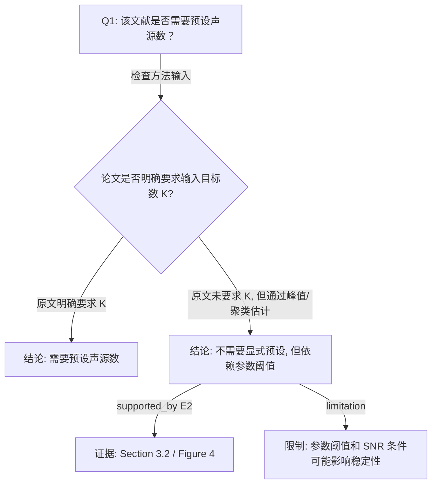

# 决策树标准格式（Decision Tree Schema）

> 来源：操作手册第 3 章
> 角色：AI-A / AI-B / Judge 三方共用的**结构契约**。`scripts/validate_jsonl.py` 据此校验 JSONL 中的 `*_decision_tree`。

这里的「决策树」不是装饰性思维导图，而是「论文证据如何支持结论」的推理结构。AI-B 后续攻击的对象就是这棵树。

## 3.1 决策树的层级

| 层级 | 名称 | 作用 | 示例 |
|---|---|---|---|
| **L0** | 研究问题根节点 | 定义这棵树要回答什么问题 | 该方法是否需要预设目标数 / 亚型数？ |
| **L1** | 论文主张节点 | 论文明确提出的核心观点 | 作者提出一种无需预设目标数的检测流程 |
| **L2** | 方法机制节点 | 解释为什么该主张成立 | 通过峰值/聚类/频率筛选推断目标数 |
| **L3** | 证据节点 | 绑定章节、图、表、实验 | Section 3.2；Figure 4；Experiment 2 |
| **L4** | 限制或条件节点 | 说明适用范围和不确定性 | 只在固定阵列/特定 SNR/单一队列下验证 |
| **L5** | 迁移到本人研究 | 判断能否借鉴到你的论文 | 可借鉴多频融合，但参数选择需重新设计 |

## 3.2 每个节点必须包含的字段

| 字段 | 含义 | 要求 |
|---|---|---|
| `node_id` | 节点编号 | 必须唯一，例如 N0、N1、N1.1 |
| `node_type` | 节点类型 | `question / claim / method / evidence / limitation / transfer / uncertainty` |
| `claim` | 节点内容 | 一句话表达，不要写成大段总结 |
| `evidence_location` | 证据位置 | 章节、图、表、实验；没有就写「原文未明确说明」 |
| `evidence_summary` | 证据摘要 | 用自己的话概括，不大段复制原文 |
| `confidence` | 可信度 | `high / medium / low` |
| `risk_tag` | 风险标签 | `证据不足 / 逻辑跳跃 / 因果过度 / 方法误读 / 可迁移性不足` |

## 3.3 每条边必须说明逻辑关系

| 边关系 | 含义 | 使用场景 |
|---|---|---|
| `because` | 因为 | 结论由某个方法或证据支持 |
| `if` | 如果 | 条件判断，例如「如果目标数未知」 |
| `supported_by` | 由……支持 | 节点连接到证据节点 |
| `leads_to` | 导致/推出 | 方法步骤推出实验结论 |
| `contradicted_by` | 被……削弱 | 原文结果或局限削弱结论 |
| `limitation` | 限制为 | 连接局限节点 |
| `transfer_to` | 可迁移到 | 连接到你的研究借鉴点 |

## 3.4 决策树 Markdown 模板（AI-A 第一版）

```markdown
# AI-A Decision Tree Round 1

paper_id: paper_001
question_id: Q1
task_type: literature_decision_tree_reasoning
question: 该文献是否需要预设声源数？
source_file: @chunks/paper_001_drone_music.md

## 1. Evidence Map

| evidence_id | location | evidence_summary | used_by_node |
|---|---|---|---|
| E1 | Section 2.1 | 作者说明方法输入与假设 | N1 |
| E2 | Section 3.2 / Figure 4 | 实验展示多目标定位流程 | N2, N3 |

## 2. Decision Tree - Mermaid



## 3. Node Table

| node_id | node_type | claim | evidence_location | confidence | risk_tag |
|---|---|---|---|---|---|
| N0 | question | 该文献是否需要预设声源数 | 用户问题 | high | none |
| N1 | claim | 需要检查方法输入是否包含目标数 K | Section 2.1 | high | none |
| N3 | claim | 方法可能不需要显式预设 K, 但依赖峰值/聚类参数 | Section 3.2 | medium | 参数依赖 |

## 4. Provisional Answer

基于上述决策树，本文方法……

## 5. Uncertainty List

- U1: 原文是否明确区分「无需预设目标数」和「通过后处理估计目标数」仍需复查。
- U2: 参数阈值是否在不同噪声条件下稳定，原文证据有限。

## 6. Follow-up Questions

1. 该方法在不同 SNR 下是否仍能稳定估计目标数？
2. 是否与 MUSIC 需要预设源数的版本做过对比？
3. 该流程能否迁移到多无人机同时出现的场景？
```

## JSONL 中的 `decision_tree` 对象结构（机器校验用）

```json
{
  "mermaid": "flowchart TD\n  N0[\"...\"]\n  N0 -->|...| N1{...}",
  "nodes": [
    {"node_id": "N0", "node_type": "question", "claim": "...", "evidence_location": "...", "confidence": "high"}
  ],
  "edges": [
    {"from": "N0", "to": "N1", "relation": "if"}
  ]
}
```

> 校验规则（`validate_jsonl.py`）：
> - `mermaid` 非空字符串。
> - `nodes` 是列表；每个节点必须有 `node_id`，且同一棵树内唯一。
> - `edges` 是列表；每条边的 `from`/`to` 必须指向已存在的 `node_id`（无悬空边）。
