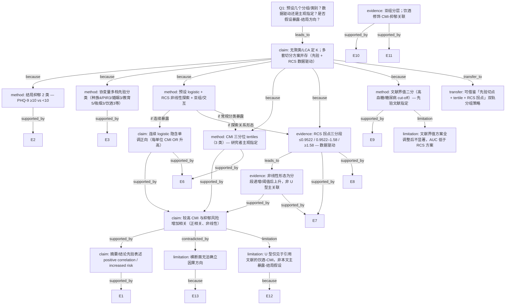

# AI-A Decision Tree Round 1

paper_id: paper_003
question_id: Q1
task_type: literature_decision_tree_reasoning
question: 本研究预设了几个分组/亚型/类别？该数量是数据驱动还是研究者主观指定？是否假设了暴露-结局关系的方向？
source_file: adversarial_lit_reading/chunks/paper_003_2024_zhou_2024_association_between_cardiometabolic_index_and_depression_national_health_and_nutrition_examination.md

## 1. Evidence Map

| evidence_id | location | evidence_summary | used_by_node |
|---|---|---|---|
| E1 | Abstract (Results) | 3794 名参与者中观察到 CMI 与抑郁正相关；RCS 确认非线性，识别拐点 0.9522 与 1.58 | N2, N8, N12 |
| E2 | Section 2.2 (Depression definition) | 抑郁以 PHQ-9 总分 ≥10 定义；阈值引用既往研究与临床验证（灵敏度/特异度 88%） | N3 |
| E3 | Section 2.3 (Covariates) | 种族 4 类、PIR 3 档、婚姻 3 类、教育 5 级；吸烟分从未/既往/当前；饮酒分从未/既往/当前 | N4 |
| E4 | Section 2.4 (Statistical analysis) | 加权 logistic 回归、RCS 探索非线性、亚组分析与交互检验；未提及聚类/LCA/轮廓系数定 K | N5, N1 |
| E5 | Section 3.1 / Table 1 | 基线按「有抑郁 vs 无抑郁」两组比较；吸烟 Table 1 显示 3 类（从未/既往/当前） | N3, N4 |
| E6 | Section 3.2 / Table 2 | CMI 作连续变量；另转换为三分位 tertiles，抑郁患病率随 tertile 升高（P for trend <0.001） | N6, N9 |
| E7 | Section 3.3 / Fig. 2 | RCS 调整后显著非线性（P for nonlinearity <0.001）；拐点 0.9522 与 1.58 | N7, N8 |
| E8 | Section 3.3 / Table 3 | 按 RCS 拐点将人群分为 ≤0.9522、0.9522–1.58、≥1.58 三组，logistic 验证关联 | N7 |
| E9 | Section 3.3 (Wakabayashi cut-offs) | 按既往文献高血糖/糖尿病 CMI 界值（女 0.799/0.800，男 1.625/1.748）二分做敏感性分析；全调整后不显著 | N10, N10L |
| E10 | Section 3.4 / Table 4 | 亚组覆盖年龄、性别、BMI、合并症等；交互检验除饮酒外均 P>0.05 | N11 |
| E11 | Section 3.4 / sTable 3 | 饮酒分 3 类时交互边际显著；合并非饮酒者（从未+既往）后交互显著；当前饮酒者中关联更强 | N11 |
| E12 | Section 4 (Discussion, alcohol) | 引用 Wakabayashi 2016：中年男性酒精与 CMI 呈 U 型——为饮酒-CMI 既往发现，非本文 CMI→抑郁 主假设 | N13 |
| E13 | Section 4 (Limitations) | 横断面设计无法建立因果 | N14 |
| E14 | Section 5 (Conclusion) | 总结 CMI 与抑郁呈 robust positive、non-linear 关联；建议维持 CMI <0.9522 | N2, N12 |

## 2. Decision Tree - Mermaid

## 3. Node Table

| node_id | node_type | claim | evidence_location | evidence_summary | confidence | risk_tag |
|---|---|---|---|---|---|---|
| N0 | question | Q1：分组/类别数量、来源（数据驱动 vs 先验）、暴露-结局方向假设 | — | 决策树根问题 | high | — |
| N1 | claim | 本文未使用无监督聚类/LCA 定 K；并行多套类别方案：结局二分、暴露连续/三分位/RCS 三分段/文献二分、协变量多档、亚组分层 | Section 2.4; 3.2–3.4 | 原文未提及 silhouette/BIC/聚类定 K | high | — |
| N2 | claim | 主要主张：CMI 升高与抑郁风险增加相关，关系为非线性 | Abstract; Section 3.3; Section 5 | 原文表述 positive / increased risk / non-linear | high | 因果过度 |
| N3 | method | 抑郁结局预设 2 类：PHQ-9 ≥10 为抑郁，<10 为非抑郁 | Section 2.2; Table 1 | 切点依据既往流行病学惯例与临床验证，非本研究数据驱动 | high | — |
| N4 | method | 协变量按问卷/临床定义预设多档（种族 4、教育 5、PIR 3、婚姻 3、吸烟 3、饮酒 3 等） | Section 2.3; Table 1 | NHANES 问卷字段或指南性定义，先验指定 | high | — |
| N5 | method | 统计预设：加权 logistic（连续暴露默认线性 logit）+ RCS 探索非线性 + 亚组/交互 | Section 2.4 | Methods 未预先声明 U 型，RCS 为探索性步骤 | high | — |
| N6 | method | CMI 分类暴露使用三分位 tertiles（3 组） | Table 2 | 常规分位数切分，研究者主观指定组数 | high | — |
| N7 | evidence | RCS 识别两个拐点后，CMI 分为 3 段：≤0.9522、0.9522–1.58、≥1.58 | Section 3.3; Fig. 2; Table 3 | 拐点数值来自本研究 RCS 拟合，数据驱动 | high | — |
| N8 | evidence | 非线性形态：第一拐点以下风险极低；中间段 OR 显著升高；高于 1.58 仍逐渐升高 | Section 3.3; Abstract | 原文显示分段递增，非 CMI→抑郁 的 U 型 | high | — |
| N9 | claim | 连续 CMI logistic 隐含单调正向（模型 1–3 每单位 CMI OR 增加 28%–34%） | Table 2 | 未预设负向或 U 型作为主模型 | high | — |
| N10 | method | 敏感性分析：按 Wakabayashi 2015 高血糖/糖尿病 CMI 界值二分（按性别不同界值） | Section 3.3; sTable 2 | 界值来自既往文献，先验指定 | medium | — |
| N10L | limitation | 文献界值二分方案在全调整模型中关联不显著，AUC（0.640/0.625）低于 RCS 方案 | Section 3.3; sFig. 2 | 该分组策略判别力弱于 RCS 三分段 | high | — |
| N11 | evidence | 亚组按多协变量分层；饮酒修饰关联（当前饮酒者中 CMI-抑郁正相关更强） | Section 3.4; Table 4; sTable 3 | 饮酒先 3 类，后合并非饮酒者为 2 类做交互 | high | — |
| N12 | claim | 摘要与结论表述「正相关」「风险增加」 | Abstract; Section 5 | 研究目标即探索 association，结果方向与代谢-抑郁文献一致 | high | — |
| N13 | limitation | 主分析未假设 CMI→抑郁 为 U 型；U 型仅出现在讨论引用的饮酒-CMI 文献 | Section 4 (Discussion) | 勿将引用文献 U 型误读为本研究主假设 | high | 方法误读 |
| N14 | limitation | 横断面设计无法验证因果方向 | Section 4 (Limitations) | 作者自述无法建立 causality | high | 因果过度 |
| N15 | transfer | 可借鉴：结局临床切点（先验）+ 暴露 tertile（先验）+ RCS 拐点分段（数据驱动）组合 | Section 2.2–3.3 | 适用于 NHANES 加权横断面关联研究 | medium | 可迁移性不足 |

## 4. Provisional Answer

围绕 **CMI（暴露）→ 抑郁（结局）** 主线，本文**并非**只预设一组分类，也**未**使用聚类/LCA 等数据驱动「定 K」的亚型发现，而是并行使用多套先验切分与一套 RCS 数据驱动切分：

**（1）结局分组：2 类，先验指定。**
抑郁以 PHQ-9 总分 ≥10 定义，<10 为非抑郁；切点引用既往研究与临床验证（灵敏度/特异度 88%），属于研究者/文献主观指定。

**（2）暴露 CMI 的分类方案（Q1 核心）：**

| 方案 | 组数 | 来源 | 用途 |
|---|---|---|---|
| 连续变量 | — | 模型形式选择 | 主分析 logistic，隐含单调正向 |
| 三分位 tertiles | **3** | **研究者主观指定**（常规分位数） | Table 2 分类 logistic + P for trend |
| RCS 拐点分段 | **3**（≤0.9522 / 0.9522–1.58 / ≥1.58） | **数据驱动**（RCS 拟合识别拐点） | Table 3 验证非线性 |
| 文献高血糖/糖尿病界值 | **2**（按性别不同界值） | **先验文献指定**（Wakabayashi 2015） | 敏感性分析（全调整后不显著） |

**（3）协变量与亚组类别（先验指定）：** 种族 4 类、PIR 3 档、婚姻 3 类、教育 5 级、吸烟 3 类、饮酒 3 类（交互分析中曾合并非饮酒者为 2 类）、性别 2 类，以及 CVD/CKD/高血压/高脂血症/糖尿病等二元变量；亚组分析按上述变量分层（Section 2.3, 3.4）。

**（4）暴露-结局关系方向假设：**

- 原文在摘要与结果中**预设并报告正向关联**（positive correlation / increased risk）。
- 连续 logistic 隐含**单调正向**（每单位 CMI 增加，OR 升高 28%–34%）。
- Methods 同时安排 **RCS 探索非线性**（非事先假定 U 型），结果发现显著非线性（P for nonlinearity <0.001），形态为**分段递增/阈值后上升**，而非 U 型主关联。
- 讨论引用的 **U 型**仅针对既往「饮酒–CMI」研究（Wakabayashi 2016），**不是**本文 CMI→抑郁 的主假设。

**综合判断：** 核心分组策略为**先验临床/问卷/文献切点**（抑郁 2 类、tertiles 3 类、文献界值 2 类、协变量多档）与 **RCS 数据驱动拐点三分段（3 类）** 的混合；关系方向以**正向、非线性（非 U 型）**为主分析框架。

## 5. Uncertainty List

- U1: RCS 结点数量、放置准则及软件实现细节正文未完整披露，拐点 0.9522 与 1.58 的可重复性需见补充材料。
- U2: tertile 三分位是否在加权样本上按调查权重计算，原文未明确说明。
- U3: 高血糖/糖尿病文献界值敏感性分析全调整后不显著，原文未明确排序「主暴露编码」究竟是连续、tertile 还是 RCS 三分段。
- U4: 饮酒交互分析中「3 类→2 类」合并是否事后根据交互 p 值调整，存在多重比较风险，原文未校正说明。
- U5: 横断面设计下 CMI→抑郁 与抑郁→代谢恶化无法区分，方向性表述只能视为关联而非因果。

## 6. Follow-up Questions

1. RCS 分析中结点数量与选择准则是什么？拐点 0.9522 与 1.58 在 bootstrap 或不同协变量调整下是否稳定？
2. CMI tertile 分位点是在未加权还是加权分布上计算的？若改为四分位或临床先验切点，结论是否一致？
3. 在 RCS 三分段、tertile、连续变量三种暴露编码中，哪一种是作者认定的 primary exposure specification？
4. 饮酒交互显著后合并饮酒类别，应视为预设亚组还是事后探索？是否需多重比较校正？
5. 若将抑郁切点从 PHQ-9≥10 改为≥5，结局类别边界改变后，关联方向与 RCS 形态是否稳健？
