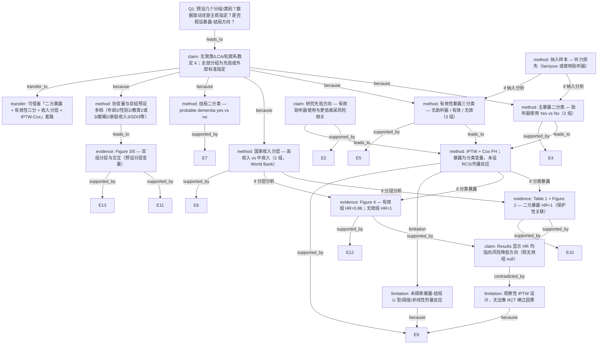

# AI-A Decision Tree Round 1

paper_id: paper_004
question_id: Q1
task_type: literature_decision_tree_reasoning
question: 本研究预设了几个分组/亚型/类别？该数量是数据驱动还是研究者主观指定？是否假设了暴露-结局关系的方向？
source_file: adversarial_lit_reading/chunks/paper_004_mmc7.md

## 1. Evidence Map

| evidence_id | location | evidence_summary | used_by_node |
|---|---|---|---|
| E1 | SUMMARY (Page 2) | 61,089 名听力受损老年人；IPTW-Cox；助听器使用与痴呆风险降低相关（HR=0.91）；有效使用组 HR=0.86，无效使用组 HR=0.98 | N2, N8, N10, N12 |
| E2 | INTRODUCTION (Page 3) | 研究目标：检验助听器使用（尤其有效使用）是否与**更低**的 probable dementia 风险相关；并考察国家经济发展水平与亚组差异 | N8 |
| E3 | RESULTS — Population characteristics / Table 1 (Pages 3–4) | 基线按国家收入水平分层；暴露分布：无助听器 84.6%、无效 5.6%、有效 9.8%；按高/中收入国分别描述 | N3, N4, N9 |
| E4 | METHOD DETAILS — Hearing aid use (Page 17) | 暴露二分类：baseline 回答 Yes/No 为使用者 vs 非使用者 | N2 |
| E5 | METHOD DETAILS — Hearing aid effectiveness (Page 17) | 使用者按自评 aided hearing 五档切分：excellent/very good/good=有效；fair/poor=无效；非使用者为参照组 → **3 组** | N3 |
| E6 | METHOD DETAILS — Country income (Page 17) | 按 World Bank 2024 分类：KLOSA/SHARE/ELSA/TILDA/HRS=高收入；CHARLS/MHAS=中收入 → **2 组** | N4 |
| E7 | METHOD DETAILS — Probable dementia (Pages 17–18) | 结局二分类：probable dementia yes/no；算法含认知+功能双损或医生诊断 | N5 |
| E8 | METHOD DETAILS — Covariates (Page 18) | 协变量预设多档：性别 2、教育 3、婚姻 2、家庭收入 3、SDI/UHC 等；认知损害 >1.5 SD 为阈值 | N6 |
| E9 | QUANTIFICATION AND STATISTICAL ANALYSIS (Pages 18–19) | IPTW（二元 logistic / 三组 multinomial）+ Cox PH；按国家收入分层；亚组按年龄/性别/教育/婚姻/家庭收入/医保/SDI；**未提及**聚类/LCA/RCS/轮廓系数定 K | N1, N7, N11 |
| E10 | RESULTS — Hearing aid use and probable dementia / Figure 2 (Pages 3–5) | 主分析：使用者 vs 非使用者 HR=0.91（95% CI 0.88–0.94）；中收入国 HR=0.76，高收入国 HR=0.92 | N9, N12 |
| E11 | RESULTS — Subgroup/interaction hearing aid use / Figure 3 (Pages 5–6) | 助听器使用亚组：年龄、性别、教育、婚姻、SDI 等预设分层；部分交互显著 | N6, N13 |
| E12 | RESULTS — Hearing aid effectiveness / Figure 4 (Page 7) | 有效组 HR=0.86 vs 参照；无效组 HR=0.98（与参照相当）；中收入国两组均显著，高收入国仅有效组显著 | N10, N12 |
| E13 | RESULTS — Subgroup/interaction effectiveness / Figure 5 (Page 7) | 有效性分析亚组：多数无显著交互；和谐队列 SDI 交互显著 | N13 |
| E14 | METHOD DETAILS — Hearing loss (Page 17) | 听力损失：自评 fair/poor **或** 使用助听器 → 纳入分析样本的二元定义 | N5L |
| E15 | QUANTIFICATION — PH assumption (Page 19) | Cox 比例风险假设经 log-cumulative hazard 图检验；原文称各队列及收入分层中曲线近似平行 | N7 |

## 2. Decision Tree - Mermaid

## 3. Node Table

| node_id | node_type | claim | evidence_location | evidence_summary | confidence | risk_tag |
|---|---|---|---|---|---|---|
| N0 | question | Q1：分组/类别数量、来源（数据驱动 vs 先验）、暴露-结局方向假设 | — | 决策树根问题 | high | — |
| N1 | claim | 本文未使用无监督聚类/LCA/K-means 等数据驱动定 K；所有核心分组均为研究者先验切分或外部标准（World Bank、DSM-IV 算法、问卷字段） | QUANTIFICATION AND STATISTICAL ANALYSIS (Page 19); METHOD DETAILS (Pages 17–18) | 全文未提及 silhouette/BIC/聚类定类数 | high | — |
| N2 | method | 主暴露预设 **2 类**：baseline 助听器使用 Yes vs No | METHOD DETAILS — Hearing aid use (Page 17); Figure 2 | 问卷二元回答，研究者主观指定 | high | — |
| N3 | method | 有效性暴露预设 **3 类**：无助听器（参照）、有效（excellent/very good/good）、无效（fair/poor） | METHOD DETAILS — Hearing aid effectiveness (Page 17); Table 1; Figure 4 | 五档自评量表按研究者规则二分有效/无效，非数据驱动聚类 | high | — |
| N4 | method | 分析分层预设 **2 类**：高收入国 vs 中收入国（World Bank 2024 分类） | Page 17 (country income); Table 1; Figure 2/4 | 外部机构分类标准，非本研究数据驱动 | high | — |
| N5 | method | 结局预设 **2 类**：probable dementia yes vs no | Pages 17–18 (Identification/Definition of probable dementia) | 算法性操作定义（认知+功能双损或医生诊断），先验指定 | high | — |
| N5L | method | 分析样本纳入标准：自评 fair/poor **或** 使用助听器 → 听力损失 | METHOD DETAILS — Hearing loss (Page 17) | 二元合并定义，先验指定 | high | — |
| N6 | method | 协变量与亚组预设多档：性别 2、教育 3（Table 1）/亚组 2、婚姻 2、家庭收入 3、SDI 3、年龄 55–69 vs ≥70 等 | Covariates (Page 18); Subgroup analyses (Page 19); Figure 3/5 | 问卷/临床常规分类，先验指定 | high | — |
| N7 | method | 统计模型：IPTW 加权 Cox PH；暴露为**分类**变量；检验 PH 假设；**未**使用 RCS/样条探索暴露剂量-反应形态 | Pages 18–19 | 模型隐含组间相对风险比较，非连续剂量非线性探索 | high | — |
| N8 | claim | 研究先验假设：助听器使用（尤其有效使用）与**更低** probable dementia 风险相关 | INTRODUCTION (Page 3); SUMMARY (Page 2) | 原文明确表述 "lower risk" / "reduced dementia risk" | high | — |
| N9 | evidence | 二元暴露结果： pooled HR=0.91；中收入 HR=0.76；高收入 HR=0.92，均 <1 | RESULTS — Hearing aid use (Pages 3–5); Figure 2 | 原文显示保护性关联方向 | high | 因果过度 |
| N10 | evidence | 有效性三分结果：有效组 HR=0.86（风险降低）；无效组 HR=0.98（与参照无显著差异） | RESULTS — Hearing aid effectiveness (Page 7); Figure 4 | 方向性差异由预设分组揭示，非连续暴露拟合 | high | — |
| N11 | limitation | 暴露-结局关系未预设或检验 U 型/阈值/单调剂量反应；仅分类 HR 比较 | QUANTIFICATION (Page 19) | 无 RCS、spline、dose-response 分析 | high | — |
| N12 | claim | 主要结果一致指向 HR<1（保护方向），无效使用组为 null 关联 | SUMMARY; Figure 2; Figure 4 | 原文显示而非「证明」因果 | high | 因果过度 |
| N13 | evidence | 亚组/交互分析基于预设 sociodemographic 分层变量；Bonferroni 校正 p 值 | Page 19; Figure 3; Figure 5 | 分层变量先验选定，非数据驱动亚型发现 | high | — |
| N14 | limitation | 观察性 pooled IPTW 分析，作者讨论 RCT 伦理/practical 局限；无法确立因果方向 | INTRODUCTION (Page 3); DISCUSSION | 关联性研究，方向假设为主 | high | 因果过度 |
| N15 | transfer | 可借鉴：暴露二元→有效性三分（自评切点）+ 国家收入分层 + IPTW 三组 multinomial + Cox 亚组/交互 | Methods + Results 全流程 | 适用于多队列 harmonized 生存分析 | medium | 可迁移性不足 |

## 4. Provisional Answer

本文 **Jiang et al., 2026**（7 队列、33 国 pooled 分析）**未使用**聚类、LCA、轮廓系数/BIC 定 K 等**数据驱动亚型发现**；核心分组均为**研究者先验指定**或**外部标准**切分。围绕 Q1 所问的三层含义，初步答案如下。

### （1）预设了几个分组/亚型/类别？

与 **暴露—结局主线** 直接相关的核心类别：

| 分析层级 | 分组方案 | 组数 | 来源 |
|---|---|---|---|
| 主暴露（primary） | 助听器使用 vs 非使用 | **2** | 先验（baseline Yes/No 问卷） |
| 有效性暴露（parallel primary） | 无助听器 / 有效 / 无效 | **3** | 先验（五档自评按规则二分） |
| 国家收入分层 | 高收入国 vs 中收入国 | **2** | 外部标准（World Bank 2024） |
| 结局 | probable dementia yes vs no | **2** | 先验算法（DSM-IV 操作定义） |
| 纳入样本 | 听力损失（fair/poor 或使用助听器） | **2**（是否纳入） | 先验 |

**并行存在的其他预设分类（协变量/亚组，非「亚型发现」）：**
- 性别 2、婚姻 2、教育 3（Table 1）/ 亚组分析 2 档、家庭收入 3、SDI 3、年龄 55–69 vs ≥70、多项二元健康协变量；
- 7 个队列分别做 supplementary cohort-specific 分析（预设队列标识，非数据驱动分型）；
- IPTW 分别针对 **2 组**（use vs no）和 **3 组**（no / good / poor effectiveness）估计倾向得分。

**数据驱动定 K：无。** 原文 Methods 与 Statistical analysis 未提及 K-means、层次聚类、LCA、silhouette、BIC 等。

### （2）该数量是数据驱动还是研究者主观指定？

**结论：几乎全部为先验/外部标准指定。**

- **有效性三分**：研究者在 Methods 中明确规定五档 aided hearing _rating 的切点（excellent/very good/good → 有效；fair/poor → 无效），属于**主观指定**的分组规则，而非由数据自动确定类数。
- **国家收入二分**：依据 World Bank 分类，属**外部标准**。
- **probable dementia 二分**：依据 harmonized 算法（认知+功能双损或医生诊断），属**先验操作定义**。
- **亚组变量**：年龄、性别、教育等分层变量在 Methods 中预先列出，属**研究者指定**的探索性分层，非无监督亚型。

### （3）是否假设了暴露-结局关系的方向？

**是，先验假设为「保护性/风险降低」方向，且模型形式为分类 Cox HR 比较（非 U 型/剂量反应探索）。**

- **Introduction / Summary** 明确研究问题：检验助听器使用（尤其**有效**使用）是否与**更低（lower）** probable dementia 风险相关（E2, E1）。
- **统计模型**：IPTW-weighted **Cox 比例风险**模型，暴露为**分类**变量；比较使用者 vs 非使用者、有效/无效 vs 参照，隐含方向为 HR<1 表示风险降低。
- **未预设/未检验**暴露-结局的 U 型、阈值效应或连续剂量-反应非线性（无 RCS/spline；E9, N11）。
- **Results 实际方向**（E10, E12）：二元暴露 HR=0.91；有效组 HR=0.86；无效组 HR=0.98（null）；与中收入国更强保护性一致——与先验方向一致，但观察性设计下只能表述为「原文显示关联方向」，不能表述为「作者证明了因果」。

**综合判断：** 本研究核心为 **2 组（使用/未使用）+ 3 组（无/有效/无效）** 并行暴露编码，辅以 **2 组国家收入分层** 与 **2 组结局**；全部为**先验/外部标准**指定，**无数据驱动亚型定数**；暴露-结局关系**先验假设为保护性（HR<1）**，以分类 Cox 模型检验，**未探索 U 型或非线性剂量反应**。

## 5. Uncertainty List

- U1: 有效性五档切点（good vs poor）的具体依据（是否引用既往量表文献或仅 convenience split）正文除描述外未给出独立验证，切点稳健性未知。
- U2: SDI 三分位（low/middle/high）的界值定义正文未完整披露，需查 Supplement Table S4 或相关方法。
- U3: 7 队列 harmonized 后各队列自评 hearing 问题措辞差异（Table S2/S3）是否影响「有效/无效」分组的可比性，原文未量化 misclassification 对类数的影响。
- U4: 中收入国分析中「无效组」亦显示 HR=0.70（Figure 4），与主假设「仅有效组保护」部分不一致；原文未深入解释该亚组异质性是否为统计偶然或小样本所致。
- U5: Cox PH 假设仅称 log-cumulative hazard 图「approximately parallel」，未报告 formal statistical test 统计量，PH 违背时的备选模型原文未明确说明。
- U6: 观察性 IPTW 无法排除反向因果（认知下降→更少有效使用助听器），方向性解读存在因果过度风险。

## 6. Follow-up Questions

1. 有效性分组切点（excellent/very good/good vs fair/poor）是否有引用 Cox/AIOI 等听力结局量表文献？若改为四档或三分位，HR 方向是否稳健？
2. Supplement Table S2/S3 中各队列 hearing 问题 harmonization 差异是否导致「无效组」在各队列间定义不一致？
3. 中收入国「无效组」HR=0.70 与 pooled/high-income 无效组 null 关联的差异，是否由 CHARLS/MHAS 样本量驱动？需否 cohort×effectiveness 交互检验？
4. 若将暴露建模为连续「有效使用时长」或「aided hearing 评分」而非 3 类，是否会改变对「方向假设」的判断？原文是否完全未收集此类连续暴露？
5. IPTW 三组 multinomial 与二元 IPTW 两套权重下，有效/无效组 HR 点估计差异多大？是否存在 positivity/overlap 问题影响分组比较可信度？
