# AI-A Decision Tree Round 1

paper_id: paper_005
question_id: Q1
task_type: literature_decision_tree_reasoning
question: 本研究预设了几个分组/亚型/类别？该数量是数据驱动还是研究者主观指定？是否假设了暴露-结局关系的方向？
source_file: adversarial_lit_reading/chunks/PMID40910275.xml

## 1. Evidence Map

| evidence_id | location | evidence_summary | used_by_node |
|---|---|---|---|
| E1 | Abstract — Methods | EO-IBD 定义为 20 岁前发生的 IBD；数据来自 GBD 2021；Joinpoint 评估时间趋势；BAPC 预测未来；SII 与 concentration index 量化 SDI 不平等 | N2, N3, N7, N8 |
| E2 | Methods §1 Data source | IBD 按 ICD-10（K50–K52, K52.8–K52.9）与 ICD-9 编码识别；EO-IBD = 20 岁前诊断；GBD 数据按 age、sex、geographical region、national boundaries 分层 | N2, N3, N4, N5 |
| E3 | Methods §2 SDI regions and GBD regional classification | 国家/地区按 SDI 五分位分为 **5 组**（high / high-middle / middle / low-middle / low SDI）；全球再分为 **21 个**互斥 GBD 区域 | N4, N5 |
| E4 | Methods §3 Joinpoint regression analysis | Joinpoint 分段回归**客观识别**拐点，将研究期分为若干时间段；原文称 "**without a priori assumptions about trend patterns**" | N1, N14, N15 |
| E5 | Methods §4 Health inequality analysis | SII 由**线性回归**得出，衡量 SDI 谱上的绝对不平等梯度；concentration index 衡量相对不平等（–1 至 1） | N12, N16 |
| E6 | Methods §5 BAPC model | BAPC 分解 age、period、cohort 效应；预测 2022–2036 四项年龄标化率：ASIR、ASPR、ASMR、ASDR | N7, N17 |
| E7 | Methods §5 (age standardization formula) | 年龄标化采用 **5 年间隔**年龄分层；权重来自 GBD 2021 全球标准人口结构 | N6 |
| E8 | Results §1 Global burden / Fig. 1 | 全球四项指标 1990–2021 趋势；Joinpoint 识别 mortality/DALYs 拐点约 **1992**；AAPC 报告各指标整体变化方向 | N14, N15, N18 |
| E9 | Results §2 BAPC projections / Fig. 1I–L | 2036 预测：ASIR/ASPR **上升**；ASMR/ASDR **继续下降** | N17, N18 |
| E10 | Results §3 Age and sex / Fig. 2 | 年龄分层：incidence/prevalence 随年龄递增；mortality/DALYs 在 **<5 岁**与 **15–19 岁**最高；性别 **2 组**比较，2021 男性 mortality/DALYs 更高 | N6, N9, N10 |
| E11 | Results §4 Region / Fig. 3; Supp Fig. 3–4 | 五档 SDI 区域比较；2021 incidence 与 SDI **正相关**（SII=0.83）；DALYs 与 SDI 呈 **U 形**（两端 SDI 负担高）；21 GBD 区域与 204 国/地区排名 | N4, N5, N11, N13, N16 |
| E12 | Results §5 Country / Fig. 4–5 | 204 国/地区 incidence/prevalence/mortality/DALYs 率及各国 AAPC 排名 | N5 |
| E13 | Discussion — Limitations | 汇总分析**无法进行** UC vs Crohn's disease 亚型分层；GBD 2021 不支持 <6 岁单独分析 | N19, N20 |
| E14 | Abstract — Results | 摘要预先描述未来 incidence **增加**、mortality/DALYs **下降**的投影方向 | N17 |
| E15 | Methods §1 + Results §3 | 全文**未提及** K-means、LCA、层次聚类、silhouette、BIC 定 K、RCS 剂量反应 | N1, N21 |

## 2. Decision Tree - Mermaid

```mermaid
flowchart TD
    N0["Q1: 预设几个分组/类别？数据驱动还是主观指定？是否假设暴露-结局方向？"]

    N1["claim: 无聚类/LCA/轮廓系数定 K；核心分层均为 GBD 框架或研究者先验切分"]
    N2["method: 疾病类别 — EO-IBD vs 全龄 IBD（年龄<20 岁 cutoff，1 个二元亚组）"]
    N3["method: 疾病识别 — ICD-10/ICD-9 编码标准（外部诊断分类，非数据驱动亚型）"]
    N4["method: SDI 区域分层 — 5 档 quintile（high→low SDI）"]
    N5["method: 地理分层 — 21 GBD 区域 + 204 国/地区"]
    N6["method: 人口学分层 — 性别 2 组 + GBD 5 年间隔年龄组（Results 重点 <5 与 15–19 岁）"]
    N7["method: 结局指标 — 4 类负担率（incidence / prevalence / mortality / DALYs）"]
    N8["method: 统计方法清单 — Joinpoint + SII/concentration index + BAPC + 年龄标化"]

    N9["evidence: Fig. 2 — 年龄分层负担模式（incidence↑随年龄；mortality/DALYs 双峰）"]
    N10["evidence: Fig. 2K–L + Supp Tables 3–4 — 性别 2 组负担差异（2004 后男性更高）"]
    N11["evidence: Results §4 + Supp Fig. 3–4 — SDI 与 incidence 正相关；与 DALYs U 形（结果层面）"]
    N12["method: SII 分析 — 预设 SDI 谱上**线性**梯度模型"]
    N13["evidence: Results §4 — 五档 SDI 区域 2021 率值比较（Table/Supp）"]
    N14["method: Joinpoint — 时间序列拐点**数据驱动**识别（无先验趋势形态）"]
    N15["evidence: Fig. 1G–H — Joinpoint 识别 1992 年 mortality/DALYs 拐点"]
    N16["limitation: U 形 SDI–DALYs 为 Results 观察到的形态，Methods 未预先假设 U 型"]
    N17["method: BAPC 预测 — 基于历史 APC 结构外推 2022–2036"]
    N18["evidence: Fig. 1I–L — 预测 ASIR/ASPR↑、ASMR/ASDR↓"]
    N19["limitation: 未分层 UC vs Crohn's（Discussion 明确承认）"]
    N20["limitation: GBD 数据库不支持 <6 岁 VEO-IBD 单独类别"]
    N21["limitation: 非个体水平暴露-结局回归；无 RCS/剂量反应/方向性因果假设检验"]

    N0 -->|leads_to| N1
    N1 -->|because| N2
    N1 -->|because| N3
    N1 -->|because| N4
    N1 -->|because| N5
    N1 -->|because| N6
    N1 -->|because| N7

    N2 -->|supported_by| E2
    N3 -->|supported_by| E2
    N4 -->|supported_by| E3
    N5 -->|supported_by| E3
    N6 -->|supported_by| E7
    N7 -->|supported_by| E1

    N8 -->|leads_to| N14
    N8 -->|leads_to| N12
    N8 -->|leads_to| N17

    N14 -->|if 时间趋势分析| N15
    N14 -->|supported_by| E4
    N15 -->|supported_by| E8

    N12 -->|if SDI 不平等分析| N11
    N12 -->|supported_by| E5
    N11 -->|supported_by| E11
    N11 -->|limitation| N16

    N4 -->|if 区域分层| N13
    N13 -->|supported_by| E11
    N5 -->|supported_by| E12

    N6 -->|if 人口学分层| N9
    N6 -->|if 人口学分层| N10
    N9 -->|supported_by| E10
    N10 -->|supported_by| E10

    N17 -->|leads_to| N18
    N17 -->|supported_by| E6
    N18 -->|supported_by| E9

    N1 -->|limitation| N19
    N1 -->|limitation| N20
    N19 -->|supported_by| E13
    N20 -->|supported_by| E13
    N1 -->|limitation| N21
    N21 -->|supported_by| E15
```

## 3. Node Table

| node_id | node_type | claim | evidence_location | evidence_summary | confidence | risk_tag |
|---|---|---|---|---|---|---|
| N0 | question | Q1：分组/类别数量、来源（数据驱动 vs 先验）、暴露-结局方向假设 | — | 决策树根问题 | high | — |
| N1 | claim | 本文未使用无监督聚类/LCA/K-means 定 K；除 Joinpoint 时间拐点外，核心分层均为 GBD 框架或研究者/外部标准先验指定 | Methods §1–§5; 全文检索 | 无 silhouette/BIC/聚类定类数 | high | — |
| N2 | method | 核心研究对象预设 **1 个年龄 cutoff 亚组**：EO-IBD（<20 岁）vs 纳入分析的全 IBD 背景比较 | Methods §1 Data source; Results §3 | 研究者定义 age<20，依据为儿科-成人过渡照护需求表述 | high | — |
| N3 | method | 疾病识别采用 **ICD 编码标准**（非 UC/Crohn 数据驱动分型） | Methods §1 | ICD-10/ICD-9 外部诊断分类 | high | — |
| N4 | method | SDI 分层预设 **5 档** quintile | Methods §2; Results §4 | GBD 2021 既定 SDI 五分位框架 | high | — |
| N5 | method | 地理分层：**21** GBD 区域 + **204** 国/地区 | Methods §2; Results §4–§5 | GBD 既定地理分类，非本研究数据驱动 | high | — |
| N6 | method | 人口学分层：性别 **2 组**；年龄按 GBD **5 年间隔**组（Results 重点报告 <5 与 15–19 岁） | Methods §5; Results §3; Fig. 2 | GBD 标准年龄结构 + 研究者选取报告重点年龄带 | high | — |
| N7 | method | 负担结局预设 **4 类**指标：incidence、prevalence、mortality、DALYs（含年龄标化率） | Abstract; Methods §5; Results §1 | GBD 标准负担指标，先验指定 | high | — |
| N8 | method | 分析套路：Joinpoint 趋势 + SII/concentration index 不平等 + BAPC 预测 + 年龄标化 | Abstract Methods; Methods §3–§5 | 描述性流行病学分析链，非个体暴露回归 | high | — |
| N9 | evidence | 年龄分层显示 incidence/prevalence 随年龄递增；mortality/DALYs 在 <5 与 15–19 岁最高（双峰描述） | Results §3; Fig. 2A–H | 原文显示年龄-负担异质性，非聚类亚型 | high | — |
| N10 | evidence | 性别 2 组：2021 男性 mortality/DALYs 更高；2004 后男性负担持续超过女性 | Results §3; Fig. 2I–L; Supp Tables 3–4 | 原文显示性别差异 | high | — |
| N11 | evidence | SDI 与 incidence **正相关**（SII=0.83）；与 DALYs 呈 **U 形**（两端 SDI 负担高） | Results §4; Supp Fig. 3–4 | U 形为 Results 报告的发现 | high | — |
| N12 | method | SII 不平等分析预设 SDI 谱上 **线性**回归梯度 | Methods §4 Health inequality analysis | 线性梯度为先验模型形式 | high | — |
| N13 | evidence | 五档 SDI 区域 2021 各指标率值差异（high SDI incidence 最高；low SDI mortality 最高） | Results §4; Supp Tables 1–4 | 原文显示区域分层负担格局 | high | — |
| N14 | method | Joinpoint 拐点识别为 **数据驱动**（permuation test 选段；无先验趋势形态假设） | Methods §3 Joinpoint regression | 原文明确 "without a priori assumptions about trend patterns" | high | — |
| N15 | evidence | Joinpoint 识别 mortality/DALYs 约 **1992** 年为拐点，前后 APC 方向不同 | Results §1; Fig. 1E–H | 拐点位置由数据决定 | high | — |
| N16 | limitation | U 形 SDI–DALYs 关系为 **Results 观察**到的形态；Methods 未预先声明 U 型/阈值/单调假设 | Results §4 vs Methods §4 | incidence 用线性 SII；DALYs U 形未在 Methods 预设 | high | — |
| N17 | method | BAPC 基于历史 APC 结构外推 2022–2036；摘要/Results 陈述未来 ASIR/ASPR↑、ASMR/ASDR↓ | Methods §5; Results §2; Abstract Results | 预测方向来自模型外推，非 RCT 式暴露方向假设 | medium | 因果过度 |
| N18 | evidence | BAPC 投影：2036 ASIR +7.62%、ASPR +2.74%；ASMR –57.41%、ASDR –61.88%（相对 2021） | Results §2; Fig. 1I–L | 原文显示预测数值与方向 | high | — |
| N19 | limitation | **未**进行 UC vs Crohn's disease 亚型分层（Discussion 承认为局限） | Discussion — Limitations | 聚合 IBD 分析，亚型类别数 = 0（未分析） | high | — |
| N20 | limitation | GBD 2021 **不支持** <6 岁 VEO-IBD 单独类别；仅可分析 <5 岁组 | Discussion — Limitations | 数据库结构限制，非研究者自由选择 K | high | — |
| N21 | limitation | 非个体水平暴露-结局因果设计；**无** RCS/剂量反应/HR 方向性假设检验 | Methods 全文; Results 全文 | 生态/描述性负担研究，不适用传统暴露→结局方向假设框架 | high | 因果过度 |

## 4. Provisional Answer

本文 **Chen et al., Gut and Liver 2026**（PMID 40910275）基于 GBD 2021 二次数据，对 EO-IBD 全球负担进行描述性流行病学分析。**未使用**聚类、LCA、轮廓系数/BIC 定 K 等无监督亚型发现；除 Joinpoint 时间拐点外，分层方案几乎全部来自 **GBD 框架**或 **研究者/外部标准先验指定**。

### （1）预设了几个分组/亚型/类别？

与主线分析直接相关的预设类别（并行存在，非互斥）：

| 分层维度 | 分组方案 | 组数 | 指定方式 |
|---|---|---|---|
| 研究对象亚组 | EO-IBD（<20 岁）vs 全龄 IBD 背景占比 | **1 个 cutoff 二元亚组** | 研究者先验（age<20） |
| 疾病识别 | IBD（ICD-10/ICD-9 编码） | 编码体系，**非** UC/Crohn 分型 | 外部 ICD 标准 |
| SDI 区域 | high / high-middle / middle / low-middle / low SDI | **5** | GBD 框架（SDI quintile） |
| GBD 地理区域 | 21 个互斥区域 | **21** | GBD 框架 |
| 国家/地区 | 204 国/地区 | **204** | GBD 框架 |
| 性别 | 男 / 女 | **2** | GBD 标准分层 |
| 年龄 | GBD 5 年间隔年龄组；Results 重点 <5 与 15–19 岁 | 多档（GBD 标准） | GBD 框架 + 报告选取 |
| 负担结局 | incidence / prevalence / mortality / DALYs（含 ASR） | **4** | GBD 标准指标 |
| 时间分段（Joinpoint） | 由拐点划分的若干时间段 | **数据驱动**（如 mortality/DALYs 约 1992 拐点） | Joinpoint 算法识别 |
| IBD 亚型（UC vs Crohn's） | **未分析** | **0**（未分层） | Discussion 承认为局限 |

**数据驱动定 K/定类：仅 Joinpoint 时间拐点为数据驱动**；无 LCA、K-means、silhouette 等。

### （2）该数量是数据驱动还是研究者主观指定？

**结论：以先验/GBD 外部标准为主；唯一明确的数据驱动环节是 Joinpoint 时间拐点识别。**

- **EO-IBD 定义（<20 岁）**：Methods §1 研究者指定年龄 cutoff，依据为覆盖儿科-青少年至早期成年过渡（原文表述），属**主观/临床惯例先验**，非聚类定类。
- **SDI 5 档、21 区域、204 国、性别 2 组、5 年间隔年龄组、4 类负担指标**：均沿用 **GBD 2021 既定框架**，属**外部标准**。
- **ICD 编码识别 IBD**：**外部诊断分类标准**，且**未**进一步分 UC/Crohn 亚型。
- **Joinpoint 拐点**：Methods §3 原文称可在**无先验趋势形态假设**下客观识别拐点 → **数据驱动**确定时间分段数与位置（如 1992 年）。
- **SII 分析**：预设 SDI 与结局之间为**线性梯度**（线性回归），属**方法先验**，非 U 型预设；U 形 SDI–DALYs 关系在 Results 才报告。

### （3）是否假设了暴露-结局关系的方向？

**本文不是个体水平「暴露→结局」因果回归设计，传统意义上的暴露-结局方向假设 largely 不适用；但部分方法模块含有形态/趋势先验：**

| 分析模块 | 是否预设关系方向/形态 | 证据 |
|---|---|---|
| Joinpoint 趋势 | **否** — 无先验单调/线性/U 型假设；拐点数据驱动 | Methods §3 |
| SII 不平等 | **是（线性）** — 预设 SDI 谱上线性梯度 | Methods §4 |
| SDI–incidence | Results 显示**正相关**；与 SII 线性框架一致 | Results §4; Supp Fig. 3 |
| SDI–DALYs | **未在 Methods 预设 U 型**；Results **观察到 U 形** | Results §4; Supp Fig. 4 |
| 年龄–负担 | Results 描述性报告（incidence↑随年龄；mortality/DALYs 双峰） | Results §3; Fig. 2 |
| BAPC 预测 | 基于历史趋势外推；摘要/Results 陈述未来 incidence/prevalence **增**、mortality/DALYs **降** | Abstract; Results §2 |
| 个体暴露→EO-IBD 因果方向 | **原文未涉及** — 无 logistic/Cox 暴露回归、无 RCS、无 E-value | Methods/Results 全文 |

**综合判断：** 本研究预设 **5 档 SDI + 2 性别 + 多档 GBD 年龄组 + 21 区域 + 204 国 + 4 类结局指标 + 1 个 EO-IBD 年龄 cutoff**，外加 Joinpoint **数据驱动**时间分段；**无数据驱动疾病亚型（UC/Crohn）定数**。关系形态上：Joinpoint **不预设**趋势方向；SII **预设线性** SDI 梯度；**U 形 SDI–DALYs 为结果观察而非先验假设**；BAPC 预测方向来自模型外推。不宜将此描述性 GBD 负担研究表述为「假设了某暴露增加/降低 EO-IBD 风险」的因果方向检验。

## 5. Uncertainty List

- U1: GBD 5 年间隔年龄组在 EO-IBD（<20 岁）范围内具体包含几个年龄 band，正文仅强调 <5 与 15–19 岁，其余 band 编号与界值需查 Supplement 或 GBD 元数据。
- U2: Joinpoint 除 1992 拐点外各指标（incidence/prevalence）分段数与 APC 方向，正文仅摘要性报告 AAPC，完整 joinpoint 段数未在主文逐条列出。
- U3: SDI–DALYs U 形关系是否经 formal 非线性检验（如 RCS、分段回归）还是仅散点/曲线描述，Methods 未说明；U 形推断强度有限。
- U4: BAPC 预测对 COVID-19 期间诊断延迟的校正程度，Discussion 仅定性讨论，未量化对 2022–2036 投影方向的影响。
- U5: 204 国/地区与 21 GBD 区域层级是否在全部 4 类指标上均完整报告，还是部分指标仅在 Supp 呈现，主文未逐一确认。
- U6: EO-IBD age<20 cutoff 是否与 GBD 数据库内 age band 边界完全对齐，原文未明确说明 cutoff 与 GBD age group 的映射规则。

## 6. Follow-up Questions

1. Supplement 中是否给出 Joinpoint 各指标完整分段表（段数、APC、拐点年份），以核实「数据驱动」时间分组的具体 K 值？
2. SDI–DALYs U 形关系是否在 Supp 中提供了非线性模型拟合或仅描述性曲线？若改为 SII 线性框架是否会掩盖 U 形？
3. GBD 2021 中 EO-IBD（<20 岁）可用的 5 年间隔 age band 共有几组？<5 岁 band 与 Discussion 提及的 VEO-IBD（<6 岁）不可分析之间是否存在数据粒度冲突？
4. 若将 SDI 五档合并为三档或连续 SDI 建模，incidence 正相关与 DALYs U 形结论是否稳健？
5. BAPC 2036 投影中 ASIR/ASPR 上升与 ASMR/ASDR 下降的方向，对 COVID-19 年份敏感性如何？是否报告了 exclude-COVID 情景？
6. 全文未分 UC/Crohn 亚型：GBD 2021 是否提供可下载的亚型分层数据？若提供，本研究未分析属设计选择还是数据不可得？
