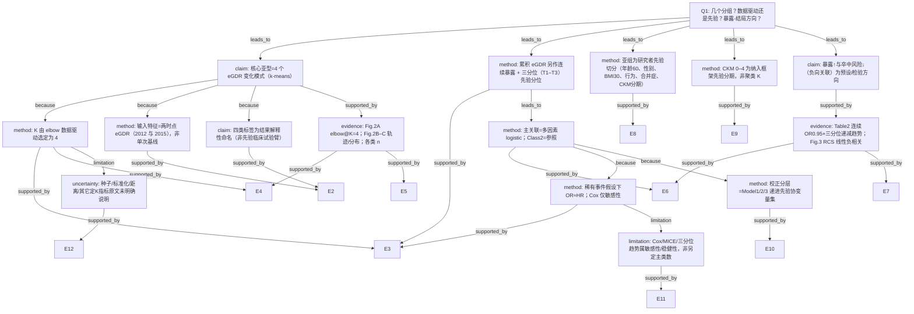

# AI-A Decision Tree Round 1

paper_id: paper_022
question_id: Q1
task_type: literature_decision_tree_reasoning
question: 本研究预设了几个分组/亚型/类别？该数量是数据驱动的（如聚类定 K）还是研究者主观指定？是否假设了暴露-结局关系的方向（线性、单调、U 型）？
source_file: adversarial_lit_reading/chunks/paper_022_2026_wang_ckm_cum_egdr_stroke.md

## 1. Evidence Map

| evidence_id | location | evidence_summary | used_by_node |
|---|---|---|---|
| E1 | Abstract Methods | 两波 eGDR（2012/2015）输入 k-means，识别 distinct change patterns；累积 eGDR=(eGDR2012+eGDR2015)/2×(2015−2012)；多因素 logistic | N1, N2, N8 |
| E2 | Methods — Assessment of eGDR… | 明确用 k-means，输入两时点 eGDR；四类命名：Class1 moderate–high stable、Class2 persistent low、Class3 stable high、Class4 rapid decrease | N1, N3, N4 |
| E3 | Methods — Statistical analysis | elbow method 定最优簇数；K=4 拐点；累积 eGDR 连续 + tertiles；稀有事件下用 logistic；Cox 作敏感性 | N2, N5, N9, N12 |
| E4 | Results — Baseline / Fig.2A | elbow 图 WCSS vs k，拐点 k=4；最终四类 n：1883/1121/1410/834 | N2, N6 |
| E5 | Results — Fig.2B–C | 四类均值轨迹与两时点分布；Class4 下降，其余相对稳定 | N3, N6 |
| E6 | Results — Table 2 | Class2 为参照；Class1/3/4 OR<1；累积 eGDR 每增 1 单位 OR 0.95；三分位 T1 参照，T2/T3 OR 递减，P for trend <0.001 | N8, N10, N11 |
| E7 | Results — Fig.3 RCS | RCS：累积 eGDR 与卒中呈线性负相关（P&lt;0.001；P for nonlinear 支持线性叙述） | N10, N11 |
| E8 | Results — Table 3 / Methods subgroups | 亚组：年龄&lt;60/≥60、性别、BMI、吸烟饮酒、血脂异常、糖尿病、CKM 0–2 vs 3–4；交互检验 | N7 |
| E9 | Methods — CKM staging | CKM stages 0–4 为研究纳入框架（先验分期体系），非聚类产物 | N13 |
| E10 | Methods Model 1–3 | Model1 未校正；Model2 年龄/性别/婚姻；Model3 再加 BMI、教育、吸烟饮酒、eGFR、血脂异常、糖尿病 | N14 |
| E11 | Supp Table S1 | Cox 敏感性：同暴露结构报 HR | N12 |
| E12 | 全文 Methods/Results | 未报告 silhouette/BIC/Gap statistic；未报告 k-means 随机种子、标准化细节、距离度量 | N15 |

## 2. Decision Tree - Mermaid

## 3. Node Table

| node_id | node_type | claim | evidence_location | evidence_summary | confidence | risk_tag |
|---|---|---|---|---|---|---|
| N0 | question | 分组数量、定 K 方式、暴露-结局方向假设 | — | 根问题 | high | — |
| N1 | claim | 主亚型为 **4** 个 eGDR change patterns（Class 1–4） | Abstract; Methods; Results Fig.2 | k-means 输出四类 | high | — |
| N2 | method | 簇数 **K=4 由 elbow 数据驱动**选定 | Methods Statistical analysis; Fig.2A | WCSS 拐点在 k=4 | high | — |
| N3 | method | 聚类输入为两时点 eGDR，捕捉基线水平+时间演变 | Methods Assessment; Fig.2 | bivariate k-means | high | — |
| N4 | claim | 四类名称（stable/persistent low/rapid decrease 等）为解释性标签 | Methods; Fig.2 图注 | 非随机化试验预设臂 | high | — |
| N5 | method | 累积 eGDR：连续 + **三分位**（研究者分位方案） | Methods; Table 2 | tertiles 与聚类并行 | high | — |
| N6 | evidence | Fig.2A–C 与各类样本量支持 K=4 解 | Results Fig.2 | n=1883/1121/1410/834 | high | — |
| N7 | method | 亚组切点多为先验（年龄60、BMI30、CKM 0–2/3–4 等） | Methods; Table 3 | 非聚类定组 | high | — |
| N8 | method | 主分析 multivariable logistic；Class 2 参照 | Methods; Table 2 | OR 主报告 | high | — |
| N9 | method | 低发病率下选 logistic；Cox 敏感性 | Methods | OR 近似 HR 叙述 | high | — |
| N10 | claim | 累积 eGDR 更高 ↔ 卒中风险更低（负向/保护方向） | Abstract; Table 2; Fig.3 | 连续与分位一致 | high | — |
| N11 | evidence | Table2 趋势 + Fig.3 RCS 线性逆关联 | Table 2; Fig.3 | P for trend；RCS | high | — |
| N12 | limitation | Cox/MICE 等不另定主类别数 | Supp S1; Methods sensitivity | 敏感性 | high | — |
| N13 | method | CKM stages 0–4 为纳入框架先验 | Methods Study population | 非数据驱动 K | high | — |
| N14 | method | Model1–3 递进校正为先验协变量集 | Methods; Table2 脚注 | 三套模型 | high | — |
| N15 | uncertainty | 随机种子、特征标准化、距离、Silhouette/BIC 原文未明确说明 | Methods 全文 | 可重复性缺口 | high | 证据不足 |

## 4. Provisional Answer

Wang et al.（CHARLS，CKM 0–4，累积 eGDR → 新发卒中）在分组上同时存在 **数据驱动聚类** 与 **研究者先验分层**：

1. **主亚型类别数 = 4（Class 1–4）**：对 2012 与 2015 两波 eGDR 做 k-means；**K 由 elbow 数据驱动定为 4**（Fig.2A）。类名是事后解释标签。
2. **并行暴露分组**：累积 eGDR **三分位（T1–T3）** 为研究者分位方案；连续变量每 1 单位报告 OR。
3. **亚组**：年龄（&lt;60/≥60）、性别、BMI、吸烟/饮酒、血脂异常、糖尿病、CKM 0–2 vs 3–4 —— **先验切分**。
4. **CKM 0–4** 是纳入/分期框架，不是聚类 K。
5. **方向假设**：主结论检验/报告 **累积 eGDR↑ → 卒中风险↓**（负向）；RCS 支持 **线性**逆关联；三分位显示单调递减趋势。Methods **未**预先声明 U 型假设。

## 5. Uncertainty List

- U1: elbow 仅主文叙述“清晰拐点”，未给各 k 的 WCSS 数值表；无 Silhouette/Gap 交叉验证定 K。
- U2: k-means 是否标准化两维 eGDR、随机种子、nstart/iter.max **原文未明确说明**。
- U3: 累积 eGDR 时间窗公式 ×(2015−2012)=×3，与 Table1 均值约 37.54（更接近 ×4）存在读法张力（交付数据包已登记 PI-2）。
- U4: Fig.3 “P for nonlinear” 具体数值需核对图注/正文措辞是否严格排除非线性。
- U5: Class 语义映射（谁是“高风险参照”）依赖 Class2=persistent low；若重跑聚类标签置换，OR 方向解读需重锚定。

## 6. Follow-up Questions

1. 补充材料或代码是否给出 elbow 全曲线数值与随机种子？
2. 两维 eGDR 入模前是否 z-score？若否，量纲是否影响簇边界？
3. 若用 Silhouette 选 K，是否仍稳定为 4？
4. 累积暴露用 ×3 还是 ×4 时，三分位边界与 OR 是否实质改变？
5. RCS 节点数与位置（默认百分位？）原文是否说明？
