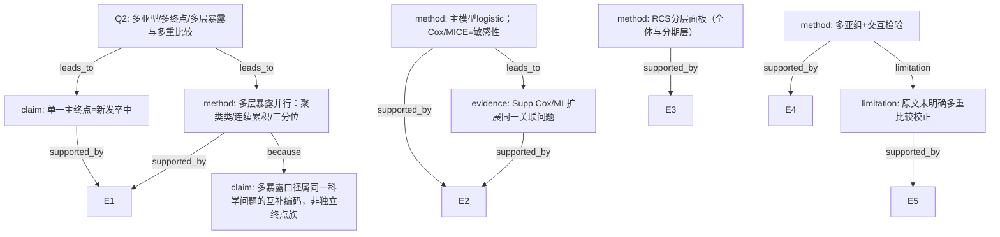

# AI-A Decision Tree Round 1

paper_id: paper_022
question_id: Q2
task_type: literature_decision_tree_reasoning
question: 如何处理多亚型/多终点/多层暴露？是否多重比较膨胀I类错误？是否对相关终点做聚合？
source_file: adversarial_lit_reading/chunks/paper_022_2026_wang_ckm_cum_egdr_stroke.md

## 1. Evidence Map

| evidence_id | location | evidence_summary | used_by_node |
|---|---|---|---|
| E1 | Abstract/Table2 | 主终点：新发卒中（Wave4自报医生诊断）；暴露：k-means四类 + 累积eGDR连续 + 三分位 | N1,N2 |
| E2 | Methods | 主分析logistic；Cox为敏感性；MICE五套为敏感性 | N3,N8 |
| E3 | Fig.3 | RCS在全体/CKM0-2/CKM3-4三面板 | N4 |
| E4 | Table3/Supp S2 | 亚组多分层 + 交互P；Supp另有HR亚组 | N5 |
| E5 | Methods | 未报告Bonferroni/FDR/假设族校正 | N6 |
| E6 | 全文 | 单一主临床终点=卒中；无复合终点/PCA聚合多终点 | N1 |

## 2. Decision Tree - Mermaid

## 3. Node Table

| node_id | node_type | claim | evidence_location | evidence_summary | confidence | risk_tag |
|---|---|---|---|---|---|---|
| N0 | question | 多终点/多层暴露/多重比较 | — | 根 | high | — |
| N1 | claim | 单一主终点卒中 | Abstract | 无多临床终点 | high | — |
| N2 | method | 暴露多层编码并行 | Table2 | 类/连续/三分位 | high | — |
| N3 | method | 主分析vs敏感性分工 | Methods | logistic主；Cox/MI敏 | high | — |
| N4 | method | RCS多面板 | Fig.3 | 分期层 | high | — |
| N5 | method | 亚组+交互 | Table3 | 多分层 | high | — |
| N6 | limitation | 未报告多重比较校正 | Methods | 原文未说明 | high | 证据不足 |
| N7 | claim | 多层暴露=同一假设互补编码 | Table2 | 非独立终点 | medium | 逻辑跳跃 |
| N8 | evidence | Supp扩展同问题 | Supp | Cox/MI | high | — |

## 4. Provisional Answer

本文**单一主终点**为 Wave4 新发卒中。暴露侧并行呈现：k-means 四类、累积 eGDR 连续、三分位；RCS 另做分期面板；亚组多分层+交互。主推理链为 logistic；Cox 与 MICE 为敏感性。**原文未报告** Bonferroni/FDR 等多重比较校正。多暴露口径宜理解为同一科学问题的互补编码，但仍存在家族wise I类错误膨胀风险（尤其亚组×多类对比）。无复合终点/PCA。

## 5. Uncertainty List

- U1: 亚组交互与四类两两对比是否构成预先界定假设族，原文未说明。
- U2: Fig.3 三面板是否校正，原文未说明。
- U3: Supp HR亚组与正文OR亚组是否同一假设族。

## 6. Follow-up Questions

1. 是否在协议/预注册中预先指定主暴露编码？
2. 亚组交互显著后是否限制探索性声明？
