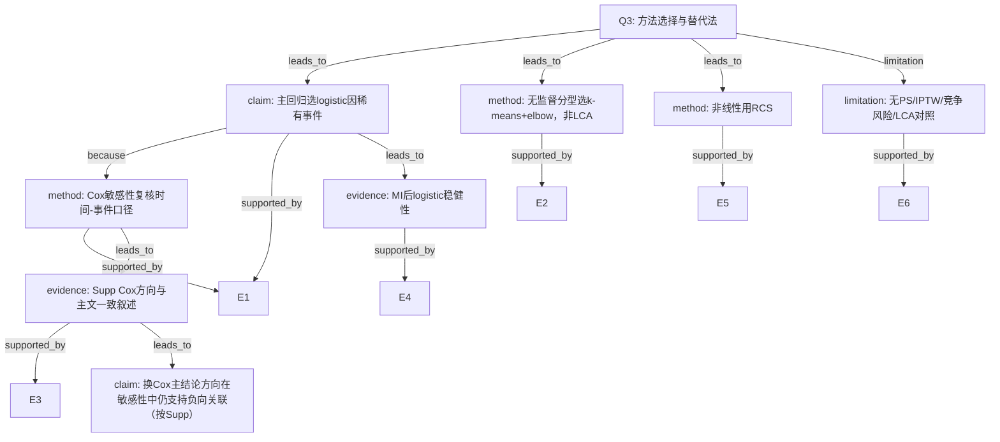

# AI-A Decision Tree Round 1

paper_id: paper_022
question_id: Q3
task_type: literature_decision_tree_reasoning
question: 该方法与既有方法区别？为何选logistic/k-means而非Cox/LCA等？换方法结论会变吗？
source_file: adversarial_lit_reading/chunks/paper_022_2026_wang_ckm_cum_egdr_stroke.md

## 1. Evidence Map

| evidence_id | location | evidence_summary | used_by_node |
|---|---|---|---|
| E1 | Methods | 低发病率选logistic近似HR；Cox作敏感性 | N1,N2 |
| E2 | Methods | k-means+elbow；未用LCA/层次聚类/GMM | N3 |
| E3 | Supp S1/S3 | Cox完整病例与MI后HR | N4 |
| E4 | Supp S4 | MI后logistic与主文对照 | N5 |
| E5 | Methods | RCS检非线性；未用多项式/分段回归主报 | N6 |
| E6 | 全文 | 未做PSM/IPTW/竞争风险 | N7 |

## 2. Decision Tree - Mermaid

## 3. Node Table

| node_id | node_type | claim | evidence_location | evidence_summary | confidence | risk_tag |
|---|---|---|---|---|---|---|
| N0 | question | 方法差异与替换敏感性 | — | 根 | high | — |
| N1 | claim | 主用logistic因低发病率 | Methods | 稀有事件假设 | high | — |
| N2 | method | Cox作敏感性 | Methods/Supp | 时间-事件 | high | — |
| N3 | method | k-means非LCA | Methods | elbow定K | high | — |
| N4 | evidence | Cox Supp | Supp S1/S3 | HR | medium | 证据不足 |
| N5 | evidence | MI logistic | Supp S4 | 稳健 | medium | — |
| N6 | method | RCS | Fig.3 | 非线性 | high | — |
| N7 | limitation | 无因果加权/竞争风险/LCA | 全文 | 未做 | high | — |
| N8 | claim | 换Cox后方向仍支持 | Supp | 敏感性 | medium | 逻辑跳跃 |

## 4. Provisional Answer

相对最直接替代：时间-事件可用 **Cox**（本文降为敏感性）；分型可用 **LCA/GMM**（本文用 **k-means+elbow**）。选择 logistic 的明确理由是卒中发病率低、OR近似HR。Supp 提供 Cox 与 MI 后复核。**未做** PSM/IPTW、竞争风险、LCA 对照。换 Cox 后主文声称方向一致，但效应量是否数值等价需逐表核对。

## 5. Uncertainty List

- U1: k-means vs LCA 结论是否改变，原文未检验。
- U2: 竞争风险（死亡）未建模。
- U3: 因果混杂用回归调整而非加权。

## 6. Follow-up Questions

1. 若主分析改Cox，Table2效应量如何变化？
2. 二维k-means是否可用增长混合模型替代？
