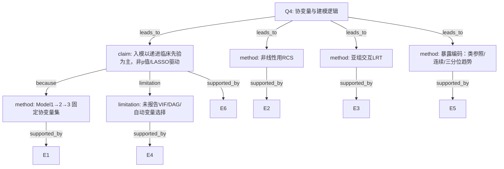

# AI-A Decision Tree Round 1

paper_id: paper_022
question_id: Q4
task_type: literature_decision_tree_reasoning
question: 变量/协变量筛选与建模逻辑？入模依据？是否交互/RCS/VIF/预先确定？
source_file: adversarial_lit_reading/chunks/paper_022_2026_wang_ckm_cum_egdr_stroke.md

## 1. Evidence Map

| evidence_id | location | evidence_summary | used_by_node |
|---|---|---|---|
| E1 | Methods Model1-3 | Model1未校正；Model2年龄性别婚姻；Model3再加BMI教育吸烟饮酒eGFR血脂异常糖尿病 | N1,N2 |
| E2 | Methods | RCS检累积eGDR非线性 | N3 |
| E3 | Table3 | 亚组交互用似然比检验 | N4 |
| E4 | Methods | 未报告单因素p筛选、LASSO、逐步回归、VIF、DAG | N5 |
| E5 | Methods | 参照类=Class2；连续每1单位；三分位趋势 | N6 |
| E6 | 全文 | 协变量集呈现为临床/行为递进调整，似预先指定而非数据驱动选择 | N1 |

## 2. Decision Tree - Mermaid

## 3. Node Table

| node_id | node_type | claim | evidence_location | evidence_summary | confidence | risk_tag |
|---|---|---|---|---|---|---|
| N0 | question | 变量筛选与模型形式 | — | 根 | high | — |
| N1 | claim | 临床先验递进调整 | Methods | 非自动选择 | high | — |
| N2 | method | 三套Model固定集 | Methods | M1/M2/M3 | high | — |
| N3 | method | RCS | Methods/Fig3 | 非线性 | high | — |
| N4 | method | 交互LRT | Table3 | 亚组 | high | — |
| N5 | limitation | 无VIF/DAG/LASSO报告 | Methods | 原文未说明 | high | 证据不足 |
| N6 | method | 暴露三种编码 | Table2 | 类/连续/三分位 | high | — |

## 4. Provisional Answer

建模逻辑：**预先呈现的递进校正**（Model1–3），未见单因素p门槛、逐步、LASSO或DAG。非线性用 RCS；亚组交互用 LRT。暴露编码含类别参照、连续单位、三分位趋势。**未报告 VIF**。是否分析前完全锁定协变量集，原文未用预注册语言明示，但叙述像固定调整集。

## 5. Uncertainty List

- U1: Model3是否含高血压——正文脚注与Methods亚组名单不完全同构。
- U2: RCS节点数/位置未说明。
- U3: eGFR与CKM分期成分是否共线未讨论。

## 6. Follow-up Questions

1. Model3协变量最终名单以脚注还是Methods为准？
2. 是否做过共线性诊断但未写入？
