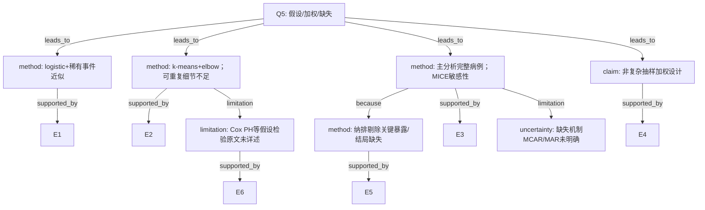

# AI-A Decision Tree Round 1

paper_id: paper_022
question_id: Q5
task_type: literature_decision_tree_reasoning
question: 依赖哪些参数假设？是否满足？加权设计？缺失如何处理？
source_file: adversarial_lit_reading/chunks/paper_022_2026_wang_ckm_cum_egdr_stroke.md

## 1. Evidence Map

| evidence_id | location | evidence_summary | used_by_node |
|---|---|---|---|
| E1 | Methods | logistic；稀有事件近似HR；未详述logit线性诊断 | N1 |
| E2 | Methods | k-means假设球状簇/距离；elbow定K；种子未说明 | N2 |
| E3 | Methods | 完整病例主分析；MICE五套敏感性处理协变量缺失 | N3 |
| E4 | Methods | CHARLS队列；非NHANES复杂抽样加权 | N4 |
| E5 | 纳排 | 排除eGDR缺失/离群与卒中状态缺失 | N5 |
| E6 | 全文 | 未报告PH假设检验（Cox敏感性）细节 | N6 |

## 2. Decision Tree - Mermaid

## 3. Node Table

| node_id | node_type | claim | evidence_location | evidence_summary | confidence | risk_tag |
|---|---|---|---|---|---|---|
| N0 | question | 假设加权缺失 | — | 根 | high | — |
| N1 | method | logistic稀有事件假设 | Methods | OR≈HR | high | — |
| N2 | method | k-means假设与定K | Methods | 细节不足 | medium | 证据不足 |
| N3 | method | CC主分析+MICE敏感 | Methods | m=5 | high | — |
| N4 | claim | 无survey加权 | 设计 | CHARLS | high | — |
| N5 | method | 纳排处理关键缺失 | Flow | 排除 | high | — |
| N6 | limitation | PH等未详述 | Supp/Methods | 原文未说明 | high | 证据不足 |
| N7 | uncertainty | 缺失机制未声明 | Methods | — | medium | — |

## 4. Provisional Answer

关键假设：稀有事件下 logistic OR 近似 HR；k-means 几何假设与 elbow 定 K；RCS 样条设定。**非** NHANES 式加权。缺失：主分析倾向完整病例（纳排已剔关键缺失）；协变量缺失用 **MICE（5）** 作敏感性。Cox PH 等检验细节**原文未明确说明**。种子/标准化**未说明**。

## 5. Uncertainty List

- U1: 结局自报与失访/死亡导致的选择偏倚机制。
- U2: MICE变量清单未完整给出。
- U3: 离群值定义未操作化。

## 6. Follow-up Questions

1. MICE插补模型含哪些变量？
2. Cox敏感性是否检验PH？
