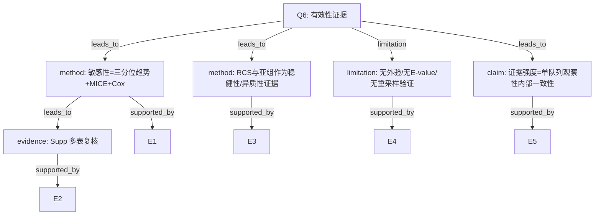

# AI-A Decision Tree Round 1

paper_id: paper_022
question_id: Q6
task_type: literature_decision_tree_reasoning
question: 如何证明分析有效？内部/外部验证、敏感性、E-value等？证据强度？
source_file: adversarial_lit_reading/chunks/paper_022_2026_wang_ckm_cum_egdr_stroke.md

## 1. Evidence Map

| evidence_id | location | evidence_summary | used_by_node |
|---|---|---|---|
| E1 | Methods/Results | 敏感性：三分位趋势；MICE | N1 |
| E2 | Supp S1-S4 | Cox与MI后Cox/logistic | N1,N2 |
| E3 | Fig.3/Table3 | RCS与亚组一致性/交互 | N3 |
| E4 | 全文 | 无外部验证队列；无bootstrap/CV；无E-value/阴性对照 | N4 |
| E5 | Methods | 单队列CHARLS内部证据 | N5 |

## 2. Decision Tree - Mermaid

## 3. Node Table

| node_id | node_type | claim | evidence_location | evidence_summary | confidence | risk_tag |
|---|---|---|---|---|---|---|
| N0 | question | 有效性证据层级 | — | 根 | high | — |
| N1 | method | 敏感性组合 | Methods | tertile/MI/Cox | high | — |
| N2 | evidence | Supp复核 | Supp | S1-S4 | high | — |
| N3 | method | RCS+亚组 | Fig3/Table3 | 形态与交互 | high | — |
| N4 | limitation | 无外验/E-value/CV | 全文 | 未做 | high | — |
| N5 | claim | 内部一致性证据 | 设计 | 单队列 | high | — |

## 4. Provisional Answer

有效性主要靠**内部敏感性三角**：三分位趋势、MICE、Cox（及MI后模型），辅以 RCS 与亚组。**无**外部队列验证、**无** bootstrap/CV 稳定性、**无** E-value/阴性对照。证据强度定位为单中心/单队列观察性关联的内部稳健性，而非预测模型验证或因果识别强度。

## 5. Uncertainty List

- U1: 聚类标签稳定性（重采样ARI）未报告。
- U2: 不同随机种子下类分配是否改变OR。

## 6. Follow-up Questions

1. 是否可补聚类稳定性分析？
2. E-value对未测混杂的提示？
