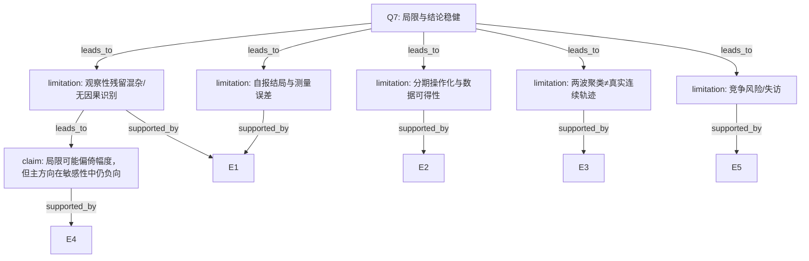

# AI-A Decision Tree Round 1

paper_id: paper_022
question_id: Q7
task_type: literature_decision_tree_reasoning
question: 局限有哪些？是否合理讨论？是否动摇主结论方向？
source_file: adversarial_lit_reading/chunks/paper_022_2026_wang_ckm_cum_egdr_stroke.md

## 1. Evidence Map

| evidence_id | location | evidence_summary | used_by_node |
|---|---|---|---|
| E1 | Discussion Limitations | 观察性残留混杂；自报卒中；CHARLS外推；测量误差等（按原文讨论） | N1,N2 |
| E2 | Methods/数据 | CKM分期操作化/期3测量限制在复现包中突出 | N3 |
| E3 | Methods | 二维两波非密采样轨迹 | N4 |
| E4 | Results | 主关联方向在多模型/敏感性中一致负向 | N5 |
| E5 | 全文 | 死亡竞争风险未建模 | N6 |

## 2. Decision Tree - Mermaid

## 3. Node Table

| node_id | node_type | claim | evidence_location | evidence_summary | confidence | risk_tag |
|---|---|---|---|---|---|---|
| N0 | question | 局限与是否动摇主方向 | — | 根 | high | — |
| N1 | limitation | 残留混杂 | Discussion | 观察性 | high | 因果过度 |
| N2 | limitation | 自报结局 | Methods/Disc | 信息偏倚 | high | — |
| N3 | limitation | 分期可操作性 | Disc/复现 | 期3等 | medium | — |
| N4 | limitation | 两波近似轨迹 | Methods | 设计 | high | — |
| N5 | claim | 主负向方向 internally 稳健 | Results/Supp | 敏感性 | medium | 逻辑跳跃 |
| N6 | limitation | 竞争风险/失访 | 设计 | 未建模 | high | — |

## 4. Provisional Answer

主要局限：观察性残留混杂、自报卒中、外推性、两波 k-means 非密采样轨迹、分期/缺失操作化、竞争风险未建模。作者讨论层面承认观察性限制。就**方向**而言，正文与敏感性多口径仍支持负向关联，但**幅度与因果解释**可被未测混杂/选择偏倚动摇；不宜把关联当成可干预因果效应。

## 5. Uncertainty List

- U1: 复现包N与原文N差异对结论定量影响。
- U2: 期3不可测对CKM分层亚组的影响。

## 6. Follow-up Questions

1. 死亡作为竞争风险时Fine-Gray是否改变？
2. 自报卒中验证效度引用是否充分？
