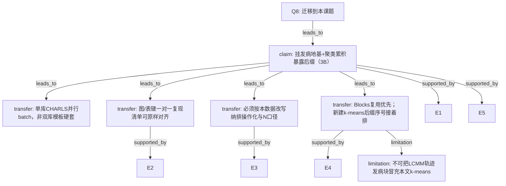

# AI-A Decision Tree Round 1

paper_id: paper_022
question_id: Q8
task_type: literature_decision_tree_reasoning
question: 方法套路哪些可迁移到本研究（发病地基+CHARLS累积eGDR k-means后缀，完整复现图/表）？哪些必须改写？
source_file: adversarial_lit_reading/chunks/paper_022_2026_wang_ckm_cum_egdr_stroke.md

## 1. Evidence Map

| evidence_id | location | evidence_summary | used_by_node |
|---|---|---|---|
| E1 | 用户确认 | 地基=发病incidence；后缀=k-means累积eGDR；单库CHARLS batch | N1,N2 |
| E2 | 本文Methods | 可平移：纳排流程图、Table1、k-means+elbow、logistic M1-3、RCS、亚组、敏感性Cox/MICE、Supp表图 | N3 |
| E3 | 数据交付 | 4d宽表；N与原文有差；期3不可测；需列审阅/disease_vars | N4 |
| E4 | Blocks库 | 可复用logistic/rcs/subgroup/imputation/attrition；缺k-means+elbow专用后缀块 | N5 |
| E5 | pipeline-foundation | 禁止第三块地基；3B只加方法层 | N1 |

## 2. Decision Tree - Mermaid

## 3. Node Table

| node_id | node_type | claim | evidence_location | evidence_summary | confidence | risk_tag |
|---|---|---|---|---|---|---|
| N0 | question | 可迁移边界 | — | 根 | high | — |
| N1 | claim | 发病地基+方法后缀 | 用户+foundation | 3B | high | — |
| N2 | transfer | 单库batch | 数据 | CHARLS | high | — |
| N3 | transfer | 发表键对齐原文 | Fig/Table/Supp | 一对一 | high | — |
| N4 | transfer | 纳排/分期按数据改写 | 交付包 | N差/期3 | high | — |
| N5 | transfer | 复用Blocks+新建后缀 | 库 | 76起 | high | — |
| N6 | limitation | 勿复用LCMM冒充 | 52块 | 不适用 | high | 可迁移性不足 |

## 4. Provisional Answer

**可直接平移的套路**：发病主链（清洗→基线→logistic递进模型→RCS→亚组→敏感性）；发表物键（Fig1–3、Table1–3、S1–S4、FigS1–S3）。**必须改写**：纳排字段操作化、CKM分期（期3不可测）、累积暴露时间乘子口径、k-means种子/标准化、协变量列名映射、终点编码。**工程**：单库 CHARLS batch；新建 `76_*` 级 k-means/累积暴露后缀；复用 logistic/rcs/subgroup/mice/cox(敏感)。**不可迁移**：把 `52_trajectory_incidence` LCMM 当本文方法；硬开第三块地基；双库模板在无第二库时假装对齐。

## 5. Uncertainty List

- U1: 年龄亚组原文60 vs 项目铁律常65，需用户确认切点。
- U2: 飞书三表字段映射待对接给定base。

## 6. Follow-up Questions

1. 年龄切点用60还是统一65？
2. batch并行单元按暴露口径还是按CKM层？
