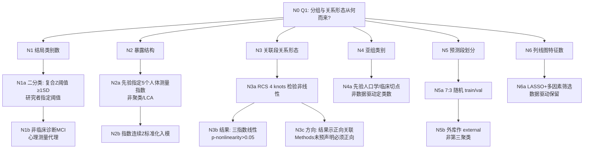

# AI-A Round1 Decision Tree — paper_024 / Q1

> paper_id: paper_024  
> QID: Q1  
> Question: 本研究预设了几个分组 / 亚型 / 类别？该数量是数据驱动的还是研究者主观指定？是否假设了暴露-结局关系的方向（线性、单调、U 型）？  
> Chunk: `adversarial_lit_reading/chunks/paper_024_nomogram_alz_13872877261424471.md`  
> Evidence rule: 无原文证据处标【原文未明确说明】；禁止用 Discussion 倒推结构。

---

## Part 1 — Evidence Map

| claim_id | claim | evidence_strength | evidence_location | quote_or_paraphrase |
|---|---|---|---|---|
| E1 | 主结局为二分类：复合认知 Z 分 ≥1 SD 低于人群均值定义为 p-MCI（心理测量学代理，非临床诊断） | 论文明确证明 | Methods「Assessment of cognitive functioning」/ Page 2–3 | 「operationalizing psychometric MCI (p-MCI) as composite z-scores falling ≥1 standard deviation (SD) below the average of the population」；并写明「reflects a psychometric classification rather than a clinical diagnosis」 |
| E2 | 暴露侧先验指定 5 个中心性肥胖人体测量指数（非聚类定 K） | 论文明确证明 | Methods「Calculation of five…」/ Abstract | 计算 ABSI、BRI、CoI、WWI、WHtR 五个指数；摘要「five central adiposity indices」 |
| E3 | 关联分析用三层校正模型（Model 1/2/3），指数作连续 Z 标准化变量 | 论文明确证明 | Statistical analysis / Page 5–6；Fig2 注 | Model1 未校正；Model2 校正 age/gender/race；Model3 全校正；「Each index was modeled as continuous variables standardized via Z-scoring」 |
| E4 | 非线性用 RCS（4 knots）检验；结果报告三指数线性（p for nonlinearity >0.05） | 论文明确证明 | Statistical analysis；Results + Fig3 | 「A restricted cubic spline (RCS) with four knots」；Results「RCS analyses confirmed linear relationships… p for nonlinearity > 0.05」 |
| E5 | 预测模型侧：7:3 随机划分 train/internal val；CHARLS 作外部验证；类别非聚类 | 论文明确证明 | Abstract；Statistical analysis Page 6 | 「7:3 split」；CHARLS 2011 external n=536 |
| E6 | 亚组分层阈值为研究者先验人口学/临床切点（年龄 60–69/70–79/≥80 等），非数据驱动定类数 | 论文明确证明 | Statistical analysis「Sensitivity analyses」 | 列出 age/gender/race/PIR/education/PA/drinking/BMI/comorbidity 分层 |
| E7 | 是否预先声明暴露-结局必须单调/正向：关联假设以统计检验为准，方向由结果决定 | 论文间接暗示 | Objective + Results | Objective 写「establish and verify a model」；正向关联出现在 Results（ABSI/WWI/CoI），Methods 未写「预先假定正向线性」 |
| E8 | 最终列线图纳入哪些指数：由 LASSO+多因素筛选决定（数据驱动选择），候选池含多指数与协变量 | 论文明确证明 | Results「Development…」；Discussion | LASSO 保留含 ABSI 等；「ABSI was the only adiposity metric retained」 |

---

## Part 2 — First-pass methods notes（不写病名硬套）

- 设计：横断面双库（主库全国调查 + 外库纵向基线波次作外验）→ 二分类结局预测。  
- 两段分析骨架：**(A) 多暴露指数关联**（分层 logistic OR + RCS + 亚组/MI）→ **(B) 预测模型**（7:3 划分 → LASSO → 多因素 logistic → 列线图 → ROC/校准/DCA/CIC + 外验）。  
- 分组：结局二分类为研究者阈值；5 指数为先验名单；亚组切点先验；**无** LCA/聚类定 K。  
- 关系形态：Methods 用 RCS(4) **检验**非线性；Results 报线性。  

---

## Part 3 — Results-ordered analysis steps

1. Fig1 纳排 → Table1 按结局分组基线  
2. Fig2 五指数 × Model1–3 关联  
3. Fig3 五指数 RCS  
4. 敏感性：亚组森林（Supp Fig）+ MI  
5. Table2 train vs val 基线  
6. Fig4 LASSO → Fig5 多因素 → Fig6 列线图  
7. Fig7 ROC+校准 → Fig8 DCA → Fig9 CIC（train / internal / external）

---

## Part 4 — Decision Tree

### Nodes

| node_id | claim | evidence | risk_tag |
|---|---|---|---|
| N0 | Q1 根：分组来源与关系形态 | — | — |
| N1/N1a/N1b | 结局二分类由 ≥1SD 阈值指定；明确非临床诊断 | E1 | 代理结局外推风险 |
| N2/N2a/N2b | 5 指数先验名单 + 连续 Z | E2,E3 | — |
| N3/N3a/N3b/N3c | RCS 检验；结果线性；正向来自结果 | E4,E7 | 方向非先验证明 |
| N4/N4a | 亚组切点先验 | E6 | — |
| N5/N5a/N5b | 7:3 + 外验库 | E5 | — |
| N6/N6a | 列线图变量数数据驱动 | E8 | — |

### Edges

| from | to | relation |
|---|---|---|
| N0 | N1 | because |
| N1 | N1a | supported_by |
| N1a | N1b | limitation |
| N0 | N2 | because |
| N2 | N2a | supported_by |
| N2a | N2b | leads_to |
| N0 | N3 | because |
| N3 | N3a | supported_by |
| N3a | N3b | leads_to |
| N3a | N3c | if |
| N0 | N4 | because |
| N4 | N4a | supported_by |
| N0 | N5 | because |
| N5 | N5a | supported_by |
| N5a | N5b | leads_to |
| N0 | N6 | because |
| N6 | N6a | supported_by |

---

## Part 5 — Answer to Q1（简答）

1. **结局分组**：1 个二分类结局（p-MCI vs 非），由复合 Z 分 **≥1 SD** 阈值**研究者指定**；原文强调非临床诊断。  
2. **暴露/亚型**：先验 **5** 个中心性肥胖指数，**不是**数据驱动聚类定 K。  
3. **亚组**：多个人口学/临床先验分层，**不是**定类算法。  
4. **关系方向/形态**：Methods 用 **RCS(4 knots) 检验**非线性；Results 对 ABSI/WWI/CoI 报 **线性**；正向关联见于结果，**Methods 未明确预声明必须正向单调**。  
5. **预测段**：train/val/external 是样本划分与外验，**不是**亚型发现；列线图最终特征数由 **LASSO+多因素** 数据驱动选出。

---

## Part 6 — Uncertainty List

- 主分析 NHANES 关联段是否使用 survey 权重：Statistical analysis 大段未写 `svyglm`/权重合并细节 → 【原文未在该段明确说明】（需 Q5 深挖）。  
- Model3「all potential confounding variables identified above」完整名单以 Fig2 注为准；Supplemental 可能有更细表。  
- 五个指数是否允许同时进入同一多因素关联模型：Fig2 为**各指数分别**建模（并列五套），非五指数同模 → 建树按「分指数模型」。  
