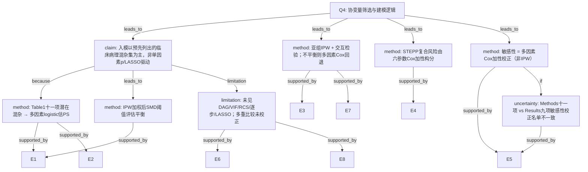

# AI-A Decision Tree Round 1

paper_id: yaoyong_moxing_sanfen
question_id: Q4
task_type: literature_decision_tree_reasoning
question: 变量/协变量筛选与建模逻辑是什么？（变量入模的依据：临床重要性 / 单因素 p 值 / 文献 / DAG / VIF；模型形式：加性 / 含交互 / 含非线性项 RCS；是否做了变量选择如 LASSO、逐步回归）该逻辑是否在分析前预先确定？
source_file: adversarial_lit_reading/chunks/yaoyong_moxing_sanfen.md

## 1. Evidence Map

| evidence_id | location | evidence_summary | used_by_node |
|---|---|---|---|
| E1 | Methods Statistical analysis (p.3) | IPW 的倾向评分由「纳入 Table 1 所示全部十一项潜在混杂」的多因素 logistic 估计；再以 PS 做 IPW 平衡两组基线 | N1, N2, N3 |
| E2 | Methods Study variables (p.2) | 预先列出基线临床病理变量清单（年龄、族裔、病理/临床 T/N、分级、HR、ERBB2、组织学、Charlson-Deyo、诊断年等），作为后续建模输入 | N1, N2 |
| E3 | Methods Statistical analysis (p.3) | 亚组按年龄、族裔、pT、HR、ERBB2、分级、分子亚型、cN 等做 IPW；并做放疗×基线特征交互检验评估异质性 | N4 |
| E4 | Methods Statistical analysis (p.3–4) | STEPP 用六参数（年龄、pT、HR、ERBB2、cT、cN）构复合风险 Cox，再滑动窗看绝对 5 年 OS 差 | N5 |
| E5 | Methods/Results (p.4, p.5) | 敏感性分析：多因素 Cox；Methods 称校正「上述十一项」；Results 写「nine selected risk factors」与 IPW 方向一致 | N6, N8 |
| E6 | Methods Statistical analysis (p.4) | 「No adjustments were made for multiple comparisons」；未见单因素 p 门槛、逐步、LASSO、DAG、VIF、RCS 的明确描述 | N7 |
| E7 | Fig. 3 caption (p.6) | 部分亚组加权后仍不平衡时改用多因素 Cox（caption 提及 imputed datasets）；主模型调整名单列于图注 | N4, N6 |
| E8 | Methods Study cohort (p.2) | 缺失基线特征者直接排除（完整病例取向），非多重插补主分析 | N7 |

## 2. Decision Tree - Mermaid

## 3. Node Table

| node_id | node_type | claim | evidence_location | evidence_summary | confidence | risk_tag |
|---|---|---|---|---|---|---|
| N0 | question | 变量筛选与模型形式是什么？ | — | 根节点 | high | — |
| N1 | claim | 协变量进入以临床病理先验清单为主，非自动变量选择 | Methods Statistical analysis | 十一项潜在混杂写入 PS logistic | high | — |
| N2 | method | 全部 Table1 混杂进 logistic 估 PS | Methods p.3; Table1 | incorporating all eleven potential confounders | high | — |
| N3 | method | IPW + SMD≤0.1 平衡诊断 | Methods p.3; Table1 weighted | SMD threshold 0.1 | high | — |
| N4 | method | 亚组再平衡 + 交互；失败则多因素 Cox | Methods p.3; Fig.3 caption | P-interaction; fallback MV Cox | high | — |
| N5 | method | STEPP 复合风险：六因子 Cox 加性构分 | Methods p.3–4; Fig.5 | age/pT/HR/ERBB2/cT/cN | high | — |
| N6 | method | 敏感性：多因素 Cox（非 IPW） | Methods p.4; Results p.5 | nine/eleven risk factors | medium | 方法误读 |
| N7 | limitation | 未报告 DAG/VIF/RCS/LASSO/逐步；未做多重比较校正；主路径为完整病例排除缺失 | Methods p.4; Study cohort | 原文未明确说明自动选择与共线性 | high | 证据不足 |
| N8 | uncertainty | 敏感性校正变量数 Methods「十一」与 Results「九」不一致 | Methods vs Results | 原文未说明如何从十一减到九 | high | 证据不足 |

## 4. Provisional Answer

该文变量/建模逻辑可概括为三段：

1. **变量进入**：倾向评分 logistic **一次性纳入 Table 1 所列全部十一项潜在混杂**（临床病理先验清单），**未见**单因素 p 值门槛、逐步回归、LASSO、DAG 或 VIF 的明确描述；缺失基线者在入组阶段排除。
2. **模型形式**：主分析为 **IPW + 加权 KM/log-rank + 加权 Cox（加性）**；亚组做 IPW 并检验 **暴露×协变量交互**；另用 **STEPP**（六参数 Cox 构复合风险，加性构分，非 RCS）；敏感性为 **多因素 Cox**。
3. **是否预先确定**：叙述上像 **分析前固定调整集**（「all eleven potential confounders as shown in Table 1」），但原文**未**用预注册/SAP 语言明示；且敏感性分析 **「eleven」vs「nine selected」** 存在口径张力，**原文未说明**九项如何选定。

**未报告**：VIF、DAG、RCS/样条非线性、LASSO/逐步；**明确声明**多重比较未校正。

## 5. Uncertainty List

- U1: Results「nine selected risk factors」如何从 Methods「eleven」选出——原文未说明。
- U2: Fig.3 caption「imputed datasets」与 Methods「缺失则排除」是否同指主队列——原文未在 Methods 展开插补流程。
- U3: Cox 比例风险假设检验（如 Schoenfeld）——原文未明确说明。
- U4: STEPP 六参数是否与 PS 十一项故意子集——仅列名，未论证为何不含 Charlson 等。

## 6. Follow-up Questions

1. 敏感性 Cox 的九项具体名单是否与十一项表注一致？
2. 亚组「imputed datasets」是否仅对不平衡亚组做了插补，抑或笔误？
3. 交互与多亚组检验在「未校正多重比较」下如何解释假阳性风险？
