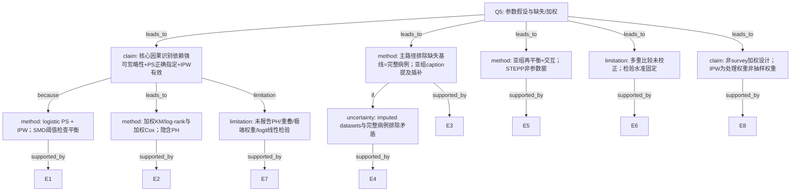

# AI-A Decision Tree Round 1

paper_id: yaoyong_moxing_sanfen
question_id: Q5
task_type: literature_decision_tree_reasoning
question: 该分析依赖哪些参数假设？是否满足？（Cox PH、logistic 线性 logit、正态性、K、训练/验证划分等）。若复杂抽样/加权设计：是否正确使用抽样权重/PSU/分层？是否处理缺失（多重插补 vs 完整病例）？
source_file: adversarial_lit_reading/chunks/yaoyong_moxing_sanfen.md

## 1. Evidence Map

| evidence_id | location | evidence_summary | used_by_node |
|---|---|---|---|
| E1 | Methods Statistical analysis | IPW：多因素 logistic 估 PS（接受放疗条件概率），再加权平衡基线；以 SMD&lt;0.1 判可接受平衡 | N1, N2 |
| E2 | Methods/Results | 结局 OS：IPW 调整 KM + log-rank + IPW 调整 Cox PH 模型 | N3 |
| E3 | Methods Study cohort | 排除「missing values on baseline characteristics」及不合理手术日期等 → 完整病例取向入组 | N4 |
| E4 | Fig. 3 caption | 部分亚组加权不平衡后改用「multivariable Cox regression based on imputed datasets」 | N4, N8 |
| E5 | Methods Statistical analysis | 亚组内重新平衡；交互检验异质性；STEPP 非参数滑动窗 | N5 |
| E6 | Methods end | R 4.2.3；双侧 P&lt;0.05；未做多重比较校正 | N6 |
| E7 | 全文 Methods | 未描述 Schoenfeld/PH 检验、logit 线性检验、PS 重叠/极端权重诊断、survey 权重/PSU/分层 | N7 |
| E8 | Abstract/Methods | 数据源为 NCDB 医院登记队列，非 NHANES 类复杂抽样设计叙述 | N9 |

## 2. Decision Tree - Mermaid

## 3. Node Table

| node_id | node_type | claim | evidence_location | evidence_summary | confidence | risk_tag |
|---|---|---|---|---|---|---|
| N0 | question | 假设/加权/缺失 | — | 根 | high | — |
| N1 | claim | IPW 因果调整依赖可忽略性等 | Methods | IPW for confounding | medium | 因果过度 |
| N2 | method | logistic PS + IPW + SMD | Methods | SMD 0.1 | high | — |
| N3 | method | 加权生存分析隐含 PH | Methods/Results | IPW Cox | medium | 证据不足 |
| N4 | method | 主分析完整病例排除缺失 | Study cohort | missing excluded | high | — |
| N5 | method | 亚组再平衡与 STEPP | Methods | STEPP/interaction | high | — |
| N6 | limitation | 未校正多重比较 | Methods end | No adjustments | high | — |
| N7 | limitation | 关键假设检验未报告 | 全文 | PH/overlap 未写 | high | 证据不足 |
| N8 | uncertainty | 插补 vs 排除矛盾 | Fig.3 vs Methods | imputed datasets | high | 方法误读 |
| N9 | claim | IPW≠复杂抽样权重 | Methods | NCDB cohort | high | — |

## 4. Provisional Answer

**关键假设：** (1) 观察性治疗分配在纳入混杂条件下可忽略；(2) PS logistic 形式正确且权重可估；(3) 加权后组间可比（以 SMD 论证）；(4) Cox 分析隐含比例风险；(5) 主分析对缺失呈完整病例（排除缺失基线）。

**是否满足：** 原文用 **加权后 SMD&lt;0.1** 支持平衡；**未报告** PH 检验、PS 重叠/极端权重、logistic 线性诊断。Fig.3 的 **imputed datasets** 与 Methods 排除缺失并存，**原文未说明**插补假设（MAR 等）。

**加权设计：** 本文 IPW 是 **处理（放疗）逆概率权重**，不是 NHANES 抽样权重/PSU/分层；**不适用** survey-weighted 专项。

**缺失：** 主路径完整病例排除；亚组 caption 提及插补——口径张力需标【证据不足】。

## 5. Uncertainty List

- U1: PH 是否检验——原文未明确说明。
- U2: 亚组 imputed datasets 的插补模型/次数——原文未展开。
- U3: 极端 IPW 权重是否截尾——原文未明确说明。

## 6. Follow-up Questions

1. 补充材料是否含 PH / 权重分布诊断？
2. 亚组插补与主队列排除如何衔接？
