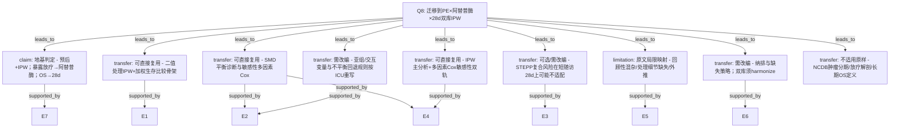

# AI-A Decision Tree Round 1

paper_id: yaoyong_moxing_sanfen
question_id: Q8
task_type: literature_decision_tree_reasoning
question: 该文的方法与套路中，哪些可迁移到「我的研究」？我的研究：肺栓塞（PE）队列；暴露=阿替普酶（alteplase）是/否；结局=28天死亡；双库 MIMIC+eICU；目标套路=预后+IPW（暴露映射：放疗→阿替普酶；OS→28d）。
source_file: adversarial_lit_reading/chunks/yaoyong_moxing_sanfen.md

## 1. Evidence Map

| evidence_id | location | evidence_summary | used_by_node |
|---|---|---|---|
| E1 | Abstract/Methods | 回顾性队列 + 二值处理（放疗 vs 否）+ IPW（logistic PS）+ 加权 KM/Cox 估 OS 关联 | N1, N2 |
| E2 | Methods | SMD 阈值评估加权平衡；亚组 IPW + 交互；不平衡则多因素 Cox 回退 | N2, N3 |
| E3 | Methods | STEPP：复合风险滑动窗看绝对效应模式 | N4 |
| E4 | Methods/Results | 敏感性：多因素 Cox 复核 IPW 主结论 | N5 |
| E5 | Discussion limitations | 回顾性/登记选择偏倚；处理细节缺失；毒性未捕获；稀有亚组 CI 贴边 | N6 |
| E6 | Methods Study cohort | 纳排图 Fig.1；完整病例排除缺失基线 | N7 |
| E7 | 用户研究说明（本任务） | PE；alteplase Y/N；28d mortality；MIMIC+eICU 双库；预后+IPW | N0, N8 |

## 2. Decision Tree - Mermaid

## 3. Node Table

| node_id | node_type | claim | evidence_location | evidence_summary | confidence | risk_tag |
|---|---|---|---|---|---|---|
| N0 | question | 可迁移性 | — | 根 | high | — |
| N1 | transfer | IPW+加权生存骨架可复用 | Abstract/Methods | binary Rx IPW Cox | high | — |
| N2 | transfer | SMD + 敏感性 Cox 可复用 | Methods | SMD 0.1; MV Cox | high | — |
| N3 | transfer | 亚组名单须按 PE/ICU 重写 | Methods | cN/HR 等肿瘤变量 | high | 可迁移性不足 |
| N4 | transfer | STEPP/5年绝对OS 不适配 28d 为主 | Methods | 5-year OS STEPP | medium | 可迁移性不足 |
| N5 | transfer | 主 IPW + 敏感性 Cox 双轨可复用 | Results | consistent HR | high | — |
| N6 | limitation | 回顾性混杂与处理细节缺失同样适用 | Discussion | limitations | high | — |
| N7 | transfer | 纳排/缺失/双库对齐须改编 | Methods; 用户设定 | dual MIMIC+eICU | high | — |
| N8 | claim | 地基=预后+IPW；映射已由用户确认 | 用户任务 | PE/alteplase/28d | high | — |
| N9 | transfer | 肿瘤分期/放疗靶区/长期OS 不适用原样 | Methods | NCDB PMRT | high | 可迁移性不足 |

## 4. Provisional Answer

**用户研究方向已确认**（非泛化）：PE 队列；暴露=alteplase yes/no；结局=28 天死亡；双库 MIMIC+eICU；套路=**预后 + IPW**。

| 类别 | 内容 |
|---|---|
| **可直接复用** | 二值处理 → logistic PS → IPW → 加权 KM/log-rank/Cox；SMD 平衡诊断；主 IPW + 多因素 Cox 敏感性双轨；交互亚组框架（变量另换） |
| **必须改编** | PS 混杂集（非肿瘤分期/HR/ERBB2，而改为 PE/ICU 临床混杂）；结局时间窗 OS→**28d**；暴露定义 PMRT→**alteplase**；单库 NCDB→**双库列名/单位 harmonize**；缺失策略是否仍完整病例；若用 landmark/immortal time 需另设 |
| **可选/可能不适用** | STEPP（原文面向 5 年绝对 OS 与复合肿瘤风险）；肿瘤特异亚组（cN1 vs cN2-3） |
| **地基一句话** | **预后 + IPW**；放疗→阿替普酶；OS→28d |

## 5. Uncertainty List

- U1: 双库是否分别估 PS 再汇总，或堆叠后统一 IPW——原文单库，用户研究未决。
- U2: 28d 二分类死亡 vs 时间到事件带删失——原文为生存时间；迁移时可 Cox 或 logistic，须另定。
- U3: alteplase 剂量/时机等处理细节在 ICU 库可得性——对应原文「放疗参数缺失」局限。

## 6. Follow-up Questions

1. 双库 IPW：分库加权还是合并加权？
2. 28d 结局用 Cox 还是 logistic（固定随访）？
3. PS 混杂白名单以何文献/临床清单锁定？
