# AI-A Revised Decision Tree

paper_id: paper_003
question_id: Q1
revision_source:
  - original_tree: @rounds/A_tree_round1_paper_003_Q1.md
  - attack_file: @rounds/B_attack_tree_paper_003_Q1.md
  - paper: @chunks/paper_003_2024_zhou_2024_association_between_cardiometabolic_index_and_depression_national_health_and_nutrition_examination.md

## 1. Revised Evidence Map

| evidence_id | location | evidence_summary | used_by_node |
|---|---|---|---|
| E1 | Abstract (Results) | 3794 名参与者中观察到 CMI 与抑郁正相关；RCS 确认非线性，识别拐点 0.9522 与 1.58 | N2, N12 |
| E2 | Section 2.2 (Depression definition) | 抑郁以 PHQ-9 总分 ≥10 定义；阈值引用既往研究与临床验证（灵敏度/特异度 88%） | N3 |
| E3 | Section 2.3 (Covariates) | 种族 4 类、PIR 3 档、婚姻 3 类、教育 5 级；吸烟分从未/既往/当前；饮酒分从未/既往/当前 | N4 |
| E4 | Section 2.4 (Statistical analysis) | 加权 logistic 回归、RCS 探索非线性、亚组分析与交互检验；**未披露 RCS 结点数/放置准则**；未提及聚类/LCA/轮廓系数定 K | N5, N1, N5a, N22 |
| E5 | Section 3.1 / Table 1 | 基线按「有抑郁 vs 无抑郁」两组比较；加权患病率 8.51%；抑郁病例 323 例 | N3, N4, N20 |
| E6 | Section 3.2 / Table 2 | CMI 作连续变量；另转换为三分位 tertiles，抑郁患病率随 tertile 升高（P for trend <0.001） | N6, N9 |
| E7 | Section 3.3 / Fig. 2 | RCS 调整后显著非线性（P for nonlinearity <0.001）；拐点 0.9522 与 1.58 | N7, N8, N9 |
| E8 | Section 3.3 / Table 3 | 按 RCS 拐点将人群分为 ≤0.9522、0.9522–1.58、≥1.58 三组，logistic 验证关联 | N7 |
| E9 | Section 3.3 (Wakabayashi cut-offs) | 按既往文献**高血糖/糖尿病** CMI 界值（女 0.799/0.800，男 1.625/1.748）二分做敏感性分析；原文称可「discriminate depression」；全调整后不显著 | N10, N10L |
| E10 | Section 3.4 / Table 4 | 亚组覆盖年龄、性别、BMI、合并症等；交互检验除饮酒外均 P>0.05 | N11 |
| E11 | Section 3.4 / sTable 3 | 饮酒分 3 类时交互边际显著；合并非饮酒者（never+former）后交互显著；当前饮酒者中关联更强 | N11, N17 |
| E12 | Section 4 (Discussion, alcohol) | 引用 Wakabayashi 2016：中年男性酒精与 CMI 呈 U 型——为饮酒-CMI 既往发现，非本文 CMI→抑郁 主假设 | N13 |
| E13 | Section 4 (Limitations) | 横断面设计无法建立因果；样本量相对小；人群限于特定 demographic areas | N14, N18 |
| E14 | Section 5 (Conclusion) | 总结 CMI 与抑郁呈 robust positive、non-linear 关联；建议维持 CMI <0.9522 | N12 |
| E15 | Section 2.1 (Flowchart) | 剔除 CMI 缺失/不可靠 14,054 + PHQ-9 缺失 1,265，最终纳入 3,794 | N19 |
| E16 | Section 4 (Discussion, never/former drinkers) | never/former 饮酒者亚组中，CMI 超过约 1.5 后 OR **smoothly decreases**，呈近似倒 U | N8, N21 |
| E17 | Section 1 (Objective) | 研究目标为 "explore the association"（非方向性预设假设） | N12 |
| E18 | Section 2.4 / 全文 | 并行四套暴露编码 + 多项亚组/交互检验，**未见多重比较校正声明** | N16 |

## 2. Revised Decision Tree - Mermaid

> ⚠️ 脱敏要求：图中**不得出现**文献的具体数值、疾病名、指标/特征名、分位数、阈值、样本量等；只保留框架，具体内容用泛化占位符替代。

```mermaid
flowchart TD
    N0["Q1: 预设几个分组/类别？数据驱动还是主观指定？是否假设暴露-结局方向？"]

    N1["claim: 无聚类/LCA 定 K；多套切分方案并存（先验 + RCS 混合驱动）"]
    N2["claim: 较高某指标与某疾病发生 Odds 升高相关（正相关、非线性；横断面关联）"]
    N3["method: 结局某疾病 2 类 — 某问卷阈值切分"]
    N4["method: 协变量多档先验分类"]
    N5["method: 预设 logistic + RCS 非线性探索 + 亚组/交互"]
    N5a["method: RCS 结点数先验设定；拐点位置由拟合数据驱动"]
    N6["method: 某指标三分位 tertiles（3 类）— 研究者主观指定"]
    N7["evidence: RCS 识别拐点后三分段 — 位置数据驱动、个数受结点数约束"]
    N8["evidence: 总体形态分段递增/阈值后上升，非 U 型主关联"]
    N9["claim: 连续 logistic 默认单调正向 — 线性模型假设，已被 RCS 非线性证伪"]
    N10["method: 文献界值二分（原属其他代谢结局）— 跨结局借用，先验文献指定"]
    N10L["limitation: 跨结局借用界值方案全调整后不显著，判别力弱于 RCS 方案"]
    N11["evidence: 亚组分层；饮酒修饰某指标-某疾病关联"]
    N12["claim: 摘要/结论结果表述 positive correlation / increased odds"]
    N13["limitation: U 型仅见于引用文献的饮酒-某指标，非本文主暴露-结局假设"]
    N14["limitation: 横断面无法确立因果方向"]
    N15a["transfer: 可借鉴多编码并行分析框架（先验切点 + 分位数 + RCS 重拟合）"]
    N15b["limitation: RCS 拐点数值为单样本估计，不可外推迁移"]
    N16["limitation: 多套暴露编码与多项亚组/交互并行，未见多重比较校正"]
    N17["limitation: 饮酒类别 3 类→2 类合并疑似事后根据 p 值调整"]
    N18["limitation: 反向因果/第三因素（如某指标←某疾病、共同炎症/应激）无法排除"]
    N19["limitation: 大量剔除缺失后样本缩减，存在选择/无应答偏倚风险"]
    N20["limitation: 结局事件数稀疏，亚组/交互检验统计效能有限"]
    N21["evidence: 非当前饮酒亚组内 OR 在某高水平达峰后回落，呈近似倒 U"]
    N22["limitation: 三分位分位点是否在加权分布上计算，原文未说明"]

    N0 -->|leads_to| N1

    N1 -->|composed_of| N3
    N1 -->|composed_of| N4
    N1 -->|composed_of| N5
    N1 -->|composed_of| N6
    N1 -->|composed_of| N7
    N1 -->|composed_of| N10

    N5 -->|if 连续暴露| N9
    N5 -->|if 探索关系形态| N5a
    N5 -->|if 常规分类暴露| N6
    N5a -->|leads_to| N7

    N7 -->|leads_to| N8
    N8 -->|scope_limited_by| N21

    N2 -->|supported_by| N6
    N2 -->|supported_by| N7
    N2 -->|supported_by| N8
    N2 -->|supported_by| N9
    N2 -->|supported_by| N12
    N2 -->|limited_by| N14
    N2 -->|limited_by| N16
    N2 -->|limited_by| N19
    N2 -->|limited_by| N20

    N9 -->|assumption_violated_by| N7
    N9 -->|assumption_violated_by| N8

    N3 -->|supported_by| E2
    N4 -->|supported_by| E3
    N5a -->|supported_by| E4
    N6 -->|supported_by| E6
    N6 -->|limited_by| N22
    N7 -->|supported_by| E7
    N7 -->|supported_by| E8
    N8 -->|supported_by| E7
    N8 -->|supported_by| E16
    N9 -->|supported_by| E6
    N10 -->|supported_by| E9
    N10 -->|limitation| N10L
    N11 -->|supported_by| E10
    N11 -->|supported_by| E11
    N11 -->|limited_by| N17
    N11 -->|limited_by| N20
    N11 -->|limited_by| N21
    N12 -->|supported_by| E1
    N12 -->|supported_by| E17
    N13 -->|because| E12
    N14 -->|because| E13
    N14 -->|includes| N18
    N19 -->|because| E15
    N16 -->|because| E18

    N2 -->|limitation| N13
    N1 -->|transfer_to| N15a
    N15a -->|limitation| N15b
```

## 3. Revised Node Table

> ⚠️ `claim` 列同样必须脱敏，只保留框架性结论。

| node_id | node_type | claim | evidence_location | evidence_summary | confidence | risk_tag |
|---|---|---|---|---|---|---|
| N0 | question | Q1：分组/类别数量、来源（数据驱动 vs 先验）、暴露-结局方向假设 | — | 决策树根问题 | high | — |
| N1 | claim | 本文未使用无监督聚类/LCA 定 K；并行多套类别方案：结局二分、暴露连续/三分位/RCS 三分段/文献二分、协变量多档、亚组分层 | Section 2.4; 3.2–3.4 | 原文未提及 silhouette/BIC/聚类定 K | high | — |
| N2 | claim | 主要主张：某指标升高与某疾病发生 Odds 升高相关，关系为非线性（横断面关联，非发病风险） | Abstract; Section 3.3; Section 5 | 原文 positive / increased odds；横断面限定 | high | 因果过度 |
| N3 | method | 某疾病结局预设 2 类：某问卷总分 ≥某阈值为阳性，<某阈值为阴性 | Section 2.2; Table 1 | 切点依据既往惯例与临床验证，非本研究数据驱动 | high | — |
| N4 | method | 协变量按问卷/临床定义预设多档（种族/教育/收入/婚姻/吸烟/饮酒等） | Section 2.3; Table 1 | 问卷字段或指南性定义，先验指定 | high | — |
| N5 | method | 统计预设：加权 logistic（连续暴露默认线性 logit）+ RCS 探索非线性 + 亚组/交互 | Section 2.4 | Methods 未预先声明 U 型，RCS 为探索性步骤 | high | — |
| N5a | method | RCS 结点数量由研究者先验设定（原文未披露），拐点位置由数据拟合驱动 | Section 2.4; Section 3.3 | 结点数决定可识别拐点数上限；正文未披露结点准则 | medium | 可重复性存疑 |
| N6 | method | 某指标分类暴露使用三分位 tertiles（3 组） | Table 2 | 常规分位数切分，研究者主观指定组数 | high | — |
| N7 | evidence | RCS 识别拐点后分为 3 段；拐点位置数据驱动，可识别拐点数受预设结点数约束 | Section 3.3; Fig. 2; Table 3 | 拐点数值来自 RCS 拟合；结点数未披露 | medium | 可重复性存疑 |
| N8 | evidence | 总体非线性形态：第一拐点以下风险极低；中间段 OR 显著升高；高于第二拐点仍逐渐升高；非主关联 U 型 | Section 3.3; Abstract | 总体分段递增；never/former 亚组例外见 N21 | high | — |
| N9 | claim | 连续 logistic 默认单调正向（线性 logit 模型假设）；该假设已被 RCS 显著非线性结论证伪 | Table 2; Section 3.3 | 连续 OR 升高 vs RCS P for nonlinearity <0.001 | medium | 内部张力 |
| N10 | method | 敏感性分析：按既往文献某代谢结局界值二分（按性别不同界值）；**界值原属其他结局，跨结局用于某疾病二分，概念依据不足** | Section 3.3; sTable 2 | Wakabayashi 高血糖/糖尿病界值借用 | medium | 概念错配 |
| N10L | limitation | 跨结局借用界值方案在全调整模型中关联不显著，AUC 低于 RCS 方案（AUC 对比见补充图） | Section 3.3; sFig. 2 | 该分组策略判别力弱于 RCS 三分段 | high | — |
| N11 | evidence | 亚组按多协变量分层；饮酒修饰关联（当前饮酒者中某指标-某疾病正相关更强） | Section 3.4; Table 4; sTable 3 | 饮酒先 3 类，后合并非饮酒者为 2 类做交互 | medium | 事后探索 |
| N12 | claim | 摘要与结论**结果**表述「正相关」「Odds/风险升高」；研究目标原文为 explore association（非方向性先验假设） | Abstract; Section 1; Section 5 | 正向表述出现在 Results/Conclusion，非 Objective | high | — |
| N13 | limitation | 主分析未假设暴露→结局为 U 型；U 型仅出现在讨论引用的饮酒-某指标文献 | Section 4 (Discussion) | 勿将引用文献 U 型误读为本研究主假设 | high | 方法误读 |
| N14 | limitation | 横断面设计无法验证因果方向 | Section 4 (Limitations) | 作者自述无法建立 causality | high | 因果过度 |
| N15a | transfer | 可借鉴：多编码并行（结局临床切点 + 暴露分位数 + RCS 在新队列重拟合）的分析框架 | Section 2.2–3.3 | 策略层可迁移至类似加权横断面关联研究 | medium | — |
| N15b | limitation | RCS 拐点阈值为单样本特定估计，未经外部验证/bootstrap，**具体数值不可外推** | Section 3.3; Section 4 | 新队列须重新拟合 RCS 并做稳定性检验 | high | 可迁移性不足 |
| N16 | limitation | 并行四套暴露编码 + 约 13 项协变量亚组与交互检验，全文未见多重比较校正 | Section 2.4; 3.2–3.4 | 假阳性膨胀风险 | medium | 多重比较 |
| N17 | limitation | 饮酒交互：3 类时边际显著，合并非饮酒者后变显著——合并方向与显著性变化提示事后探索 | Section 3.4; sTable 3 | 原文未说明合并是否预设 | medium | 事后探索 |
| N18 | limitation | 除横断面外，反向因果（某疾病→代谢恶化）与第三因素（炎症/应激）无法排除 | Section 4 (Limitations); Introduction | Q1 方向假设的双向替代解释 | medium | 因果过度 |
| N19 | limitation | 剔除大量 CMI/问卷缺失者后样本大幅缩减，完整病例与多重插补并存，存在选择偏倚 | Section 2.1 (Fig. 1) | 14,054+1,265 剔除 → 3,794 纳入 | high | 选择偏倚 |
| N20 | limitation | 结局事件数稀疏（加权患病率约 8.5%），亚组/交互在多分层下效能有限 | Table 1; Section 3.4 | 323 例抑郁事件 | medium | 低效能 |
| N21 | evidence | 非当前饮酒亚组内，某指标超过约某高水平后 OR 平滑回落，呈近似倒 U（与总体形态不同） | Section 4 (Discussion); sFig. 3 | never/former drinkers 亚组例外 | medium | 过度泛化 |
| N22 | limitation | 三分位分位点是否在加权分布上计算，原文未说明 | Section 3.2; Table 2 | 加权/未加权分位点不同或影响 OR | low | 口径不明 |

## 4. Final Answer Based on Revised Tree

围绕 **某指标（暴露）→ 某疾病（结局）** 主线，本文**并非**只预设一组分类，也**未**使用聚类/LCA 等数据驱动「定 K」的亚型发现，而是并行使用多套先验切分与一套 RCS **混合驱动**切分：

**（1）结局分组：2 类，先验指定。**
某疾病以某问卷总分 ≥某阈值定义，<某阈值为非阳性；切点引用既往研究与临床验证，属于研究者/文献主观指定。

**（2）暴露某指标的分类方案（Q1 核心）：**

| 方案 | 组数 | 来源 | 用途 |
|---|---|---|---|
| 连续变量 | — | 模型形式选择（默认线性 logit） | 主分析 logistic；**单调假设已被 RCS 非线性证伪** |
| 三分位 tertiles | **3** | **研究者主观指定**（常规分位数；加权口径未说明） | 分类 logistic + P for trend |
| RCS 拐点分段 | **3** | **混合驱动**（结点数先验设定 + 拐点位置数据拟合） | 验证非线性；结点数/准则未披露 |
| 文献代谢界值 | **2**（按性别不同界值） | **先验文献指定**（原属其他代谢结局，跨结局借用） | 敏感性分析（全调整后不显著） |

**（3）协变量与亚组类别（先验指定）：** 种族/收入/婚姻/教育/吸烟/饮酒等多档分类；亚组分析按上述变量分层。

**（4）暴露-结局关系方向假设：**

- 研究 **Objective** 原文为 "explore the association"（**非方向性先验假设**）；正向关联是**结果**而非事前锁定。
- 连续 logistic 默认**单调正向**（线性模型假设），但 RCS 检出显著非线性（P<0.001），二者存在**内部张力**——单调性仅为默认主模型设定，非关系形态最终判断。
- 总体形态为**分段递增/阈值后上升**（非 U 型主关联）；但在**非当前饮酒亚组**内，OR 在某高水平达峰后回落，呈近似倒 U。
- 讨论引用的 **U 型**仅针对既往「饮酒–某指标」研究，**不是**本文主暴露-结局假设。

**（5）关键限定（修正后新增）：**

- 横断面 → 无法确立因果；须考虑反向因果与第三因素（N14/N18）。
- 大量缺失剔除 → 选择偏倚风险（N19）。
- 并行多编码 + 多项亚组/交互 → 多重比较未校正（N16）。
- 饮酒类别合并 → 疑似事后探索（N17）。
- 结局事件稀疏 → 亚组结论稳定性存疑（N20）。
- RCS 拐点数值 → 单样本估计，策略可迁移、数值不可外推（N15a/N15b）。

**综合判断：** 核心分组策略为**先验临床/问卷/文献切点**与 **RCS 混合驱动拐点三分段**的并行混合；关系方向以**正向、非线性（总体非 U 型）**为结果框架，但须受横断面、选择偏倚、多重比较、线性-非线性张力及亚组形态差异等多重限定。

## 5. Revision Log

| critique_id | accepted_or_rejected | action | reason |
|---|---|---|---|
| EA1 | **accepted** | `N2 --contradicted_by--> N14` 改为 `N2 --limited_by--> N14` | 横断面不能定因果并不反驳阳性关联本身，仅限制因果解读；采纳攻击意见 |
| EA2 | **accepted** | `N8/N9/N6 --supported_by--> N2` 反向为 `N2 --supported_by--> N8/N9/N6` | 统一 supported_by 语义：claim 由 evidence 支撑，与 N3→E2 等边一致 |
| EA3 | **accepted** | `N1 --because--> N3..N10` 改为 `N1 --composed_of--> N3..N10` | N1 与分量节点为聚合/组成关系，非因果推导 |
| EA4 | **accepted** | 新增 `N9 --assumption_violated_by--> N7/N8`；N9 claim 修订为「线性模型假设，已被 RCS 非线性证伪」 | §3.2 连续 OR vs §3.3 RCS P<0.001 构成内部张力，须显式刻画 |
| EA5 | **accepted** | 在 N5 与 N7 之间插入中间节点 N5a（RCS 结点数先验设定） | 避免方法预设直接连到数据驱动结果，补全「结点数先验」环节 |
| NA1 | **accepted** | N7 去「纯数据驱动」化；新增 N5a；N7 加 risk_tag「可重复性存疑」、confidence 降为 medium | §2.4 未披露 RCS 结点数；拐点个数受结点数约束，原文仅支持位置数据驱动 |
| NA2 | **accepted** | N9 修订为被证伪的模型假设；confidence 降为 medium；加 risk_tag「内部张力」 | 与 EA4 同步；原文证据充分 |
| NA3 | **accepted** | N12「先验表述」→「结果/摘要表述」；增引 E17（Objective 为 explore） | §1 Objective 非方向性假设，正向为结果非先验 |
| NA4 | **accepted** | N2 claim「风险增加」→「Odds 升高相关（横断面关联，非发病风险）」 | Q1 第三问涉及方向措辞；横断面不宜称发病风险 |
| NA5 | **accepted** | N15 拆为 N15a（策略可迁移）+ N15b（数值不可外推）；加 `N15a --limitation--> N15b` | 拐点为单样本 RCS 估计，§4 Limitations 亦提示样本/人群局限 |
| NA6 | **accepted** | N10 增补「界值原属其他代谢结局，跨结局借用，概念依据不足」 | §3.3 原文明确界值为 hyperglycemia/diabetes，用于 depression 属跨结局借用 |
| NA7 | **accepted** | N8 增 `scope_limited_by--> N21`；新增 N21 节点刻画 never/former 亚组倒 U | §4 Discussion 原文："OR decreases smoothly as CMI exceeds approximate 1.5" |
| MB1 | **accepted** | 已通过 N5a 节点接入树 | 与 NA1/EA5 合并处理 |
| MB2 | **accepted** | 新增 N16（多重比较未校正），`N2 --limited_by--> N16` | 全文未见 Bonferroni/FDR 等校正声明 |
| MB3 | **accepted** | 新增 N17（事后合并饮酒类别），`N11 --limited_by--> N17` | §3.4 3 类边际显著→2 类显著，合并方向提示事后探索 |
| MB4 | **accepted** | 新增 N18（反向因果/第三因素），`N14 --includes--> N18` | Q1 方向假设需枚举双向替代；Introduction 有代谢→抑郁机制但横断面无法区分 |
| MB5 | **accepted** | 新增 N19（选择偏倚），`N2 --limited_by--> N19` | §2.1 剔除 14,054+1,265，完整病例分析 |
| MB6 | **accepted** | 新增 N20（小事件数/低效能），`N2/N11 --limited_by--> N20` | Table 1：323 例抑郁，8.51% 患病率 |
| MB7 | **accepted** | 已通过 N21 节点接入 | 与 NA7 合并 |
| MB8 | **accepted** | 新增 N22（tertile 加权口径不明），`N6 --limited_by--> N22` | §3.2 未说明分位点是否在加权分布上计算 |
| EP3 | **accepted** | N10L 注明 AUC 对比数值来自补充图 sFig.2，当前 chunk 不可核验正文 | 避免读者误以为正文已给出 RCS AUC 具体值 |
| EP4 | **rejected** | 无节点删除 | 攻击方确认 AI-A 无数值捏造；所有原节点均有原文依据，仅修订表述与结构 |

## 6. Remaining Uncertainty

- U1: RCS 结点数量、放置准则及软件实现细节正文未完整披露，拐点位置的可重复性需见补充材料（已通过 N5a/N7 标注，confidence 降为 medium）。
- U2: tertile 三分位是否在加权样本上按调查权重计算，原文未明确说明（已通过 N22 接入树）。
- U3: 高血糖/糖尿病文献界值敏感性分析全调整后不显著，概念错配可能是更深层原因（已通过 N10 标注）。
- U4: 饮酒交互分析中「3 类→2 类」合并是否事后根据交互 p 值调整（已通过 N17 接入树）。
- U5: 横断面设计下暴露→结局与结局→暴露及第三因素无法区分（已通过 N14/N18 接入树）。
- U6: sFig.2 中 CMI_RCS 的 AUC 具体数值未在正文 chunk 中呈现，与文献界值方案的对比仅能间接引用。
