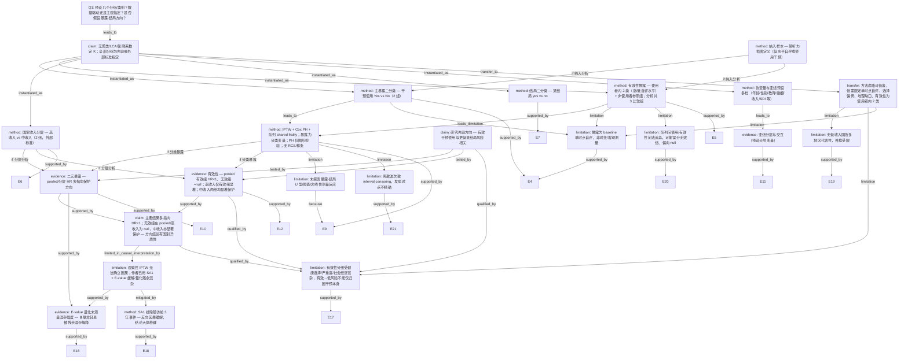

# AI-A Revised Decision Tree

paper_id: paper_004
question_id: Q1
revision_source:
  - original_tree: @rounds/A_tree_round1_paper_004_Q1.md
  - attack_file: @rounds/B_attack_tree_paper_004_Q1.md
  - paper: @chunks/paper_004_mmc7.md

## 1. Revised Evidence Map

| evidence_id | location | evidence_summary | used_by_node |
|---|---|---|---|
| E1 | SUMMARY (Page 2) | 某样本量听力受损老年人；IPTW-Cox；干预使用与某结局风险降低相关（HR<1）；有效使用组 HR 更低，无效使用组 pooled HR≈1 | N2, N8, N10, N12 |
| E2 | INTRODUCTION (Page 3) | 研究目标：检验干预使用（尤其有效使用）是否与**更低**的某结局风险相关；并考察国家经济发展水平与亚组差异 | N8 |
| E3 | RESULTS — Population characteristics / Table 1 (Pages 3–4) | 基线按国家收入水平分层；暴露分布按高/中收入国分别描述 | N3, N4, N9 |
| E4 | METHOD DETAILS — Hearing aid use (Page 17) | 暴露二分类：baseline 回答 Yes/No 为使用者 vs 非使用者 | N2, N_BASE |
| E5 | METHOD DETAILS — Hearing aid effectiveness (Page 17) | 使用者按自评 aided hearing 五档切分：高/中水平=有效；低水平=无效；非使用者为参照组；分析层面共 3 个比较组 | N3, N_HARM |
| E6 | METHOD DETAILS — Country income (Page 17) | 按 World Bank 2024 分类：若干队列为高收入；若干为中收入 → **2 组** | N4 |
| E7 | METHOD DETAILS — Probable dementia (Pages 17–18) | 结局二分类：某结局 yes/no；算法含认知+功能双损或医生诊断 | N5 |
| E8 | METHOD DETAILS — Covariates (Page 18) | 协变量预设多档：性别 2、教育 3、婚姻 2、家庭收入 3、SDI/UHC 等；认知损害 >某阈值 SD 为阈值 | N6 |
| E9 | QUANTIFICATION AND STATISTICAL ANALYSIS (Pages 18–19) | IPTW（二元 logistic / 三组 multinomial）+ Cox PH + **cohort shared frailty**；按国家收入分层；亚组按年龄/性别/教育/婚姻/家庭收入/医保/SDI；**未提及**聚类/LCA/RCS/轮廓系数定 K | N1, N7, N11, N_INT |
| E10 | RESULTS — Hearing aid use and probable dementia / Figure 2 (Pages 3–5) | 主分析：使用者 vs 非使用者 HR<1；中收入国 HR 更低，高收入国 HR 略低 | N9, N12 |
| E11 | RESULTS — Subgroup/interaction hearing aid use / Figure 3 (Pages 5–6) | 干预使用亚组：年龄、性别、教育、婚姻、SDI 等预设分层；部分交互显著 | N6, N13 |
| E12 | RESULTS — Hearing aid effectiveness / Figure 4 (Page 7) | pooled 有效组 HR<1、无效组 HR≈1；高收入国仅有效组显著；**中收入国有效组与无效组均显著保护（HR≈某低水平）** | N10, N12 |
| E13 | RESULTS — Subgroup/interaction effectiveness / Figure 5 (Page 7) | 有效性分析亚组：多数无显著交互 | N13 |
| E14 | METHOD DETAILS — Hearing loss (Page 17) | 听力损失：自评低水平 **或** 使用干预 → 纳入分析样本的二元定义 | N5L |
| E15 | QUANTIFICATION — PH assumption (Page 19) | Cox 比例风险假设经 log-cumulative hazard 图检验；原文称各队列及收入分层中曲线近似平行；**无 formal Schoenfeld 统计量** | N7 |
| E16 | RESULTS + METHODS (Pages 4, 7, 19) | **E-value** 量化未测量混杂：pooled/高收入/中收入分别为某水平；有效组分层亦有 E-value；作者用于抵御残余混杂 | N9, N12, N14 |
| E17 | DISCUSSION (Pages 9–10) + Limitation 2 (Page 11) | **selection-into-effectiveness**：自评有效者更可能为健康素养高、损害更轻、社会经济资源更好的人群；严重度与期望混杂有效性自评 | N_SEL |
| E18 | Sensitivity analyses (Pages 4, 19) | **SA1**：排除随访前 3 年新发病例以缓解反向因果；主结论大体稳健 | N_SA1, N14 |
| E19 | Limitation 4 (Page 11) | 样本**无低收入国**，缺非洲/南美/大洋洲代表性 | N_GEN, N15 |
| E20 | Limitation 5 (Page 12) | 各队列对「使用/有效性」问法不同（ever wear vs normal use），可能误分入无效组，偏向 null | N_HARM |
| E21 | Limitation 6 (Page 12) | 2–3 年波次造成 interval censoring，发病时点不精确 | N_INT |

## 2. Revised Decision Tree - Mermaid

> ⚠️ 脱敏要求：图中**不得出现**文献的具体数值、疾病名、指标/特征名、分位数、阈值、样本量等；只保留框架，具体内容用泛化占位符替代。

## 3. Revised Node Table

> ⚠️ `claim` 列同样必须脱敏，只保留框架性结论。

| node_id | node_type | claim | evidence_location | evidence_summary | confidence | risk_tag |
|---|---|---|---|---|---|---|
| N0 | question | Q1：分组/类别数量、来源（数据驱动 vs 先验）、暴露-结局方向假设 | — | 决策树根问题 | high | — |
| N1 | claim | 本文未使用无监督聚类/LCA/K-means 等数据驱动定 K；所有核心分组均为研究者先验切分或外部标准 | QUANTIFICATION (Page 19); METHOD DETAILS (Pages 17–18) | 全文未提及 silhouette/BIC/聚类定类数 | high | — |
| N2 | method | 主暴露预设 **2 类**：baseline 干预使用 Yes vs No | METHOD DETAILS (Page 17); Figure 2 | 问卷二元回答，研究者主观指定 | high | — |
| N3 | method | 有效性暴露：**使用者内 2 类**（高/低自评水平），**非使用者为参照组**；分析层面共 3 个比较组 | METHOD DETAILS — effectiveness (Page 17); Table 1; Figure 4 | 五档自评按研究者规则二分，非数据驱动聚类 | high | 分类可比性 |
| N4 | method | 分析分层预设 **2 类**：高收入国 vs 中收入国（外部机构分类） | Page 17; Table 1; Figure 2/4 | 外部标准，非本研究数据驱动 | high | — |
| N5 | method | 结局预设 **2 类**：某结局 yes vs no | Pages 17–18 | 算法性操作定义，先验指定 | high | — |
| N5L | method | 分析样本纳入：自评低水平 **或** 使用干预 → 某听力损害定义 | METHOD DETAILS (Page 17) | 二元合并定义，先验指定 | high | — |
| N6 | method | 协变量与亚组预设多档：性别/教育/婚姻/收入/SDI/年龄等 | Covariates (Page 18); Subgroup (Page 19); Figure 3/5 | 问卷/临床常规分类，先验指定 | high | — |
| N7 | method | IPTW 加权 Cox PH + **cohort shared frailty**；暴露为**分类**变量；PH 仅图形检验；**未**使用 RCS/样条 | Pages 18–19 | 多队列 pooled 模型骨架含 frailty；非连续剂量探索 | high | — |
| N8 | claim | 研究先验假设：干预使用（尤其有效使用）与**更低**某结局风险相关 | INTRODUCTION (Page 3); SUMMARY (Page 2) | 原文明确表述 lower risk | high | 方向推断 |
| N9 | evidence | 二元暴露：pooled 与分层 HR 多指向保护方向（中收入国效应更强） | RESULTS (Pages 3–5); Figure 2 | 关联性结果，非因果证明 | high | 关联非因果 |
| N10 | evidence | 有效性：pooled 有效组 HR<1、无效组≈null；高收入仅有效组显著；**中收入有效组与无效组均显著保护** | RESULTS (Page 7); Figure 4 | 分层异质性，非单一 pooled 结论可概括 | high | 选择混杂 |
| N11 | limitation | 暴露-结局未预设或检验 U 型/阈值/单调剂量反应；仅分类 HR 比较 | QUANTIFICATION (Page 19) | 无 RCS、spline、dose-response | high | — |
| N12 | claim | 主要结果多指向 HR<1；无效组在 pooled/高收入为 null，**中收入亦显著保护** — 「有效性决定方向」非全局成立 | SUMMARY; Figure 2; Figure 4 | 国别异质性；观察性下为关联方向 | high | 关联非因果 |
| N13 | evidence | 亚组/交互基于预设 sociodemographic 分层；Bonferroni 校正 | Page 19; Figure 3; Figure 5 | 分层变量先验选定 | high | — |
| N14 | limitation | 观察性 pooled IPTW 无法确立因果；作者已用 **SA1（排除前 3 年）** 缓解反向因果且大体稳健，并计算 **E-value** 量化未测量混杂 | INTRODUCTION; DISCUSSION; Pages 4, 19 | 残余混杂仍不能完全排除 | high | 残余混杂 |
| N15 | transfer | 方法套路可借鉴，但需限定：(a) 单时点自评暴露；(b) 中收入结果受强选择偏倚；(c) 无低收入国代表性；(d) 有效性为使用者内 2 类+参照 | Methods + Results + Limitations | 迁移需重新验证 | medium | 可迁移性不足 |
| N_SEL | limitation | 有效性分组受健康素养/损害严重度/社会经济**正向选择**混杂；「有效→低风险」不能仅归因干预本身 | DISCUSSION (Pages 9–10); Limitation 2 (Page 11) | 原文大篇幅讨论选择效应 | high | 选择偏倚 |
| N_SA1 | method | SA1：排除随访前 3 年新发病例，专门缓解反向因果；主结论大体稳健 | Pages 4, 19 | 非完全消除但作者已主动处理 | high | — |
| N_EV | evidence | E-value 表明需较强未测量混杂方可解释 away 观察关联 | Pages 4, 7, 19 | pooled/分层/有效性均有 E-value | high | — |
| N_BASE | limitation | 暴露在 baseline **单时点**测定，非时变/客观；长随访下对方向/剂量支撑有限 | METHOD DETAILS (Page 17) | 强化 N11 剂量反应缺失论证 | high | 测量局限 |
| N_HARM | limitation | 各队列对使用/有效性问法不同，可能将非常用者误分入无效组，偏向 null | Limitation 5 (Page 12) | 影响 N3 跨队列可比性 | medium | 分类误差 |
| N_GEN | limitation | 样本无低收入国，缺多地区代表性；外推至低资源场景不确定 | Limitation 4 (Page 11) | 地理泛化受限 | high | 可迁移性不足 |
| N_INT | limitation | 离散波次随访致 interval censoring，发病时点记录不精确 | Limitation 6 (Page 12) | 与 Cox 时标相关 | medium | — |

## 4. Final Answer Based on Revised Tree

基于修正后决策树，对 Q1 三问的最终答案如下（框架性表述，已脱敏）。

### （1）预设了几个分组/亚型/类别？

与 **暴露—结局主线** 直接相关的核心类别：

| 分析层级 | 分组方案 | 组数 | 来源 |
|---|---|---|---|
| 主暴露 | 干预使用 vs 非使用 | **2** | 先验（baseline Yes/No 问卷） |
| 有效性暴露 | 使用者内高/低水平 **2 类** + 非使用者参照 | **2+参照（共 3 比较组）** | 先验（五档自评按规则二分） |
| 国家收入分层 | 高收入国 vs 中收入国 | **2** | 外部标准 |
| 结局 | 某结局 yes vs no | **2** | 先验算法 |
| 纳入样本 | 某听力损害定义 | **2**（是否纳入） | 先验 |

**并行预设分类（协变量/亚组）：** 性别、婚姻、教育、家庭收入、SDI、年龄等常规分层；多队列分别做 supplementary 分析（预设队列标识）。

**数据驱动定 K：无。** Methods 与 Statistical analysis 未提及 K-means、LCA、silhouette、BIC 等。

### （2）该数量是数据驱动还是研究者主观指定？

**结论：几乎全部为先验/外部标准指定。**

- 有效性分组：研究者在 Methods 中明确规定五档 aided hearing 的切点，属**主观指定**。
- 国家收入二分：依据外部机构分类。
- 结局二分：依据 harmonized 算法，属**先验操作定义**。
- 亚组变量：Methods 中预先列出，属**研究者指定**探索性分层。

**补充局限（修正后新增）：** 各队列问法 harmonization 差异（N_HARM）与单时点 baseline 暴露（N_BASE）进一步说明分组规则虽为先验指定，但跨队列可比性与时变暴露刻画均有限。

### （3）是否假设了暴露-结局关系的方向？

**是，先验假设为「保护性/风险降低」方向，且模型为分类 Cox HR 比较（非 U 型/剂量反应探索）。**

- Introduction / Summary 明确研究问题为检验**更低（lower）**风险（N8）。
- 统计模型：IPTW-weighted Cox PH + shared frailty，暴露为分类变量（N7）。
- **修正后关键限定：**
  - **分层异质性（N10/N12）：** pooled 与高收入国显示「仅有效组保护、无效组 null」；但**中收入国有效组与无效组均显著保护**，故「有效性决定保护方向」**非全局成立**。
  - **选择混杂（N_SEL）：** 自评「有效」者更可能为健康素养高、损害更轻、社会经济资源更好的人群；有效组低风险**不能仅归因于干预有效性本身**。
  - **因果解读（N14/N_EV/N_SA1）：** 观察性设计无法确立因果；作者已用 SA1 缓解反向因果且大体稳健，并用 E-value 量化未测量混杂——残余混杂仍存，但不宜表述为作者未做任何防御。
- **未探索** U 型、阈值或非线性剂量反应（N11）；单时点暴露进一步限制剂量-方向推断（N_BASE）。

**综合判断：** 本研究核心为 **2 组（使用/未使用）+ 使用者内 2 类有效性（+ 参照组）** 并行暴露编码，辅以 **2 组国家收入分层** 与 **2 组结局**；全部为**先验/外部标准**指定，**无数据驱动亚型定数**；暴露-结局关系**先验假设为保护性（HR<1）**，以分类 Cox 模型检验，**未探索 U 型或非线性剂量反应**；但**方向结论存在国别异质性与选择混杂限定**，观察性下只能表述为「原文显示关联方向」。

## 5. Revision Log

| critique_id | accepted_or_rejected | action | reason |
|---|---|---|---|
| A1 | accepted | 重写 N10、N12：删除「无效组一致 null」普适表述；补中收入国无效组亦显著保护的分层结论；消除与 U4 的自相矛盾 | severity=高；原文 Figure 4 行735-736 明确中收入国 poor effectiveness HR 显著<1，与「null」直接矛盾 |
| A2 | accepted | N10 补充分层 HR 框架（pooled / 高收入 / 中收入三套），不再只引用 pooled | severity=中；与 A1 同源，证据选择性引用 |
| A3 | accepted | N7 加入 **cohort shared frailty**；注明 PH 仅图形检验 | severity=中；Page 19 行3061-3063 为模型骨架，不可省略 |
| A4 | accepted | N3 改为「使用者内 2 类 + 非使用者参照组；分析共 3 比较组」 | severity=低-中；Page 17 行2950-2954 原文明确 users 内二分、非使用者为 reference |
| A5 | accepted | 新增 N_SEL 节点；N8/N10/N12 以 qualified_by 连接；risk_tag 标注选择混杂 | severity=中-高；Discussion 行2190-2258、Limitation 2 行2347-2355 大篇幅讨论选择效应，直接威胁方向推断 |
| A6 | accepted | 重写 N15：限定单时点自评、中收入选择偏倚、无低收入国、有效性措辞；新增 N_GEN 分支 | severity=中；Limitation 4 行2384-2391 与 baseline 单时点行2944 支持 |
| A7 | accepted | 重写 N14；新增 N_SA1、N_EV 节点；risk_tag 由「因果过度」改为「关联非因果/残余混杂」 | severity=中；SA1 行3081-3082、结果行416-419、E-value 行399-402/737-740 证实作者已做缓解与量化 |
| A8 | rejected（确认保留） | N1 保持不变 | AI-B 确认结论正确，不构成攻击 |
| E1 | accepted | N12→N14 边由 contradicted_by 改为 limited_in_causal_interpretation_by | severity=低；观察性局限限定因果解读，不「反驳」关联结果本身 |
| E2 | accepted | N8→N7 改为 N8→N9/N10（tested_by）；删除 N8 leads_to N7 循环暗示 | severity=低-中；分类 Cox 估计 HR，方向由先验+结果一致性支撑 |
| E3 | accepted | N1→N2/3/4/5/6 边由 because 改为 instantiated_as | severity=低；「未聚类」与「先验分组」为并列观察，非因果关系 |
| E4 | accepted | 修正 N10/N12 内容后保留 N10→supported_by→N12，使边关系成立 | severity=中；原边将不充分 pooled 证据连到普适强主张 |
| MB1 | accepted | 新增 N_SEL（selection-into-effectiveness 混杂分支） | Missing Branch #1，severity=中-高 |
| MB2 | accepted | 新增 N_GEN 并连至 N15 | Missing Branch #2，Limitation 4 有原文证据 |
| MB3 | accepted | 新增 N_SA1 并连至 N14（mitigated_by） | Missing Branch #3，SA1 有原文证据 |
| MB4 | accepted | 新增 N_HARM 并连至 N3 | Missing Branch #4，Limitation 5 行2405-2411 |
| MB5 | accepted | 新增 N_INT 并连至 N7 | Missing Branch #5，低优先级但 Limitation 6 有原文依据 |
| MB6 | accepted | 新增 N_BASE 并连至 N2/N3 | Missing Branch #6，baseline 单时点行2944 |
| EP1 | accepted | 新增 E16/N_EV，E-value 证据入图 | 最重要证据缺口；原文核心敏感性防御 |
| EP2 | accepted | N10/N12 证据改为同时引用 pooled 与分层（E12 扩展） | 证据选择性引用问题 |
| U4 | accepted（上移） | 原 Uncertainty U4 内容并入 N10/N12 正式节点，消除树内矛盾 | 与 A1 同源 |

## 6. Remaining Uncertainty

- U1: 有效性五档切点的具体依据（是否引用既往量表文献）正文除描述外未给出独立验证，切点稳健性未知。
- U2: SDI 三分位界值定义正文未完整披露，需查 Supplement。
- U3: 各队列 hearing 问题 harmonization 差异（N_HARM 已升格为正式分支）对无效组跨队列可比性的量化影响仍未知。
- U4: （已解决）中收入国无效组保护性关联已写入 N10/N12；但其与主假设「仅有效组保护」的机制解释原文未深入展开。
- U5: Cox PH 假设仅图形检验、无 formal test 统计量；PH 违背时的备选模型原文未明确说明。
- U6: 尽管 SA1 与 E-value 已缓解/量化，观察性 IPTW 仍无法完全排除残余混杂与选择偏倚（N_SEL）；中收入国无效组显著保护是否部分由选择效应驱动，原文未分解。
