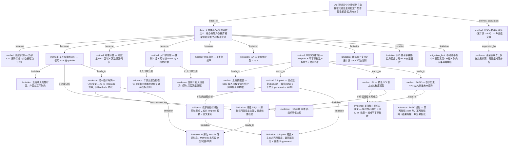

# AI-A Revised Decision Tree

paper_id: paper_005
question_id: Q1
revision_source:
  - original_tree: adversarial_lit_reading/rounds/A_tree_round1_paper_005_Q1.md
  - attack_file: adversarial_lit_reading/rounds/B_attack_tree_paper_005_Q1.md
  - paper: adversarial_lit_reading/chunks/PMID40910275.xml

## 1. Revised Evidence Map

| evidence_id | location | evidence_summary | used_by_node |
|---|---|---|---|
| E1 | Abstract — Methods | 某早发亚组定义为某年龄阈值前诊断；GBD 2021 数据；Joinpoint、BAPC、SII/concentration index | N2, N7, N8 |
| E2 | Methods §1 Data source | 某疾病按 ICD-10（K50–K52, K52.8–K52.9）与 ICD-9（555–556.9, 558–558.9, 569.5）识别；早发=某年龄阈值前；GBD 按 age/sex/region/country 分层；输入估计含 spatiotemporal Gaussian process regression、Bayesian regularization、trimmed meta-regression | N2, N3, N23 |
| E3 | Methods §2 SDI and GBD regional classification | SDI 五分位 **5 组**；21 GBD 区域；原文："SDI values demonstrate temporal variability, reflecting dynamic socioeconomic changes" | N4, N5, N22 |
| E4 | Methods §3 Joinpoint regression | 客观识别拐点、"without a priori assumptions about trend patterns"；**正文未写 permutation test**（机制见 ref10 Kim et al. 2000 / 软件默认） | N14 |
| E5 | Methods §4 Health inequality analysis | SII 由 SDI 谱上**线性回归**得出；concentration index 衡量相对不平等 | N12, N25 |
| E6 | Methods §5 BAPC model | BAPC 分解 age/period/cohort；预测 2022–2036 四项年龄标化率 | N17 |
| E7 | Methods §5 (age standardization) | 年龄标化采用 **5 年间隔**分层；EO-IBD（<20）内对应 4 档：<5 / 5–9 / 10–14 / 15–19 | N6 |
| E8 | Results §1 Global burden / Fig. 1 | mortality/DALYs 在 **1992** 出现拐点；incidence/prevalence 的 joinpoint **段数 K 主文未列**；AAPC 摘要报告 | N15, N26 |
| E9 | Results §2 BAPC projections / Fig. 1I–L | 预测：两指标 ASR **上升**；另两指标 **继续下降** | N17, N18 |
| E10 | Results §3 Age and sex / Fig. 2; Supp Fig. 2 | 年龄分层负担模式；性别 2 组差异；EO-IBD 占全某疾病比例（incident 3.73% 等）**仅作比例参照，非对照分析** | N2, N9, N10 |
| E11 | Results §4 Region / Supp Fig. 3–4 | incidence 与 SDI 正相关；SII=0.83；Concentration Index=11%；DALYs 与 SDI **U 形**；SII for DALYs 0.4→–1.06 | N11, N11U, N13, N25 |
| E12 | Results §5 Country / Fig. 4–5 | 某数量国/地区率值及 AAPC 排名 | N5 |
| E13 | Discussion — Limitations | 未分层 UC vs Crohn's；GBD 不支持 <6 岁单独类别；BAPC "limited capacity for causal inference" | N19, N20, N17, N24 |
| E14 | Abstract — Results | 摘要报告 BAPC **结果投影**方向（某两指标增、某两指标降），非 a priori 假设 | N18 |
| E15 | Methods §1 + 全文检索 | 正文未提及 K-means/LCA/silhouette/BIC/RCS；Supplement 未随 chunk 提供，存在盲区 | N1, N21 |

## 2. Revised Decision Tree - Mermaid

> ⚠️ 脱敏要求：图中不得出现文献具体数值、疾病名、指标/特征名、分位数、阈值、样本量等。

## 3. Revised Node Table

| node_id | node_type | claim | evidence_location | evidence_summary | confidence | risk_tag |
|---|---|---|---|---|---|---|
| N0 | question | Q1：分组/类别数量、来源、暴露-结局方向假设 | — | 根问题 | high | — |
| N1 | claim | 无无监督聚类/LCA 定 K；除 Joinpoint 时间分段外，核心分层为数据库框架或先验/外部标准 | Methods §1–§5; E15 | 正文无 silhouette/BIC/聚类 | high | — |
| N2 | method | 研究人群为某年龄 cutoff 前病例 — **纳入阈值，非分组变量** | Methods §1; Results §3 Supp | 原文定义 cutoff；全疾病占比仅参照 | high | — |
| N2R | evidence | 全某疾病占比仅作分母参照，**无**早发 vs 成人对照分析 | Results §3; Supp Fig. 2 | 比例描述，非亚组比较 | high | — |
| N3 | method | 疾病识别采用外部 ICD 编码（非亚型 A/B 数据驱动分型） | Methods §1 | ICD-10/ICD-9 外部标准 | high | — |
| N4 | method | 某发展指数 **框架 K=5** 档 quintile — **成员归属时变** | Methods §2 | GBD 五分位 + temporal variability | high | — |
| N22 | limitation | 五档 quintile **非固定互斥划分**；国家/地区可在研究期内迁移档位 | Methods §2 | SDI temporal variability | high | — |
| N5 | method | 地理分层：某数量 GBD 区域 + 某数量国/地区 | Methods §2; Results §4–5 | GBD 既定地理框架 | high | — |
| N6 | method | 性别 **2 组**；某 age cutoff 内 **4 档**年龄带（GBD 5 年间隔） | Methods §5; Results §3 | <某阈值内 4 档 | high | — |
| N7 | method | 负担结局 **4 类**指标（incidence/prevalence/mortality/DALYs） | Abstract; Methods §5 | GBD 标准指标 | high | — |
| N8 | method | 本研究分析链：Joinpoint + 不平等指数 + BAPC + 年龄标化 | Methods §3–§5 | 描述性流行病学链 | high | — |
| N23 | method | **上游**：GBD 输入负担估计由时空 GP 回归等模型派生 | Methods §1 | 数据基底为模型估计，非原始登记 | medium | — |
| N9 | evidence | 年龄分层：某两指标随年龄递增；另两指标在某两年龄带最高（双峰） | Results §3; Fig. 2 | Results 涌现形态，非预设 | high | — |
| N10 | evidence | 性别 2 组负担差异（某时点后某组持续更高） | Results §3; Fig. 2 | 原文显示 | high | — |
| N11 | evidence | 某指标与某分层变量：描述性正相关 + 线性 SII 梯度 + 相对不平等指数 | Results §4; Supp Fig. 3 | SII 与描述性正相关方向一致 | high | — |
| N11U | evidence | 另一指标与同一分层变量呈 **U 形**（两端高负担） | Results §4; Supp Fig. 4 | Results 观察，非 Methods 预设 | high | — |
| N12 | method | SII 预设 SDI 谱上 **线性**回归梯度 | Methods §4 | 线性模型为先验形式 | high | — |
| N25 | limitation | 线性 SII 对 U 形指标 **设定可能失配**；单一梯度不能干净摘要 U 形 | Methods §4 vs Results §4 | DALYs U 形 vs SII 线性矛盾 | high | 方法误读 |
| N13 | evidence | 五档区域某年各指标率值差异格局 | Results §4; Supp Tables | 原文显示 | high | — |
| N14 | method | Joinpoint 拐点 **数据驱动**（Kim et al. ref10/软件算法；正文无 permutation 字样） | Methods §3; ref10 | 无先验趋势形态；permutation 为引用/软件推断 | high | — |
| N15 | evidence | **仅**部分指标报告某年拐点；其余 joinpoint 段数 K **主文未列** | Results §1; Fig. 1 | 1992 拐点仅 mortality/DALYs | medium | 证据不足 |
| N26 | limitation | Joinpoint 段数 K 主文未完整披露；"数据驱动定 K"需 Supplement 核验 | Results §1; U2 | 主文 K 不完整 | medium | 证据不足 |
| N16 | limitation | U 形为 Results 涌现；Methods 未预设 U 型/阈值/单调 | Results §4 vs Methods §4 | 与 N25 联动 | high | — |
| N17 | method | BAPC 基于历史 APC 外推未来；Discussion 承认因果推断能力有限 | Methods §5; Discussion | 趋势外推，非因果设计 | medium | 预测外推·非因果 |
| N18 | evidence | BAPC 投影：某两指标 ASR 升、某两指标降（**结果外推**，非 a priori 假设） | Results §2; Abstract Results | 原文显示投影方向 | high | — |
| N19 | limitation | 未分层某疾病亚型 A vs B | Discussion — Limitations | 亚型类别数=0（未分析） | high | — |
| N20 | limitation | 数据库不支持更细年龄 cutoff 单独类别 | Discussion — Limitations | 数据粒度限制 | high | — |
| N21 | limitation | 非个体暴露→结局回归；无 RCS/HR 方向性检验 | Methods/Results 全文 | 生态/描述性设计 | high | — |
| N24 | migration_limit | 不可迁移至：个体亚型发现、未知 K 聚类、因果暴露推断 | Discussion; 全文设计 | 全球聚合负担研究边界 | high | 可迁移性不足 |

## 4. Final Answer Based on Revised Tree

基于修正后决策树，对 Q1 的最终答案如下（框架性表述，已脱敏）。

### （1）预设了几个分组/亚型/类别？

| 分层维度 | 组数 | 指定方式 | 备注 |
|---|---|---|---|
| 某发展指数区域 | **框架 K=5** | GBD 外部框架 | **成员归属时变**，非固定聚类 |
| GBD 地理区域 | **某数量（21）** | GBD 框架 | 先验 |
| 国/地区 | **某数量（204）** | GBD 框架 | 先验 |
| 性别 | **2** | GBD 标准 | 先验 |
| 年龄（某 cutoff 内） | **4 档** | GBD 5 年间隔 | 先验框架 |
| 负担结局 | **4 类** | GBD 标准 | 先验 |
| Joinpoint 时间分段 | **K 部分披露** | 数据驱动（算法） | 主文仅部分指标报告拐点 |
| 疾病亚型 A vs B | **0**（未分析） | — | Discussion 承认 |
| 研究人群 cutoff | **纳入阈值** | 研究者先验 | **不计入分组变量** |

**不计入 Q1 分组计数**：某 age cutoff 为**纳入定义**（N2），全某疾病占比仅作比例参照（N2R），非二元亚组对照。

**方法预设的数据驱动定 K**：仅 Joinpoint 时间分段（N14）；段数 K 主文未完整披露（N26）。

**Results 层涌现形态（非预设）**：U 形分层-指标关系（N11U）、年龄双峰负担（N9）。

### （2）数据驱动还是研究者主观指定？

- **先验/GBD 外部标准为主**：五档指数框架、地理、性别、4 档年龄、4 类结局、ICD 编码。
- **框架 K=5 但非静态**：五档成员随时间迁移（N22）。
- **数据驱动（有限）**：Joinpoint 拐点由算法/ref10 选段（N14）；K 值主文未完整报告（N26）。
- **上游数据亦为模型派生**：GBD 输入非原始登记，经时空 GP 回归等估计（N23）。
- **无**聚类/LCA/silhouette 定类（N1；Supplement 未检，E15 标注盲区）。

### （3）是否假设了暴露-结局关系的方向？

本文为**全球聚合描述性负担研究**（N21），非个体暴露→结局因果回归：

| 模块 | 预设/形态 | 说明 |
|---|---|---|
| Joinpoint | **不预设**趋势形态 | 拐点数据驱动（N14） |
| SII | **预设线性**梯度 | 适用于单调关系（N12） |
| 某指标–分层变量 | 正相关（描述性 + SII 一致） | N11 |
| 另一指标–分层变量 | **U 形为 Results 观察**；与线性 SII **可能失配** | N11U, N25, N16 |
| BAPC | 历史趋势外推；**非因果假设** | N17, N18；risk_tag=预测外推·非因果 |
| 个体因果方向 | **原文未涉及** | N21 |

**迁移边界（N24）**：方法套路不可直接用于个体亚型发现、未知 K 聚类或因果暴露推断。

## 5. Revision Log

| critique_id | accepted_or_rejected | action | reason |
|---|---|---|---|
| NA1 | **accepted** | 重定义 N2 为「纳入阈值」非「二元亚组」；新增 N2R；Q1 计数表移除 cutoff 行；EA1 边改为 `defines_population` | 原文无早发 vs 成人对照；Supp 仅比例参照，属结构误读 |
| NA2 | **accepted** | N4 增「成员归属时变」限定；新增 N22（MB1）；计数表标注「框架 K=5，非静态」 | Methods §2 明确 SDI temporal variability |
| NA3 | **accepted** | N14 删除「正文 permutation test」表述，改为 ref10/软件算法推断 | 正文仅 "without a priori assumptions"，无 permutation 字样 |
| NA4 | **accepted** | 新增 N25（MB4）承载线性 SII vs U 形指标设定失配；N11 拆为 N11（单调）+ N11U（U 形）；重连 EA2 边 | SII 线性梯度与 U 形 DALYs 内部矛盾须显式标注 |
| NA5 | **accepted** | N11 补相对不平等指数；区分「描述性正相关」与「线性 SII 梯度」 | Results §4 同段报告 SII 与 Concentration Index |
| NA6 | **accepted** | N6 与计数表写明 cutoff 内 **4 档**年龄带 | Methods 5 年间隔 + <某阈值 → 4 档可推断 |
| NA7 | **accepted** | N17 risk_tag 由「因果过度」改为「预测外推·非因果」 | BAPC 为外推非因果；Discussion 承认 causal inference 有限 |
| NA8 | **accepted** | Final Answer 区分「方法预设定 K（Joinpoint）」与「Results 涌现（U 形/双峰）」 | 与 N16/N11U/N9 修正后结构一致 |
| EA1 | **accepted** | N0→N2 改为 `defines_population`；N2 移出 N1 的 `because` 分组链 | 纳入定义≠分层依据 |
| EA2 | **accepted** | N12→N11 加条件「if 单调线性」；N11U→N25 `contradicted_by`；N25→N16 `leads_to` | 设定冲突不能只靠 N16 软限定 |
| EA3 | **accepted** | N15 限定「仅部分指标报告拐点」；新增 N26（MB5） | 主文未列全部 joinpoint 段数 K |
| EA4 | **accepted** | E2 补全 ICD-9 具体码（555–556.9, 558–558.9, 569.5） | 证据表完整性 |
| MB1 | **accepted** | 新增 N22 + N4→N22 limitation 边 | SDI 时变成员归属 |
| MB2 | **accepted** | 新增 N23 + N8→N23 边 | GBD 上游模型派生数据层 |
| MB3 | **accepted** | 新增 N24 migration_limit + N1→N24 边 | 迁移边界显式化 |
| MB4 | **accepted** | 新增 N25（见 NA4） | 线性 SII vs U 形冲突独立节点 |
| MB5 | **accepted** | 新增 N26 + N14/N15→N26 边 | Joinpoint K 未披露限制 |
| E14 措辞 | **accepted** | N18/E14 改为「BAPC 结果投影」非「预先描述/假设」 | 预设 vs 结果区分 |
| E15 Supplement 盲区 | **accepted** | E15 注明 Supplement 未随 chunk 提供 | absence claim 范围限定 |

## 6. Remaining Uncertainty

- U1: Joinpoint 各指标完整段数 K、APC 需查 Supplement（N26）。
- U2: SDI–DALYs U 形是否经 formal 非线性检验，或仅曲线描述（N25 仍待 Supplement 核实）。
- U3: Supplement 是否含 K-means/LCA/RCS 等（E15 盲区）。
- U4: BAPC 对 COVID-19 诊断延迟的敏感性，Discussion 仅定性讨论。
- U5: 五档指数时变成员迁移对跨年率比较的具体影响，原文未量化。
- U6: GBD 上游模型不确定性如何传递至本研究分层比较，原文未展开。
