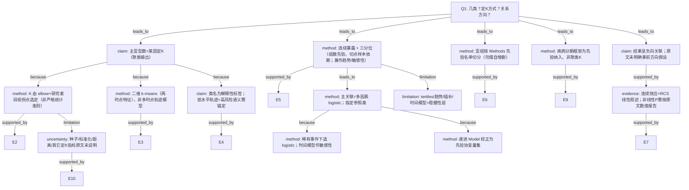

# AI-A Revised Decision Tree

paper_id: paper_022
question_id: Q1
revision_source:
  - original_tree: @rounds/A_tree_round1_paper_022_Q1.md
  - attack_file: @rounds/B_attack_tree_paper_022_Q1.md
  - paper: @chunks/paper_022_2026_wang_ckm_cum_egdr_stroke.md

## 1. Revised Evidence Map

| evidence_id | location | evidence_summary | used_by_node |
|---|---|---|---|
| E1 | Abstract Methods | 两时点指标值作 k-means；累积暴露公式；多因素 logistic | N1, N3, N8 |
| E2 | Methods | elbow 定簇数；称 K=4 有清晰拐点；未给其它有效性指标 | N2 |
| E3 | Methods | bivariate：两时点数值为输入特征 | N3 |
| E4 | Methods/Results 类标签 | 一类命名为 persistent low，同时叙述为高风险组 | N4 |
| E5 | Methods | 累积暴露作连续 + tertiles；后文又列入敏感性 | N5, N12 |
| E6 | Methods 亚组名单 | age/sex/education/smoke-drink/CKM/diabetes/hypertension/dyslipidaemia | N7 |
| E7 | Abstract Results | 连续 OR 负向；RCS 称线性；P for nonlinearity 报告 | N10, N11 |
| E8 | Methods Model1–3 | 递进校正协变量集 | N14 |
| E9 | Methods | CKM stages 0–4 纳入框架 | N13 |
| E10 | Methods | 种子/标准化/距离未明确说明 | N15 |

## 2. Revised Decision Tree - Mermaid

> 脱敏：仅保留分析框架。

## 3. Revised Node Table

| node_id | node_type | claim | evidence_location | evidence_summary | confidence | risk_tag |
|---|---|---|---|---|---|---|
| N0 | question | 类别数、定K、方向假设 | — | 根 | high | — |
| N1 | claim | 主亚型为聚类得到的固定K类 | Abstract/Methods | k-means 输出 | high | — |
| N2 | method | K 由 elbow 拐点选定，含研究者判断；非 Silhouette/BIC 自动化 | Methods | elbow 叙述 | high | — |
| N3 | method | 二维两时点特征聚类，非多时点轨迹模型 | Methods | bivariate | high | — |
| N4 | claim | 类名解释性；低水平=高风险需语义锚定 | Methods/Results | 命名张力 | high | — |
| N5 | method | 三分位：组数先验、切点样本依赖；兼剂量反应与敏感性 | Methods | tertiles | high | — |
| N7 | method | 亚组严格跟 Methods 名单 | Methods | 先验分层 | high | — |
| N8 | method | 主分析 logistic + 参照类 | Methods/Table | OR | high | — |
| N9 | method | Cox 等为敏感性 | Methods/Supp | 稳健性 | high | — |
| N10 | claim | 结果负向关联；**未**证实事前方向假设 | Abstract | 观察性结果 | high | — |
| N11 | evidence | RCS/连续效应支持线性负向叙述 | Abstract/Fig | 非线性P按原文 | medium | 证据不足 |
| N12 | limitation | tertiles 与敏感性表述并存 | Methods | 口径 | high | — |
| N13 | method | 分期框架先验 | Methods | 非定K | high | — |
| N14 | method | Model 递进先验 | Methods | 校正 | high | — |
| N15 | uncertainty | 可重复细节缺失 | Methods | 未说明 | high | 证据不足 |

## 4. Final Answer Based on Revised Tree

- **主类别数**：聚类得到 **K=4** 类变化模式；K 由 **elbow + 目视拐点**选定（数据辅助，非严格统计自动准则）；类名为解释性标签，且「低水平轨迹=高风险」需语义锚定。
- **并行分组**：累积暴露连续 + **三分位**（组数先验、切点样本依赖；正文与敏感性表述并存）。
- **亚组**：按 Methods 先验名单（年龄/性别/教育/行为/分期/糖尿病/高血压/血脂异常等）；**不得**把未在 Methods 声明的分层擅自写入「预设亚组」。
- **分期 0–4**：纳入框架先验，不是聚类 K。
- **方向**：结果呈负向关联与线性 RCS 叙述；**原文未明确事前假设**线性/单调/U 型；避免因果箭头措辞。

## 5. Revision Log

| critique_id | accepted_or_rejected | action | reason |
|---|---|---|---|
| ATK-N1 | accepted | N2 改为 elbow+目视判断，降「纯数据驱动」绝对化 | severity 中，合理 |
| ATK-N2 | accepted | N3 明确二维 k-means≠多时点轨迹 | 合理 |
| ATK-N3 | accepted | N4 补低水平=高风险语义锚定 | 合理 |
| ATK-N4 | accepted | N5 改切点样本依赖+敏感性并存 | 合理 |
| ATK-N5 | accepted | N7 亚组改回 Methods 名单，删擅自 BMI | severity 高 |
| ATK-N6 | accepted | N10 去掉「预设方向」，改结果方向 | severity 高 |
| ATK-N7 | accepted | N11 降为 medium，强调 chunk/图注核对 | 攻击文件末尾截断仍保留要点 |

## 6. Remaining Uncertainty

- U1: B 攻击因 max_tokens 截断，后半节点攻击未完整；后续可用更大预算重攻。
- U2: Table3 是否含 BMI 亚组需对照全文表，不在 Methods 则不当「预设」。
- U3: 累积暴露时间乘子 ×3 vs 表均值张力仍在（数据交付包 PI-2）。
