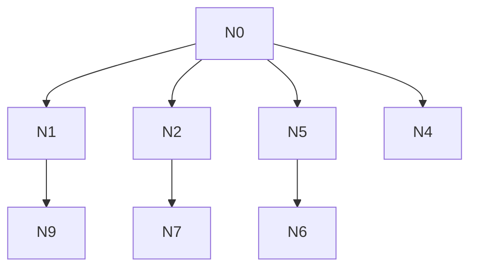

# AI-A Revised Decision Tree

paper_id: paper_022
question_id: Q2
revision_source:
  - original_tree: @rounds/A_tree_round1_paper_022_Q2.md
  - attack_file: @rounds/B_attack_tree_paper_022_Q2.md
  - paper: @chunks/paper_022_2026_wang_ckm_cum_egdr_stroke.md

## 1. Revised Evidence Map

| evidence_id | location | evidence_summary | used_by_node |
|---|---|---|---|
| E1 | Abstract/Table2 | 单终点+多层暴露 | N1,N2 |
| E2 | Methods | 无多重比较校正声明 | N6 |
| E3 | Table3/Supp | 亚组交互 | N5 |

## 2. Revised Decision Tree - Mermaid

> 脱敏框架

## 3. Revised Node Table

| node_id | node_type | claim | evidence_location | evidence_summary | confidence | risk_tag |
|---|---|---|---|---|---|---|
| N0|question|多层暴露与多重比较|—|根|high|—|
| N1|claim|单一主终点，但多重比较仍可来自亚组×暴露×模型|全文|收窄|high|—|
| N2|method|多层暴露编码并行|Table2|类/连续/分位|high|—|
| N4|method|RCS面板需区分正文/补充|Fig/Supp|核对|medium|—|
| N5|method|亚组+交互|Table3/Supp|多检验|high|—|
| N6|limitation|未报告多重比较校正（未报告≠证实未做）|Methods|—|high|证据不足|
| N7|uncertainty|互补编码为审阅推断非原文明示|—|—|medium|逻辑跳跃|
| N9|claim|单终点不自动消除I类错误膨胀风险|Q2|—|high|—|

## 4. Final Answer Based on Revised Tree

单一主终点为新发卒中；但多重比较压力主要来自**多层暴露编码 × 多模型 × 多亚组/交互**，不能因单终点就否定家族wise误差风险。多层暴露是同一科学问题的多种编码，但原文**未声明**“互补编码”以免多重比较；亦**未报告**多重比较校正。RCS 分期面板在补充图更完整时需标 Supp。亚组表号以全文为准（正文亚组表 vs 基线表勿混淆）。

## 5. Revision Log

| critique_id | accepted_or_rejected | action | reason |
|---|---|---|---|
| N-A1|accepted|收窄N1：单终点≠无多重比较|合理|
| N-A2|accepted|N7降级为推断，标注原文未声明互补编码|合理|
| N-A3|accepted|N6保留未报告校正，但注明未报告≠未做|合理|
| N-A4|accepted|Fig面板来源改为全文/补充核对|攻击基于节选时表号易混；全文Fig3为RCS，Table3为亚组|
| N-A5|rejected|完全删Table3亚组|全文Table3确为亚组；攻击节选误判|

## 6. Remaining Uncertainty

- 亚组×四类对比的假设族是否预指定仍不明确
- 补充图与正文图编号对应需发表清单固化
