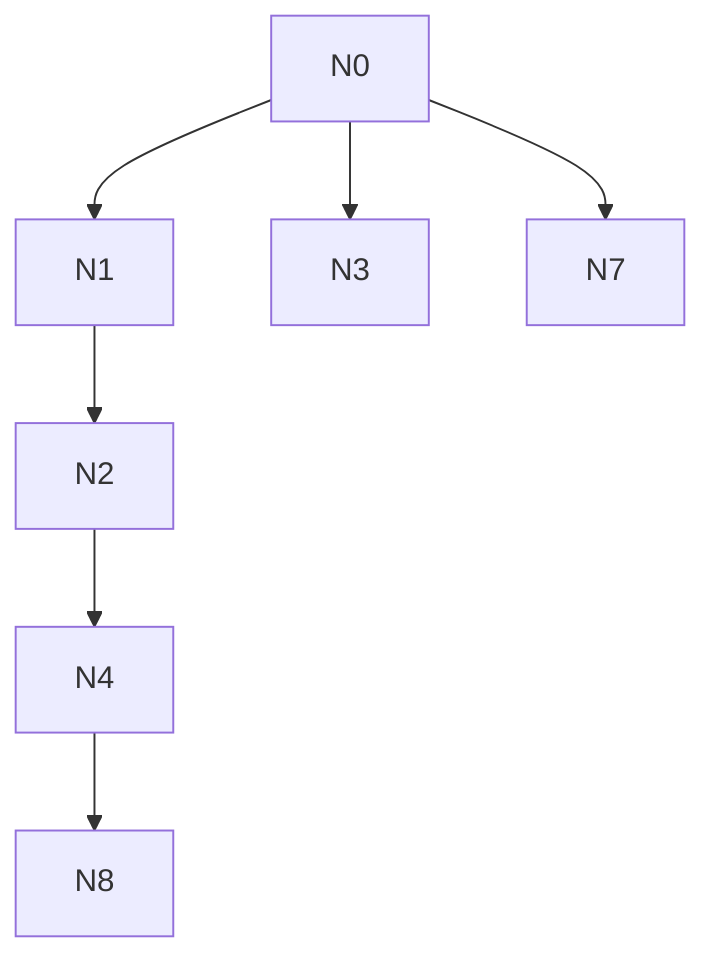

# AI-A Revised Decision Tree

paper_id: paper_022
question_id: Q3
revision_source:
  - original_tree: @rounds/A_tree_round1_paper_022_Q3.md
  - attack_file: @rounds/B_attack_tree_paper_022_Q3.md
  - paper: @chunks/paper_022_2026_wang_ckm_cum_egdr_stroke.md

## 1. Revised Evidence Map

| evidence_id | location | evidence_summary | used_by_node |
|---|---|---|---|
| E1 | Methods | rare disease; Cox sensitivity | N1,N2 |
| E2 | Methods | k-means elbow | N3 |
| E3 | Supp S1-S4 | Cox/MI | N4 |

## 2. Revised Decision Tree - Mermaid

> 脱敏框架

## 3. Revised Node Table

| node_id | node_type | claim | evidence_location | evidence_summary | confidence | risk_tag |
|---|---|---|---|---|---|---|
| N0|question|方法选择|—|根|high|—|
| N1|method|主用logistic；原文给出稀有事件近似理由|Methods|OR≈HR|high|—|
| N2|method|Cox为敏感性|Methods/Supp|存在|high|—|
| N3|method|k-means+elbow；未做LCA对照且未详述为何不用|Methods|—|high|证据不足|
| N4|evidence|Supp Cox/MI 供复核|Supp|需逐表|medium|—|
| N7|limitation|无PS/竞争风险/LCA|全文|未做|high|—|
| N8|claim|换Cox后方向需以Supp为准，不可无表断言数值等价|Supp|—|medium|逻辑跳跃|

## 4. Final Answer Based on Revised Tree

主回归用 logistic，全文 Methods 明确因低发病率与 rare-disease assumption 使 OR 近似 HR，并以 **Cox 作敏感性**（补充表呈现）。分型用 **k-means+elbow**，**未做 LCA 对照**。换 Cox 后方向支持需以补充表为准，不可在未见表时空口“完全一致”。PSM/IPTW/竞争风险原文未做。对“为何不用 LCA”原文未给详细方法学对照理由——应标【原文未明确说明】。

## 5. Revision Log

| critique_id | accepted_or_rejected | action | reason |
|---|---|---|---|
| A-N1|rejected|删除稀有事件理由|全文Methods明确rare disease assumption与OR≈HR；攻击基于截断节选|
| A-N2|rejected|删除Cox敏感性|全文Methods+Supp S1/S3存在Cox；攻击节选未见|
| A-N3|accepted|保留k-means并强调未给LCA对照理由|合理|
| A-N8|accepted|N8降级：方向一致性必须绑定Supp表，禁止无表断言|合理|

## 6. Remaining Uncertainty

- LCA替换是否改变类结构未检验
- 竞争风险未建模
