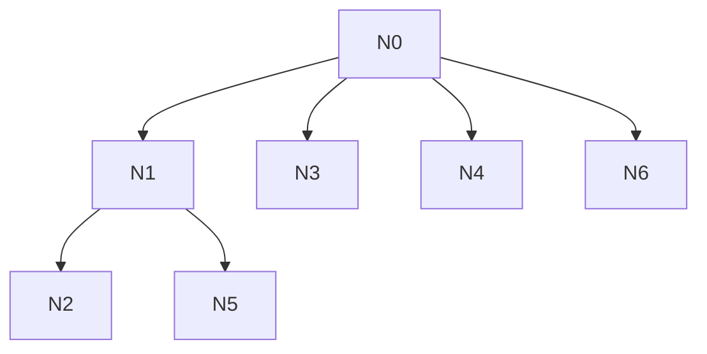

# AI-A Revised Decision Tree

paper_id: paper_022
question_id: Q4
revision_source:
  - original_tree: @rounds/A_tree_round1_paper_022_Q4.md
  - attack_file: @rounds/B_attack_tree_paper_022_Q4.md
  - paper: @chunks/paper_022_2026_wang_ckm_cum_egdr_stroke.md

## 1. Revised Evidence Map

| evidence_id | location | evidence_summary | used_by_node |
|---|---|---|---|
| E1 | Methods | Model1-3 | N2 |
| E2 | Methods | 无VIF声明 | N5 |
| E3 | Table2 | 暴露编码 | N6 |

## 2. Revised Decision Tree - Mermaid

> 脱敏框架

## 3. Revised Node Table

| node_id | node_type | claim | evidence_location | evidence_summary | confidence | risk_tag |
|---|---|---|---|---|---|---|
| N0|question|建模逻辑|—|根|high|—|
| N1|claim|呈现递进调整；选择机制原文未明确（可能先验也可能未披露）|Methods|—|high|—|
| N2|method|M1-M3固定呈现|Methods|—|high|—|
| N3|method|RCS|Fig/Methods|—|high|—|
| N4|method|亚组交互|Table3|—|high|—|
| N5|limitation|无VIF/自动选择报告|Methods|未报告|high|证据不足|
| N6|method|暴露编码含数据驱动类与分位|Table2|—|high|—|

## 4. Final Answer Based on Revised Tree

原文呈现 Model1–3 递进调整与 RCS/亚组交互，但**未用预注册措辞证明协变量“先验锁定”**；只能写“呈现为固定递进集，选择机制原文未明确”。未见 VIF/LASSO/逐步报告。暴露含聚类类、连续、三分位——聚类类为数据驱动分型后的分析因子，不等于试验预设臂。

## 5. Revision Log

| critique_id | accepted_or_rejected | action | reason |
|---|---|---|---|
| N-A1|accepted|N1改为呈现递进集，选择机制未明示|高severity合理|
| N-A2|accepted|RCS证据位置按全文Abstract/Methods/Fig核对|合理|
| N-A3|accepted|澄清聚类类≠预设试验臂|合理|

## 6. Remaining Uncertainty

- Model3名单脚注与Methods完全同构性
- RCS节点设定未说明
