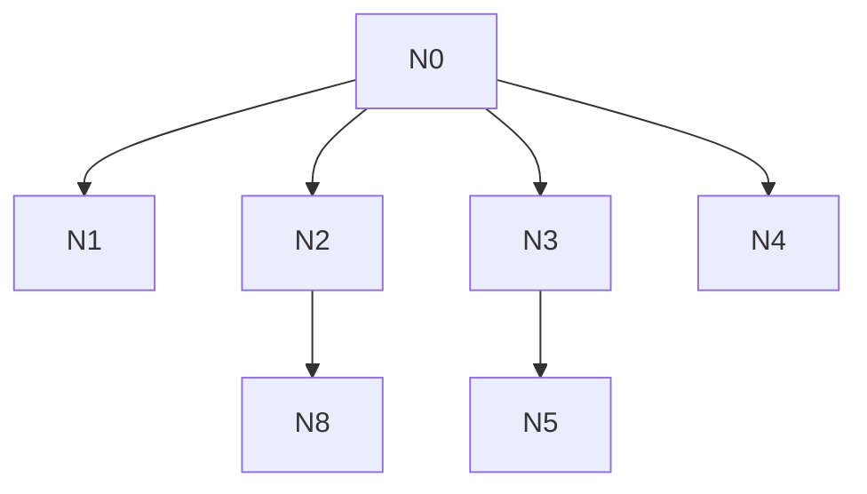

# AI-A Revised Decision Tree

paper_id: paper_022
question_id: Q5
revision_source:
  - original_tree: @rounds/A_tree_round1_paper_022_Q5.md
  - attack_file: @rounds/B_attack_tree_paper_022_Q5.md
  - paper: @chunks/paper_022_2026_wang_ckm_cum_egdr_stroke.md

## 1. Revised Evidence Map

| evidence_id | location | evidence_summary | used_by_node |
|---|---|---|---|
| E1 | Abstract | OR reports | N1 |
| E2 | Methods | rare disease; MICE; CHARLS sampling | N1,N3,N4 |
| E3 | Methods | k-means details incomplete | N2 |

## 2. Revised Decision Tree - Mermaid

> 脱敏框架

## 3. Revised Node Table

| node_id | node_type | claim | evidence_location | evidence_summary | confidence | risk_tag |
|---|---|---|---|---|---|---|
| N0|question|假设/加权/缺失|—|根|high|—|
| N1|method|主报告OR；Methods另述稀有事件近似HR并做Cox敏感|Methods|区分|high|—|
| N2|method|k-means假设与可重复细节不足|Methods|—|medium|证据不足|
| N3|method|CC主分析+MICE敏感|Methods|—|high|—|
| N4|claim|多阶段抽样设计；主分析未见survey加权实现|设计|—|high|—|
| N5|method|纳排剔关键缺失|Flow|—|high|—|
| N8|uncertainty|缺失机制未声明|Methods|—|medium|—|

## 4. Final Answer Based on Revised Tree

主效应量报告为 **OR**（logistic）。全文 Methods 另给出稀有事件下 OR 近似 HR 的叙述，并开展 Cox 敏感性——二者并存时必须区分“报告量”与“近似解释”。CHARLS 为多阶段抽样；原文主分析**未表现为 survey-weighted 估计**，但不能把“未加权分析”说成“非复杂抽样设计”。缺失：纳排剔除关键缺失 + MICE 敏感性。k-means 可重复细节不足。

## 5. Revision Log

| critique_id | accepted_or_rejected | action | reason |
|---|---|---|---|
| A1|accepted|区分OR报告量与稀有事件近似解释|合理，避免混为一谈|
| A2|accepted|N4改为复杂抽样设计但主分析未见加权实现|合理|
| A3|rejected|删除一切Cox相关limitation|全文有Cox敏感性；攻击节选未见|

## 6. Remaining Uncertainty

- MICE变量清单
- 离群定义
- 是否本可用survey权重
