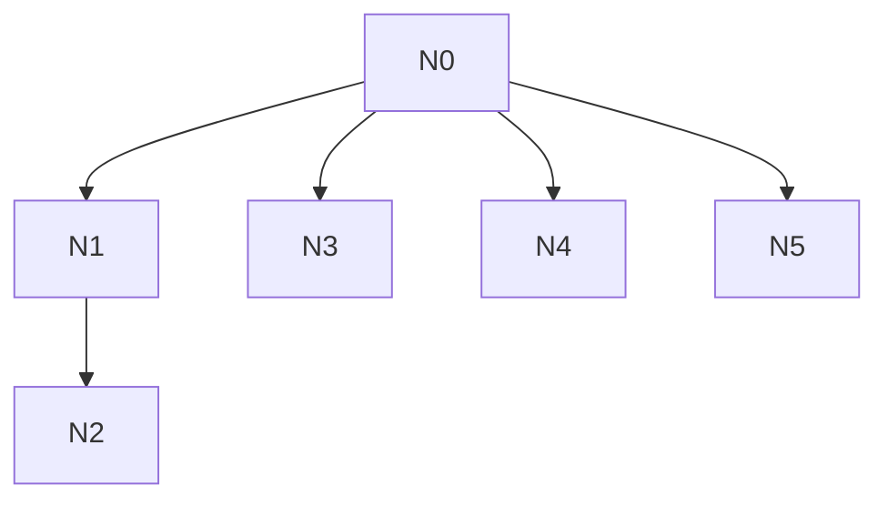

# AI-A Revised Decision Tree

paper_id: paper_022
question_id: Q6
revision_source:
  - original_tree: @rounds/A_tree_round1_paper_022_Q6.md
  - attack_file: @rounds/B_attack_tree_paper_022_Q6.md
  - paper: @chunks/paper_022_2026_wang_ckm_cum_egdr_stroke.md

## 1. Revised Evidence Map

| evidence_id | location | evidence_summary | used_by_node |
|---|---|---|---|
| E1 | Methods | sensitivity suite | N1 |
| E2 | Supp | Cox/MI | N2 |
| E3 | Fig3 | RCS primary nonlinear | N3 |

## 2. Revised Decision Tree - Mermaid

> 脱敏框架

## 3. Revised Node Table

| node_id | node_type | claim | evidence_location | evidence_summary | confidence | risk_tag |
|---|---|---|---|---|---|---|
| N0|question|有效性|—|根|high|—|
| N1|method|敏感性：三分位趋势+MICE+Cox|Methods/Supp|—|high|—|
| N2|evidence|Supp表复核|Supp|—|high|—|
| N3|method|RCS=主分析非线性检验|Fig3|—|high|—|
| N4|limitation|无外验/E-value/CV|全文|—|high|—|
| N5|claim|内部统计一致性≠因果证据强度|设计|—|high|—|

## 4. Final Answer Based on Revised Tree

有效性证据以**内部敏感性**为主：三分位趋势、MICE、Cox（全文Methods/Supp），辅以亚组。RCS 是主分析中的非线性检验，不宜仅标成“稳健性装饰”。**无**外验、**无**E-value/CV。证据强度=单队列观察性内部一致性，非因果识别强度。k-means 是主暴露分型，不是敏感性。

## 5. Revision Log

| critique_id | accepted_or_rejected | action | reason |
|---|---|---|---|
| N-A1|accepted|从敏感性列表剔除k-means；三分位/MICE/Cox按全文保留|攻击把节选当全文否认三分位——部分采纳概念澄清|
| N-A2|accepted|RCS改为主分析非线性模块|合理|
| N-A4|accepted|区分统计稳健与因果证据|合理|

## 6. Remaining Uncertainty

- 聚类稳定性未报告
- E-value未做
