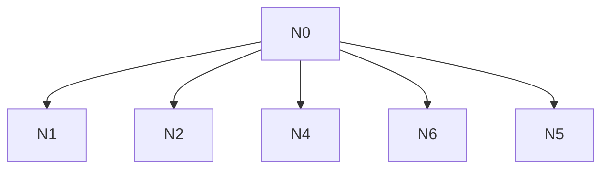

# AI-A Revised Decision Tree

paper_id: paper_022
question_id: Q7
revision_source:
  - original_tree: @rounds/A_tree_round1_paper_022_Q7.md
  - attack_file: @rounds/B_attack_tree_paper_022_Q7.md
  - paper: @chunks/paper_022_2026_wang_ckm_cum_egdr_stroke.md

## 1. Revised Evidence Map

| evidence_id | location | evidence_summary | used_by_node |
|---|---|---|---|
| E1 | Discussion | limitations | N1,N2 |
| E2 | Results | multi-model direction | N5 |

## 2. Revised Decision Tree - Mermaid

> 脱敏框架

## 3. Revised Node Table

| node_id | node_type | claim | evidence_location | evidence_summary | confidence | risk_tag |
|---|---|---|---|---|---|---|
| N0|question|局限|—|根|high|—|
| N1|limitation|观察性残留混杂|Disc|—|high|—|
| N2|limitation|自报结局|Disc|—|high|—|
| N4|limitation|两波近似轨迹|Methods|—|high|—|
| N5|claim|已报告口径下方向一致负向；未覆盖全部局限|Results|—|medium|逻辑跳跃|
| N6|limitation|竞争风险未建模|设计|—|high|—|

## 4. Final Answer Based on Revised Tree

局限包括观察性混杂、自报结局、两波近似轨迹、分期操作化、竞争风险/失访等。多模型结果方向一致**不能**自动推广为“对所有局限均稳健”。应写：主关联方向在已报告的调整/敏感性口径中一致负向，但原文未声称覆盖竞争风险等未建模局限。

## 5. Revision Log

| critique_id | accepted_or_rejected | action | reason |
|---|---|---|---|
| B-N1|accepted|弱化N5：一致负向≠覆盖全部局限|高|
| B-N2|accepted|limitation节点去掉因果过度标签误用|合理|

## 6. Remaining Uncertainty

- 复现N差
- 竞争风险
