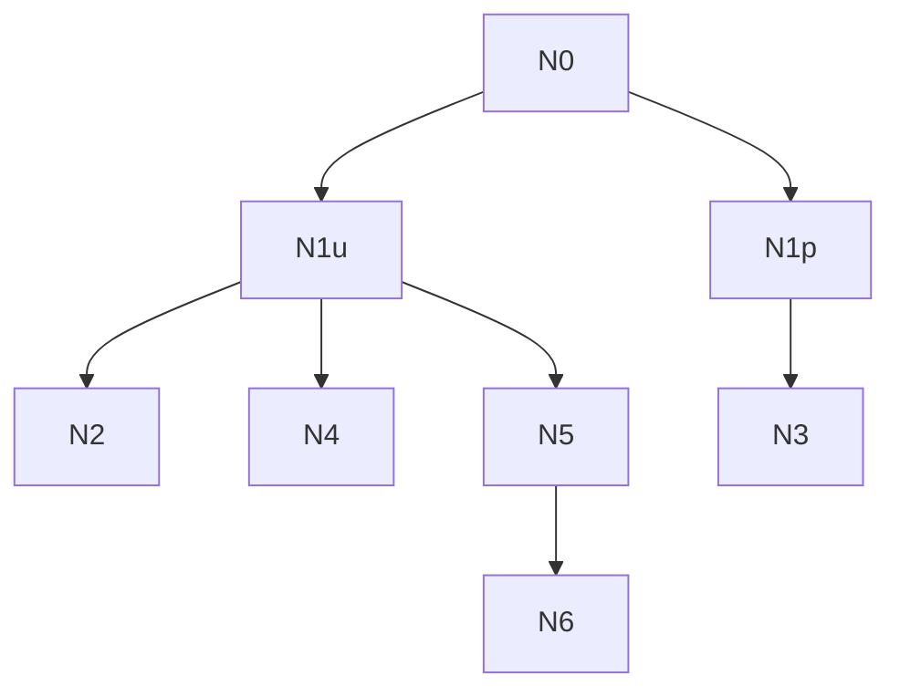

# AI-A Revised Decision Tree

paper_id: paper_022
question_id: Q8
revision_source:
  - original_tree: @rounds/A_tree_round1_paper_022_Q8.md
  - attack_file: @rounds/B_attack_tree_paper_022_Q8.md
  - paper: @chunks/paper_022_2026_wang_ckm_cum_egdr_stroke.md

## 1. Revised Evidence Map

| evidence_id | location | evidence_summary | used_by_node |
|---|---|---|---|
| E1 | 用户确认 | foundation A | N1u |
| E2 | Methods | k-means cum eGDR logistic | N1p |
| E3 | 交付包 | N差/期3 | N4 |

## 2. Revised Decision Tree - Mermaid

> 脱敏框架

## 3. Revised Node Table

| node_id | node_type | claim | evidence_location | evidence_summary | confidence | risk_tag |
|---|---|---|---|---|---|---|
| N0|question|迁移边界|—|根|high|—|
| N1u|transfer|用户约束：发病地基+方法后缀3B|用户确认|—|high|—|
| N1p|claim|原文：两波指标聚类+累积暴露+logistic关联|Methods|—|high|—|
| N2|transfer|单库batch|数据|—|high|—|
| N3|transfer|发表键对齐；数字复现受N/标签置换限制|Fig/Table|—|high|—|
| N4|transfer|纳排/分期必须按本数据改写|交付包|—|high|—|
| N5|transfer|复用logistic/rcs/subgroup；新建k-means后缀|Blocks|—|high|—|
| N6|limitation|禁止LCMM轨迹块冒充|52|—|high|可迁移性不足|

## 4. Final Answer Based on Revised Tree

迁移结论分两层：**用户工程约束**（发病地基+k-means累积暴露后缀、单库CHARLS batch、3B）与**原文方法证据**（两波eGDR k-means、累积暴露公式、logistic/RCS/亚组/Supp Cox）。发表键应对齐原文图/表/补充，但聚类标签置换与N口径差异使“原样数字复现”不能保证。必须改写纳排/分期操作化；新建后缀块；禁止用LCMM冒充。Model递进与参照类规则按原文落地。

## 5. Revision Log

| critique_id | accepted_or_rejected | action | reason |
|---|---|---|---|
| A1|accepted|拆分用户约束 vs 原文证据|高|
| A2|accepted|弱化一对一数字复现保证；强调键对齐+操作差异|合理|
| A3|accepted|证据定位写到公式/输入特征级|合理|

## 6. Remaining Uncertainty

- 年龄切点60 vs 项目65
- batch并行粒度
