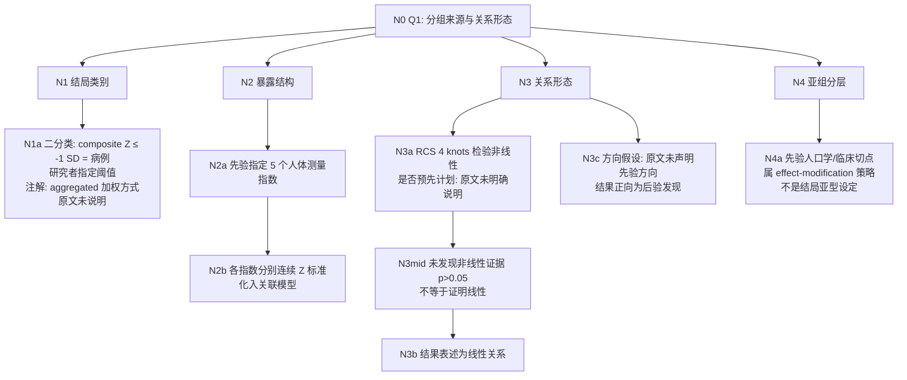

# AI-A Round2 Revised Decision Tree — paper_024 / Q1

> 采纳 AI-B 高 severity：N3c 方向先验/后验拆分；N5/N6 移出主树（非「分组/亚型」）；N1a 补 composite Z 不确定性；N6 两阶段选择仅作补充。

## Revision Log
| id | from attack | action |
|---|---|---|
| R1 | N-04 / Required#1 | N3c 改为「原文未声明先验方向；结果正向为后验」 |
| R2 | E-04 / Required#2 | 主树删除 N5/N6；移至 Appendix |
| R3 | N-05 | Appendix 写清三阶段筛选 |
| R4 | N-01 / M-01 | N1a 注解 composite Z 聚合方式【原文未明确说明】 |
| R5 | E-02 | N3a→N3b 间加「未拒绝非线性→采用线性解释」 |
| R6 | N-02 | N1b 改为 N1a 属性注解，不再独立成边 |

---

## Evidence Map（修订要点）
- E7 → 证据强度改为 **原文未明确说明**（Objective 不足以证明有无先验方向假设）
- E8 → 改为两阶段：关联/RCS/亚组/MI 初筛三指数 → LASSO → 多因素

---

## Decision Tree（Q1 主树：只答分组/类别/关系形态）

### Nodes
| node_id | claim | evidence |
|---|---|---|
| N1a | 结局二分类由 ≥1SD 阈值指定；composite 聚合细节未说明 | Methods 认知评估段 |
| N2a/N2b | 5 指数先验；分指数连续 Z 建模 | Methods 公式段；Fig2 |
| N3a/N3mid/N3b | RCS(4) 检验；阴性非线性 → 线性表述 | Statistical analysis；Fig3 |
| N3c | 无先验方向声明 | 【原文未明确说明】 |
| N4a | 亚组=分层策略≠亚型 | Sensitivity analyses |

### Edges
N0→N1 because；N1→N1a supported_by；N0→N2 because；N2→N2a supported_by；N2a→N2b leads_to；N0→N3 because；N3→N3a supported_by；N3a→N3mid leads_to；N3mid→N3b leads_to；N3→N3c supported_by；N0→N4 because；N4→N4a supported_by。

---

## Appendix（非 Q1「分组」主答；供后续 Q4/Q6）
- 7:3 train/internal validation；CHARLS external  
- 筛选三阶段：关联等初筛 ABSI/WWI/CoI → train 内 LASSO 10-fold one-SE → 多因素显著入列线图  

## Answer（修订）
1. 结局：**1 个二分类**（研究者阈值），非聚类定类。  
2. 暴露：**先验 5 指数**，非数据驱动定 K。  
3. 亚组：先验分层，属敏感性/交互策略。  
4. 关系形态：Methods 部署 RCS 检验；结果报线性；**先验方向假设原文未明确说明**。  
5. train/val/LASSO **不是** Q1 意义下的「分组/亚型」。
