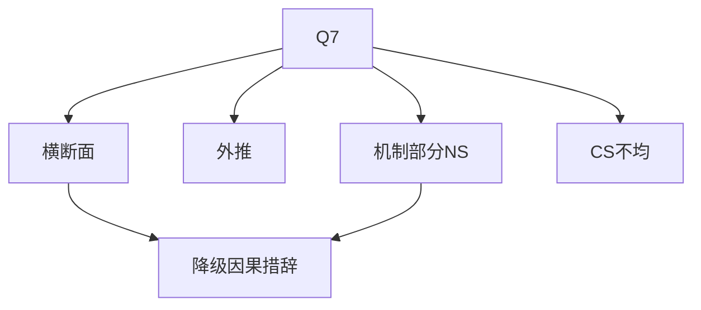

# Revised Q7
## Answer
局限：横断面时序、外推、部分亚型机制NS、CS不均、自报/CMB、中介协变量披露不足。动摇强因果与“普遍中介”表述；异质表型+网络可描述的弱结论仍可保留。
## Mermaid

```mermaid
flowchart TD
  Q7-->L1["横断面"]
  Q7-->L2["外推"]
  Q7-->L3["机制部分NS"]
  Q7-->L4["CS不均"]
  L1-->C["降级因果措辞"]
  L3-->C
```
