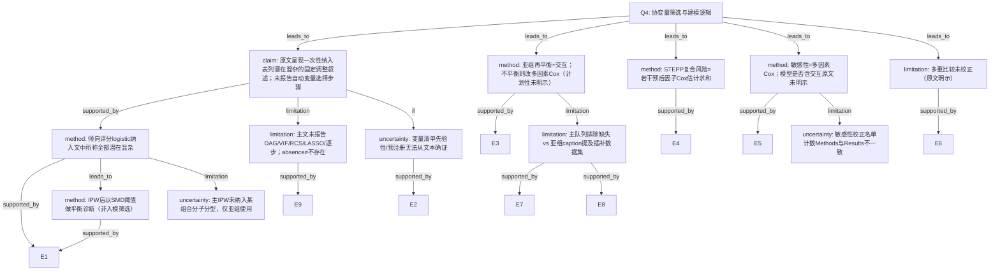

# AI-A Revised Decision Tree

paper_id: yaoyong_moxing_sanfen
question_id: Q4
revision_source:
  - original_tree: @rounds/A_tree_round1_yaoyong_moxing_sanfen_Q4.md
  - attack_file: @rounds/B_attack_tree_yaoyong_moxing_sanfen_Q4.md
  - paper: @chunks/yaoyong_moxing_sanfen.md

## 1. Revised Evidence Map

| evidence_id | location | evidence_summary | used_by_node |
|---|---|---|---|
| E1 | Methods Statistical analysis | 原文写倾向评分 logistic「incorporating all eleven potential confounders as shown in Table 1」，再 IPW | N1, N2 |
| E2 | Methods Study variables | 预先列出基线临床病理变量清单；未交代清单来源（文献/指南/数据驱动） | N1, N9 |
| E3 | Methods Statistical analysis | 亚组按多特征做 IPW 并做暴露×特征交互；组内再平衡 | N4 |
| E4 | Methods Statistical analysis | STEPP：六参数 Cox 参数估计求和得复合风险，再滑动窗 | N5 |
| E5 | Methods p.4 vs Results p.5 | Methods：校正 eleven baseline；Results sensitivity：nine selected risk factors | N6, N8 |
| E6 | Methods end | 「No adjustments were made for multiple comparisons」——仅支持多重比较策略 | N7b |
| E7 | Fig. 3 caption | 部分亚组加权不平衡后改用 multivariable Cox based on imputed datasets | N4, N11 |
| E8 | Methods Study cohort | 排除缺失基线特征者 | N11 |
| E9 | 全文 Methods/Results 检索 | 主文未描述 DAG/VIF/RCS/LASSO/逐步；补充材料未纳入本 chunk | N7a |

## 2. Revised Decision Tree - Mermaid

> 脱敏：无具体病名/指标数值/样本量；仅框架。

## 3. Revised Node Table

| node_id | node_type | claim | evidence_location | evidence_summary | confidence | risk_tag |
|---|---|---|---|---|---|---|
| N0 | question | 变量筛选与模型形式 | — | 根 | high | — |
| N1 | claim | 叙述上为固定潜在混杂集进 PS；未报告自动选择步骤（≠证明未做） | Methods | all eleven…as shown in Table 1 | medium | 证据不足 |
| N2 | method | PS logistic 纳入文中所称全部潜在混杂 | Methods | eleven potential confounders | high | — |
| N3 | method | SMD 阈值=平衡诊断，非变量筛选机制 | Methods/Table1 | SMD threshold | high | — |
| N4 | method | 亚组 IPW+交互；不平衡回退多因素 Cox；是否分析前计划原文未明示 | Methods; Fig.3 | P-interaction; fallback | medium | 逻辑跳跃 |
| N5 | method | STEPP：原文描述 summing parameter estimates 得复合风险；六参数为何入选未说明 | Methods | six parameters listed | medium | 证据不足 |
| N6 | method | 敏感性多因素 Cox；是否加性/含交互原文未明示；nine selected 措辞可疑 | Methods/Results | eleven vs nine selected | medium | 方法误读 |
| N7a | limitation | 主文未报告 DAG/VIF/RCS/LASSO/逐步；补料未知 | 全文检索 | absence of report | medium | 证据不足 |
| N7b | limitation | 多重比较未校正 | Methods end | No adjustments… | high | — |
| N8 | uncertainty | 敏感性名单计数不一致 | Methods vs Results | eleven vs nine | high | 证据不足 |
| N9 | uncertainty | 无预注册/SAP 措辞；先验性不可确证 | Methods | as shown in Table 1 | high | 证据不足 |
| N10 | uncertainty | 组合分子分型未进主 IPW、仅亚组 | Methods vs Fig.3 | asymmetry | medium | 证据不足 |
| N11 | limitation | 完整病例排除 vs imputed datasets caption 张力 | Study cohort; Fig.3 | missing vs imputed | medium | 方法误读 |

## 4. Final Answer

**入模依据：** 原文呈现「将 Table 所示全部潜在混杂纳入倾向评分 logistic」的**固定调整叙述**；**未报告**单因素 p 门槛、逐步、LASSO、DAG、VIF。清单**来源依据原文未说明**（临床/文献/数据驱动不可分）。**absence of report ≠ evidence of absence**（补料未审）。

**模型形式：** 主路径 IPW→加权生存比较；亚组含**交互检验**；STEPP 用若干因子 Cox 估计**求和**构复合风险（非 RCS）；敏感性为多因素 Cox。**「加性」非原文明示**（仅 STEPP 有 summing 措辞）。

**是否预先确定：** **原文未使用预注册/SAP 语言，无法确证**；仅能从「as shown in Table 1」措辞推断像固定集。亚组不平衡后的 Cox 回退与「nine selected」措辞进一步削弱「全程预先锁定」主张。

**须标注张力：** Methods「eleven」vs Results「nine selected」；主分析排除缺失 vs Fig.3「imputed datasets」。

## 5. Revision Log

| critique_id | severity | action | note |
|---|---|---|---|
| B-N1-1 / B-N1-2 | 高 | 采纳 | N1 改为「未报告自动选择」+ 清单依据不明；加 N9 |
| B-N2-1 / B-E1-1 | 高 | 采纳 | N1→N2 改为 supported_by；eleven 保留为原文用词 |
| B-N3-1 / B-E2-1 | 中 | 采纳 | N3 标明非筛选；边改为 N2→N3 |
| B-N4-1 / M-B5 | 高/中 | 采纳 | N4 confidence→medium；加 N11 |
| B-N5-1 | 中 | 采纳 | 删除独断「加性」；改 summing 措辞+依据未知 |
| B-N6-1 / B-N8-1 | 高/中 | 采纳 | 删 N6「加性」；N8 改 limitation 边；标 selected |
| B-N7-1 / B-E5-1 | 高 | 采纳 | 拆 N7a/N7b；E6 只撑多重比较 |
| M-B1/M-B4 | 中 | 采纳 | 新增 N9、N10 |
| M-B3/M-B6 | 中/低 | 部分采纳 | N5 风险标注；亚组 PS 重估写入 Follow-up |

## 6. Follow-up Questions

1. 补充材料是否含变量选择或插补细节？
2. 「nine selected」具体名单与十一项差哪两项？
3. 亚组 IPW 是否亚组内重估 PS？
