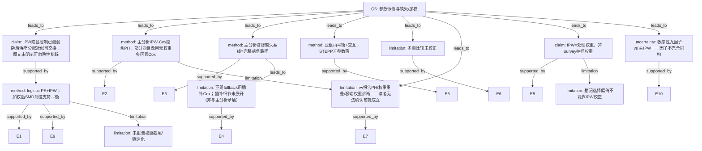

# AI-A Revised Decision Tree

paper_id: yaoyong_moxing_sanfen
question_id: Q5
revision_source:
  - original_tree: @rounds/A_tree_round1_yaoyong_moxing_sanfen_Q5.md
  - attack_file: @rounds/B_attack_tree_yaoyong_moxing_sanfen_Q5.md
  - paper: @chunks/yaoyong_moxing_sanfen.md

## 1. Revised Evidence Map

| evidence_id | location | evidence_summary | used_by_node |
|---|---|---|---|
| E1 | Methods Statistical analysis | To control for confounding：logistic 估 PS → IPW；SMD 阈值 0.1 | N1, N2 |
| E2 | Methods/Results | IPW-adjusted KM/log-rank 与 IPW-adjusted Cox PH | N3 |
| E3 | Methods Study cohort | 排除缺失基线特征者 | N4 |
| E4 | Fig. 3 caption | 部分亚组加权不平衡 → multivariable Cox based on imputed datasets（方法切换） | N8 |
| E5 | Methods | 亚组再平衡 + 交互；STEPP | N5 |
| E6 | Methods end | 双侧 P&lt;0.05；未校正多重比较 | N6 |
| E7 | 全文检索 | 未报告 PH/重叠/极端权重/logit 线性诊断 | N7 |
| E8 | Methods/Limitations | NCDB 医院登记；IPW 为处理权重；选择偏倚承认 | N9, N11 |
| E9 | Table 1 Weighted SMD | 加权后各基线 SMD&lt;0.1 | N2 |
| E10 | Results sensitivity | nine selected risk factors 多因素 Cox | N10 |

## 2. Revised Decision Tree - Mermaid

## 3. Revised Node Table

| node_id | node_type | claim | evidence_location | evidence_summary | confidence | risk_tag |
|---|---|---|---|---|---|---|
| N0 | question | 假设/加权/缺失 | — | 根 | high | — |
| N1 | claim | IPW 隐含条件可交换性；原文仅写 control confounding | Methods | To control for confounding | medium | 因果过度 |
| N2 | method | PS+IPW；加权 SMD&lt;0.1 支持平衡 | Methods; Table1 | SMD threshold | high | — |
| N3 | method | 主路径 IPW-Cox 隐含 PH；部分亚组无权重 MV Cox | Methods; Fig.3 | PH 数学性质≠已检验 | medium | 证据不足 |
| N4 | method | 主分析完整病例排除缺失 | Study cohort | missing excluded | high | — |
| N5 | method | 亚组再平衡与 STEPP | Methods | interaction/STEPP | high | — |
| N6 | limitation | 多重比较未校正 | Methods end | No adjustments | high | — |
| N7 | limitation | 未报告 PH/重叠/极端权重诊断 | 全文检索 | 可确认遗漏 | high | — |
| N8 | limitation | 亚组 fallback 插补 Cox；细节未展开 | Fig.3 caption | method switch | medium | 证据不足 |
| N9 | claim | 非 survey 加权；IPW=处理权重 | Methods | NCDB registry | high | — |
| N10 | uncertainty | 敏感性九因子 vs 主十一因子 | Results | nine selected | high | 证据不足 |
| N11 | limitation | 登记选择偏倚 IPW 不可校正 | Discussion limitations | selection bias | high | — |
| N12 | limitation | 权重截尾/稳定化未报告 | Methods | 原文未明确说明 | high | 证据不足 |

## 4. Final Answer

**依赖假设：** 观察性治疗混杂可用已测协变量经 IPW 控制（原文措辞为 control confounding，**未**明示可忽略性）；PS logistic 可估；加权后可比（以 SMD 论证）；Cox **隐含** PH；主分析对缺失采完整病例排除；删失独立性等**原文未讨论**。

**是否满足：** 加权后 Table1 SMD&lt;0.1 **支持平衡**；**未报告** PH、重叠、极端权重、截尾/稳定化——读者**无法确认**这些前提成立（属可确认遗漏，非「矛盾」）。

**加权设计：** IPW=**处理逆概率权重**，非复杂抽样权重；NCDB 选择偏倚 **IPW 不能校正**（原文局限已承认）。

**缺失：** 主分析排除缺失基线；Fig.3 部分亚组因平衡失败 **切换** 为插补数据上的多因素 Cox——属 **fallback 细节缺失**（MAR/次数等未写），**不宜**称为与主分析逻辑矛盾。

**附加：** 敏感性九因子与主 IPW 十一因子 **不完全同构**（与 Q4 呼应）。

## 5. Revision Log

| critique_id | severity | action | note |
|---|---|---|---|
| N8-A / E-A1 | 高 | 采纳 | 取消「矛盾」；改为亚组 fallback 细节缺失；边改为 leads_to |
| N4-A | 高（上游） | 采纳 | N4 限定主分析完整病例 |
| N1-A | 中 | 采纳 | 弱化因果措辞 |
| N3-A | 中 | 采纳 | 区分主 IPW-Cox 与亚组无权重 Cox |
| N7-A | 低 | 采纳 | risk_tag 改为可确认遗漏；边改挂 N0/N3 |
| Missing 权重截尾 | 中 | 采纳 | 新增 N12 |
| Missing nine vs eleven | 中 | 采纳 | 新增 N10 |
| N9 NCDB 选择偏倚 | 低 | 采纳 | 新增 N11 |

## 6. Follow-up Questions

1. 补料是否含权重分布与 PH 诊断？
2. 亚组插补变量集是否等于十一项混杂？
