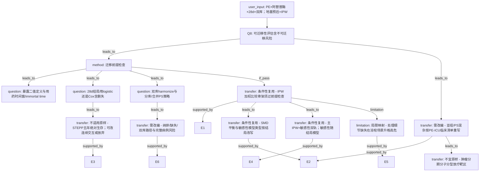

# AI-A Revised Decision Tree

paper_id: yaoyong_moxing_sanfen
question_id: Q8
revision_source:
  - original_tree: @rounds/A_tree_round1_yaoyong_moxing_sanfen_Q8.md
  - attack_file: @rounds/B_attack_tree_yaoyong_moxing_sanfen_Q8.md
  - paper: @chunks/yaoyong_moxing_sanfen.md

## 1. Revised Evidence Map

| evidence_id | location | evidence_summary | used_by_node |
|---|---|---|---|
| E1 | Abstract/Methods | 单库回顾队列；二值处理；IPW+加权 KM/Cox 估长期 OS | N1 |
| E2 | Methods | SMD 阈值；亚组 IPW+交互；不平衡→多因素 Cox | N2, N3 |
| E3 | Methods | STEPP 面向绝对 5 年 OS | N4 |
| E4 | Results | 敏感性多因素 Cox 与 IPW 方向一致 | N5 |
| E5 | Discussion limitations | 回顾性选择偏倚；处理参数缺失；毒性未捕获；稀有亚组不稳 | N6 |
| E6 | Methods Study cohort | Fig.1 纳排；排除缺失基线 | N7 |
| U0 | user_input | PE；alteplase Y/N；28d 死亡；MIMIC+eICU；预后+IPW 映射 | N_in |

## 2. Revised Decision Tree - Mermaid

## 3. Revised Node Table

| node_id | node_type | claim | evidence_location | evidence_summary | confidence | risk_tag |
|---|---|---|---|---|---|---|
| N_in | transfer | 用户确认研究方向与映射 | user_input | PE/alteplase/28d/dual | high | — |
| N0 | question | 可迁移性（含失败分支） | — | 根 | high | — |
| NP | method | 迁移前提强制检查 | user_input+Methods | 暴露/结局/双库 | high | — |
| NP1 | question | 暴露时间窗与 immortal time | user_input | 用药相对随访起点 | medium | 因果过度 |
| NP2 | question | 28d：logistic vs Cox | user_input | 固定窗 vs 删失 | high | — |
| NP3 | question | 双库 PS：分库/合并/库协变量 | user_input | dual DB | high | — |
| N1 | transfer | IPW 骨架条件性复用 | Methods | binary Rx IPW | medium | 可迁移性不足 |
| N2 | transfer | SMD/敏感性条件性复用；阈值可参考须校准 | Methods | SMD 0.1 | medium | 可迁移性不足 |
| N3 | transfer | PS/亚组变量按 PE-ICU 重写 | Methods | tumor vars ≠ ICU | high | — |
| N4 | transfer | STEPP 五年绝对 OS 不适用原样 | Methods | 5-year STEPP | high | 可迁移性不足 |
| N5 | transfer | 主 IPW+敏感性双轨条件性复用 | Results | MV Cox sensitivity | medium | — |
| N6 | limitation | 溶栓剂量/时机缺失→高危局限 | Discussion | treatment detail missing | high | — |
| N7 | transfer | 双库纳排/缺失；完整病例可能过剔 | Methods | complete-case | high | — |
| NX | transfer | 肿瘤特异临床变量不适用 | Methods | stage/HR/ERBB2 | high | 可迁移性不足 |

## 4. Final Answer

**用户研究方向已确认。** 地基一句话：**预后 + IPW**；暴露映射 **放疗 → 阿替普酶**；结局映射 **OS → 28 天死亡**。

| 类别 | 内容 |
|---|---|
| **条件性复用（非「直接」）** | 二值处理 IPW → 加权比较；SMD 平衡诊断（阈值参考须按 ICU 变量校准）；主 IPW + 敏感性双轨（敏感性模型随 28d 选 logistic 或 Cox） |
| **必须先过前提检查** | 暴露时间窗/immortal time；28d 模型选择；双库 harmonize 与分库/合并 PS 策略 |
| **必须改编** | PS/亚组混杂 → PE-ICU 临床清单（血流动力学、右心负荷、出血风险等）；纳排与缺失（警惕完整病例过剔） |
| **不适用原样** | STEPP 五年绝对 OS；肿瘤分期/分子分型/放疗靶区 |
| **局限升格** | 原文「处理参数缺失」在溶栓量效/时效场景下为**高危**，须剂量/时机敏感性或限制因果措辞 |

## 5. Revision Log

| critique_id | severity | action | note |
|---|---|---|---|
| A2-02/03/05/E1 | 高 | 采纳 | 「可直接复用」→「条件性复用」；插入 NP 前提检查 |
| MB2/结局分支 | 高 | 采纳 | NP2 logistic vs Cox |
| MB3 双库 | 高 | 采纳 | NP3 分库/合并路径 |
| MB1/MB4 | 中 | 采纳 | NP1 暴露时间窗/immortal time |
| A2-07 N6 | 中 | 采纳 | 溶栓细节缺失升格高危 |
| A2-09 N8 | 低 | 采纳 | 改为 N_in user_input |
| A2-10 N9 | 低 | 采纳 | 并入 N3→NX |
| MB5–MB9 | 中/低 | 部分采纳 | 写入 Follow-up；未全部扩节点以免树膨胀 |

## 6. Follow-up Questions

1. 28d 死亡最终锁定 logistic 还是带删失 Cox？
2. 双库：分库估 PS 还是合并+库协变量？
3. alteplase 时间戳是否足以做 landmark 防 immortal time？
