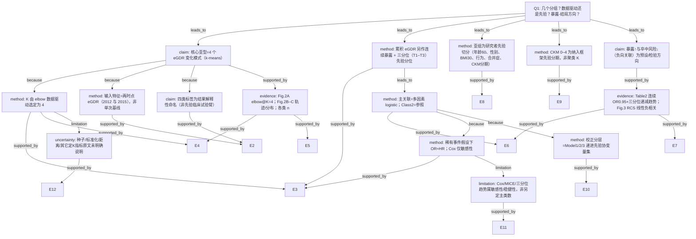

问题 Q1：本研究预设了几个分组/亚型/类别？该数量是数据驱动的（如聚类定 K）还是研究者主观指定？是否假设了暴露-结局关系的方向（线性、单调、U 型）？

请严格按 AI-B 攻击者角色，对照下方原文 chunk，攻击上方 AI-A 决策树。输出完整攻击报告（节点/边/证据/分支/结论迁移）。

---

# AI-A 初稿

# AI-A Decision Tree Round 1

paper_id: paper_022
question_id: Q1
task_type: literature_decision_tree_reasoning
question: 本研究预设了几个分组/亚型/类别？该数量是数据驱动的（如聚类定 K）还是研究者主观指定？是否假设了暴露-结局关系的方向（线性、单调、U 型）？
source_file: adversarial_lit_reading/chunks/paper_022_2026_wang_ckm_cum_egdr_stroke.md

## 1. Evidence Map

| evidence_id | location | evidence_summary | used_by_node |
|---|---|---|---|
| E1 | Abstract Methods | 两波 eGDR（2012/2015）输入 k-means，识别 distinct change patterns；累积 eGDR=(eGDR2012+eGDR2015)/2×(2015−2012)；多因素 logistic | N1, N2, N8 |
| E2 | Methods — Assessment of eGDR… | 明确用 k-means，输入两时点 eGDR；四类命名：Class1 moderate–high stable、Class2 persistent low、Class3 stable high、Class4 rapid decrease | N1, N3, N4 |
| E3 | Methods — Statistical analysis | elbow method 定最优簇数；K=4 拐点；累积 eGDR 连续 + tertiles；稀有事件下用 logistic；Cox 作敏感性 | N2, N5, N9, N12 |
| E4 | Results — Baseline / Fig.2A | elbow 图 WCSS vs k，拐点 k=4；最终四类 n：1883/1121/1410/834 | N2, N6 |
| E5 | Results — Fig.2B–C | 四类均值轨迹与两时点分布；Class4 下降，其余相对稳定 | N3, N6 |
| E6 | Results — Table 2 | Class2 为参照；Class1/3/4 OR<1；累积 eGDR 每增 1 单位 OR 0.95；三分位 T1 参照，T2/T3 OR 递减，P for trend <0.001 | N8, N10, N11 |
| E7 | Results — Fig.3 RCS | RCS：累积 eGDR 与卒中呈线性负相关（P&lt;0.001；P for nonlinear 支持线性叙述） | N10, N11 |
| E8 | Results — Table 3 / Methods subgroups | 亚组：年龄&lt;60/≥60、性别、BMI、吸烟饮酒、血脂异常、糖尿病、CKM 0–2 vs 3–4；交互检验 | N7 |
| E9 | Methods — CKM staging | CKM stages 0–4 为研究纳入框架（先验分期体系），非聚类产物 | N13 |
| E10 | Methods Model 1–3 | Model1 未校正；Model2 年龄/性别/婚姻；Model3 再加 BMI、教育、吸烟饮酒、eGFR、血脂异常、糖尿病 | N14 |
| E11 | Supp Table S1 | Cox 敏感性：同暴露结构报 HR | N12 |
| E12 | 全文 Methods/Results | 未报告 silhouette/BIC/Gap statistic；未报告 k-means 随机种子、标准化细节、距离度量 | N15 |

## 2. Decision Tree - Mermaid

## 3. Node Table

| node_id | node_type | claim | evidence_location | evidence_summary | confidence | risk_tag |
|---|---|---|---|---|---|---|
| N0 | question | 分组数量、定 K 方式、暴露-结局方向假设 | — | 根问题 | high | — |
| N1 | claim | 主亚型为 **4** 个 eGDR change patterns（Class 1–4） | Abstract; Methods; Results Fig.2 | k-means 输出四类 | high | — |
| N2 | method | 簇数 **K=4 由 elbow 数据驱动**选定 | Methods Statistical analysis; Fig.2A | WCSS 拐点在 k=4 | high | — |
| N3 | method | 聚类输入为两时点 eGDR，捕捉基线水平+时间演变 | Methods Assessment; Fig.2 | bivariate k-means | high | — |
| N4 | claim | 四类名称（stable/persistent low/rapid decrease 等）为解释性标签 | Methods; Fig.2 图注 | 非随机化试验预设臂 | high | — |
| N5 | method | 累积 eGDR：连续 + **三分位**（研究者分位方案） | Methods; Table 2 | tertiles 与聚类并行 | high | — |
| N6 | evidence | Fig.2A–C 与各类样本量支持 K=4 解 | Results Fig.2 | n=1883/1121/1410/834 | high | — |
| N7 | method | 亚组切点多为先验（年龄60、BMI30、CKM 0–2/3–4 等） | Methods; Table 3 | 非聚类定组 | high | — |
| N8 | method | 主分析 multivariable logistic；Class 2 参照 | Methods; Table 2 | OR 主报告 | high | — |
| N9 | method | 低发病率下选 logistic；Cox 敏感性 | Methods | OR 近似 HR 叙述 | high | — |
| N10 | claim | 累积 eGDR 更高 ↔ 卒中风险更低（负向/保护方向） | Abstract; Table 2; Fig.3 | 连续与分位一致 | high | — |
| N11 | evidence | Table2 趋势 + Fig.3 RCS 线性逆关联 | Table 2; Fig.3 | P for trend；RCS | high | — |
| N12 | limitation | Cox/MICE 等不另定主类别数 | Supp S1; Methods sensitivity | 敏感性 | high | — |
| N13 | method | CKM stages 0–4 为纳入框架先验 | Methods Study population | 非数据驱动 K | high | — |
| N14 | method | Model1–3 递进校正为先验协变量集 | Methods; Table2 脚注 | 三套模型 | high | — |
| N15 | uncertainty | 随机种子、特征标准化、距离、Silhouette/BIC 原文未明确说明 | Methods 全文 | 可重复性缺口 | high | 证据不足 |

## 4. Provisional Answer

Wang et al.（CHARLS，CKM 0–4，累积 eGDR → 新发卒中）在分组上同时存在 **数据驱动聚类** 与 **研究者先验分层**：

1. **主亚型类别数 = 4（Class 1–4）**：对 2012 与 2015 两波 eGDR 做 k-means；**K 由 elbow 数据驱动定为 4**（Fig.2A）。类名是事后解释标签。
2. **并行暴露分组**：累积 eGDR **三分位（T1–T3）** 为研究者分位方案；连续变量每 1 单位报告 OR。
3. **亚组**：年龄（&lt;60/≥60）、性别、BMI、吸烟/饮酒、血脂异常、糖尿病、CKM 0–2 vs 3–4 —— **先验切分**。
4. **CKM 0–4** 是纳入/分期框架，不是聚类 K。
5. **方向假设**：主结论检验/报告 **累积 eGDR↑ → 卒中风险↓**（负向）；RCS 支持 **线性**逆关联；三分位显示单调递减趋势。Methods **未**预先声明 U 型假设。

## 5. Uncertainty List

- U1: elbow 仅主文叙述“清晰拐点”，未给各 k 的 WCSS 数值表；无 Silhouette/Gap 交叉验证定 K。
- U2: k-means 是否标准化两维 eGDR、随机种子、nstart/iter.max **原文未明确说明**。
- U3: 累积 eGDR 时间窗公式 ×(2015−2012)=×3，与 Table1 均值约 37.54（更接近 ×4）存在读法张力（交付数据包已登记 PI-2）。
- U4: Fig.3 “P for nonlinear” 具体数值需核对图注/正文措辞是否严格排除非线性。
- U5: Class 语义映射（谁是“高风险参照”）依赖 Class2=persistent low；若重跑聚类标签置换，OR 方向解读需重锚定。

## 6. Follow-up Questions

1. 补充材料或代码是否给出 elbow 全曲线数值与随机种子？
2. 两维 eGDR 入模前是否 z-score？若否，量纲是否影响簇边界？
3. 若用 Silhouette 选 K，是否仍稳定为 4？
4. 累积暴露用 ×3 还是 ×4 时，三分位边界与 OR 是否实质改变？
5. RCS 节点数与位置（默认百分位？）原文是否说明？

---

# 原文 CHUNK

# Page 1

Wang et al. Cardiovascular Diabetology   (2026) 25:78                                                                                          Cardiovascular Diabetology
https://doi.org/10.1186/s12933-026-03096-1

      RESEARCH                                                                                                                                                               Open Access

Cumulative exposure to the estimated
glucose disposal rate and incident stroke
in individuals with cardiovascular–kidney–
metabolic syndrome stages 0–4: 6-year
longitudinal evidence from CHARLS
Yan Wang1,2†, Ning Wei1,2†, Meng Li1,2, Jun-Wen Liu1,2, Hong-Bin Lin1,2 and Hong-Fei Zhang1,2*

      Abstract
      Background The estimated glucose disposal rate (eGDR), an established measure of peripheral insulin sensitivity,
      contributes to stratifying the risk of cardio-cerebrovascular events. Nevertheless, the association between long-
      term eGDR exposure and stroke incidence throughout all stages (0–4) of cardiovascular–kidney–metabolic (CKM)
      syndrome remains unknown.
      Methods A cohort of 5248 individuals was drawn from the China Health and Retirement Longitudinal Study
      (CHARLS). For each participant, eGDR values for the years 2012 and 2015 were calculated using the equation:
      21.158 − [0.090 × WC (cm)] − [3.407 × HTN (presence = 1)] − [0.551 × HbA1c (%)]. Cumulative eGDR was calculated as
      (eGDR2012 + eGDR2015)/2* time (2015–2012). K-means clustering was used to analyse eGDR values from both 2012
      and 2015 to identify distinct change patterns. To assess associations with stroke risk, we utilised multivariable logistic
      regression and restricted cubic spline models.
      Results During the 2015–2018 follow-up period, a total of 336 incident stroke cases were documented. Four distinct
      eGDR change patterns were identified. In fully adjusted models, compared with the participants in the persistent
      low pattern (Class 2), those in the moderate–high stable (OR 0.43, 95% CI: 0.31–0.58), stable high (OR 0.29, 0.19–0.43),
      and rapid decrease (OR 0.66, 0.47–0.91) patterns exhibited significantly lower stroke risk. Furthermore, each 1-unit
      increase in cumulative eGDR was associated with a 5% reduction in stroke odds (OR 0.95, 0.93–0.96). Restricted cubic
      spline analysis confirmed a linear inverse relationship between cumulative eGDR and stroke risk (P < 0.001; P for
      nonlinearity = 0.259).

​†​
​​ ​​​​Y​a​n Wang and Ning Wei have contributed equally to this work.
*Correspondence:
Hong-Fei Zhang
zhanghongfei@smu.edu.cn
Full list of author information is available at the end of the article

                                             © The Author(s) 2026, modified publication 2026. Open Access This article is licensed under a Creative Commons Attribution-NonCommercial-
                                             NoDerivatives 4.0 International License, which permits any non-commercial use, sharing, distribution and reproduction in any medium or format,
                                             as long as you give appropriate credit to the original author(s) and the source, provide a link to the Creative Commons licence, and indicate if you
                                             modified the licensed material. You do not have permission under this licence to share adapted material derived from this article or parts of it. The
                                             images or other third party material in this article are included in the article’s Creative Commons licence, unless indicated otherwise in a credit line
                                             to the material. If material is not included in the article’s Creative Commons licence and your intended use is not permitted by statutory regulation
                                             or exceeds the permitted use, you will need to obtain permission directly from the copyright holder. To view a copy of this licence, visit ​h​t​t​​p​:​/​/​​c​r​e​​
                                             a​t​​i​v​e​c​o​m​m​o​n​s​.​o​r​g​/​l​i​c​e​n​s​e​s​/​b​y​-​n​c​-​n​d​/​4​.​0​/​​​​.​​​​

# Page 2

Wang et al. Cardiovascular Diabetology   (2026) 25:78                                                          Page 2 of 11

 Conclusion Cumulative eGDR is inversely associated with stroke risk across all CKM syndrome stages (0–4). This
 observation suggests that prolonged eGDR surveillance may be associated with improved risk stratification in this
 population.
 Keywords Cumulative estimated glucose disposal rate, Stroke, Cardiovascular–kidney–metabolic syndrome
 Graphical Abstract

​Introduction                                                  vasodilation, increased vasoconstriction, and altered vas-
 Stroke poses a critical public health threat in China and     cular reactivity. This endothelial dysfunction promotes
 is characterised by substantial and growing burdens           atherosclerotic plaque formation and destabilisation,
 of morbidity and disability [1, 2]. Cardiovascular–kid-       which are critical events in stroke pathogenesis [8–10].
 ney–metabolic (CKM) syndrome—a pathophysiologi-               Systemically, it perpetuates a chronic inflammatory state
 cal nexus interconnecting obesity, diabetes, and chronic      characterised by increased cytokine levels—including
 kidney disease—increasingly frames our understanding          high-sensitivity C-reactive protein (hs-CRP), interleu-
 of this challenge by amplifying vulnerability to cardio-      kin-6 (IL-6), and tumour necrosis factor-alpha (TNF-α)—
 cerebrovascular events [3]. Susceptibility linked to CKM      which together impair endothelial integrity, accelerate
 syndrome is not static but follows a graded progression;      atherogenesis, and foster a prothrombotic milieu [10–
 individuals in stages 3–4 face a disproportionately greater   12]. Furthermore, insulin resistance exacerbates oxidative
 stroke risk than those in stages 0–2 [4]. This graded risk    stress through dual pathways: increasing reactive oxygen
 pattern underscores the necessity of identifying modifi-      species (ROS) generation and decreasing antioxidant
 able risk factors, which can inform early intervention        defences, culminating in vascular cellular damage and
 strategies for stroke prevention in the CKM population.       dysfunction [13]. These pathways are further amplified by
   The estimated glucose disposal rate (eGDR), a               associated metabolic disturbances—including dyslipidae-
 proxy measure of peripheral insulin sensitivity, is           mia, sympathetic nervous system activation, and hyper-
 computed as follows: eGDR = 21.158 − (0.090 × WC              coagulability mediated by elevated plasminogen activator
 [cm]) − (3.407 × HTN       [presence = 1]) − (0.551 × HbA1c   inhibitor-1—collectively increasing susceptibility to cere-
 [%]), with higher values signifying increased insulin sen-    brovascular events [14–16].
 sitivity [5]. Low eGDR not only corresponds to severe           Substantial evidence indicates that reduced eGDR con-
 insulin resistance but is also related to stroke occur-       tributes to cerebrocardiovascular pathogenesis. Dong et
 rence through multiple biological mechanisms [6, 7]. At       al. [17] reported a 42% increase in cardiovascular dis-
 the vascular level, insulin resistance compromises endo-      ease risk (HR = 1.42, 95% CI 1.36–1.48) per 1-unit eGDR
 thelial function by reducing nitric oxide synthesis and       decrease in patients with CKM syndrome stages 0–3.
 increasing endothelin-1 production, leading to impaired       Similarly, Zabala et al. [18] reported a 78% higher stroke

# Page 3

Wang et al. Cardiovascular Diabetology   (2026) 25:78                                                           Page 3 of 11

incidence in the lowest vs. highest eGDR quartile (HR         Assessment of eGDR, cumulative eGDR, and eGDR change
1.78, 95% CI 1.54–2.06) among 32,087 T2DM patients.           patterns
Liang et al. [19] revealed a U-shaped relationship: cardio-   Waist circumference (WC) was measured at the umbili-
vascular risk was increased in both the lowest eGDR stra-     cal level in standing participants during normal tidal
tum (HR 2.11, 95% CI 1.76–2.53) and the highest stratum       breathing [23]. Hypertension (HTN) was defined by: (1)
(HR 1.48, 1.12–1.96), indicating adverse effects at eGDR      prior physician diagnosis, (2) current antihypertensive
extremes. This relationship was further supported by          treatment, or (3) blood pressure ≥ 140/90 mmHg. Gly-
a systematic review and meta-analysis by Shojaei et al.       cated haemoglobin (HbA1c) measurements from whole
[20], encompassing more than 1.2 million participants,        blood samples underwent NHANES-standardised assay
in which lower eGDR was consistently linked to major          calibration [24]. eGDR was derived using the validated
adverse cardio-cerebrovascular events (RR = 1.84; 95% CI:     equation: 21.158 − [0.090 × WC (cm)] − [3.407 × HTN
1.67–2.03).                                                   (presence = 1)] − [0.551 × HbA1c (%)]. Here, WC (cm),
  However, given that eGDR is a dynamic parameter, a          HTN (1 = present; 0 = absent), and HbA1c (%) operation-
single assessment may not fully capture its cumulative        alised these variables [5, 25]. Cumulative eGDR exposure
burden. Although cumulative exposure to cardiovascu-          was computed as follows: (eGDR₂₀₁₂ + eGDR₂₀₁₅)/2 × (tim
lar risk factors—not baseline levels—is strongly associ-      e₂₀₁₅—time₂₀₁₂) [26]. Participants were subsequently clas-
ated with long-term clinical outcomes, the influence of       sified into four distinct eGDR change patterns through
cumulative eGDR on stroke in the context of CKM syn-          k-means clustering analysis using eGDR values from both
drome has not been specifically assessed [4, 6]. This study   2012 and 2015 as input features: Class 1 (moderate–high
examined how longitudinal eGDR variations are related         stable), Class 2 (persistent low), Class 3 (stable high), and
to stroke incidence across all stages of CKM syndrome         Class 4 (rapid decrease).
(0–4) in the CHARLS cohort, addressing a critical gap in
evidence.                                                     CKM syndrome staging classification (0–4)
                                                              CKM syndrome staging at baseline (2012, Wave 1) was
Methods                                                       determined following the American Heart Association
Study population                                              framework, which categorises the condition into five pro-
CHARLS (China Health and Retirement Longitudinal              gressive stages (0–4) [3]. Stage 0 characterises individuals
Study), a national population-based cohort, enrolled          without metabolic or cardiovascular risk factors; Stage 1
Chinese participants aged ≥ 45 years. This study was car-     manifests overweight/obesity or prediabetes;
ried out jointly by Peking University’s National School         Stage 2 is defined by established conditions, including
of Development and the Chinese Academy of Social              type 2 diabetes (T2DM), hypertension (HTN), hypertri-
Sciences. It utilised a multistage, stratified sampling       glyceridaemia, and chronic kidney disease (CKD); Stage
approach, with four waves of data collection conducted        3 involves subclinical cardiovascular impairment, such
in 2012 (baseline), 2013, 2015, and 2018. All surveys fol-    as asymptomatic atherosclerosis or left ventricular dys-
lowed standardised protocols to maintain data quality         function; and Stage 4 represents clinical cardiovascular
and comparability. Further methodological details are         disease—such as coronary artery disease (CAD), heart
available in prior publications [21, 22].                     failure (HF), stroke, peripheral artery disease (PAD), and
  Participants were included if they met the following        atrial fibrillation (AF)—in patients with established CKM
criteria: (1) complete data on CKM syndrome staging           pathophysiology.
(stages 0–4); (2) no stroke history and available stroke
status data from waves 1 to 3 (2012–2015); (3) acces-         Outcome ascertainment
sible stroke outcome data at wave 4 (2018); and (4) com-      The incidence of stroke during follow-up served as the
plete data for estimated glucose disposal rate (eGDR)         primary outcome. In Wave 4, stroke events were ascer-
calculation (without outliers) at waves 1 or 3. Individu-     tained when participants reported affirmative responses
als not meeting all these criteria were excluded from the     to the physician-diagnosed question: “Have you been
analysis.                                                     diagnosed with stroke by a doctor?” This case identifica-
  Ethical approval for the CHARLS study was obtained          tion approach has been validated in prior investigations
from the IRB of Peking University (IRB00001052-11015).        [27, 28].
All participants provided written informed consent prior
to enrolment.                                                 Data collection
                                                              At baseline (Wave 1, 2011–2012), trained personnel
                                                              administered standardised questionnaires to obtain
                                                              sociodemographic and health-related information. Col-
                                                              lected variables included age, sex, marital status, and

# Page 4

Wang et al. Cardiovascular Diabetology   (2026) 25:78                                                            Page 4 of 11

education level—with education categorised as no for-          Model 3 (further adjusted for behavioural and clinical
mal education, ≤ middle school, high school or voca-           confounders, including education, smoking status, alco-
tional training, or ≥ college. Smoking status and alcohol      hol use, body mass index, dyslipidaemia, diabetes, and
use status were dichotomised as never/ever exposure.           estimated glomerular filtration rate). To facilitate clinical
Physician-diagnosed hypertension, diabetes mellitus, and       interpretation, the effect size for continuous cumulative
dyslipidaemia were additionally ascertained through self-      eGDR is reported per 1-unit increase. Potential nonlin-
reports. Physical examinations revealed the following          ear associations were examined using restricted cubic
parameters: body mass index (BMI), waist circumference         splines.
(WC), systolic blood pressure (SBP), and diastolic blood         Effect modification was evaluated via stratified analyses
pressure (DBP). Additional laboratory assays quantified        across these subgroups: age (< 60 vs. ≥ 60 years), sex, edu-
triglyceride (TG) levels, blood glucose levels, HbA1c lev-     cational attainment (below high school vs. high school or
els, HDL cholesterol levels, LDL cholesterol levels, uric      higher), behavioural factors (never vs. ever tobacco and
acid (UA) levels, eGFRs, and total cholesterol (TC) levels.    alcohol exposure), and CKM stage (0–2 vs. 3–4), and the
                                                               presence of diabetes, hypertension, or dyslipidaemia.
Statistical analysis                                           All stratified models retained the covariates specified in
Continuous variables are presented as mean ± SD when           Model 3, and interaction terms were tested using likeli-
normally distributed or as median (IQR) otherwise. Cat-        hood ratio tests. To assess the robustness of our findings,
egorical data are reported as counts and percentages.          we conducted two sensitivity analyses: (1) reclassify-
Baseline comparisons were performed using χ2/Fisher            ing cumulative eGDR into tertiles and testing for linear
exact tests (expected frequencies < 5) for categorical vari-   trends, and (2) multiple imputation via chained equa-
ables, t-test for normally distributed continuous vari-        tions (MICE; five datasets) was applied to manage miss-
ables, and Mann‒Whitney U tests for skewed continuous          ing covariate data, followed by comparison of pooled
variables.                                                     estimates with complete-case results. Analyses were per-
   To characterise longitudinal eGDR patterns from 2012        formed using R 4.2.2 and Free Statistics software v2.0,
to 2015, we applied the k-means clustering algorithm           with statistical significance set at two-tailed P < 0.05.
using eGDR measurements from both time points (2012
and 2015) as input variables for each participant. This        Results
bivariate approach enabled the algorithm to capture het-       Baseline characteristics by eGDR change classes
erogeneity in both baseline insulin sensitivity status and     Figure 1 depicts the flow diagram of participant selec-
temporal evolution. The k-means method, an unsuper-            tion. The CHARLS baseline cohort (2011–2012) initially
vised machine learning technique, groups observations          comprised 17,708 eligible participants. Participants with
by minimising within-cluster variance. The optimal num-        incomplete CKM syndrome staging data (n = 8307) were
ber of clusters was determined using the elbow method,         excluded, leaving 9401 individuals with documented
which evaluates the reduction in within-cluster sum            CKM stages 0–4. Among these, sequential exclusions
of squares as the number of clusters increases. A clear        were applied for the following: history of stroke or miss-
inflection point emerged at K = 4, which suggests that         ing stroke status during the baseline and follow-up
four clusters provided an optimal balance between model        period from waves 1 through 3 (n = 1828); absence of
fit and complexity (Fig. 2A). On the basis of this solution,   stroke outcome data at wave 4 (n = 710); and incomplete
the participants were categorised into four distinct tra-      eGDR measurements or outlier values at baseline or wave
jectory groups on the basis of their proximity to the final    3 (n = 1611). After these exclusion criteria were applied,
cluster centroids (Fig. 2B).                                   the final analytical cohort comprised 5248 participants
   Cumulative eGDR exposure was analysed as both a             categorised into four classes on the basis of eGDR change
continuous measure and in tertiles to evaluate its dose‒       patterns (Class 1, n = 1883; Class 2, n = 1121; Class 3,
response relationship with stroke incidence. Given the         n = 1410; and Class 4, n = 834).
low incidence of stroke (6.40%) in our cohort, multivari-        Table 1 presents the baseline characteristics of par-
able logistic regression was used to estimate odds ratios      ticipants with CKM syndrome (stages 0–4), stratified
(ORs), which approximate hazard ratios (HRs) under             by four eGDR change pattern groups (classes 1–4). Spe-
the rare disease assumption [29]. To address potential         cifically, Class 1 included 1883 participants, with eGDR
limitations from follow-up duration, we conducted Cox          values ranging from 10.39 ± 0.75 in 2012 to 9.91 ± 0.63
proportional hazards models as sensitivity analyses.           in 2015, which is consistent with a stable moderate-risk
Results are reported as odds ratios (ORs) and 95% con-         group; Class 2 comprised 1121 participants, whose eGDR
fidence intervals (CIs) across sequential models: Model        values ranged from 6.42 ± 1.00 in 2012 to 5.81 ± 1.15 in
1 (unadjusted crude analysis); Model 2 (adjusted for           2015, corresponding to a persistent high-risk group;
demographic covariates: age, sex, and marital status); and     Class 3 had 1410 participants, with eGDR values ranging

# Page 5

Wang et al. Cardiovascular Diabetology     (2026) 25:78                                                       Page 5 of 11

Fig. 1 Flowchart of the study population

from 11.74 ± 1.04 in 2012 to 11.45 ± 1.18 in 2015, which      circumference (73.85 ± 11.40 cm) and the highest HDL
was categorised as a stable low-risk group; and Class 4       cholesterol concentration (57.12 ± 15.82 mg/dL) among
included 834 participants, whose eGDR values decreased        all classes (Table 1).
from 9.64 ± 1.35 in 2012 to 7.16 ± 1.03 in 2015, defined as     Key findings of K-means clustering for eGDR changes
a rapid decrease group.                                       and the identification of the optimal number of clusters
   Males accounted for 43.73% of participants. Mean           are presented in Fig. 2. Clustering was performed using
eGDR values for the study population were 9.79 ± 2.14 in      eGDR values from both 2012 and 2015 as input features.
2012 and 9.01 ± 2.36 in 2015, with a cumulative eGDR of       The elbow method plot is shown in Fig. 2A, with within-
37.54 ± 8.46. Significant intergroup differences emerged      cluster sum of squares (WCSS) on the y-axis versus clus-
in demographics (age, sex, and BMI), sociobehavioural         ter number (k) on the x-axis; a clear elbow was observed
factors (education and smoking/alcohol status), and           at k = 4, at which point the reduction in within-cluster
clinical stage (CKM severity). The prevalence of comor-       sum of squares levelled off. This confirmed that 4 clus-
bidities (hypertension, diabetes, and dyslipidaemia) and      ters were the optimal choice to balance the heterogene-
metabolic parameters (e.g., blood glucose level, glycated     ity of eGDR changes and model simplicity. The eGDR
haemoglobin level, lipid profile, blood pressure, and         values of the 4 identified clusters (class 1 to class 4) at
waist circumference) also differed significantly across the   two time points (2012 and 2015) are shown in Fig. 2B.
groups.                                                       Classes 1, 2, and 3 maintained relatively stable eGDR lev-
   Specifically, Class 2 was the group with the most          els between these two years, whereas class 4 exhibited a
severe metabolic dysregulation: compared with the             distinct downwards trend in eGDR. These results pro-
other classes, it had the highest BMI (26.40 ± 4.17 kg/       vide a basis for subsequent subgroup analyses related to
m2), the highest prevalence of comorbidities (96.34%          eGDR changes and stroke risk. The distribution of eGDR
for hypertension, 15.19% for diabetes, 24.29% for dys-        values across the four clusters at both time points (2012
lipidaemia), and the most prominent abnormalities             and 2015) is shown in Fig. 2C. These patterns, identified
in metabolic parameters (SBP 146.61 ± 22.77 mmHg,             using two-time point data, provide a basis for subsequent
DBP 83.69 ± 12.84 mmHg, WC 93.46 ± 8.57 cm, glu-              subgroup analyses of eGDR changes and stroke risk.
cose 120.58 ± 51.62 mg/dL, HbA1c 5.52 ± 1.09%, TG
164.53 ± 140.56 mg/dL). In contrast, Class 3 had the
most favourable metabolic profile, with the lowest waist

# Page 6

Wang et al. Cardiovascular Diabetology              (2026) 25:78                                                                                       Page 6 of 11

Table 1 Baseline characteristics according to eGDR change patterns
Characteristics                           Overall                Class 1                Class 2                Class 3               Class 4               P-value
                                          (N = 5248)             (N = 1883)             (N = 1121)             (N = 1410)            (N = 834)
Age, mean (SD), years                     58.29 (8.86)           57.21 (8.69)           59.83 (8.58)           57.92 (9.25)          59.31 (8.58)          < 0.001
Gender, n (%)                                                                                                                                              < 0.001
Female                                    2953 (56.27%)          1068 (56.72%)          698 (62.27%)           746 (52.91%)          441 (52.88%)
Male                                      2295 (43.73%)          815 (43.28%)           423 (37.73%)           664 (47.09%)          393 (47.12%)
BMI, mean (SD), kg/m2                     23.68 (3.98)           24.01 (3.10)           26.40 (4.17)           20.78 (2.81)          24.22 (4.05)          < 0.001
Educational level, n (%)                                                                                                                                     0.004
No formal education                       2493 (47.52%)          832 (44.21%)           535 (47.73%)           696 (49.40%)          430 (51.56%)
Middle school or below                    1200 (22.87%)          428 (22.74%)           252 (22.48%)           326 (23.14%)          194 (23.26%)
High school or vocational school          1066 (20.32%)          420 (22.32%)           231 (20.61%)           269 (19.09%)          146 (17.51%)
College or above                          487 (9.28%)            202 (10.73%)           103 (9.19%)            118 (8.37%)           64 (7.67%)
Smoking status, n (%)                                                                                                                                      < 0.001
Never                                     3315 (63.17%)          1221 (64.84%)          766 (68.33%)           835 (59.22%)          493 (59.11%)
Ever                                      1933 (36.83%)          662 (35.16%)           355 (31.67%)           575 (40.78%)          341 (40.89%)
Drinking status, n (%)                                                                                                                                       0.037
Never                                     3276 (62.47%)          1186 (63.02%)          733 (65.45%)           860 (61.04%)          497 (59.66%)
Ever                                      1968 (37.53%)          696 (36.98%)           387 (34.55%)           549 (38.96%)          336 (40.34%)
Marital status, n (%)                                                                                                                                        0.092
Single                                    517 (9.85%)            172 (9.13%)            113 (10.08%)           131 (9.29%)           101 (12.11%)
Married                                   4731 (90.15%)          1711 (90.87%)          1008 (89.92%)          1279 (90.71%)         733 (87.89%)
SBP, mean (SD), mm Hg                     131.47 (21.93)         126.12 (18.03)         146.61 (22.77)         121.79 (17.18)        139.74 (22.39)        < 0.001
DBP, mean (SD), mm Hg                     76.36 (12.63)          74.37 (11.22)          83.69 (12.84)          71.22 (10.97)         79.77 (12.53)         < 0.001
WC, mean (SD), cm                         84.61 (12.29)          87.09 (6.85)           93.46 (8.57)           73.85 (11.40)         85.32 (14.55)         < 0.001
Glucose, mean (SD), mg/dl                 109.33 (35.23)         105.89 (26.11)         120.58 (51.62)         100.74 (17.47)        116.48 (42.51)        < 0.001
TC, mean (SD), mg/dL                      193.36 (38.24)         193.47 (36.66)         200.13 (40.89)         186.48 (35.89)        195.60 (40.01)        < 0.001
TG, mean (SD), mg/dL                      133.54 (107.22)        134.25 (100.14)        164.53 (140.56)        101.42 (66.80)        144.57 (111.70)       < 0.001
HDL, mean (SD), mg/dL                     51.05 (15.16)          49.71 (13.84)          46.42 (13.75)          57.12 (15.82)     

[...truncated...]
