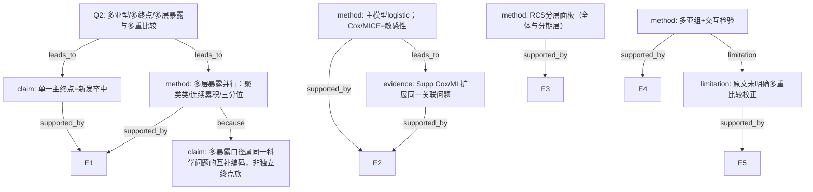

问题 Q2：如何处理多亚型/多终点/多层暴露？是否多重比较膨胀I类错误？是否对相关终点做聚合？

请严格按 AI-B 攻击者角色攻击上方 AI-A 决策树。对照原文 CHUNK。输出完整但精炼的攻击报告（含 Node-level 表与高/中 severity）。不要冗长复述原文。

---

# AI-A 初稿

# AI-A Decision Tree Round 1

paper_id: paper_022
question_id: Q2
task_type: literature_decision_tree_reasoning
question: 如何处理多亚型/多终点/多层暴露？是否多重比较膨胀I类错误？是否对相关终点做聚合？
source_file: adversarial_lit_reading/chunks/paper_022_2026_wang_ckm_cum_egdr_stroke.md

## 1. Evidence Map

| evidence_id | location | evidence_summary | used_by_node |
|---|---|---|---|
| E1 | Abstract/Table2 | 主终点：新发卒中（Wave4自报医生诊断）；暴露：k-means四类 + 累积eGDR连续 + 三分位 | N1,N2 |
| E2 | Methods | 主分析logistic；Cox为敏感性；MICE五套为敏感性 | N3,N8 |
| E3 | Fig.3 | RCS在全体/CKM0-2/CKM3-4三面板 | N4 |
| E4 | Table3/Supp S2 | 亚组多分层 + 交互P；Supp另有HR亚组 | N5 |
| E5 | Methods | 未报告Bonferroni/FDR/假设族校正 | N6 |
| E6 | 全文 | 单一主临床终点=卒中；无复合终点/PCA聚合多终点 | N1 |

## 2. Decision Tree - Mermaid

## 3. Node Table

| node_id | node_type | claim | evidence_location | evidence_summary | confidence | risk_tag |
|---|---|---|---|---|---|---|
| N0 | question | 多终点/多层暴露/多重比较 | — | 根 | high | — |
| N1 | claim | 单一主终点卒中 | Abstract | 无多临床终点 | high | — |
| N2 | method | 暴露多层编码并行 | Table2 | 类/连续/三分位 | high | — |
| N3 | method | 主分析vs敏感性分工 | Methods | logistic主；Cox/MI敏 | high | — |
| N4 | method | RCS多面板 | Fig.3 | 分期层 | high | — |
| N5 | method | 亚组+交互 | Table3 | 多分层 | high | — |
| N6 | limitation | 未报告多重比较校正 | Methods | 原文未说明 | high | 证据不足 |
| N7 | claim | 多层暴露=同一假设互补编码 | Table2 | 非独立终点 | medium | 逻辑跳跃 |
| N8 | evidence | Supp扩展同问题 | Supp | Cox/MI | high | — |

## 4. Provisional Answer

本文**单一主终点**为 Wave4 新发卒中。暴露侧并行呈现：k-means 四类、累积 eGDR 连续、三分位；RCS 另做分期面板；亚组多分层+交互。主推理链为 logistic；Cox 与 MICE 为敏感性。**原文未报告** Bonferroni/FDR 等多重比较校正。多暴露口径宜理解为同一科学问题的互补编码，但仍存在家族wise I类错误膨胀风险（尤其亚组×多类对比）。无复合终点/PCA。

## 5. Uncertainty List

- U1: 亚组交互与四类两两对比是否构成预先界定假设族，原文未说明。
- U2: Fig.3 三面板是否校正，原文未说明。
- U3: Supp HR亚组与正文OR亚组是否同一假设族。

## 6. Follow-up Questions

1. 是否在协议/预注册中预先指定主暴露编码？
2. 亚组交互显著后是否限制探索性声明？

---

# 原文 CHUNK

# Page 1

Wang et al. Cardiovascular Diabetology   (2026) 25:78                                                                                          Cardiovascular Diabetology
https://doi.org/10.1186/s12933-026-03096-1

      RESEARCH                                                                                                                                                               Open Access

Cumulative exposure to the estimated
glucose disposal rate and incident stroke
in individuals with cardiovascular–kidney–
metabolic syndrome stages 0–4: 6-year
longitudinal evidence from CHARLS
Yan Wang1,2†, Ning Wei1,2†, Meng Li1,2, Jun-Wen Liu1,2, Hong-Bin Lin1,2 and Hong-Fei Zhang1,2*

      Abstract
      Background The estimated glucose disposal rate (eGDR), an established measure of peripheral insulin sensitivity,
      contributes to stratifying the risk of cardio-cerebrovascular events. Nevertheless, the association between long-
      term eGDR exposure and stroke incidence throughout all stages (0–4) of cardiovascular–kidney–metabolic (CKM)
      syndrome remains unknown.
      Methods A cohort of 5248 individuals was drawn from the China Health and Retirement Longitudinal Study
      (CHARLS). For each participant, eGDR values for the years 2012 and 2015 were calculated using the equation:
      21.158 − [0.090 × WC (cm)] − [3.407 × HTN (presence = 1)] − [0.551 × HbA1c (%)]. Cumulative eGDR was calculated as
      (eGDR2012 + eGDR2015)/2* time (2015–2012). K-means clustering was used to analyse eGDR values from both 2012
      and 2015 to identify distinct change patterns. To assess associations with stroke risk, we utilised multivariable logistic
      regression and restricted cubic spline models.
      Results During the 2015–2018 follow-up period, a total of 336 incident stroke cases were documented. Four distinct
      eGDR change patterns were identified. In fully adjusted models, compared with the participants in the persistent
      low pattern (Class 2), those in the moderate–high stable (OR 0.43, 95% CI: 0.31–0.58), stable high (OR 0.29, 0.19–0.43),
      and rapid decrease (OR 0.66, 0.47–0.91) patterns exhibited significantly lower stroke risk. Furthermore, each 1-unit
      increase in cumulative eGDR was associated with a 5% reduction in stroke odds (OR 0.95, 0.93–0.96). Restricted cubic
      spline analysis confirmed a linear inverse relationship between cumulative eGDR and stroke risk (P < 0.001; P for
      nonlinearity = 0.259).

​†​
​​ ​​​​Y​a​n Wang and Ning Wei have contributed equally to this work.
*Correspondence:
Hong-Fei Zhang
zhanghongfei@smu.edu.cn
Full list of author information is available at the end of the article

                                             © The Author(s) 2026, modified publication 2026. Open Access This article is licensed under a Creative Commons Attribution-NonCommercial-
                                             NoDerivatives 4.0 International License, which permits any non-commercial use, sharing, distribution and reproduction in any medium or format,
                                             as long as you give appropriate credit to the original author(s) and the source, provide a link to the Creative Commons licence, and indicate if you
                                             modified the licensed material. You do not have permission under this licence to share adapted material derived from this article or parts of it. The
                                             images or other third party material in this article are included in the article’s Creative Commons licence, unless indicated otherwise in a credit line
                                             to the material. If material is not included in the article’s Creative Commons licence and your intended use is not permitted by statutory regulation
                                             or exceeds the permitted use, you will need to obtain permission directly from the copyright holder. To view a copy of this licence, visit ​h​t​t​​p​:​/​/​​c​r​e​​
                                             a​t​​i​v​e​c​o​m​m​o​n​s​.​o​r​g​/​l​i​c​e​n​s​e​s​/​b​y​-​n​c​-​n​d​/​4​.​0​/​​​​.​​​​

# Page 2

Wang et al. Cardiovascular Diabetology   (2026) 25:78                                                          Page 2 of 11

 Conclusion Cumulative eGDR is inversely associated with stroke risk across all CKM syndrome stages (0–4). This
 observation suggests that prolonged eGDR surveillance may be associated with improved risk stratification in this
 population.
 Keywords Cumulative estimated glucose disposal rate, Stroke, Cardiovascular–kidney–metabolic syndrome
 Graphical Abstract

​Introduction                                                  vasodilation, increased vasoconstriction, and altered vas-
 Stroke poses a critical public health threat in China and     cular reactivity. This endothelial dysfunction promotes
 is characterised by substantial and growing burdens           atherosclerotic plaque formation and destabilisation,
 of morbidity and disability [1, 2]. Cardiovascular–kid-       which are critical events in stroke pathogenesis [8–10].
 ney–metabolic (CKM) syndrome—a pathophysiologi-               Systemically, it perpetuates a chronic inflammatory state
 cal nexus interconnecting obesity, diabetes, and chronic      characterised by increased cytokine levels—including
 kidney disease—increasingly frames our understanding          high-sensitivity C-reactive protein (hs-CRP), interleu-
 of this challenge by amplifying vulnerability to cardio-      kin-6 (IL-6), and tumour necrosis factor-alpha (TNF-α)—
 cerebrovascular events [3]. Susceptibility linked to CKM      which together impair endothelial integrity, accelerate
 syndrome is not static but follows a graded progression;      atherogenesis, and foster a prothrombotic milieu [10–
 individuals in stages 3–4 face a disproportionately greater   12]. Furthermore, insulin resistance exacerbates oxidative
 stroke risk than those in stages 0–2 [4]. This graded risk    stress through dual pathways: increasing reactive oxygen
 pattern underscores the necessity of identifying modifi-      species (ROS) generation and decreasing antioxidant
 able risk factors, which can inform early intervention        defences, culminating in vascular cellular damage and
 strategies for stroke prevention in the CKM population.       dysfunction [13]. These pathways are further amplified by
   The estimated glucose disposal rate (eGDR), a               associated metabolic disturbances—including dyslipidae-
 proxy measure of peripheral insulin sensitivity, is           mia, sympathetic nervous system activation, and hyper-
 computed as follows: eGDR = 21.158 − (0.090 × WC              coagulability mediated by elevated plasminogen activator
 [cm]) − (3.407 × HTN       [presence = 1]) − (0.551 × HbA1c   inhibitor-1—collectively increasing susceptibility to cere-
 [%]), with higher values signifying increased insulin sen-    brovascular events [14–16].
 sitivity [5]. Low eGDR not only corresponds to severe           Substantial evidence indicates that reduced eGDR con-
 insulin resistance but is also related to stroke occur-       tributes to cerebrocardiovascular pathogenesis. Dong et
 rence through multiple biological mechanisms [6, 7]. At       al. [17] reported a 42% increase in cardiovascular dis-
 the vascular level, insulin resistance compromises endo-      ease risk (HR = 1.42, 95% CI 1.36–1.48) per 1-unit eGDR
 thelial function by reducing nitric oxide synthesis and       decrease in patients with CKM syndrome stages 0–3.
 increasing endothelin-1 production, leading to impaired       Similarly, Zabala et al. [18] reported a 78% higher stroke

# Page 3

Wang et al. Cardiovascular Diabetology   (2026) 25:78                                                           Page 3 of 11

incidence in the lowest vs. highest eGDR quartile (HR         Assessment of eGDR, cumulative eGDR, and eGDR change
1.78, 95% CI 1.54–2.06) among 32,087 T2DM patients.           patterns
Liang et al. [19] revealed a U-shaped relationship: cardio-   Waist circumference (WC) was measured at the umbili-
vascular risk was increased in both the lowest eGDR stra-     cal level in standing participants during normal tidal
tum (HR 2.11, 95% CI 1.76–2.53) and the highest stratum       breathing [23]. Hypertension (HTN) was defined by: (1)
(HR 1.48, 1.12–1.96), indicating adverse effects at eGDR      prior physician diagnosis, (2) current antihypertensive
extremes. This relationship was further supported by          treatment, or (3) blood pressure ≥ 140/90 mmHg. Gly-
a systematic review and meta-analysis by Shojaei et al.       cated haemoglobin (HbA1c) measurements from whole
[20], encompassing more than 1.2 million participants,        blood samples underwent NHANES-standardised assay
in which lower eGDR was consistently linked to major          calibration [24]. eGDR was derived using the validated
adverse cardio-cerebrovascular events (RR = 1.84; 95% CI:     equation: 21.158 − [0.090 × WC (cm)] − [3.407 × HTN
1.67–2.03).                                                   (presence = 1)] − [0.551 × HbA1c (%)]. Here, WC (cm),
  However, given that eGDR is a dynamic parameter, a          HTN (1 = present; 0 = absent), and HbA1c (%) operation-
single assessment may not fully capture its cumulative        alised these variables [5, 25]. Cumulative eGDR exposure
burden. Although cumulative exposure to cardiovascu-          was computed as follows: (eGDR₂₀₁₂ + eGDR₂₀₁₅)/2 × (tim
lar risk factors—not baseline levels—is strongly associ-      e₂₀₁₅—time₂₀₁₂) [26]. Participants were subsequently clas-
ated with long-term clinical outcomes, the influence of       sified into four distinct eGDR change patterns through
cumulative eGDR on stroke in the context of CKM syn-          k-means clustering analysis using eGDR values from both
drome has not been specifically assessed [4, 6]. This study   2012 and 2015 as input features: Class 1 (moderate–high
examined how longitudinal eGDR variations are related         stable), Class 2 (persistent low), Class 3 (stable high), and
to stroke incidence across all stages of CKM syndrome         Class 4 (rapid decrease).
(0–4) in the CHARLS cohort, addressing a critical gap in
evidence.                                                     CKM syndrome staging classification (0–4)
                                                              CKM syndrome staging at baseline (2012, Wave 1) was
Methods                                                       determined following the American Heart Association
Study population                                              framework, which categorises the condition into five pro-
CHARLS (China Health and Retirement Longitudinal              gressive stages (0–4) [3]. Stage 0 characterises individuals
Study), a national population-based cohort, enrolled          without metabolic or cardiovascular risk factors; Stage 1
Chinese participants aged ≥ 45 years. This study was car-     manifests overweight/obesity or prediabetes;
ried out jointly by Peking University’s National School         Stage 2 is defined by established conditions, including
of Development and the Chinese Academy of Social              type 2 diabetes (T2DM), hypertension (HTN), hypertri-
Sciences. It utilised a multistage, stratified sampling       glyceridaemia, and chronic kidney disease (CKD); Stage
approach, with four waves of data collection conducted        3 involves subclinical cardiovascular impairment, such
in 2012 (baseline), 2013, 2015, and 2018. All surveys fol-    as asymptomatic atherosclerosis or left ventricular dys-
lowed standardised protocols to maintain data quality         function; and Stage 4 represents clinical cardiovascular
and comparability. Further methodological details are         disease—such as coronary artery disease (CAD), heart
available in prior publications [21, 22].                     failure (HF), stroke, peripheral artery disease (PAD), and
  Participants were included if they met the following        atrial fibrillation (AF)—in patients with established CKM
criteria: (1) complete data on CKM syndrome staging           pathophysiology.
(stages 0–4); (2) no stroke history and available stroke
status data from waves 1 to 3 (2012–2015); (3) acces-         Outcome ascertainment
sible stroke outcome data at wave 4 (2018); and (4) com-      The incidence of stroke during follow-up served as the
plete data for estimated glucose disposal rate (eGDR)         primary outcome. In Wave 4, stroke events were ascer-
calculation (without outliers) at waves 1 or 3. Individu-     tained when participants reported affirmative responses
als not meeting all these criteria were excluded from the     to the physician-diagnosed question: “Have you been
analysis.                                                     diagnosed with stroke by a doctor?” This case identifica-
  Ethical approval for the CHARLS study was obtained          tion approach has been validated in prior investigations
from the IRB of Peking University (IRB00001052-11015).        [27, 28].
All participants provided written informed consent prior
to enrolment.                                                 Data collection
                                                              At baseline (Wave 1, 2011–2012), trained personnel
                                                              administered standardised questionnaires to obtain
                                                              sociodemographic and health-related information. Col-
                                                              lected variables included age, sex, marital status, and

# Page 4

Wang et al. Cardiovascular Diabetology   (2026) 25:78                                                            Page 4 of 11

education level—with education categorised as no for-          Model 3 (further adjusted for behavioural and clinical
mal education, ≤ middle school, high school or voca-           confounders, including education, smoking status, alco-
tional training, or ≥ college. Smoking status and alcohol      hol use, body mass index, dyslipidaemia, diabetes, and
use status were dichotomised as never/ever exposure.           estimated glomerular filtration rate). To facilitate clinical
Physician-diagnosed hypertension, diabetes mellitus, and       interpretation, the effect size for continuous cumulative
dyslipidaemia were additionally ascertained through self-      eGDR is reported per 1-unit increase. Potential nonlin-
reports. Physical examinations revealed the following          ear associations were examined using restricted cubic
parameters: body mass index (BMI), waist circumference         splines.
(WC), systolic blood pressure (SBP), and diastolic blood         Effect modification was evaluated via stratified analyses
pressure (DBP). Additional laboratory assays quantified        across these subgroups: age (< 60 vs. ≥ 60 years), sex, edu-
triglyceride (TG) levels, blood glucose levels, HbA1c lev-     cational attainment (below high school vs. high school or
els, HDL cholesterol levels, LDL cholesterol levels, uric      higher), behavioural factors (never vs. ever tobacco and
acid (UA) levels, eGFRs, and total cholesterol (TC) levels.    alcohol exposure), and CKM stage (0–2 vs. 3–4), and the
                                                               presence of diabetes, hypertension, or dyslipidaemia.
Statistical analysis                                           All stratified models retained the covariates specified in
Continuous variables are presented as mean ± SD when           Model 3, and interaction terms were tested using likeli-
normally distributed or as median (IQR) otherwise. Cat-        hood ratio tests. To assess the robustness of our findings,
egorical data are reported as counts and percentages.          we conducted two sensitivity analyses: (1) reclassify-
Baseline comparisons were performed using χ2/Fisher            ing cumulative eGDR into tertiles and testing for linear
exact tests (expected frequencies < 5) for categorical vari-   trends, and (2) multiple imputation via chained equa-
ables, t-test for normally distributed continuous vari-        tions (MICE; five datasets) was applied to manage miss-
ables, and Mann‒Whitney U tests for skewed continuous          ing covariate data, followed by comparison of pooled
variables.                                                     estimates with complete-case results. Analyses were per-
   To characterise longitudinal eGDR patterns from 2012        formed using R 4.2.2 and Free Statistics software v2.0,
to 2015, we applied the k-means clustering algorithm           with statistical significance set at two-tailed P < 0.05.
using eGDR measurements from both time points (2012
and 2015) as input variables for each participant. This        Results
bivariate approach enabled the algorithm to capture het-       Baseline characteristics by eGDR change classes
erogeneity in both baseline insulin sensitivity status and     Figure 1 depicts the flow diagram of participant selec-
temporal evolution. The k-means method, an unsuper-            tion. The CHARLS baseline cohort (2011–2012) initially
vised machine learning technique, groups observations          comprised 17,708 eligible participants. Participants with
by minimising within-cluster variance. The optimal num-        incomplete CKM syndrome staging data (n = 8307) were
ber of clusters was determined using the elbow method,         excluded, leaving 9401 individuals with documented
which evaluates the reduction in within-cluster sum            CKM stages 0–4. Among these, sequential exclusions
of squares as the number of clusters increases. A clear        were applied for the following: history of stroke or miss-
inflection point emerged at K = 4, which suggests that         ing stroke status during the baseline and follow-up
four clusters provided an optimal balance between model        period from waves 1 through 3 (n = 1828); absence of
fit and complexity (Fig. 2A). On the basis of this solution,   stroke outcome data at wave 4 (n = 710); and incomplete
the participants were categorised into four distinct tra-      eGDR measurements or outlier values at baseline or wave
jectory groups on the basis of their proximity to the final    3 (n = 1611). After these exclusion criteria were applied,
cluster centroids (Fig. 2B).                                   the final analytical cohort comprised 5248 participants
   Cumulative eGDR exposure was analysed as both a             categorised into four classes on the basis of eGDR change
continuous measure and in tertiles to evaluate its dose‒       patterns (Class 1, n = 1883; Class 2, n = 1121; Class 3,
response relationship with stroke incidence. Given the         n = 1410; and Class 4, n = 834).
low incidence of stroke (6.40%) in our cohort, multivari-        Table 1 presents the baseline characteristics of par-
able logistic regression was used to estimate odds ratios      ticipants with CKM syndrome (stages 0–4), stratified
(ORs), which approximate hazard ratios (HRs) under             by four eGDR change pattern groups (classes 1–4). Spe-
the rare disease assumption [29]. To address potential         cifically, Class 1 included 1883 participants, with eGDR
limitations from follow-up duration, we conducted Cox          values ranging from 10.39 ± 0.75 in 2012 to 9.91 ± 0.63
proportional hazards models as sensitivity analyses.           in 2015, which is consistent with a stable moderate-risk
Results are reported as odds ratios (ORs) and 95% con-         group; Class 2 comprised 1121 participants, whose eGDR
fidence intervals (CIs) across sequential models: Model        values ranged from 6.42 ± 1.00 in 2012 to 5.81 ± 1.15 in
1 (unadjusted crude analysis); Model 2 (adjusted for           2015, corresponding to a persistent high-risk group;
demographic covariates: age, sex, and marital status); and     Class 3 had 1410 participants, with eGDR values ranging

# Page 5

Wang et al. Cardiovascular Diabetology     (2026) 25:78                                                       Page 5 of 11

Fig. 1 Flowchart of the study population

from 11.74 ± 1.04 in 2012 to 11.45 ± 1.18 in 2015, which      circumference (73.85 ± 11.40 cm) and the highest HDL
was categorised as a stable low-risk group; and Class 4       cholesterol concentration (57.12 ± 15.82 mg/dL) among
included 834 participants, whose eGDR values decreased        all classes (Table 1).
from 9.64 ± 1.35 in 2012 to 7.16 ± 1.03 in 2015, defined as     Key findings of K-means clustering for eGDR changes
a rapid decrease group.                                       and the identification of the optimal number of clusters
   Males accounted for 43.73% of participants. Mean           are presented in Fig. 2. Clustering was performed using
eGDR values for the study population were 9.79 ± 2.14 in      eGDR values from both 2012 and 2015 as input features.
2012 and 9.01 ± 2.36 in 2015, with a cumulative eGDR of       The elbow method plot is shown in Fig. 2A, with within-
37.54 ± 8.46. Significant intergroup differences emerged      cluster sum of squares (WCSS) on the y-axis versus clus-
in demographics (age, sex, and BMI), sociobehavioural         ter number (k) on the x-axis; a clear elbow was observed
factors (education and smoking/alcohol status), and           at k = 4, at which point the reduction in within-cluster
clinical stage (CKM severity). The prevalence of comor-       sum of squares levelled off. This confirmed that 4 clus-
bidities (hypertension, diabetes, and dyslipidaemia) and      ters were the optimal choice to balance the heterogene-
metabolic parameters (e.g., blood glucose level, glycated     ity of eGDR changes and model simplicity. The eGDR
haemoglobin level, lipid profile, blood pressure, and         values of the 4 identified clusters (class 1 to class 4) at
waist circumference) also differed significantly across the   two time points (2012 and 2015) are shown in Fig. 2B.
groups.                                                       Classes 1, 2, and 3 maintained relatively stable eGDR lev-
   Specifically, Class 2 was the group with the most          els between these two years, whereas class 4 exhibited a
severe metabolic dysregulation: compared with the             distinct downwards trend in eGDR. These results pro-
other classes, it had the highest BMI (26.40 ± 4.17 kg/       vide a basis for subsequent subgroup analyses related to
m2), the highest prevalence of comorbidities (96.34%          eGDR changes and stroke risk. The distribution of eGDR
for hypertension, 15.19% for diabetes, 24.29% for dys-        values across the four clusters at both time points (2012
lipidaemia), and the most prominent abnormalities             and 2015) is shown in Fig. 2C. These patterns, identified
in metabolic parameters (SBP 146.61 ± 22.77 mmHg,             using two-time point data, provide a basis for subsequent
DBP 83.69 ± 12.84 mmHg, WC 93.46 ± 8.57 cm, glu-              subgroup analyses of eGDR changes and stroke risk.
cose 120.58 ± 51.62 mg/dL, HbA1c 5.52 ± 1.09%, TG
164.53 ± 140.56 mg/dL). In contrast, Class 3 had the
most favourable metabolic profile, with the lowest waist

# Page 6

Wang et al. Cardiovascular Diabetology              (2026) 25:78                                                                                       Page 6 of 11

Table 1 Baseline characteristics according to eGDR change patterns
Characteristics                           Overall                Class 1                Class 2                Class 3               Class 4               P-value
                                          (N = 5248)             (N = 1883)             (N = 1121)             (N = 1410)            (N = 834

=== SUPP EXCERPT ===
# Supplementary Material 1 — Wang et al. Cardiovasc Diabetol 2026;25:78
Cumulative exposure to the estimated glucose disposal rate and incident stroke in individuals with cardiovascular–kidney–metabolic syndrome stages 0–4: 6-year longitudinal evidence from CHARLS
Yan Wang1,2#, Ning Wei1,2#, Meng Li1,2, Jun-Wen Liu1,2, Hong-Bin Lin1,2, Hong-Fei Zhang1,2
Author affiliations:
1 Department of Anesthesiology, Zhujiang Hospital, Southern Medical University, Guangzhou, 510280, China
2 Institute of Perioperative Medicine and Organ Protection, Zhujiang Hospital of Southern Medical University, Guangzhou, 510280, China
# Yan Wang, Ning Wei contributed equally to this work.
Corresponding authors:
Dr. Hong-Fei Zhang; zhanghongfei@smu.edu.cn
Department of Anesthesiology, Zhujiang Hospital; Institute of Perioperative Medicine and Organ Protection, Zhujiang Hospital of Southern Medical University, Guangzhou, 510280, China
Table S1 Cox regression for associations between eGDR change patterns, cumulative eGDR, and stroke in subjects with CKM syndrome stages 0–4
CI, confidence interval; HR, hazard ratio; T, tertiles; eGDR, estimated glucose disposal rate; BMI, body mass index; eGFR, estimated glomerular filtration rate; CKM, cardiovascular-kidney-metabolic.
Model 1: no covariates were adjusted
Model 2: Adjusted for age, gender and marital status
Model 3: Adjusted for age, gender, marital status, BMI, educational level, smoke status, drink status, eGFR, dyslipidemia, diabetes
Table S2 Subgroup analysis of eGDR change patterns and stroke incidence in subjects with CKM syndrome (stages 0–4)
Adjusted for all covariates except for this subgroup of variables. CI, confidence interval; HR, hazard ratio; BMI, body mass index; CKM, cardiovascular-kidney-metabolic.
Table S3 Association between eGDR change patterns, cumulative eGDR, and stroke in adults with CKM syndrome: cox regression analysis after multiple imputation
CI, confidence interval; HR, hazard ratio; T, tertiles; eGDR, estimated glucose disposal rate; BMI, body mass index; eGFR, estimated glomerular filtration rate; CKM, cardiovascular-kidney-metabolic.
Model 1: no covariates were adjusted
Model 2: Adjusted for age, gender and marital status
Model 3: Adjusted for age, gender, marital status, BMI, educational level, smoke status, drink status, eGFR, dyslipidemia, diabetes
With missing data: The number of missing values for the covariates were: 2 (0.038%) for education levels, 4 (0.076%) for drinking status, 4 (0.076%) for diabetes and 66 (1.26%) for dyslipidemia. Multiple imputation was applied to handle missing values in all continuous and categorical variables, followed by analyses on the imputed datasets
Table S4 Association between eGDR change patterns, cumulative eGDR, and stroke in adults with CKM syndrome: logistic regression analysis after multiple imputation
CI, confidence interval; OR, odds ratio; T, tertiles; eGDR, estimated glucose disposal rate; BMI, body mass index; eGFR, estimated glomerular filtration rate; CKM, cardiovascular-kidney-metabolic.
Model 1: no covariates were adjusted
Model 2: Adjusted for age, gender and marital status
Model 3: Adjusted for age, gender, marital status, BMI, educational level, smoke status, drink status, eGFR, dyslipidemia, diabetes
With missing data: The number of missing values for the covariates were: 2 (0.038%) for education levels, 4 (0.076%) for drinking status, 4 (0.076%) for diabetes and 66 (1.26%) for dyslipidemia. Multiple imputation was applied to handle missing values in all continuous and categorical variables, followed by analyses on the imputed datasets
Fig. S1 The RCS analysis of the relationship between cumulative eGDR and stroke incidence in participants with CKM syndrome (stages 0–4). Adjustment variables included for age, gender, marital status, body mass index (BMI), educational attainment, smoking status, alcohol consumption status, estimated glomerular filtration rate (eGFR), dyslipidemia, and diabetes. (A) Relationship between cumulative eGDR and stroke incidence in participants with CKM syndrome (Stages 0–4); (B) Relationship between cumulative eGDR and stroke incidence in participants with non-advanced CKM syndrome (Stages 0–2); (C) Relationship between cumulative eGDR and stroke incidence in participants with advanced CKM syndrome (stages 3–4). BMI, body mass index; eGFR, estimated glomerular filtration rate; CKM, cardiovascular-kidney-metabolic; HR, hazard ratio
Fig. S2 Subgroup analysis of cumulative eGDR (per 0.1 unit) and stroke incidence in subjects with CKM syndrome (stages 0–4). Adjusted for all covariates except for this subgroup of variables. BMI, body mass index; CKM, cardiovascular-kidney-metabolic; HR, hazard ratio
Fig. S3 Subgroup analysis of cumulative eGDR (per 0.1 unit) and stroke incidence in subjects with CKM syndrome (stages 0–4). Adjusted for all covariates except for this subgroup of variables. BMI, body mass index; CKM, cardiovascular-kidney-metabolic; OR, odds ratio

## DOCX_TABLE_0
| Variable | Total number | Events, n (%) | Model 1 | P value | Model 2 | P value | Model 3 | P value |
| Variable | Total number | Events, n (%) | HR (95% CI) |  | HR (95% CI) |  | HR (95% CI) | P value |
| eGDR change patterns |  |  |  |  |  |  |  |  |
| Class 2 | 1121 | 144 (12.8) | Reference |  | Reference |  | Reference |  |
| Class 1 | 1883 | 86 (4.6) | 0.35 (0.27~0.46) | <0.001 | 0.37 (0.29~0.49) | <0.001 | 0.46 (0.35~0.62) | <0.001 |
| Class 3 | 1410 | 43 (3) | 0.23 (0.16~0.33) | <0.001 | 0.24 (0.17~0.34) | <0.001 | 0.32 (0.22~0.47) | <0.001 |
| Class 4 | 834 | 63 (7.6) | 0.57 (0.43~0.77) | <0.001 | 0.58 (0.43~0.78) | <0.001 | 0.69 (0.51~0.94) | 0.020 |
| Cumulative eGDR | 5248 | 336 (6.4) | 0.94 (0.93~0.95) | <0.001 | 0.94 (0.93~0.96) | <0.001 | 0.96 (0.94~0.97) | <0.001 |
| Tertiles of Cumulative eGDR |  |  |  |  |  |  |  |  |
| T1 | 1749 | 192 (11) | Reference |  | Reference |  | Reference |  |
| T2 | 1749 | 90 (5.1) | 0.45 (0.35~0.58) | <0.001 | 0.48 (0.37~0.62) | <0.001