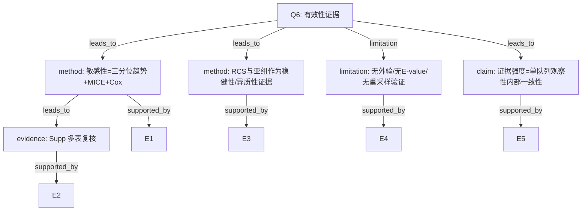

You are reviewing a clinical epidemiology methods decision tree. Keep the critique academic and technical. Avoid any non-scientific content.

Question Q6: What validity evidence exists (sensitivity, external validation, E-value)? How strong?

Attack the AI-A decision tree using the paper excerpt. Output a concise structured attack report with severity tags.

---
# AI-A

# AI-A Decision Tree Round 1

paper_id: paper_022
question_id: Q6
task_type: literature_decision_tree_reasoning
question: 如何证明分析有效？内部/外部验证、敏感性、E-value等？证据强度？
source_file: adversarial_lit_reading/chunks/paper_022_2026_wang_ckm_cum_egdr_stroke.md

## 1. Evidence Map

| evidence_id | location | evidence_summary | used_by_node |
|---|---|---|---|
| E1 | Methods/Results | 敏感性：三分位趋势；MICE | N1 |
| E2 | Supp S1-S4 | Cox与MI后Cox/logistic | N1,N2 |
| E3 | Fig.3/Table3 | RCS与亚组一致性/交互 | N3 |
| E4 | 全文 | 无外部验证队列；无bootstrap/CV；无E-value/阴性对照 | N4 |
| E5 | Methods | 单队列CHARLS内部证据 | N5 |

## 2. Decision Tree - Mermaid

## 3. Node Table

| node_id | node_type | claim | evidence_location | evidence_summary | confidence | risk_tag |
|---|---|---|---|---|---|---|
| N0 | question | 有效性证据层级 | — | 根 | high | — |
| N1 | method | 敏感性组合 | Methods | tertile/MI/Cox | high | — |
| N2 | evidence | Supp复核 | Supp | S1-S4 | high | — |
| N3 | method | RCS+亚组 | Fig3/Table3 | 形态与交互 | high | — |
| N4 | limitation | 无外验/E-value/CV | 全文 | 未做 | high | — |
| N5 | claim | 内部一致性证据 | 设计 | 单队列 | high | — |

## 4. Provisional Answer

有效性主要靠**内部敏感性三角**：三分位趋势、MICE、Cox（及MI后模型），辅以 RCS 与亚组。**无**外部队列验证、**无** bootstrap/CV 稳定性、**无** E-value/阴性对照。证据强度定位为单中心/单队列观察性关联的内部稳健性，而非预测模型验证或因果识别强度。

## 5. Uncertainty List

- U1: 聚类标签稳定性（重采样ARI）未报告。
- U2: 不同随机种子下类分配是否改变OR。

## 6. Follow-up Questions

1. 是否可补聚类稳定性分析？
2. E-value对未测混杂的提示？

---
# PAPER EXCERPT

# Page 1

Wang et al. Cardiovascular Diabetology   (2026) 25:78                                                                                          Cardiovascular Diabetology
https://doi.org/10.1186/s12933-026-03096-1

      RESEARCH                                                                                                                                                               Open Access

Cumulative exposure to the estimated
glucose disposal rate and incident stroke
in individuals with cardiovascular–kidney–
metabolic syndrome stages 0–4: 6-year
longitudinal evidence from CHARLS
Yan Wang1,2†, Ning Wei1,2†, Meng Li1,2, Jun-Wen Liu1,2, Hong-Bin Lin1,2 and Hong-Fei Zhang1,2*

      Abstract
      Background The estimated glucose disposal rate (eGDR), an established measure of peripheral insulin sensitivity,
      contributes to stratifying the risk of cardio-cerebrovascular events. Nevertheless, the association between long-
      term eGDR exposure and stroke incidence throughout all stages (0–4) of cardiovascular–kidney–metabolic (CKM)
      syndrome remains unknown.
      Methods A cohort of 5248 individuals was drawn from the China Health and Retirement Longitudinal Study
      (CHARLS). For each participant, eGDR values for the years 2012 and 2015 were calculated using the equation:
      21.158 − [0.090 × WC (cm)] − [3.407 × HTN (presence = 1)] − [0.551 × HbA1c (%)]. Cumulative eGDR was calculated as
      (eGDR2012 + eGDR2015)/2* time (2015–2012). K-means clustering was used to analyse eGDR values from both 2012
      and 2015 to identify distinct change patterns. To assess associations with stroke risk, we utilised multivariable logistic
      regression and restricted cubic spline models.
      Results During the 2015–2018 follow-up period, a total of 336 incident stroke cases were documented. Four distinct
      eGDR change patterns were identified. In fully adjusted models, compared with the participants in the persistent
      low pattern (Class 2), those in the moderate–high stable (OR 0.43, 95% CI: 0.31–0.58), stable high (OR 0.29, 0.19–0.43),
      and rapid decrease (OR 0.66, 0.47–0.91) patterns exhibited significantly lower stroke risk. Furthermore, each 1-unit
      increase in cumulative eGDR was associated with a 5% reduction in stroke odds (OR 0.95, 0.93–0.96). Restricted cubic
      spline analysis confirmed a linear inverse relationship between cumulative eGDR and stroke risk (P < 0.001; P for
      nonlinearity = 0.259).

​†​
​​ ​​​​Y​a​n Wang and Ning Wei have contributed equally to this work.
*Correspondence:
Hong-Fei Zhang
zhanghongfei@smu.edu.cn
Full list of author information is available at the end of the article

                                             © The Author(s) 2026, modified publication 2026. Open Access This article is licensed under a Creative Commons Attribution-NonCommercial-
                                             NoDerivatives 4.0 International License, which permits any non-commercial use, sharing, distribution and reproduction in any medium or format,
                                             as long as you give appropriate credit to the original author(s) and the source, provide a link to the Creative Commons licence, and indicate if you
                                             modified the licensed material. You do not have permission under this licence to share adapted material derived from this article or parts of it. The
                                             images or other third party material in this article are included in the article’s Creative Commons licence, unless indicated otherwise in a credit line
                                             to the material. If material is not included in the article’s Creative Commons licence and your intended use is not permitted by statutory regulation
                                             or exceeds the permitted use, you will need to obtain permission directly from the copyright holder. To view a copy of this licence, visit ​h​t​t​​p​:​/​/​​c​r​e​​
                                             a​t​​i​v​e​c​o​m​m​o​n​s​.​o​r​g​/​l​i​c​e​n​s​e​s​/​b​y​-​n​c​-​n​d​/​4​.​0​/​​​​.​​​​

# Page 2

Wang et al. Cardiovascular Diabetology   (2026) 25:78                                                          Page 2 of 11

 Conclusion Cumulative eGDR is inversely associated with stroke risk across all CKM syndrome stages (0–4). This
 observation suggests that prolonged eGDR surveillance may be associated with improved risk stratification in this
 population.
 Keywords Cumulative estimated glucose disposal rate, Stroke, Cardiovascular–kidney–metabolic syndrome
 Graphical Abstract

​Introduction                                                  vasodilation, increased vasoconstriction, and altered vas-
 Stroke poses a critical public health threat in China and     cular reactivity. This endothelial dysfunction promotes
 is characterised by substantial and growing burdens           atherosclerotic plaque formation and destabilisation,
 of morbidity and disability [1, 2]. Cardiovascular–kid-       which are critical events in stroke pathogenesis [8–10].
 ney–metabolic (CKM) syndrome—a pathophysiologi-               Systemically, it perpetuates a chronic inflammatory state
 cal nexus interconnecting obesity, diabetes, and chronic      characterised by increased cytokine levels—including
 kidney disease—increasingly frames our understanding          high-sensitivity C-reactive protein (hs-CRP), interleu-
 of this challenge by amplifying vulnerability to cardio-      kin-6 (IL-6), and tumour necrosis factor-alpha (TNF-α)—
 cerebrovascular events [3]. Susceptibility linked to CKM      which together impair endothelial integrity, accelerate
 syndrome is not static but follows a graded progression;      atherogenesis, and foster a prothrombotic milieu [10–
 individuals in stages 3–4 face a disproportionately greater   12]. Furthermore, insulin resistance exacerbates oxidative
 stroke risk than those in stages 0–2 [4]. This graded risk    stress through dual pathways: increasing reactive oxygen
 pattern underscores the necessity of identifying modifi-      species (ROS) generation and decreasing antioxidant
 able risk factors, which can inform early intervention        defences, culminating in vascular cellular damage and
 strategies for stroke prevention in the CKM population.       dysfunction [13]. These pathways are further amplified by
   The estimated glucose disposal rate (eGDR), a               associated metabolic disturbances—including dyslipidae-
 proxy measure of peripheral insulin sensitivity, is           mia, sympathetic nervous system activation, and hyper-
 computed as follows: eGDR = 21.158 − (0.090 × WC              coagulability mediated by elevated plasminogen activator
 [cm]) − (3.407 × HTN       [presence = 1]) − (0.551 × HbA1c   inhibitor-1—collectively increasing susceptibility to cere-
 [%]), with higher values signifying increased insulin sen-    brovascular events [14–16].
 sitivity [5]. Low eGDR not only corresponds to severe           Substantial evidence indicates that reduced eGDR con-
 insulin resistance but is also related to stroke occur-       tributes to cerebrocardiovascular pathogenesis. Dong et
 rence through multiple biological mechanisms [6, 7]. At       al. [17] reported a 42% increase in cardiovascular dis-
 the vascular level, insulin resistance compromises endo-      ease risk (HR = 1.42, 95% CI 1.36–1.48) per 1-unit eGDR
 thelial function by reducing nitric oxide synthesis and       decrease in patients with CKM syndrome stages 0–3.
 increasing endothelin-1 production, leading to impaired       Similarly, Zabala et al. [18] reported a 78% higher stroke

# Page 3

Wang et al. Cardiovascular Diabetology   (2026) 25:78                                                           Page 3 of 11

incidence in the lowest vs. highest eGDR quartile (HR         Assessment of eGDR, cumulative eGDR, and eGDR change
1.78, 95% CI 1.54–2.06) among 32,087 T2DM patients.           patterns
Liang et al. [19] revealed a U-shaped relationship: cardio-   Waist circumference (WC) was measured at the umbili-
vascular risk was increased in both the lowest eGDR stra-     cal level in standing participants during normal tidal
tum (HR 2.11, 95% CI 1.76–2.53) and the highest stratum       breathing [23]. Hypertension (HTN) was defined by: (1)
(HR 1.48, 1.12–1.96), indicating adverse effects at eGDR      prior physician diagnosis, (2) current antihypertensive
extremes. This relationship was further supported by          treatment, or (3) blood pressure ≥ 140/90 mmHg. Gly-
a systematic review and meta-analysis by Shojaei et al.       cated haemoglobin (HbA1c) measurements from whole
[20], encompassing more than 1.2 million participants,        blood samples underwent NHANES-standardised assay
in which lower eGDR was consistently linked to major          calibration [24]. eGDR was derived using the validated
adverse cardio-cerebrovascular events (RR = 1.84; 95% CI:     equation: 21.158 − [0.090 × WC (cm)] − [3.407 × HTN
1.67–2.03).                                                   (presence = 1)] − [0.551 × HbA1c (%)]. Here, WC (cm),
  However, given that eGDR is a dynamic parameter, a          HTN (1 = present; 0 = absent), and HbA1c (%) operation-
single assessment may not fully capture its cumulative        alised these variables [5, 25]. Cumulative eGDR exposure
burden. Although cumulative exposure to cardiovascu-          was computed as follows: (eGDR₂₀₁₂ + eGDR₂₀₁₅)/2 × (tim
lar risk factors—not baseline levels—is strongly associ-      e₂₀₁₅—time₂₀₁₂) [26]. Participants were subsequently clas-
ated with long-term clinical outcomes, the influence of       sified into four distinct eGDR change patterns through
cumulative eGDR on stroke in the context of CKM syn-          k-means clustering analysis using eGDR values from both
drome has not been specifically assessed [4, 6]. This study   2012 and 2015 as input features: Class 1 (moderate–high
examined how longitudinal eGDR variations are related         stable), Class 2 (persistent low), Class 3 (stable high), and
to stroke incidence across all stages of CKM syndrome         Class 4 (rapid decrease).
(0–4) in the CHARLS cohort, addressing a critical gap in
evidence.                                                     CKM syndrome staging classification (0–4)
                                                              CKM syndrome staging at baseline (2012, Wave 1) was
Methods                                                       determined following the American Heart Association
Study population                                              framework, which categorises the condition into five pro-
CHARLS (China Health and Retirement Longitudinal              gressive stages (0–4) [3]. Stage 0 characterises individuals
Study), a national population-based cohort, enrolled          without metabolic or cardiovascular risk factors; Stage 1
Chinese participants aged ≥ 45 years. This study was car-     manifests overweight/obesity or prediabetes;
ried out jointly by Peking University’s National School         Stage 2 is defined by established conditions, including
of Development and the Chinese Academy of Social              type 2 diabetes (T2DM), hypertension (HTN), hypertri-
Sciences. It utilised a multistage, stratified sampling       glyceridaemia, and chronic kidney disease (CKD); Stage
approach, with four waves of data collection conducted        3 involves subclinical cardiovascular impairment, such
in 2012 (baseline), 2013, 2015, and 2018. All surveys fol-    as asymptomatic atherosclerosis or left ventricular dys-
lowed standardised protocols to maintain data quality         function; and Stage 4 represents clinical cardiovascular
and comparability. Further methodological details are         disease—such as coronary artery disease (CAD), heart
available in p

[truncated methods/results]
 (adjusted for           2015, corresponding to a persistent high-risk group;
demographic covariates: age, sex, and marital status); and     Class 3 had 1410 participants, with eGDR values ranging

# Page 5

Wang et al. Cardiovascular Diabetology     (2026) 25:78                                                       Page 5 of 11

Fig. 1 Flowchart of the study population

from 11.74 ± 1.04 in 2012 to 11.45 ± 1.18 in 2015, which      circumference (73.85 ± 11.40 cm) and the highest HDL
was categorised as a stable low-risk group; and Class 4       cholesterol concentration (57.12 ± 15.82 mg/dL) among
included 834 participants, whose eGDR values decreased        all classes (Table 1).
from 9.64 ± 1.35 in 2012 to 7.16 ± 1.03 in 2015, defined as     Key findings of K-means clustering for eGDR changes
a rapid decrease group.                                       and the identification of the optimal number of clusters
   Males accounted for 43.73% of participants. Mean           are presented in Fig. 2. Clustering was performed using
eGDR values for the study population were 9.79 ± 2.14 in      eGDR values from both 2012 and 2015 as input features.
2012 and 9.01 ± 2.36 in 2015, with a cumulative eGDR of       The elbow method plot is shown in Fig. 2A, with within-
37.54 ± 8.46. Significant intergroup differences emerged      cluster sum of squares (WCSS) on the y-axis versus clus-
in demographics (age, sex, and BMI), sociobehavioural         ter number (k) on the x-axis; a clear elbow was observed
factors (education and smoking/alcohol status), and           at k = 4, at which point the reduction in within-cluster
clinical stage (CKM severity). The prevalence of comor-       sum of squares levelled off. This confirmed that 4 clus-
bidities (hypertension, diabetes, and dyslipidaemia) and      ters were the optimal choice to balance the heterogene-
metabolic parameters (e.g., blood glucose level, glycated     ity of eGDR changes and model simplicity. The eGDR
haemoglobin level, lipid profile, blood pressure, and         values of the 4 identified clusters (class 1 to class 4) at
waist circumference) also differed significantly across the   two time points (2012 and 2015) are shown in Fig. 2B.
groups.                                                       Classes 1, 2, and 3 maintained relatively stable eGDR lev-
   Specifically, Class 2 was the group with the most          els between these two years, whereas class 4 exhibited a
severe metabolic dysregulation: compared with the             distinct downwards trend in eGDR. These results pro-
other classes, it had the highest BMI (26.40 ± 4.17 kg/       vide a basis for subsequent subgroup analyses related to
m2), the highest prevalence of comorbidities (96.34%          eGDR changes and stroke risk. The distribution of eGDR
for hypertension, 15.19% for diabetes, 24.29% for dys-        values across the four clusters at both time points (2012
lipidaemia), and the most prominent abnormalities             and 2015) is shown in Fig. 2C. These patterns, identified
in metabolic parameters (SBP 146.61 ± 22.77 mmHg,             using two-time point data, provide a basis for subsequent
DBP 83.69 ± 12.84 mmHg, WC 93.46 ± 8.57 cm, glu-              subgroup analyses of eGDR changes and stroke risk.
cose 120.58 ± 51.62 mg/dL, HbA1c 5.52 ± 1.09%, TG
164.53 ± 140.56 mg/dL). In contrast, Class 3 had the
most favourable metabolic profile, with the lowest waist

# Page 6

Wang et al. Cardiovascular Diabetology              (2026) 25:78                                                                                       Page 6 of 11

Table 1 Baseline characteristics according to eGDR change patterns
Characteristics                           Overall                Class 1                Class 2                Class 3               Class 4               P-value
                                          (N = 5248)             (N = 1883)             (N = 1121)             (N = 1410)            (N = 834)
Age, mean (SD), years                     58.29 (8.86)           57.21 (8.69)           59.83 (8.58)           57.92 (9.25)          59.31 (8.58)          < 0.001
Gender, n (%)                                                                                                                                              < 0.001
Female                                    2953 (56.27%)          1068 (56.72%)          698 (62.27%)           746 (52.91%)          441 (52.88%)
Male                                      2295 (43.73%)          815 (43.28%)           423 (37.73%)           664 (47.09%)          393 (47.12%)
BMI, mean (SD), kg/m2                     23.68 (3.98)           24.01 (3.10)           26.40 (4.17)           20.78 (2.81)          24.22 (4.05)          < 0.001
Educational level, n (%)                                                                                                                                     0.004
No formal education                       2493 (47.52%)          832 (44.21%)           535 (47.73%)           696 (49.40%)          430 (51.56%)
Middle school or below                    1200 (22.87%)          428 (22.74%)           252 (22.48%)           326 (23.14%)          194 (23.26%)
High school or vocational school          1066 (20.32%)          420 (22.32%)           231 (20.61%)           269 (19.09%)          146 (17.51%)
College or above                          487 (9.28%)            202 (10.73%)           103 (9.19%)            118 (8.37%)           64 (7.67%)
Smoking status, n (%)                                                                                                                                      < 0.001
Never                                     3315 (63.17%)          1221 (64.84%)          766 (68.33%)           835 (59.22%)          493 (59.11%)
Ever                                      1933 (36.83%)          662 (35.16%)           355 (31.67%)           575 (40.78%)          341 (40.89%)
Drinking status, n (%)                                                                                                                                       0.037
Never                                     3276 (62.47%)          1186 (63.02%)          733 (65.45%)           860 (61.04%)          497 (59.66%)
Ever                                      1968 (37.53%)          696 (36.98%)           387 (34.55%)           549 (38.96%)          336 (40.34%)
Marital status, n (%)                                                                                                                                        0.092
Single                                    517 (9.85%)            172 (9.13%)            113 (10.08%)           131 (9.29%)           101 (12.11%)
Married                                   4731 (90.15%)          1711 (90.87%)          1008 (89.92%)          1279 (90.71%)         733 (87.89%)
SBP, mean (SD), mm Hg                     131.47 (21.93)         126.12 (18.03)         146.61 (22.77)         121.79 (17.18)        139.74 (22.39)        < 0.001
DBP, mean (SD), mm Hg                     76.36 (12.63)          74.37 (11.22)          83.69 (12.84)          71.22 (10.97)         79.77 (12.53)         < 0.001
WC, mean (SD), cm                         84.61 (12.29)          87.09 (6.85)           93.46 (8.57)           73.85 (11.40)         85.32 (14.55)         < 0.001
Glucose, mean (SD), mg/dl                 109.33 (35.23)         105.89 (26.11)         120.58 (51.62)         100.74 (17.47)        116.48 (42.51)        < 0.001
TC, mean (SD), mg/dL                      193.36 (38.24)         193.47 (36.66)         200.13 (40.89)         186.48 (35.89)        195.60 (40.01)        < 0.001
TG, mean (SD), mg/dL                      133.54 (107.22)        134.25 (100.14)        164.53 (140.56)        101.42 (66.80)        144.57 (111.70)       < 0.001
HDL, mean (SD), mg/dL                     51.05 (15.16)          49.71 (13.84)          46.42 (13.75)          57.12 (15.82)     