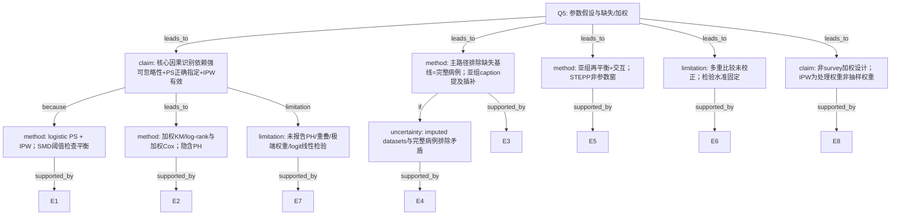

# AI-B input package

## Question (Q5)
该分析依赖哪些参数假设？是否满足？（Cox PH、logistic、缺失、加权设计等）

## AI-A Round1 Decision Tree

# AI-A Decision Tree Round 1

paper_id: yaoyong_moxing_sanfen
question_id: Q5
task_type: literature_decision_tree_reasoning
question: 该分析依赖哪些参数假设？是否满足？（Cox PH、logistic 线性 logit、正态性、K、训练/验证划分等）。若复杂抽样/加权设计：是否正确使用抽样权重/PSU/分层？是否处理缺失（多重插补 vs 完整病例）？
source_file: adversarial_lit_reading/chunks/yaoyong_moxing_sanfen.md

## 1. Evidence Map

| evidence_id | location | evidence_summary | used_by_node |
|---|---|---|---|
| E1 | Methods Statistical analysis | IPW：多因素 logistic 估 PS（接受放疗条件概率），再加权平衡基线；以 SMD&lt;0.1 判可接受平衡 | N1, N2 |
| E2 | Methods/Results | 结局 OS：IPW 调整 KM + log-rank + IPW 调整 Cox PH 模型 | N3 |
| E3 | Methods Study cohort | 排除「missing values on baseline characteristics」及不合理手术日期等 → 完整病例取向入组 | N4 |
| E4 | Fig. 3 caption | 部分亚组加权不平衡后改用「multivariable Cox regression based on imputed datasets」 | N4, N8 |
| E5 | Methods Statistical analysis | 亚组内重新平衡；交互检验异质性；STEPP 非参数滑动窗 | N5 |
| E6 | Methods end | R 4.2.3；双侧 P&lt;0.05；未做多重比较校正 | N6 |
| E7 | 全文 Methods | 未描述 Schoenfeld/PH 检验、logit 线性检验、PS 重叠/极端权重诊断、survey 权重/PSU/分层 | N7 |
| E8 | Abstract/Methods | 数据源为 NCDB 医院登记队列，非 NHANES 类复杂抽样设计叙述 | N9 |

## 2. Decision Tree - Mermaid

## 3. Node Table

| node_id | node_type | claim | evidence_location | evidence_summary | confidence | risk_tag |
|---|---|---|---|---|---|---|
| N0 | question | 假设/加权/缺失 | — | 根 | high | — |
| N1 | claim | IPW 因果调整依赖可忽略性等 | Methods | IPW for confounding | medium | 因果过度 |
| N2 | method | logistic PS + IPW + SMD | Methods | SMD 0.1 | high | — |
| N3 | method | 加权生存分析隐含 PH | Methods/Results | IPW Cox | medium | 证据不足 |
| N4 | method | 主分析完整病例排除缺失 | Study cohort | missing excluded | high | — |
| N5 | method | 亚组再平衡与 STEPP | Methods | STEPP/interaction | high | — |
| N6 | limitation | 未校正多重比较 | Methods end | No adjustments | high | — |
| N7 | limitation | 关键假设检验未报告 | 全文 | PH/overlap 未写 | high | 证据不足 |
| N8 | uncertainty | 插补 vs 排除矛盾 | Fig.3 vs Methods | imputed datasets | high | 方法误读 |
| N9 | claim | IPW≠复杂抽样权重 | Methods | NCDB cohort | high | — |

## 4. Provisional Answer

**关键假设：** (1) 观察性治疗分配在纳入混杂条件下可忽略；(2) PS logistic 形式正确且权重可估；(3) 加权后组间可比（以 SMD 论证）；(4) Cox 分析隐含比例风险；(5) 主分析对缺失呈完整病例（排除缺失基线）。

**是否满足：** 原文用 **加权后 SMD&lt;0.1** 支持平衡；**未报告** PH 检验、PS 重叠/极端权重、logistic 线性诊断。Fig.3 的 **imputed datasets** 与 Methods 排除缺失并存，**原文未说明**插补假设（MAR 等）。

**加权设计：** 本文 IPW 是 **处理（放疗）逆概率权重**，不是 NHANES 抽样权重/PSU/分层；**不适用** survey-weighted 专项。

**缺失：** 主路径完整病例排除；亚组 caption 提及插补——口径张力需标【证据不足】。

## 5. Uncertainty List

- U1: PH 是否检验——原文未明确说明。
- U2: 亚组 imputed datasets 的插补模型/次数——原文未展开。
- U3: 极端 IPW 权重是否截尾——原文未明确说明。

## 6. Follow-up Questions

1. 补充材料是否含 PH / 权重分布诊断？
2. 亚组插补与主队列排除如何衔接？

## Paper chunks (full)

# Page 1

RESEARCH
Breast Cancer Research and Treatment          (2026) 217:32 
https://doi.org/10.1007/s10549-026-07981-x
Yizi Jin, Huiyue Li and Zhaozhi Yang contributed equally to this 
work.
	
 Jennifer K. Plichta
jennifer.plichta@duke.edu
	
 Jian Zhang
syner2000@163.com
1	
Phase I Unit, Fudan University Shanghai Cancer Center, No. 
270, Dong’an Road, Shanghai 200032, China
2	
Department of Oncology, Shanghai Medical College, Fudan 
University, No. 130, Dong’an Road, Shanghai 200032, China
3	
Department of Biostatistics and Bioinformatics, Duke 
University Medical Center, Durham, NC, USA
4	
Department of Radiation Oncology, Fudan University 
Shanghai Cancer Center, Shanghai, China
5	
Clinical Research Center for Radiation Oncology, Shanghai 
Key Laboratory of Radiation Oncology, Shanghai, China
6	
Department of Biostatistics, St Jude Children’s Research 
Hospital, Memphis, TN, USA
7	
Duke Cancer Institute, Duke University Medical Center, 
Durham, NC 27710, USA
8	
Department of Population Health Sciences, Duke University 
School of Medicine, Durham, NC 27710, USA
9	
Department of Surgery, Duke University School of Medicine, 
Durham, NC 27710, USA
Abstract
Purpose  This study aims to determine the potential association of postmastectomy radiotherapy and survival in patients with 
clinically node-positive axillary breast cancer who achieved ypN0 after neoadjuvant chemotherapy.
Methods  We conducted a retrospective cohort study using the National Cancer Database. Eligible patients were women 
aged 18–80 with cT1-2, cN+ invasive breast cancer and achieving ypN0 status. Inverse probability weighting (IPW)-based 
analyses were used to assess the differences in overall survival (OS) between the radiotherapy and no radiotherapy groups. 
Absolute 5-year OS rates between the two groups were analyzed by nonparametric sliding-window subpopulation treatment 
effect pattern plot (STEPP) analysis. Sensitivity analyses were conducted using multivariable Cox regressions.
Results  We identified 3,351 patients who met eligibility criteria, of whom 57.0% (N = 1,910) did not receive radiotherapy 
and 43.0% (N = 1,441) did receive radiotherapy. No significant differences in OS were observed between the radiotherapy 
and non-radiotherapy groups after adjustment (hazard ratio = 1.01, P = .96). The STEPP analysis demonstrated no significant 
differences between the RT and no RT groups, regardless of the composite risk. Subgroup analyses showed that the differ­
ence in OS rates between the two groups was significantly correlated with cN category, and the advantage associated with 
radiotherapy receipt was only observed in cN2-3 patients but not in cN1 patients (hazard ratio = 0.55; P-interaction = 0.024).
Conclusions  This study further supports the NSABP B51 findings, suggesting that omitting postmastectomy radiotherapy 
may be reasonable for cT1-2N1M0 patients who achieved ypN0. However, postmastectomy radiotherapy may be a consid­
eration for patients with more advanced nodal disease (cN2-3) who achieve ypN0 status after NAC, indicating that a more 
tailored approach may be warranted.
Keywords  Breast cancer · Postmastectomy radiotherapy · Survival benefit · Inverse probability weighting · Neoadjuvant 
chemotherapy
Received: 12 December 2025 / Accepted: 15 April 2026
© The Author(s), under exclusive licence to Springer Science+Business Media, LLC, part of Springer Nature 2026
Exploring the potential of postmastectomy radiotherapy in cN + and 
ypN0 breast cancer patients following neoadjuvant chemotherapy
Yizi Jin1,2 · Huiyue Li3 · Zhaozhi Yang2,4,5 · Sheng Luo3 · Songyun Zhang3 · Li Tang6 · Samantha M. Thomas3,7 · 
Jennifer K. Plichta7,8,9 · Jian Zhang1,2

# Page 2

1 3
   32 
 
Page 2 of 10
Breast Cancer Research and Treatment          (2026) 217:32 
Introduction
Several randomized clinical trials and meta-analyses have 
established that adjuvant postmastectomy radiotherapy 
(PMRT) improves overall survival (OS) in patients with 
stage II-III breast cancer [1–4]. Two randomized clinical 
trials have verified that regional nodal irradiation (RNI) sig­
nificantly improves disease-free survival (DFS) in patients 
with N1 or high-risk node-negative breast cancer [5, 6]. 
Furthermore, a recent individual patient data meta-analysis 
by EBCTCG indicated that RNI can reduce breast cancer 
mortality and all-cause mortality in trials conducted after 
the 1980s [7].
However, the use of neoadjuvant chemotherapy (NAC) 
prior to mastectomy has created substantial controversy 
regarding the identification of patient subgroups that might 
benefit from PMRT. NAC can reduce the size and extent 
of locally advanced breast cancer. Pathological complete 
response (pCR) has been recognized as a surrogate endpoint 
for predicting long-term clinical outcomes, such as DFS 
and OS [8]. In modern systemic treatment settings, the axil­
lary pCR rate varies between 13 and 60% across different 
breast cancer subtypes with clinically positive nodes [9]. 
Although the EBCTCG meta-analyses showed that PMRT 
did not benefit patients with pathological N0 (pN0) disease 
at initial surgery [10], omitting PMRT by extrapolation in 
clinical node positive (cN+) and ypN0 patients after NAC 
and mastectomy remains controversial.
Combined analysis of NSABP B18 and B27 revealed that 
T1-3N1 patients achieving pCR after NAC had less than a 
10% local-regional recurrence (LRR) rate, suggesting that 
radiotherapy may result in a negligible absolute reduction in 
the long-term risk of breast cancer mortality [11]. Many ret­
rospective studies have demonstrated that PMRT does not 
reduce the risk of distant metastasis or OS in cN+ patients 
achieving pCR after NAC [12–16]. However, McGuire 
et al. reported that PMRT did reduce the risk of LRR and 
improved the disease-specific survival and OS in stage III 
(especially cN2-N3 involvement) breast cancer [12]. Simi­
larly, Rusthoven et al. found that PMRT was independently 
associated with improved OS in clinically T1-3N1M0 and 
ypN0 patients after NAC and mastectomy, based on a 
National Cancer Database (NCDB) analysis from 2003 to 
2011 [17].
NSABP B51/RTOG 1304 aimed to test whether radio­
therapy improves the breast cancer recurrence-free interval 
rate in women with biopsy-proven clinical T1-3N1 disease 
before NAC and then become pathologically-node nega­
tive at the time of surgery. The study reported a 5-year esti­
mated invasive recurrence-free interval rate of 91.8% in the 
non-RT group and 92.7% in the RT group, with no statis­
tically significant difference observed [18, 19]. This study 
demonstrated that RNI did not notably improve oncologic 
outcomes in the NAC setting. However, the potential benefit 
of PMRT for patients initially with clinical N2-N3 disease 
who achieve ypN0 status after NAC remains uncertain. To 
this end, we retrospectively analyzed a large NCDB cohort 
to assess whether PMRT is associated with survival in breast 
cancer patients with clinically node-positive axillary disease 
who convert to ypN0 after NAC.
Methods
Study cohort
The NCDB is a hospital-based cancer registry that includes 
data from more than 1500 accredited facilities and repre­
sents over 70% of newly diagnosed malignancies and ~ 
80% of all breast malignancies in the United States [20]. 
The NCDB was queried for eligible patients who were (1) 
women aged from 18 to 80; (2) diagnosed with cT1-2, cN+ 
invasive breast cancer between 2010 and 2018; (3) patho­
logical node negative (ypN0) after NAC and mastectomy. 
The exclusion criteria included: (1) patients with distant 
metastases or multiple malignancies; (2) patients with post­
operative T category upstaging; (3) patients who received 
other types of neoadjuvant therapy except NAC ± neoadju­
vant anti-ERBB2 therapy1; (4) received radiotherapy to ana­
tomical sites other than the breast, chest wall, and regional 
lymph nodes (i.e., non-PMRT radiation); (5) patients who 
had missing values on baseline characteristics, or had unre­
alistic surgery dates such as indication of surgery after last 
contact or death. Details of patient selection are listed in 
Fig. 1.
Study variables and outcomes
The baseline clinicopathological variables of interest were 
extracted, including age at diagnosis, ethnicity (non-His­
panic White, non-Hispanic Black, Hispanic, non-Hispanic 
other), pathological T category, grade, hormone receptor 
(HR) status, ERBB2 status, histopathological classifica­
tion, Charlson-Deyo score (0, 1, 2+), diagnosis year, clini­
cal T and N category. When estrogen receptor (ER) status, 
and/or progesterone receptor (PR) status were positive, HR 
was defined as positive, whereas both ER and PR status 
being negative was defined as HR-negative. Of note, anti-
ERBB2 directed therapy is included as immunotherapy in 
1  In NCDB, anti-ERBB2 therapy was recorded as chemotherapy 
before 2013 and was reclassified as BRM/immunotherapy after 2013. 
Therefore, we excluded patients treated with neoadjuvant BRM/
immunotherapy or hormone therapy before 2013. We also excluded 
patients treated with neoadjuvant hormone therapy after 2013.

# Page 3

1 3
Page 3 of 10 
   32 
Breast Cancer Research and Treatment          (2026) 217:32 
the NCDB, and prior to 2013, it was classified as a type of 
chemotherapy.
Statistical analysis
Baseline characteristics were compared between patients 
who did and did not receive radiotherapy. The balance in 
baseline characteristics was evaluated by the standardized 
mean difference (SMD), and a threshold of 0.1 was used to 
indicate an acceptable balance of the factors between the 
two groups.
To control for confounding, we implemented inverse 
probability weighting (IPW) to adjust for the observed dif­
ferences in baseline characteristics. Based on a multivari­
able logistic regression incorporating all eleven potential 
confounders as shown in Table 1, we first estimated the pro­
pensity scores (PSs), yielding the conditional probability of 
receiving radiotherapy. We then conducted IPW using esti­
mated PS to weigh each patient and for balancing baseline 
characteristics across the two groups (no radiotherapy vs. 
radiotherapy).
The primary outcome of interest was OS, defined as the 
time interval between the date of initial diagnosis and the 
date of last contact or death. We analyzed OS by investigat­
ing IPW-adjusted Kaplan-Meier (KM) curves and log-rank 
tests, as well as IPW-adjusted Cox proportional hazards 
models. In addition, we performed subgroup IPW-adjusted 
analyses to test for differences in OS between patients with 
and without radiotherapy according to age, ethnicity (non-
Hispanic White and non-Hispanic Black), pT category, 
HR status, ERBB2 status, grade (grade I-II and grade III), 
molecular subtype (triple-negative breast cancer, HR-pos­
itive/ERBB2-negative breast cancer, and ERBB2-positive 
breast cancer), and cN category (cN1 and cN2-3) follow­
ing the previously described methods, to ensure all the rel­
evant baseline characteristics were rebalanced within each 
subgroup. If post-weighting balance could not be reached 
in a certain subgroup, multivariable regression models were 
subsequently applied for covariate adjustments. We also 
conducted interaction tests between receipt of radiotherapy 
and these baseline characteristics to evaluate the heteroge­
neity of the prognostic impact of radiotherapy across the 
subgroups.
Absolute 5-year OS rates between non-radiotherapy and 
radiotherapy arms were analyzed by nonparametric sliding-
window subpopulation treatment effect pattern plot (STEPP) 
analysis following procedure in a previous report [21–23]. 
Briefly, six parameters (age at diagnosis, pT category, HR 
status, ERBB2 status, cT category, and cN category) were 
chosen to construct a Cox proportional hazards model defin­
ing the composite risk. Then, the value of the composite 
risk of each patient was calculated by summing the model 
parameter estimates according to the observed prognostic 
factor values. Nonparametric sliding-window STEPP analy­
sis was used to investigate the patterns of absolute treatment 
effect between the two arms, as measured by Kaplan-Meier 
estimates of 5-year OS (y-axis) across the continuum of val­
ues of composite risk (x-axis).
Furthermore, we conducted sensitivity analyses using 
multivariable Cox regressions with the aforementioned risk 
Fig. 1  Consolidated standards 
of reporting trials (CONSORT) 
diagram

# Page 4

1 3
   32 
 
Page 4 of 10
Breast Cancer Research and Treatment          (2026) 217:32 
factors (i.e., adjustment for eleven baseline characteristics) 
to further confirm our findings.
All the analyses were performed by R version 4.2.3. And 
two-sided P < .05 was considered statistically significant. 
No adjustments were made for multiple comparisons.
Results
We identified 3,351 patients who met eligibility criteria, of 
whom 57.0% (N = 1,910) did not receive radiotherapy and 
43.0% (N = 1,441) did receive radiotherapy (Fig. 1). Com­
pared with non-radiotherapy patients, patients receiving 
Table 1  Baseline characteristics among the NCDB breast cancer patients diagnosed between 2010 and 2018 with cN+ disease who convert to 
ypN0 after NAC
Characteristic
Overall 
(N = 3,351)
No Radiotherapy 
(N = 1,910)
Radiotherapy 
(N = 1,441)
P1
Standardized Mean 
Difference
No. (%)
Unweighted
Weighted2
Age
0.002
0.12
0.005
  20–40
894 (26.7)
472 (24.7)
422 (29.3)
  40–60
1,894 (56.5)
1,089 (57.0)
805 (55.9)
  60+
563 (16.8)
349 (18.3)
214 (14.9)
Ethnicity
0.21
0.07
0.010
  Non-Hispanic White
2,207 (65.9)
1,267 (66.3)
940 (65.2)
  Non-Hispanic Black
572 (17.1)
335 (17.5)
237 (16.4)
  Hispanic
364 (10.9)
189 (9.9)
175 (12.1)
  Non-Hispanic Other
208 (6.2)
119 (6.2)
89 (6.2)
pT category
0.011
0.10
0.004
  pT0/IS
1,851 (55.2)
1,096 (57.4)
755 (52.4)
  pT1
1,208 (36.0)
649 (34.0)
559 (38.8)
  pT2
292 (8.7)
165 (8.6)
127 (8.8)
Grade
0.14
0.07
0.004
  Grade I
70 (2.1)
46 (2.4)
24 (1.7)
  Grade III
2,452 (73.2)
1,409 (73.8)
1,043 (72.4)
  Grade II
829 (24.7)
455 (23.8)
374 (26.0)
Hormone receptor status
0.002
0.11
0.003
  Negative
1,706 (50.9)
1,016 (53.2)
690 (47.9)
  Positive
1,645 (49.1)
894 (46.8)
751 (52.1)
ERBB2 status
0.010
0.09
0.002
  Negative
1,859 (55.5)
1,023 (53.6)
836 (58.0)
  Positive
1,492 (44.5)
887 (46.4)
605 (42.0)
Histopathological classification
0.82
0.02
0.004
  Ductal
3,051 (91.0)
1,744 (91.3)
1,307 (90.7)
  Lobular
203 (6.1)
113 (5.9)
90 (6.2)
  Other
97 (2.9)
53 (2.8)
44 (3.1)
Charlson-Deyo score
0.26
0.06
0.004
  0
3,005 (89.7)
1,700 (89.0)
1,305 (90.6)
  1
284 (8.5)
175 (9.2)
109 (7.6)
  >=2
62 (1.9)
35 (1.8)
27 (1.9)
Diagnosis year
< 0.001
0.14
0.007
  2010–2012
624 (18.6)
323 (16.9)
301 (20.9)
  2013–2015
1,391 (41.5)
843 (44.1)
548 (38.0)
  2016–2018
1,336 (39.9)
744 (39.0)
592 (41.1)
cT category
0.011
0.09
0.004
  cT1
716 (21.4)
438 (22.9)
278 (19.3)
  cT2
2,635 (78.6)
1,472 (77.1)
1,163 (80.7)
cN category
< 0.001
0.41
0.003
  cN1
2,840 (84.8%)
1,734 (90.8%)
1,106 (76.8%)
  cN2
296 (8.8%)
124 (6.5%)
172 (11.9%)
  cN3
215 (6.4%)
52 (2.7%)
163 (11.3%)
1Pearson’s Chi-squared test
2The weighted cohort indicated that assigning weights to each patient by inverse probability weighting

# Page 5

1 3
Page 5 of 10 
   32 
Breast Cancer Research and Treatment          (2026) 217:32 
radiotherapy were more likely to be diagnosed at 20–40 
years old (29.3% vs. 24.7%), have pT1-2 (47.6% vs. 
42.6%), cT2 (80.7% vs. 77.1%), cN2-3 (23.2% vs. 9.2%), 
and ERBB2-negative status (58.0% vs. 53.6%) as shown in 
Table 1. Additionally, compared with Hispanic patients, of 
whom 48.0% received radiotherapy, non-Hispanic White 
(42.6%), non-Hispanic Black (41.4%) and non-Hispanic 
Other (42.8%) patients had lower proportions of receiving 
radiotherapy.
After IPW adjustment, SMDs were smaller than 0.1 for 
all baseline characteristics (Table 1 and Supplementary Fig­
ure S1) indicating that the weighted populations in the two 
subgroups were generally comparable.
The median follow-up time was 60.8 months (interquar­
tile range [IQR] 44.3 to 81.2). Before and after IPW adjust­
ment, no significant OS differences were observed between 
patients with and without radiotherapy (unweighted 5-year 
OS rate: 93.6% vs. 92.4%, log-rank P = .25; weighted 5-year 
OS rate: 92.7% vs. 92.6%, IPW-adjusted log-rank P = .96; 
IPW-adjusted hazard ratio = 1.01 [95% CI 0.77 to 1.32], 
P = .96; Fig.  2 and Supplementary Figure S2). Subgroup 
analyses based on cN category demonstrated that differ­
ences in OS rates between the two groups (with and without 
RT) were significantly correlated with cN category, and an 
OS advantage was associated with RT receipt only among 
cN2-3 patients but not cN1 patients (cN1: hazard ratio = 1.26 
[95% CI 0.94 to 1.70] vs. cN2-3: hazard ratio = 0.55 [95% 
CI 0.31 to 0.97]; P-interaction = 0.024; Fig. 3). The Kaplan-
Meier curves for the cN1 and cN2-3 subgroups are shown 
in Fig. 4. No significant heterogeneity for the differences 
in OS between the two groups based on age, ethnicity, pT 
category, HR status, ERBB2 status, grade, and molecular 
subtype was observed (all P-interaction > 0.05; Fig. 3).
All 3,351 patients were included in the STEPP analysis, 
and the results defining the composite risk, thus validating 
the findings from the Cox model, are presented in Supple­
mentary Table S1 and Figure S3. The STEPP analysis dem­
onstrated no significant differences between the RT and no 
RT groups, regardless of the composite risk (Fig. 5).
In addition, the sensitivity analysis from multivariable 
Cox regressions with nine selected risk factors showed con­
sistent results with the above IPW-adjusted results (hazard 
ratio = 1.05 [95% CI 0.79 to 1.39], P = .74).
Fig. 2  Kaplan-Meier curves of radiotherapy versus no radiotherapy after IPW among the NCDB breast cancer patients diagnosed between 2010 and 
2018 with cN+ disease who convert to ypN0 after NAC. Abbreviations: IPW, inverse probability weighting; OS, overall survival; RT, radiotherapy

# Page 6

1 3
   32 
 
Page 6 of 10
Breast Cancer Research and Treatment          (2026) 217:32 
Discussion
For patients with cN+ axillary disease that are down-staged 
to ypN0 at surgery, the controversy regarding the utility 
of PMRT after NAC persists. In this study, we evaluated 
the association between PMRT and survival among breast 
cancer patients with cN+ disease who achieved ypN0 after 
NAC, drawing on NCDB data from 2010 to 2018. Overall, 
we found no significant difference in OS between the RT 
and no RT groups. However, for patients with cN2-3 disease 
who converted to ypN0 after NAC, our findings suggest that 
radiotherapy may be potentially associated with improved 
OS, although further investigation is required.
In an era of taxane/anthracycline-based chemotherapy 
without targeted drugs for specific molecular subtypes, 
combined analysis of NSABP B18 and B27 demonstrated 
that patients with cN1 disease achieving pCR had a low 
LRR rate, suggesting that PMRT may provide minimal ben­
efit in terms of long-term survival [11]. McGuire et al. also 
reported the 10-year LRR rate was zero for clinical stage I-II 
patients achieving both breast and axillary lymph node pCR 
[12]. In the study by Scodan et al., they found that PMRT 
had no significant effect on the LRR or OS in patients with 
clinical stage II-III disease at diagnosis achieving pCR in 
both the breast and axillary lymph nodes [13]. However, a 
trend was shown towards worse OS among patients who did 
not achieve a pCR in the breast after NAC (HR 6.65; 95% CI 
0.82 to 54.12; P = .076). Shim et al. reported a multicenter, 
retrospective study in Korea (KROG 12 − 05), finding that 
PMRT in ypN0 patients after NAC for clinical stage II-III 
breast cancer showed no correlation with differences in DFS 
or OS in multivariable analysis [14]. Recently, Huang et al. 
reported a multicenter, retrospective study of Chinese breast 
cancer patients with clinical T1-4N1-2M0 who underwent 
NAC and mastectomy. In 490 patients who were ypN0, 
47% received PMRT. They also found no significant differ­
ences in DFS and OS between the RT and no RT groups 
before and after propensity score matching (PSM) [15]. A 
pooled analysis of two prospective trials focusing on the 
ERBB2-positive breast cancer subtype revealed that 55% 
of patients achieved nodal pCR with anti-ERBB2 targeted 
treatment, and those with axillary ypN0 disease had a 5-year 
Fig. 3  Overall survival analyses based on multivariable Cox Propor­
tional Hazards modeling by receipt of radiotherapy among the NCDB 
breast cancer patients diagnosed between 2010 and 2018 with cN+ 
disease who convert to ypN0 after NAC. Post-weighting balance was 
not achieved in the age 20–40, age 60+, non-Hispanic Black, pT1, 
pT2, HR-positive, grade I-II, TNBC, HR+/ERBB2- BC, cN2, and cN3 
subgroups; therefore, multivariable Cox regression based on imputed 
datasets was instead applied. Other subgroup analyses still applied 
IPW method. P-interaction<0.05, implied significant heterogeneity in 
the survival impact of receiving radiotherapy within subgroups of a 
specific variable. The multivariable Cox models were adjusted for age 
at diagnosis, ethnicity, pT category, tumor grade, HR status, ERBB2 
status, histopathological classification, Charlson-Deyo score, diagno­
sis year, cT and cN category. Abbreviations: HR, hormone receptor; 
BC, breast cancer; TNBC, triple-negative breast cancer; NAC, neoad­
juvant chemotherapy; NCDB, National Cancer Data Base

# Page 7

1 3
Page 7 of 10 
   32 
Breast Cancer Research and Treatment          (2026) 217:32 
locoregional recurrence-free survival rate of 97%. PMRT 
had no effect on LRR or progression-free survival [16]. 
These findings collectively support the notion that PMRT 
may be reasonably considered for omission in patients with 
cN1 disease who achieve ypN0 status after NAC, as our 
IPW-based analysis also demonstrated no significant OS 
differences in this subgroup.
Another important randomized clinical trial, NSABP 
B51/RTOG 1304, established high level of evidence that 
supports PMRT omission in patients with cN1 disease [18, 
19]. From 2013 to 2020, 1,641 patients with cT1-3N1M0 
disease were randomized. After a median follow-up of 59.5 
months, the estimated 5-year invasive breast cancer-free 
interval rate was 91.8% for the no RNI group and 92.7% 
for the RNI group (HR 0.88, 95%CI 0.60 to 1.29; P = 
.60). There was no significant difference in DFS and OS 
between the RNI and no RNI groups. However, this study 
did not specifically address the potential benefit of PMRT in 
Fig. 4  Kaplan-Meier curves of 
overall survival for cN1 and 
cN2-3 subgroups. Panel A shows 
the Kaplan-Meier curves for the 
subgroup including patients with 
cN1 breast cancer. Panel B shows 
the Kaplan-Meier curves for the 
subgroup including patients with 
cN2 or cN3 breast cancer. Abbre­
viations: OS, overall survival

# Page 8

1 3
   32 
 
Page 8 of 10
Breast Cancer Research and Treatment          (2026) 217:32 
patients with cN2-3 disease who achieve ypN0 status after 
NAC, which remains an area of controversy.
Evidence for cN2-3 patients was so far established on 
retrospective studies. McGuire et al. reported that PMRT 
reduced the LRR and improved the disease-specific survival 
and OS in stage III breast cancer, particularly in patients 
with cN2-N3 involvement [12]. Huang et al. reported that 
PMRT tended to improve DFS in cN2 patients who achieved 
ypN0 after NAC and mastectomy, but with no statistical sig­
nificance (5-year DFS for No-PMRT vs. PMRT: 74.3% vs. 
88.7%, P = .086) [15]. In this study, we observed a signifi­
cant OS advantage associated with RT receipt in the cN2-3 
subgroup with a sample size of 511 patients. Our STEPP 
analysis showed a similar trend in patients with a higher 
composite risk, although this was not significant. Overall, 
our findings suggest that PMRT may be a consideration for 
patients with more advanced nodal disease (cN2-3) who 
achieve ypN0 status after NAC, indicating that a more tai­
lored approach to PMRT application may be warranted.
There are several limitations in this study. First, this is a 
retrospective cohort study based on data from the NCDB, 
which is a hospital-based tumor registry. Although it cap­
tures approximately 80% of all breast cancer diagnoses in 
the United States [24], it may not be fully representative 
of the entire breast cancer population, potentially introduc­
ing selection bias. Second, as an inherent limitation of the 
NCDB, we were unable to obtain detailed radiation therapy 
parameters, including dose prescription, irradiated volumes, 
and delivery techniques. These are fundamental factors 
known to significantly influence treatment outcomes [25], 
and the lack of these data limits the robustness of our con­
clusions regarding the efficacy of PMRT. Third, the NCDB 
does not capture treatment-related toxicity data, which pre­
vents us from weighing the potential survival benefits of 
PMRT against the risk of adverse effects, a critical consid­
eration for clinical decision-making. Forth, the sample size 
of cN2-3 patients is relatively small due to the rarity of this 
subgroup, and the upper bound of the 95% CI for the HR in 
this subgroup is 0.97, indicating that the observed potential 
benefit should be interpreted with caution.
In conclusion, this comprehensive analysis provides 
additional evidence consistent with the NSABP B51 find­
ings, suggesting that PMRT may not be necessary for all 
ypN0 patients, particularly those initially diagnosed with 
cN1 disease. In comparison, PMRT may still be considered 
for those with initial cN2-3 disease who convert to ypN0, 
as there may be a potential survival benefit in this specific 
subgroup. These results indicate a potential need for a more 
tailored approach to the application of PMRT for patients 
with cN+ disease achieving ypN0 after NAC. However, due 
to the aforementioned limitations, our conclusions should 
be interpreted cautiously. Further prospective studies with 
larger cohorts are needed to refine guidelines for PMRT 
Fig. 5  Subpopulation treatment 
effect pattern plot (STEPP) of 
5-year overall survival rates. The 
error bars indicate the 95% CI

# Page 9

1 3
Page 9 of 10 
   32 
Breast Cancer Research and Treatment          (2026) 217:32 
use, ensuring optimal outcomes for all breast cancer patient 
subgroups.
Supplementary 
Information  The 
online 
version 
contains 
supplementary material available at ​h​t​t​p​s​:​/​/​d​o​i​.​o​r​g​/​1​0​.​1​0​0​7​/​s​1​0​5​4​9​-​0​
2​6​-​0​7​9​8​1​-​x​.​
Acknowledgements  The authors thank Ms. Li Kong, President 
of Academy of Clinical Research and Study, for coordinating this 
research work and communication.
Author contributions  Conceptualization, Y.J. and J.Z.; Methodology, 
Y.J., H.L., Z.Y., S.L., S.Z., L.T., S.T., J.P. and J.Z.; Validation, Y.J., 
Z.Y. and J.P.; Formal Analysis, Y.J., H.L., Z.Y.; Investigation, Y.J., 
H.L., Z.Y.; Resources, J.P. and S.L.; Data Curation, H.L.; Writing 
– Original Draft, Y.J., H.L., Z.Y.; Writing – Review & Editing, Y.J., 
H.L., Z.Y., S.L., L.T., S.T., J.P., and J.Z.; Supervision, J.P. and J.Z. All 
authors reviewed and approved the manuscript.
Funding  None.
Data availability  The data that support the findings of this study are 
available in National Cancer Database.
Declarations
Ethical approval  The study was conducted in accordance with the 
1964 Helsinki Declaration and its later amendments or comparable 
ethical standards. The data used in this study was obtained from the 
National Cancer Database (NCDB). The NCDB is a joint project of the 
American College of Surgeons and the American Cancer Society. The 
data is de-identified and aggregated, and its use for research purposes 
is in compliance with the Health Insurance Portability and Account­
ability Act (HIPAA) regulations. Ethical approval was not required 
for this study as the data does not contain any personally identifiable 
information. We have adhered to the highest ethical standards in the 
conduct of this research, including the responsible use and interpreta­
tion of the data.
Disclosures  None.
Competing interests  The authors declare no competing interests.
References
1.	
Overgaard M, Hansen PS, Overgaard J, Rose C, Andersson M, 
Bach F et al (1997) Postoperative radiotherapy in high-risk pre­
menopausal women with breast cancer who receive adjuvant che­
motherapy. Danish Breast Cancer Cooperative Group 82b Trial. 
N Engl J Med 337(14):949–955
2.	
Ragaz J, Jackson SM, Le N, Plenderleith IH, Spinelli JJ, Basco 
VE et al (1997) Adjuvant radiotherapy and chemotherapy in 
node-positive premenopausal women with breast cancer. N Engl 
J Med 337(14):956–962
3.	
Overgaard M, Jensen MB, Overgaard J, Hansen PS, Rose C, 
Andersson M et al (1999) Postoperative radiotherapy in high-risk 
postmenopausal breast-cancer patients given adjuvant tamoxifen: 
Danish Breast Cancer Cooperative Group DBCG 82c randomised 
trial. Lancet 353(9165):1641–1648
4.	
Clarke M, Collins R, Darby S, Davies C, Elphinstone P, Evans 
V et al (2005) Effects of radiotherapy and of differences in the 
extent of surgery for early breast cancer on local recurrence and 
15-year survival: an overview of the randomised trials. Lancet 
366(9503):2087–2106
5.	
Whelan TJ, Olivotto IA, Parulekar WR, Ackerman I, Chua BH, 
Nabid A et al (2015) Regional Nodal Irradiation in Early-Stage 
Breast Cancer. N Engl J Med 373(4):307–316
6.	
Poortmans PM, Collette S, Kirkove C, Van Limbergen E, Budach 
V, Struikmans H et al (2015) Internal Mammary and Medial 
Supraclavicular Irradiation in Breast Cancer. N Engl J Med 
373(4):317–327
7.	
Early Breast Cancer Trialists’, Collaborative G (2023) Radio­
therapy to regional nodes in early breast cancer: an individual 
patient data meta-analysis of 14 324 women in 16 trials. Lancet 
402(10416):1991–2003
8.	
Cortazar P, Zhang L, Untch M, Mehta K, Costantino JP, Wolmark 
N et al (2014) Pathological complete response and long-term 
clinical benefit in breast cancer: the CTNeoBC pooled analysis. 
Lancet 384(9938):164–172
9.	
Samiei S, Simons JM, Engelen SME, Beets-Tan RGH, Classe 
JM, Smidt ML et al (2021) Axillary Pathologic Complete 
Response After Neoadjuvant Systemic Therapy by Breast Can­
cer Subtype in Patients With Initially Clinically Node-Positive 
Disease: A Systematic Review and Meta-analysis. JAMA Surg 
156(6):e210891
10.	 Ebctcg MGP, Taylor C, Correa C, Cutter D, Duane F et al (2014) 
Effect of radiotherapy after mastectomy and axillary surgery on 
10-year recurrence and 20-year breast cancer mortality: meta-
analysis of individual patient data for 8135 women in 22 ran­
domised trials. Lancet 383(9935):2127–2135
11.	 Mamounas EP, Anderson SJ, Dignam JJ, Bear HD, Julian TB, 
Geyer CE Jr. et al (2012) Predictors of locoregional recurrence 
after neoadjuvant chemotherapy: results from combined analysis 
of National Surgical Adjuvant Breast and Bowel Project B-18 and 
B-27. J Clin Oncol 30(32):3960–3966
12.	 McGuire SE, Gonzalez-Angulo AM, Huang EH, Tucker SL, Kau 
SW, Yu TK et al (2007) Postmastectomy radiation improves the 
outcome of patients with locally advanced breast cancer who 
achieve a pathologic complete response to neoadjuvant chemo­
therapy. Int J Radiat Oncol Biol Phys 68(4):1004–1009
13.	 Le Scodan R, Selz J, Stevens D, Bollet MA, de la Lande B, Dav­
eau C et al (2012) Radiotherapy for stage II and stage III breast 
cancer patients with negative lymph nodes after preoperative 
chemotherapy and mastectomy. Int J Radiat Oncol Biol Phys 
82(1):e1–7
14.	 Shim SJ, Park W, Huh SJ, Choi DH, Shin KH, Lee NK et al 
(2014) The role of postmastectomy radiation therapy after neoad­
juvant chemotherapy in clinical stage II-III breast cancer patients 
with pN0: a multicenter, retrospective study (KROG 12 – 05). Int 
J Radiat Oncol Biol Phys 88(1):65–72
15.	 Huang Z, Zhu L, Huang XB, Tang Y, Rong QL, Shi M et al (2020) 
Postmastectomy Radiation Therapy Based on Pathologic Nodal 
Status in Clinical Node-Positive Stage II to III Breast Cancer 
Treated with Neoadjuvant Chemotherapy. Int J Radiat Oncol Biol 
Phys 108(4):1030–1039
16.	 Saifi O, Bachir B, Panoff J, Poortmans P, Zeidan YH (2023) Post-
mastectomy radiation therapy in HER-2 positive breast cancer 
after primary systemic therapy: Pooled analysis of TRYPHAENA 
and NeoSphere trials. Radiother Oncol 184:109668
17.	 Rusthoven CG, Rabinovitch RA, Jones BL, Koshy M, Amini A, 
Yeh N et al (2016) The impact of postmastectomy and regional 
nodal radiation after neoadjuvant chemotherapy for clinically 
lymph node-positive breast cancer: a National Cancer Database 
(NCDB) analysis. Ann Oncol 27(5):818–827
18.	 Mamounas E, Bandos HWJ et al (2023) Loco-regional irradia­
tion in patients with biopsy-proven axillary node involvement 
at presentation who become pathologically node-negative after

# Page 10

1 3
   32 
 
Page 10 of 10
Breast Cancer Research and Treatment          (2026) 217:32 
neoadjuvant chemotherapy: primary outcomes of NRG Oncol­
ogy/NSABP B-51/RTOG 1304. SABCS
19.	 Mamounas EP, Bandos H, White JR, Julian TB, Khan AJ, 
Shaitelman SF et al (2025) Omitting Regional Nodal Irradiation 
after Response to Neoadjuvant Chemotherapy. N Engl J Med 
392(21):2113–2124
20.	 Mallin K, Browner A, Palis B, Gay G, McCabe R, Nogueira L et al 
(2019) Incident Cases Captured in the National Cancer Database 
Compared with Those in U.S. Population Based Central Cancer 
Registries in 2012–2014. Ann Surg Oncol 26(6):1604–1612
21.	 Yip WK, Bonetti M, Cole BF, Barcella W, Wang XV, Lazar A et 
al (2016) Subpopulation Treatment Effect Pattern Plot (STEPP) 
analysis for continuous, binary, and count outcomes. Clinical tri­
als (London, England) 13(4):382 – 90
22.	 Zhang J, Lin Y, Sun XJ, Wang BY, Wang ZH, Luo JF et al (2018) 
Biomarker assessment of the CBCSG006 trial: a randomized 
phase III trial of cisplatin plus gemcitabine compared with pacli­
taxel plus gemcitabine as first-line therapy for patients with meta­
static triple-negative breast cancer. Ann Oncol 29(8):1741–1747
23.	 Regan MM, Francis PA, Pagani O, Fleming GF, Walley BA, Viale 
G et al (2016) Absolute Benefit of Adjuvant Endocrine Therapies 
for Premenopausal Women With Hormone Receptor-Positive, 
Human Epidermal Growth Factor Receptor 2-Negative Early 
Breast Cancer: TEXT and SOFT Trials. J Clin oncology: official 
J Am Soc Clin Oncol 34(19):2221–2231
24.	 Habermann EB, Day CN, Palis BE, Plichta JK, Wasif N, Wei­
gel RJ et al (2025) American college of surgeons cancer program 
annual report from 2021 participant user file. J Am Coll Surg 
240(1):95–110
25.	 Nielsen AWM, Thorsen LBJ, Özcan D, Matthiessen LW, Maae 
E, Milo MLH et al (2025) Internal mammary node irradiation 
in 4541 node-positive breast cancer patients treated with newer 
systemic therapies and 3D-based radiotherapy (DBCG IMN2): a 
prospective, nationwide, population-based cohort study. Lancet 
Reg Health Eur 49:101160
Publisher’s note  Springer Nature remains neutral with regard to juris­
dictional claims in published maps and institutional affiliations.
Springer Nature or its licensor (e.g. a society or other partner) holds 
exclusive rights to this article under a publishing agreement with the 
author(s) or other rightsholder(s); author self-archiving of the accepted 
manuscript version of this article is solely governed by the terms of 
such publishing agreement and applicable law.
