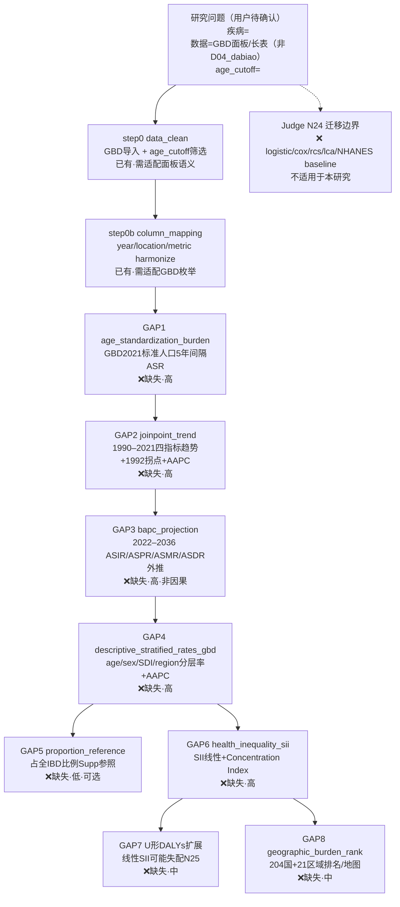

# Block Extraction Report

paper_id: paper_005  
question_id: Q1  
judge_source: @labels/paper_005_Q1_training.jsonl（score=9；取 `chosen_decision_tree` + `evidence` + `critique`）  
paper: @chunks/PMID40910275.xml（Chen et al., Gut and Liver 2026, PMID 40910275）  
user_data_probe: @Data/mimic/D04_dabiao.RData（只读探查，未写实例 config）  
reuse_template: **无同型模板** → **已新建** `configs/templates/config_burden_gbd.template.R`  
run_entry: `run_burden_gbd.R`  
pipeline_decision_tree_template: @adversarial_lit_reading/templates/pipeline_decision_tree_template.md

---

## 0c. 流水线决策树（wizard 交互门定稿）

> 标准模板：`templates/pipeline_decision_tree_template.md`（paper_005 为首版定稿参考）



---

## 0. Judge 定稿要点（驱动 block 抽取）

| 来源 | 要点 |
|---|---|
| chosen N1 | 无聚类/LCA 定 K；除 Joinpoint 外核心分层均为 GBD 框架或先验/外部标准 |
| chosen N2 / N2R | EO-IBD(<20) 为**纳入阈值**，非分组变量；全 IBD 占比仅比例参照，无对照分析 |
| chosen N4 / N22 | SDI 框架 K=5，但**成员归属时变**，非固定互斥聚类 |
| chosen N6 | 性别 2 组；<20 内 **4 档**年龄带（GBD 5 年间隔） |
| chosen N12 / N11 / N11U / N25 | SII 预设**线性**梯度；incidence 正相关(SII=0.83, CI=11%)；DALYs **U 形**为 Results 观察，与线性 SII **可能设定失配** |
| chosen N14 / N26 | Joinpoint 拐点数据驱动（ref10/软件）；**段数 K 主文未完整披露** |
| chosen N17 / N18 | BAPC 趋势外推，非因果假设；Discussion 承认 causal inference 有限 |
| chosen N23 | GBD 输入负担估计由时空 GP 回归等**上游模型派生** |
| chosen N24 | **迁移边界**：不可用于个体亚型发现、未知 K 聚类、因果暴露推断 |
| critique | N2 结构误读、SDI 静态化、SII-U 形冲突、permutation 过度陈述等已在 Round2 修正 |

**Q1 对 block 抽取的含义：** 本文是**全球聚合描述性负担研究**（生态/面板率数据），不是个体水平暴露→结局回归。现有 Blocks 库以 MIMIC/NHANES **个体队列**为主；除数据预处理外，**主分析链几乎全部缺失**。

---

## 0b. 用户数据只读探查（wizard 阶段 2）

| 项 | 实测 |
|---|---|
| 路径 | `Data/mimic/D04_dabiao.RData` |
| 对象 | `dabiao`（3306 × 70） |
| ID 列 | `subject_id` |
| 结局列 | `Disease_Group`（Continent Urinary_Incontinence 2910 / 另一水平 396） |
| 数据结构 | **个体水平**临床化验宽表 |
| GBD 所需列 | **无** year / country / SDI_quintile / incidence_rate / DALYs_rate / GBD_region 等面板字段 |
| NHANES 设计列 | **无** `WTMEC2YR` / `SDMVPSU` / `SDMVSTRA` |

**结构差异（须在 wizard 确认）：**

- paper_005 套路 = **GBD 二次数据全球负担描述**（Joinpoint + SII/CI + BAPC + 分层率表）；
- `D04_dabiao` = **MIMIC 个体队列**，与 GBD 负担流水线**不兼容**。
- 本步产出为**研究型通用模板**（`config_burden_gbd.template.R`），**不能**直接把 `D04_dabiao` 填入试跑。
- 若用户目标是「用自有数据做类似 GBD 负担分析」，须准备**面板/生态率数据**（year × location × age/sex × 四指标），并经 wizard 确认后再写实例 config。

---

## 1. 统计方法 → Block 映射（按 Results 顺序）

> Methods 与 Results 不一致时以 Results 为准。对齐 Results §1 → §2 → §3 → §4 → §5。  
> Methods 前置步骤（年龄标化 ASR）在 pipeline 中置于 Joinpoint 之前。

| step | 文献分析 | 模型/检验 | 预期表/图 | 对应 block | 状态 |
|---|---|---|---|---|---|
| 0 | GBD 2021 数据导入；EO-IBD(<20) 筛选 | 二次数据提取；ICD-10/ICD-9 | — | `data_clean` | 已有(需适配：面板/长表率数据，非个体宽表) |
| 0b | 列映射（year/location/age/sex/SDI/四指标） | 字段 harmonize | — | `column_mapping` | 已有(需适配：`database_type` 需新枚举如 `GBD`) |
| M1 | 年龄标化率 ASR | GBD 2021 标准人口 5 年间隔权重 | Methods 公式 | `age_standardization_burden` | **缺失 GAP1** |
| 1 | 全球负担 1990–2021 趋势 | Joinpoint 分段回归；APC/AAPC | Fig 1 A–H | `joinpoint_trend` | **缺失 GAP2** |
| 2 | BAPC 未来投影 2022–2036 | Bayesian APC；四指标 ASR 外推 | Fig 1 I–L | `bapc_projection` | **缺失 GAP3** |
| 3a | 年龄分层负担 | 描述性率 + 分年龄 AAPC | Fig 2 A–H | `descriptive_stratified_rates_gbd` | **缺失 GAP4** |
| 3b | 性别分层负担 | 描述性率 + 性别 AAPC | Fig 2 I–L；Supp Tables 1–4 | `descriptive_stratified_rates_gbd` | **缺失 GAP4** |
| 3c | EO-IBD 占全 IBD 比例 | 比例描述（非亚组对照） | Supp Fig 2 | `proportion_reference` | **缺失 GAP5** |
| 4a | 五档 SDI 区域负担 | 描述性率 + SDI 分层 AAPC | Fig 3；Supp Tables 1–4 | `descriptive_stratified_rates_gbd` | **缺失 GAP4** |
| 4b | 健康不平等 | SII（SDI 谱线性回归）；Concentration Index | Supp Fig 3–4 | `health_inequality_sii` | **缺失 GAP6** |
| 4c | SDI–DALYs U 形 | Results 曲线描述（Methods 未预设 U 型；SII 线性可能失配） | Supp Fig 4 | `health_inequality_sii` 或扩展非线性 | **缺失 GAP7** |
| 5 | 21 GBD 区域 + 204 国/地区 | 描述性率 + AAPC 排名/地图 | Fig 3–5 | `geographic_burden_rank` | **缺失 GAP8** |

**刻意未纳入 pipeline（Judge N24 迁移边界 + 库语义不匹配）：**

| 文献/库 block | 原因 |
|---|---|
| `logistic_*` / `cox_*` / `rcs_nhanes` | 非个体暴露→结局回归；N21 明确无 RCS/HR |
| `lca` / `unsupervised_clustering_table` | N1：无聚类/LCA 定 K |
| `baseline_nhanes` / `subgroup_nhanes_weighted` | 设计为个体 Table 1 / 加权回归，非率表分层 |
| `index` 中 `SII` 复合指标 | 库内 SII = 血小板×中性粒/淋巴**炎症指数**，≠ 健康不平等 Slope Index of Inequality |
| `mediation_*` | 无中介设计 |

---

## 2. pipeline$blocks 顺序（建议）

```r
c(
  # ── 前置（Methods 数据准备）──
  "data_clean",                      # step 0：GBD 长表/面板导入 + <age_cutoff> 筛选
  "column_mapping",                  # step 0b：year/location/metric 列 harmonize
  "age_standardization_burden",    # GAP1：ASR（Joinpoint/BAPC 输入）

  # ── Results §1 ──
  "joinpoint_trend",               # GAP2：四指标全球趋势 + 拐点 + AAPC

  # ── Results §2 ──
  "bapc_projection",               # GAP3：2022–2036 ASIR/ASPR/ASMR/ASDR 投影

  # ── Results §3 ──
  "descriptive_stratified_rates_gbd",  # GAP4：年龄 + 性别分层率/AAPC
  # "proportion_reference",          # GAP5：占全 IBD 比例（Supp；可选）

  # ── Results §4 ──
  # "descriptive_stratified_rates_gbd",  # 同上 block，config 切换 stratify_by=SDI_quintile
  "health_inequality_sii",         # GAP6：SII + Concentration Index（incidence 单调）
  # "health_inequality_nonlinear",   # GAP7：U 形 DALYs 非线性/分段（待 GAP6 扩展）

  # ── Results §5 ──
  "geographic_burden_rank"         # GAP8：204 国 + 21 区域排名/地图
)
```

**当前可注册执行的前缀（库中已有）：** 仅 `data_clean`、`column_mapping`（且须大幅适配 GBD 面板语义）。  
**其余 block 均为 TODO 占位，建成并注册前不得 uncomment。**

---

## 3. 缺失 Block 清单

| gap_id | 文献做法 | 建议新 block | 建议目录 | 严重度 | 影响主结论? | 备注 |
|---|---|---|---|---|---|---|
| GAP1 | GBD 2021 标准人口 5 年间隔年龄标化（ASIR/ASPR/ASMR/ASDR） | `age_standardization_burden` | `Blocks/35_burden/` | **高** | **是** | Joinpoint/BAPC 均依赖 ASR；Methods §5 公式 |
| GAP2 | Joinpoint 分段回归；APC/AAPC；1992 mortality/DALYs 拐点 | `joinpoint_trend` | `Blocks/35_burden/` | **高** | **是** | Results §1 核心；N14 数据驱动定 K；N26 K 未完整披露 |
| GAP3 | BAPC age-period-cohort 投影 2022–2036 | `bapc_projection` | `Blocks/35_burden/` | **高** | **是** | Results §2；N17 外推非因果 |
| GAP4 | 按 age/sex/SDI quintile/GBD region 分层描述率 + AAPC | `descriptive_stratified_rates_gbd` | `Blocks/35_burden/` | **高** | **是** | Results §3–§4；SDI 成员时变（N22）须在 config 标注 |
| GAP5 | EO-IBD 占全 IBD 比例（incident 3.73% 等） | `proportion_reference` | `Blocks/35_burden/` | 低 | 否 | N2R：比例参照非对照；Supp Fig 2 |
| GAP6 | SII（线性 SDI 梯度）+ Concentration Index | `health_inequality_sii` | `Blocks/36_inequality/` | **高** | **是** | SII=0.83, CI=11%；≠ 库内 `index$SII` 炎症指标 |
| GAP7 | SDI–DALYs U 形（Results 观察；线性 SII 可能失配） | 扩展 `health_inequality_sii` 或 `health_inequality_nonlinear` | `Blocks/36_inequality/` | 中 | 部分 | N25/N16；原文未 formal 非线性检验 |
| GAP8 | 204 国/21 区域率值 + AAPC 排名/ choropleth | `geographic_burden_rank` | `Blocks/35_burden/` | 中 | 部分 | Results §5；地图产出 |
| GAP9 | SDI quintile 成员时变（1990–2021 迁移） | 扩展 `data_clean` 或 `descriptive_stratified_rates_gbd` | `Blocks/02_data_clean/` 或 `35_burden/` | 中 | 部分 | N22；跨年 SDI 归属非静态 K=5 |
| GAP10 | GBD 上游时空 GP 回归估计不确定性传递 | 扩展 `data_clean` 元数据 | `Blocks/02_data_clean/` | 低 | 否 | N23；Discussion 数据质量局限 |

**分析细节（不需独立 block）：**

| 项 | 处理建议 |
|---|---|
| Joinpoint 段数 K 主文未列（N26） | `joinpoint_trend` 输出完整分段表；Supplement 对齐 |
| UC vs Crohn 未分层（N19） | config 注释 `subtype_stratify=none`；非 block 缺口 |
| <6 岁 VEO-IBD 不可分析（N20） | 年龄带 config 上限；数据粒度限制 |
| BAPC COVID-19 敏感性 | `bapc_projection` 可选 exclude_years 参数 |

---

## 4. 模板复用 / 最小 diff

**判定：无同型可复用模板。**

| 候选模板 | 不匹配原因 |
|---|---|
| `config_incidence_nhanes.template.R` | 个体 NHANES 加权 logistic；无 Joinpoint/BAPC/SII |
| `config_association_nhanes.template.R` | 横断面关联；同上 |
| `config_incidence_single.template.R` | 单库发病 logistic + VIF 链 |
| `config_survival_*.template.R` | Cox/KM 预后；非负担率 |

**已新建** `configs/templates/config_burden_gbd.template.R`（骨架）：

| 项 | 设定 |
|---|---|
| `study_type` | `"burden"`（库内新语义；**尚无**对应 block 变体） |
| `classification_mode` | `"rate_panel"`（率面板，非 binary 个体结局） |
| 数据槽 | `gbd$age_cutoff` / `metrics` / `strata_vars` 占位 |
| pipeline | 仅启用 `data_clean` + `column_mapping`；GAP1–GAP8 以 `# TODO(GAPn)` 注释 |
| 禁止项 | 无 `run_block()`；无 block 级 `data_source` |

**run 薄入口：** `run_burden_gbd.R`（默认 `--config configs/templates/config_burden_gbd.template.R`）

**未写论文级实例 config**；占位符须经 wizard 回填。

---

## 5. config / run 骨架（已落地，占位符待 wizard）

### config 关键占位符（❓ 须交互确认）

```r
config$data$rawdata_path        = "Data/gbd/<TO_CONFIRM>.RData"   # 面板/长表，非 D04_dabiao
config$data$rawdata_obj         = "<TO_CONFIRM>"
config$data$id_column           = "<location_id>"                 # 国/地区 ID，非 subject_id
config$gbd$age_cutoff           = "<TO_CONFIRM>"                  # 如 20（EO-IBD 定义）
config$gbd$metrics              = c("<incidence>","<prevalence>","<mortality>","<dalys>")
config$gbd$strata_vars          = c("age_group","sex","sdi_quintile","gbd_region","country")
config$gbd$sdi_temporal         = TRUE                            # N22：SDI 成员时变
config$project$output_dir       = "Output/<TO_CONFIRM>"
config$project$mirror_pub_outputs_to_root   # TRUE/FALSE 须确认
config$pipeline$checkpoint$dir
```

### run 建议命令（**未执行**）

```bash
Rscript run_burden_gbd.R --list-checkpoints
Rscript run_burden_gbd.R --to column_mapping    # 当前仅前两步可注册；完整链待 GAP 落地
```

---

## 6. runner 映射核对

| block | 注册? | 源文件 |
|---|---|---|
| `data_clean` | ✓ | Blocks/02_data_clean/01block_data_clean.R |
| `column_mapping` | ✓ | Blocks/01_column_mappings/01block_column_mapping.R |
| **`age_standardization_burden`（GAP1）** | **✗ 未注册** | 须新建 Blocks/35_burden/ + 补 `pipeline_block_sources()` |
| **`joinpoint_trend`（GAP2）** | **✗ 未注册** | 同上 |
| **`bapc_projection`（GAP3）** | **✗ 未注册** | 同上 |
| **`descriptive_stratified_rates_gbd`（GAP4）** | **✗ 未注册** | 同上 |
| **`proportion_reference`（GAP5）** | **✗ 未注册** | 同上 |
| **`health_inequality_sii`（GAP6）** | **✗ 未注册** | 须新建 Blocks/36_inequality/ + 补映射 |
| **`health_inequality_nonlinear`（GAP7）** | **✗ 未注册** | 扩展 GAP6 或独立 block |
| **`geographic_burden_rank`（GAP8）** | **✗ 未注册** | Blocks/35_burden/ |
| `index`（库内 SII 炎症指标） | ✓ | **语义冲突** — 不可用于健康不平等 SII |

---

## 7. wizard 交互门待办（写实例 config 前）

1. **确认研究目标**：复现 paper_005（需 GBD 面板数据）vs 误用 MIMIC `D04_dabiao`（不兼容）？
2. **确认数据形态**：长表字段（year, location, age, sex, SDI, 四指标率 + UI）与 `<age_cutoff>` 筛选规则。
3. **确认** `mirror_pub_outputs_to_root`、`output_dir`、是否纳入 Supp 比例分析（GAP5）。
4. **输出并确认分析决策树**（见下方 mermaid）后再写 `configs/config_*.R` 实例。
5. **GAP1–GAP8 落地并注册后**方可试跑完整 pipeline；当前最多 smoke test 至 `column_mapping`。
6. **用户同意试跑**后再执行 `Rscript`。

---

> **强制规则确认**：只写/更新 `configs/templates/config_burden_gbd.template.R`、`run_burden_gbd.R`、`rounds/block_gap_paper_005_Q1.md`；未改动 Blocks/、R/、已有 configs、A/B/Judge 产物；缺失 block 只登记不实现；**未试跑**。
