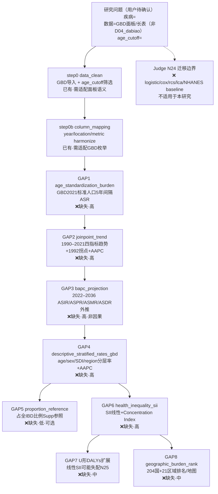

# Block Extractor 流水线决策树模板（wizard 交互门）

> **用途**：Block Extractor 完成 block 映射后，在**对话框**与 `block_gap_*.md` 中展示的标准决策树格式。  
> **区别于**：AI-A 文献决策树（Q1–Q8 证据节点，见 `rounds/A_tree_round2_revised_*.md`）。  
> **首版样例**：paper_005（GBD 负担，Chen et al. 2026）→ `rounds/block_gap_paper_005_Q1.md`  
> **个体队列样例**：paper_003（NHANES 横断面）→ `rounds/block_gap_paper_003_Q1.md`（节点结构不同，本模板为 GBD/负担型）

---

## 节点类型约定

| 前缀 | 含义 | 状态标记 |
|---|---|---|
| `Q` | 研究问题（用户待确认：疾病/数据形态/关键参数） | — |
| `D0`, `D0b`, … | 已有 block（`data_clean` / `column_mapping` 等） | `已有` / `已有·需适配` |
| `G1`–`Gn` | 缺失 block（GAP 编号与 block_gap 报告一致） | `❌缺失·高/中/低` |
| `LIM` | Judge 迁移边界 / 库内不适用 block | `❌ … 不适用于本研究` |

---

## 标准 Mermaid 模板（paper_005 / GBD 负担型）

复制后按新文献替换：疾病名、数据形态、age_cutoff、各 step 的 block 名、GAP 严重度、LIM 中不适用的 block 列表。

---

## 适配规则（生成新文献决策树时）

1. **Q 节点**：只写用户待确认项（疾病、数据路径/形态、核心 cutoff/暴露/结局），**不得**照搬文献 Table 列名。
2. **D* 节点**：仅列出 `pipeline_block_sources()` 中**已注册**且语义匹配的 block；标注 `已有` 或 `已有·需适配`。
3. **G* 节点**：与 `block_gap_*.md` 的 GAP 表一一对应；主链按 **Results 顺序** 串联；可选分析（Supp）用分支（如 G4→G5）。
4. **LIM 节点**：来自 Judge `migration_limit` / critique；列出库内存在但**本文不适用**的 block（虚线 `-.->` 连 Q）。
5. **边方向**：主 pipeline 实线顺序；迁移边界虚线；禁止悬空节点。
6. **交付位置**：Block Extractor 须在 (a) 对话框展示终版 mermaid；(b) `block_gap_*.md` 的「§7 wizard 交互门待办」或独立「§0c 流水线决策树」节写入同一份图。

---

## NHANES 个体队列型（对照，非本模板主形）

个体水平 NHANES/MIMIC 关联/发病研究请参考 paper_003 结构（插补→baseline→logistic→RCS→亚组），节点以 `imputation` / `baseline_nhanes` / `logistic_*` 为主，**不要**强行套用上方 GBD GAP 链。详见 `rounds/block_gap_paper_003_Q1.md`。
