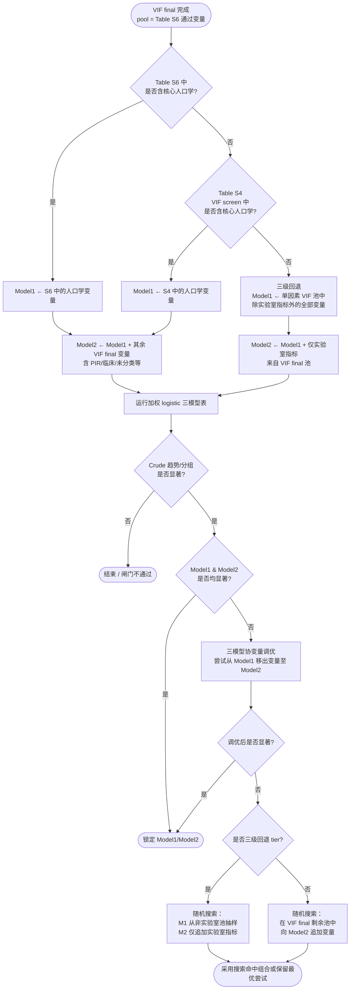

# NHANES 发病/关联分析 — 协变量选择逻辑

> 适用引擎：`Blocks/11_logistic/00logistic_nhanes_weighted_common.R`  
> 触发阶段：`multicollinearity_nhanes_final`（VIF final）之后，logistic / RCS / 亚组 / 中介等下游 block  
> 配置入口：`config$logistic_nhanes_weighted`

---

## 1. 总览

NHANES 加权 logistic 采用 **四模型** 结构（Model 3 由课题 `analysis_models$model3_required_factors` 决定；名单为空则不上 Model 3）：

| 模型 | 含义 |
|------|------|
| **Crude** | 不调整协变量 |
| **Model 1** | 人口学 / 基础混杂调整 |
| **Model 2** | 在 Model 1 基础上进一步调整临床、实验室等协变量（闸门只看本层） |
| **Model 3** | Model 2 + 该病学术上必须调整的协变量；不显著则下游全调整回退 Model 2 |

闸门（Gate B）仍只要求 Crude / Model1 / Model2。Model 3 在 M1/M2 锁定之后拟合。

协变量池来自 **单因素筛选 → VIF screen（Table S4）→ 多因素 → VIF final（Table S6）** 流水线。  
Model 1 / Model 2 的初始拆分在 **VIF final** 阶段完成；若 Crude 显著而调整后模型不显著，可启动 **随机搜索** 微调。

---

## 2. 决策流程图



---

## 3. Model 1 三级回退

### 第一级：Table S6（VIF final）

- **数据源**：`ctx$results$vif_final_pass`（多因素 p&lt;阈值 且 VIF 通过后的变量池）
- **规则**：在池中匹配 **核心人口学** 变量名 → 全部纳入 Model 1
- **日志关键词**：`Model1 人口学取自 Table S6（VIF final）`

### 第二级：Table S4（VIF screen）

- **触发条件**：第一级 Model 1 为空
- **数据源**：`ctx$results$vif_screen_pass` / `vif_screen_pass_weighted`（单因素显著后的 VIF 初筛池）
- **规则**：在 S4 池中匹配核心人口学 → 纳入 Model 1
- **日志关键词**：`Model1 取自 Table S4（VIF screen）`

### 第三级：非实验室回退

- **触发条件**：S6、S4 均无人口学
- **规则**：
  1. 取 **单因素 VIF 池（S4）** 中、**不属于实验室指标** 的全部变量 → Model 1
  2. 若 S4 无非实验室变量，再回退到 **VIF final 池** 中的非实验室变量
- **Model 2 约束**：`Model2 = Model1 ∪ 实验室指标`（实验室指标仅来自 VIF final 池）
- **日志关键词**：`三级回退`、`Model1 取自单因素 VIF 池（非实验室）`

> **已废弃**：旧版第三级「仅强制纳入 Age」不再使用。

---

## 4. 变量分类定义

### 4.1 核心人口学（Model 1 优先匹配）

配置项：`logistic_nhanes_weighted$model1_demographic_names`

默认值：

```
Age, Gender, Sex, Race, Smoking, Smoke, Education, Marital_Status, Marital
```

- **PIR / Income 不算核心人口学**，不会进入第一、二级 Model 1 匹配
- PIR 等社会经济变量在标准路径下归入 Model 2（`demo_factor_names` 分类）

### 4.2 扩展人口学 / 社会经济（仅标准路径 Model 2）

配置项：`logistic_nhanes_weighted$demo_factor_names`

在核心人口学之外，用于将 PIR、Income 等划入 Model 2 的社会经济层。

### 4.3 临床协变量（标准路径 Model 2）

配置项：`logistic_nhanes_weighted$clinical_factor_names`

示例：`HDL`, `Hypertension`, `T2DM`, `Lipid_lowering_agents` 等。

### 4.4 实验室指标

优先级：

1. `logistic_nhanes_weighted$lab_indicator_vars`
2. `mediation_nhanes_weighted$lab_indicator_vars`
3. 引擎内置 `.default_laboratory_test_vars()`（`R/utils.R` → Table 1 `Laboratory Tests` 小节）

匹配方式：变量名 **规范化后模式匹配**（与人口学匹配逻辑相同），例如 `HDL`、`Glucose`、`ALT`、`WBC` 等。

**三级回退时**：实验室指标 **不得** 进入 Model 1，只能出现在 Model 2。

---

## 5. Model 2 组装规则

| Model 1 来源 | Model 2 组成 |
|--------------|--------------|
| S6 / S4 人口学 | Model1 + VIF final 池中剩余变量（社会经济 + 临床 + 未分类） |
| 三级回退（非实验室） | Model1 + VIF final 池中 **仅实验室指标** |

共同约束：

- Model 2 **始终包含** Model 1（`M2 = unique(c(M1, ...))`）
- **暴露复合指标**及其 **计算组分** 不进入协变量池（见第 6 节）
- `Age` 与 `Age_Group` 并存时，优先保留 `Age`，剔除 `Age_Group`

---

## 6. 全局排除（不进任何 Model）

函数：`.lnw00_model_exclude_vars()`

| 类别 | 示例 |
|------|------|
| 暴露指标 | 当前 batch 的 `index_var`（如 ALBI、CAR） |
| 指标组分 | 由 `01block_index.R` 公式解析出的组分变量（如 ALBI 排除 Bilirubin_Total、Albumin） |
| 设计列 | ID、SEQN、权重、PSU、Strata 等（`nhanes$exclude_cols`） |
| 结局泄漏 | `Disease`, `Disease_Group` |
| 默认排除 | `BMI`, `Weight`, `Height`（config 可覆盖 `exclude_from_models`） |

---

## 7. 随机搜索（Crude 显著但调整后不显著）

配置项：`logistic_nhanes_weighted$random_search`

| 参数 | 含义 | 默认 |
|------|------|------|
| `enable` | 是否启用 | `TRUE` |
| `max_attempts` | 外层迭代上限 | 100 |
| `max_inner_attempts` | 内层随机次数 | 20 |
| `initial_sample_n` | 首轮抽样变量数 | 1 |
| `p_threshold` | 显著性阈值 | 继承 `cascade$crude_p_threshold`（通常 0.05） |

### 7.1 标准路径（S6/S4 人口学）

1. 先执行 **三模型协变量调优**（`.lnw00_tune_covariates_triple_sig`）：尝试将 Model 1 中部分变量移至 Model 2
2. 仍不显著 → 在 `VIF final 池 \ Model1` 中随机抽样，追加至 Model 2

### 7.2 三级回退路径

专用函数：`.lnw00_random_search_nonlab_m1_lab_m2()`

- **M1 搜索池**：单因素 VIF 池中的非实验室变量
- **M2 搜索池**：VIF final 池中的实验室指标
- **约束**：Model 2 **只能** 在 Model 1 基础上追加实验室指标，不能混入其他非实验室变量

---

## 8. 发表表对应关系

| 流水线阶段 | 发表表 | ctx 结果字段 |
|------------|--------|--------------|
| 单因素 NHANES | Table S2 | `nhanes_tb1_weighted`, `univar_features` |
| VIF screen | **Table S4** | `vif_screen_pass`, `vif_screen_pass_weighted` |
| 多因素 NHANES | — | `tb2`, `Model2Factors` |
| VIF final | **Table S6** | `vif_final_pass`, `Model1Factors`, `Model2Factors` |
| Logistic 三模型 | Table 2 / 主表 | `nhanes_logistic_M1`, `nhanes_logistic_M2` |

Table S6 在 VIF final 导出时会 **追加暴露指标一行**（即使其 VIF 未单独列出），保证主分析暴露可见。

---

## 9. 配置示例（DR NHANES batch）

```r
logistic_nhanes_weighted = list(
  model1_demographic_names = c(
    "Age", "Gender", "Race", "Smoking", "Education", "Marital_Status"
  ),
  demo_factor_names = c(
    "Age", "Gender", "Race", "Smoke", "Education", "PIR", "Marital_Status"
  ),
  clinical_factor_names = c(
    "HDL", "Hypertension", "T2DM", "Lipid_lowering_agents",
    "Antihypertensive_agents", "Antidiabetic_agents"
  ),
  exclude_from_models = c("ID", "SEQN", "BMI", "Weight", "Height"),
  random_search = list(
    enable = TRUE,
    max_attempts = 100L,
    max_inner_attempts = 20L,
    initial_sample_n = 1L
  ),
  model1_factors = NULL,   # 非 NULL 时跳过自动拆分，改用手动指定
  model2_factors = NULL
)
```

手动锁定：当 `model1_factors` 与 `model2_factors` **均非空** 时，跳过自动三级回退与随机搜索。

---

## 10. 日志排查

在 worker 日志中检索：

```bash
grep -E 'Model1|三级回退|Table S6|Table S4|随机搜索|实验室' logs/<INDEX>.log
```

| 日志片段 | 含义 |
|----------|------|
| `Model1 人口学取自 Table S6` | 走第一级 |
| `Model1 取自 Table S4` | 走第二级 |
| `Model1 取自单因素 VIF 池（非实验室）` | 走第三级 |
| `Model2 仅 Model1 + 实验室指标` | 三级回退 Model 2 约束生效 |
| `三级回退随机搜索命中` | 随机搜索成功 |
| `使用随机搜索后的 Model1/Model2` | 最终采用搜索组合 |

上下文结果字段：

- `ctx$results$nhanes_logistic_model1_tier`：`s6_demo` / `s4_demo` / `nonlab_screen_fallback`
- `ctx$results$nhanes_logistic_model2_lab_only`：三级回退时为 `TRUE`

---

## 11. 相关源码索引

| 文件 | 职责 |
|------|------|
| `Blocks/11_logistic/00logistic_nhanes_weighted_common.R` | Model 1/2 拆分、随机搜索、三模型调优 |
| `Blocks/08_vif/02block_multicollinearity_nhanes_weighted.R` | VIF screen/final、Table S4/S6、初始 Model 因子写入 ctx |
| `Blocks/07_multivariate/04block_multivariate_nhanes.R` | 多因素筛选 → `tb2` |
| `R/utils.R` | 实验室指标默认列表、指标组分排除 |
| `Blocks/00_index/01block_index.R` | 复合指标公式与组分变量 |

---

## 12. 版本说明

| 日期 | 变更 |
|------|------|
| 2026-06 | 第三级由「仅 Age」改为「单因素 VIF 池非实验室 → Model1；Model2 仅实验室」 |
| 2026-06 | 新增三级回退专用随机搜索（非实验室 M1 + 实验室 M2） |
| 2026-06 | PIR 明确不属于核心人口学；S6 导出含暴露指标行 |
