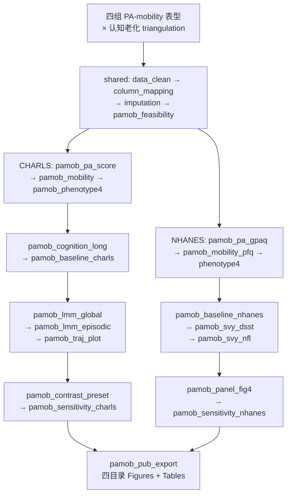

# PA–Mobility 联合表型与认知衰老（CHARLS + NHANES）设计

**日期**：2026-09-20  
**状态**：用户已口头批准设计方向（选型 A：LMM 主分析）；本文件待用户审阅后进入实施计划  
**方案来源**：`想法_身体活动-移动能力联合表型与认知衰老_双数据库完整执行框架_服务商版 copy.docx`  
**方法学参考**：`adversarial_lit_reading/papers/轨迹发病.pdf`（流水线/发表物组织参考；**主模型不采用 LCMM 潜类别**）  
**实现路径**：新建 `Blocks/74_pa_mobility_cognitive_full/` + dual-slot batch（不硬套 `incidence_dual_batch`）

---

## 1. 研究问题与定位

构建 **身体活动行为（PA）× 移动能力（mobility capacity）** 四组联合表型，比较：

1. **CHARLS（主）**：基线表型与 **global cognition（0–21）纵向变化速度**（LMM：`phenotype × time`）；次要结局 episodic memory。  
2. **NHANES 2013–2014（补）**：概念协调后的四组表型与 **DSST**、**log(serum NfL)** 的横断面关联（survey-weighted）。

**明确不是**：疾病筛查、临床 AD 诊断、双库个体合并、NfL 作为 CHARLS 纵向中介、把 NHANES DSST 写成 cognitive decline。

参照组固定：**Active–preserved**（sufficiently active & mobility preserved）。

两项预设对比：

1. Inactive–preserved vs Active–preserved  
2. Active–limited vs Inactive–limited  

---

## 2. 产出与引擎落盘（不改旧课题）

| 类型 | 路径 |
|------|------|
| 课题产出根 | `G:/02block_result/02_Cognitive_impairment/pa_mobility_cognitive_charls_nhanes/`（WSL 挂载后等价路径） |
| 原始数据 | 用户指定：`\\192.168.68.133\02block_result\02_Cognitive_impairment\trajectory_Personalized_yuhan\data`（config 中写可复现绝对/挂载路径；**当前会话未挂载成功，实施前须先接通**） |
| 决策树 | `Decisiontree/decision_tree_pa_mobility_cognitive.md` |
| Config | `configs/config_pa_mobility_cognitive.R`、`configs/config_pa_mobility_cognitive_batch.R`、`configs/templates/config_pa_mobility_cognitive*.template.R` |
| Run | `run/pa_mobility_cognitive/run_pa_mobility_cognitive.R`、`run_pa_mobility_cognitive_batch.R` |
| Blocks | `Blocks/74_pa_mobility_cognitive_full/`（序号接 73 之后） |
| 设计/计划 | 本文件；实施计划 `docs/superpowers/plans/2026-09-20-pa-mobility-cognitive-charls-nhanes.md` |

**R 运行时**：一律  
`"/mnt/c/Program Files/R/R-4.5.1/bin/x64/Rscript.exe"`  
缺包装入该 R 的 library。主算法 **lme4 + survey**；默认不引入 Python（除非后续加强模块需要）。

---

## 3. 四组表型定义（分析前锁定）

| 编码 | PA | Mobility | 标签 |
|------|----|----------|------|
| 1 | ≥600 MET-min/week | 四项均无困难 | Active–preserved（参照） |
| 2 | <600 | 四项均无困难 | Inactive–preserved |
| 3 | ≥600 | ≥1 项有困难 | Active–limited |
| 4 | <600 | ≥1 项有困难 | Inactive–limited |

**CHARLS PA**：vigorous×8 + moderate×4 + walking×3.3；时长区间代表值默认 20 / 75 / 180 / 240（Tian & Shi 2022；实施时对照原始问卷复核）。  
**CHARLS mobility 四项**：约 1 km 步行、连续爬楼、久坐后起立、弯腰/蹲跪。不纳入 ADL/IADL、跑步、上肢等进主 mobility。  
**NHANES PA**：GPAQ 工作/交通/休闲 MET-min/week，阈值同 600。  
**NHANES mobility**：PFQ061B/C/D/I；回答 5（do not do）主分析归 limited；PFQ054 结构性跳转归 limited。  
**NHANES NfL 权重**：必须 `WTSSNH2Y` + `SDMVSTRA`/`SDMVPSU`；年龄主整合样本 60–75 岁。

不得因结果不显著改阈值。

---

## 4. 主模型

### 4.1 CHARLS LMM

\[
\text{Cognition}_{it} = \beta_0 + \beta_1 Time_{it} + \beta_2 Phenotype_i + \beta_3 (Phenotype_i \times Time_{it}) + \beta_C Cov_i + u_{0i} + \varepsilon_{it}
\]

- 核心：`Phenotype × Time`  
- 随机效应：至少 random intercept；收敛且数据支持时可加 random slope for time  
- Time：距基线实际年数  
- Model 1/2/3 协变量分层见方案 §5.8；主文完全模型 = Model 3  
- 主结局 global 0–21；次要 episodic memory  
- 主模型不调整 ADL/IADL、SPPB、握力（避免过度调整）

### 4.2 NHANES

- Survey-weighted linear：phenotype → DSST；phenotype → log(sNfL)  
- 报告校正后 DSST 预测均值与 sNfL 几何均值（Figure 4）  
- Model 1–3 见方案 §6.7；NfL 扩展可加 eGFR（±CRP 敏感性）

### 4.3 不做（基础版）

正式中介、ML/RCS/大量无预设亚组、个体 pooling、强行 meta、事后改阈值、LCMM 潜类别（留给可选加强模块，不进本设计主路径）。

---

## 5. 流水线决策树

### Batch 分层

| 层 | Blocks | 说明 |
|----|--------|------|
| **shared** | `data_clean` → `column_mapping` → `imputation` → `pamob_feasibility` | 可行性报告闸门：未过闸不得宣称主结果 |
| **unit CHARLS** | 表型 → 认知 long → baseline → LMM → traj plot → contrast → sensitivity | 纵向 discovery |
| **unit NHANES** | 表型 → baseline → svy DSST/NfL → Fig4 → sensitivity | biomarker extension |
| **finalize** | `pamob_pub_export` | Tables/Figures 四目录 + image_information |

---

## 6. Block 映射（74 目录）

| Step | Block | 文件（拟） | 复用/新建 | 主要产出 |
|------|-------|-----------|-----------|----------|
| 01 | `data_clean` | `Blocks/02_data_clean/` | 复用 | 清洗表 |
| 02 | `column_mapping` | `Blocks/01_column_mappings/` | 复用 | 双库列名协调词典 |
| 03 | `imputation` | `Blocks/03_imputation/` | 复用 | 插补；主暴露/结局缺失不填成「无困难/无活动」 |
| 04 | `pamob_feasibility` | `74/01block_pamob_feasibility.R` | **新建** | 波次×变量矩阵、逐步纳排 n、四组 N、闸门报告 |
| 05 | `pamob_pa_score` | `74/02block_pamob_pa_score.R` | **新建** | CHARLS MET-min/week + 二分类 |
| 06 | `pamob_mobility` | `74/03block_pamob_mobility.R` | **新建** | CHARLS 四项 + preserved/limited |
| 07 | `pamob_pa_gpaq` | `74/04block_pamob_pa_gpaq.R` | **新建** | NHANES GPAQ MET |
| 08 | `pamob_mobility_pfq` | `74/05block_pamob_mobility_pfq.R` | **新建** | NHANES PFQ + 跳转规则 |
| 09 | `pamob_phenotype4` | `74/06block_pamob_phenotype4.R` | **新建** | 四组编码 + Table 表型分布 |
| 10 | `pamob_cognition_long` | `74/07block_pamob_cognition_long.R` | **新建** | global/episodic long + Time_years |
| 11 | `pamob_baseline_charls` | 可调 `baseline_binary` 或 `74/08…` | 优先复用 | Table 1 CHARLS |
| 12 | `pamob_baseline_nhanes` | 可调 `baseline_nhanes` | 优先复用 | Table 3 加权 |
| 13 | `pamob_lmm_global` | `74/09block_pamob_lmm_global.R` | **新建** | Table 2 主 LMM（参考 `competing_lmm_trajectory` / `network_temp_mixed_model`） |
| 14 | `pamob_lmm_episodic` | `74/10block_pamob_lmm_episodic.R` | **新建** | 次要结局 LMM |
| 15 | `pamob_traj_plot` | `74/11block_pamob_traj_plot.R` | **新建** | Figure 3 |
| 16 | `pamob_contrast_preset` | `74/12block_pamob_contrast_preset.R` | **新建** | 两项预设对比 |
| 17 | `pamob_sensitivity_charls` | `74/13block_pamob_sensitivity_charls.R` | **新建** | 卒中排除、mobility≥2、PA 替代赋值等 |
| 18 | `pamob_svy_dsst` | `74/14block_pamob_svy_dsst.R` | **新建** | 复用 `R/nhanes_survey_weight.R` |
| 19 | `pamob_svy_nfl` | `74/15block_pamob_svy_nfl.R` | **新建** | WTSSNH2Y + log NfL |
| 20 | `pamob_panel_fig4` | `74/16block_pamob_panel_fig4.R` | **新建** | Figure 4 双面板 |
| 21 | `pamob_sensitivity_nhanes` | `74/17block_pamob_sensitivity_nhanes.R` | **新建** | PFQ5 排除、eGFR/CRP、卒中排除 |
| 22 | `pamob_concept_fig1` | `74/18block_pamob_concept_fig1.R` | **新建** | Figure 1 |
| 23 | `pamob_flowchart` | 可复用 attrition flowchart 或 `74/19…` | 优先复用 | Figure 2 |
| 24 | `pamob_pub_export` | `74/20block_pamob_pub_export.R` | **新建** | `export_pub_figures` 四目录 |

`analysis_exclusion`：按 `skills/review-raw-covariate-columns` 审列后写入 `disease_vars`（认知结局/诊断泄漏不得进协变量池）；本课题暴露是表型，不是复合指标公式，但仍禁止把结局成分当协变量。

---

## 7. 图表交付清单

| 编号 | 内容 | 来源 block |
|------|------|------------|
| Figure 1 | 概念框架 + 四组示意 | `pamob_concept_fig1` |
| Figure 2 | CHARLS 纳排流程 | flowchart / attrition |
| Figure 3 | CHARLS 四组校正 global trajectories | `pamob_traj_plot` |
| Figure 4 | NHANES DSST 均值 + sNfL 几何均值双面板 | `pamob_panel_fig4` |
| Table 1 | CHARLS 四组基线 | baseline CHARLS |
| Table 2 | LMM phenotype×time + 两项预设对比 | `pamob_lmm_global` + contrast |
| Table 3 | NHANES 四组基线（加权） | baseline NHANES |
| Table 4 | NHANES → DSST / log-sNfL | `pamob_svy_*` |
| Supplement | 变量字典、替代定义、敏感性全套 | sensitivity + feasibility |

Figures 必须含 `pdf/` `png/` `tiff/` `image_information/`（`pub_figure_three_formats` / `pub_figure_image_information` 铁律）。

---

## 8. 质量控制闸门（方案 §9）

正式主结果前必须落盘可行性报告，至少含：

1. CHARLS 候选波次 × PA/mobility/认知/协变量可用性矩阵  
2. 方案 A（2011 基线）与方案 B（2015 基线）逐步纳排 n（默认优先评估 A，**锁定前由可行性报告决定**）  
3. 两库四组 N/% 与缺失模式  
4. PA 区间代表值与代码  
5. PFQ054 / 回答 5 规则  
6. NHANES sNfL 最小表型组 N 与加权比例（&lt;30 则 NfL 四组主分析降级为探索）  
7. 完整变量字典  

年龄：CHARLS 建议 ≥45；样本过小可改 ≥60，须在锁定前决定并写进 Methods。

---

## 9. 与现有套路的关系

| 现有 | 关系 |
|------|------|
| `52_trajectory_incidence` / `64_cftraj` | 仅参考 batch/决策树组织；**不**把 LCMM 作主路径 |
| `55/.../competing_lmm_trajectory`、`61/.../network_temp_mixed_model` | LMM/`lme4` 实现参考 |
| `baseline_nhanes`、`R/nhanes_survey_weight.R`、加权 logistic blocks | NHANES 设计/权重复用 |
| `incidence_dual_batch` | **不套用**（结局非 0/1 发病指标批量） |
| 已有 `02_Cognitive_impairment/trajectory_Personalized_yuhan` 等课题 | **只读数据，不改其 config/结果** |

---

## 10. 验收标准

- [ ] 决策树 / config / run / Blocks/74 齐全且可 dry-run  
- [ ] 四组阈值分析前锁定；参照组 = Active–preserved  
- [ ] CHARLS 为 repeated cognition LMM，非单次随访普通回归  
- [ ] NHANES NfL 使用 WTSSNH2Y  
- [ ] PFQ054 / 回答 5 规则落地  
- [ ] CES-D/PHQ 不作认知结局；ADL/IADL 不进主 mobility  
- [ ] 主文图表齐套 + 敏感性预设完整  
- [ ] 结论区分纵向 CHARLS vs 横断面 NHANES；无过度因果/AD 特异表述  
- [ ] 未改动仓库内其他已完成课题产物  

---

## 11. 开放项（实施前一次性锁定）

1. **数据挂载**：接通 `192.168.68.133` 或拷贝 `data/` 到本机可读路径。  
2. **CHARLS baseline 波次**：可行性报告后在 A（2011）与 B（2015）间锁定。  
3. **飞书 workplan_code**：若需同步，实施时分配新编号（不占用旧 Bxx）。  

---

## 12. Spec 自检

| 检查 | 结果 |
|------|------|
| 无 TBD/占位符冒充已决 | 开放项仅 §11 三项，已标明须锁定 |
| 与口头设计一致（选型 A、74、图表、不改旧项目） | 是 |
| 范围未偷偷加入 LCMM/中介/ML | 是；LCMM 仅「不做」声明 |
| 与发病 dual-batch 边界清晰 | 是；明确不套用 |
| Blocks 编号与现有 73 不冲突 | 是；新建 74 |

> **Teacher revision (Yuhan):** Main scientific claim = cognitive **level** + **domain** heterogeneity (esp. Active–limited episodic vulnerability); NHANES main = large-sample DSST; sNfL exploratory.

