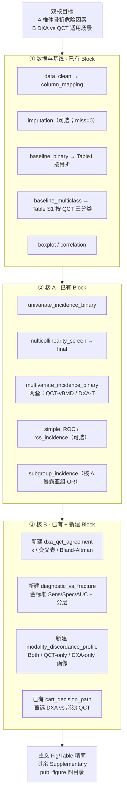

# 骨质疏松 · DXA/QCT 适用场景画像 + 椎体骨折危险因素 — 设计规格

> 状态：已确认定稿（2026-09-22）  
> 产出根：`\\192.168.68.133\02block_result\10_osteoporosis\personalized`  
> WSL：`/mnt/g/02block_result/10_osteoporosis/personalized`  
> 方案：`骨质疏松多因素危险因素分析及不同特征患者适用场景画像(1).docx` + `老师分析思路整理(1)(1).docx`  
> 决策树副本：`Decisiontree/decision_tree_osteoporosis_dxa_qct_personalized.md`  
> 开跑条件：本 spec 用户审阅无异议 + 实现计划确认后才写 config / 新建 Block / 开跑

---

## 0. 已确认决策

| ID | 项 | 定稿 |
| --- | --- | --- |
| D0 | 叙事打包 | **方案 1**：主文双核精简，补充收纳 |
| D1 | 主叙事 | **C 双主线并重**：核 A 椎体骨折危险因素 + 核 B DXA vs QCT 适用场景 |
| D2 | 金标准 | 椎体压缩骨折 = 诊断效能金标准（不因老师顾虑放弃；本数据支持） |
| D3 | 主分层 | Nathan（1–2 vs 3–4）、AAC（无/有）、BMI（&lt;24 / ≥24）；Age（&lt;65 / ≥65）仅补充 |
| D4 | 核 A 骨密度 | **两套多因素 Model 分列**：QCT-vBMD 套 vs DXA T-score 套（禁止同模共线） |
| D5 | CART | `cart_decision_path`，`maxdepth≤3`，叶标签「首选 DXA / 必须 QCT」 |
| D6 | 工程 | **优先复用已有 Block**；缺口 **新建 3 个 register_block**（见 §5），不长期只靠课题 hotfix 脚本 |
| D7 | 插补 | 当前 CSV **无缺失**；pipeline 可挂 `imputation`（表 S 缺失说明）或轻跳，Methods 写「无缺失、未插补」 |
| D8 | 性别 | 源数据 **无 Sex/Gender 列**；Methods 披露；不伪造 |

---

## 1. 研究问题

1. **核 A**：在校正年龄、BMI、骨转换与代谢指标后，QCT-vBMD / DXA T-score 及关键代谢标志是否独立关联椎体压缩骨折。  
2. **核 B**：DXA 与 QCT 诊断一致性如何；以椎体骨折为金标准时二者效能差多少；Nathan / AAC / BMI 下 DXA 灵敏度是否衰减；何种特征应首选 DXA、何种必须 QCT。

---

## 2. 数据快照（已核对，2026-09-22）

| 项 | 值 |
| --- | --- |
| 文件 | `data/研究数据_完整版(数据整理)(1).csv`（GBK） |
| N | **208**（SampleID 唯一） |
| 缺失 | **0**（31 列齐全） |
| 骨折 | 85（40.9%） |
| QCT 三分类 | 正常 12 / 骨量减少 53 / 骨质疏松 143 |
| DXA 三分类（腰或髋最低） | 15 / 65 / 128 |
| OP 二分类一致率 | **68.8%**（κ 待算）；QCT-only OP **40**（骨折 25）；DXA-only OP **25**（骨折 4）；Both OP 103（骨折 52） |
| 骨折者中判 OP | QCT **77/85**；DXA **56/85** → 金标准对比有临床差，值得做 |
| Nathan | 1:73，2:91，3:34，4:10（无 0）；高分级 3–4：**44** |
| AAC | 无 116 / 有 92 |
| 年龄 | mean 66.3（48–92）；&lt;65：92（骨折仅 **17** → 不作主交互） |

核心列（分析别名建议在 `column_mapping` 统一）：

- `Age`, `BMI`, `QCT_vBMD`, `QCT_cat`, `DXA_T_min`, `DXA_cat_min`, `DXA_T_lumbar`, `DXA_cat_lumbar`
- `Vertebral_fracture`（0/1）
- 代谢：`FPG`, `TG`, `CHO`, `HDL_C`, `LDL_C`, …
- 骨代谢：`VitD_25OH`, `P1NP`, `bCTX`, `PTH`, `ALP`, `Calcitonin`, `Osteocalcin`, Ca, P
- `Nathan`, `AAC`

---

## 3. 分析总决策树



---

## 4. 发表图表清单

### 4.1 主文 Tables

| 表 | 内容 | 来源 Block |
| --- | --- | --- |
| Table 1 | 按椎体骨折（有/无）基线特征 | `baseline_binary` |
| Table 2 | 骨折单因素 + 多因素 OR（Panel A=QCT-vBMD 套；Panel B=DXA T 套） | `univariate_incidence_binary` + `multivariate_incidence_binary` |
| Table 3 | 骨折金标准下 DXA vs QCT 总体诊断指标 | **新建** `diagnostic_vs_fracture` |
| Table 4 | Nathan / AAC / BMI 分层诊断指标（灵敏度衰减） | **新建** `diagnostic_vs_fracture` |

### 4.2 主文 Figures

| 图 | 内容 | 来源 Block |
| --- | --- | --- |
| Figure 1 | 纳排流程图 | `attrition_flowchart` |
| Figure 2 | 多因素 OR 森林图（核 A） | 发病 multivariate / logistic 导出图 |
| Figure 3 | DXA↔QCT 一致性（交叉 + κ；连续 Bland–Altman） | **新建** `dxa_qct_agreement` |
| Figure 4 | 骨折金标准 ROC：DXA T vs QCT-vBMD | **新建** `diagnostic_vs_fracture`（可与 `simple_ROC` 口径对齐） |
| Figure 5 | 分层灵敏度衰减（Nathan / AAC / BMI） | **新建** `diagnostic_vs_fracture` |
| Figure 6 | CART 临床决策路径（首选 DXA / 必须 QCT） | `cart_decision_path` |

### 4.3 补充

| 编号 | 内容 | 来源 Block |
| --- | --- | --- |
| Table S1 | 按 QCT 三分类基线 | `baseline_multiclass` |
| Table S2 | 按 AAC 基线 | `baseline_binary`（换 strata） |
| Table S3 | 全变量单因素（未进主文 Model 者） | `univariate_incidence_binary` |
| Table S4 | VIF | `multicollinearity_screen` / `final` |
| Table S5 | 不一致三分类（Both / QCT-only / DXA-only）画像 | **新建** `modality_discordance_profile` |
| Table S6 | CART 切点规则表 | `cart_decision_path` |
| Figure S1 | 关键连续变量箱线（按骨折） | `boxplot` |
| Figure S2 | 相关热图 | `correlation` |
| Figure S3 | Age 亚组诊断效能（事件少，仅补充） | `diagnostic_vs_fracture`（可选层） |
| Figure S4 | RCS：QCT-vBMD / T-score → 骨折（可选） | `rcs_incidence` |

发表图必须落 `Figures/{pdf,png,tiff,image_information}` 四目录（`pub_figure_export`）。

---

## 5. 新建 Block 规格（定稿必含）

目录建议：`Blocks/75_osteo_dxa_qct/`（或并入 `13_roc` / `04_baseline` 旁独立文件，实现计划再定路径；**必须 `register_block` + 跑 catalog 同步**）。

### 5.1 `dxa_qct_agreement`

| 项 | 规格 |
| --- | --- |
| 目的 | DXA 与 QCT 诊断/连续量一致性 |
| 输入 | `QCT_cat` / `DXA_cat_min`（三分类与 OP 二分类）；`QCT_vBMD` / `DXA_T_min` |
| 产出 | 交叉表；Cohen’s κ（二分类±三分类）；Bland–Altman 图（连续：T-score 与 vBMD 需 config 声明是否 z-score 同图或分面板） |
| 主文角色 | Figure 3 + 一致性数值表（可并入 Fig3 脚注或短表） |
| config 节 | `config$dxa_qct_agreement` |

### 5.2 `diagnostic_vs_fracture`

| 项 | 规格 |
| --- | --- |
| 目的 | 以椎体骨折为金标准，比较 DXA / QCT 诊断效能，并按临床分层 |
| 输入 | `Vertebral_fracture`；`DXA_cat` / `QCT_cat`（阳性=骨质疏松 cat==2，可配）；连续 `DXA_T_min` / `QCT_vBMD` 做 ROC |
| 分层 | 强制：Nathan、AAC、BMI；可选：Age（默认仅补充导出） |
| 产出 | Table 3/4；Figure 4 ROC；Figure 5 分层 Sens；可选 Fig S3 |
| 度量 | Sens / Spec / PPV / NPV / AUC（`pROC`/`sklearn` 口径与项目 `pub_digits` 一致）；分层报告 n 与事件数 |
| config 节 | `config$diagnostic_vs_fracture` |

### 5.3 `modality_discordance_profile`

| 项 | 规格 |
| --- | --- |
| 目的 | 按 DXA/QCT OP 一致性格局画像 |
| 分组 | `Both_OP` / `QCT_only_OP` / `DXA_only_OP` / `Neither_OP`（四组；或合并 Neither 视 n） |
| 产出 | Table S5 风格基线比较（复用 baseline 统计函数，勿整表抄死） |
| 强调 | QCT-only 骨折负担（本数据 25/40）写入图注/表注 |
| config 节 | `config$modality_discordance_profile` |

**新建纪律**：标准文件头；`register_block`；实现后 `python3 scripts/update_blocks_catalog.py`；禁止只放 `personalized/scripts/` 当长期方案。

---

## 6. 复用 Block 与推荐 pipeline

模板基底：`configs/templates/config_incidence_single.template.R`（单库发病）。

```r
pipeline$blocks <- c(
  "data_clean",
  "column_mapping",
  "imputation",                    # miss=0 可配置跳过完整 MICE
  "baseline_binary",               # Table 1
  "baseline_multiclass",           # Table S1（可二次 strata）
  "boxplot",
  "correlation",
  "univariate_incidence_binary",
  "multicollinearity_screen",
  "multivariate_incidence_binary", # 核 A；两套 Model 用 config 分支或跑两遍 index
  "multivariate_covariate_resolve",
  "multicollinearity_final",
  "simple_ROC",
  "rcs_incidence",                 # 可选 → Fig S4
  "subgroup_incidence",            # 核 A 亚组
  "dxa_qct_agreement",             # 【新建】
  "diagnostic_vs_fracture",        # 【新建】
  "modality_discordance_profile",  # 【新建】
  "cart_decision_path",            # 核 B 决策路径
  "attrition_flowchart"
)
```

核 A 多因素锁变量（主文默认）：`Age` + `BMI` + 骨密度轴（分套：`QCT_vBMD` 或 `DXA_T_min`）+ `bCTX` + `P1NP` + `VitD_25OH` + `PTH`。若 VIF 超标则 **P1NP 与 bCTX 二选一保留**（优先保留单因素更强者），不扩库塞入 TG/HDL 等；其余代谢仅 Table S3。

`cart_decision_path` 特征锁：`Nathan`, `AAC`, `BMI`, `Age`（连续或二分类按 config）。

**CART 结局默认（已定）**：`need_QCT = 1` 当且仅当 **QCT_only_OP**（QCT 判骨质疏松且 DXA 未判骨质疏松）；其余为 `0`（首选 DXA 路径）。  
`leaf_labels`：`0`→「首选 DXA」，`1`→「必须 QCT」。Methods 写死该操作定义；敏感性（可选补充）可用「骨折且 DXA 非 OP」替换结局，不改主文默认。

---

## 7. 小样本与审稿风险（硬约束）

- 主文多因素禁止 20+ 实验室一锅炖。  
- Age&lt;65 仅 17 例骨折 → 不进主文交互主结论。  
- Nathan 3–4 仅 n=44 → 分层报 CI，避免过度解释。  
- CART 深度 ≤3，minsplit/minbucket 按 n=208 放宽但防叶事件为 0。  
- 无 Sex：不编造；讨论局限。

---

## 8. 验收标准

- [ ] Decisiontree 与本 spec 图表编号一致  
- [ ] 主文 Table 1–4、Figure 1–6 齐全且脚注含分母 n  
- [ ] Table 2 Day 风格：两套 Model 不共线混装  
- [ ] Table 3/4 与 Fig4/5 数字同源（同一 Block 导出）  
- [ ] 三个新 Block 已 `register_block` 且 catalog 已同步  
- [ ] `cart_decision_path` 叶节点中文临床标签可读  
- [ ] Figures 四目录齐全；无根目录平铺 PDF  
- [ ] Methods 写清：无缺失、无 Sex、金标准=椎体压缩骨折、分层定义  

---

## 9. 非目标（本期不做）

- 双库外验 / eICU  
- 全套 ML 竞品（RF/XGB 等）；仅 CART 路径图  
- 中介、竞争风险、轨迹  
- 为「看起来全」把 Age 四分层或 Nathan 五级全进主文交互  

---

## 10. 下一步

1. 用户审阅本 spec（尤其 §5 三个新 Block 命名与 CART 结局定义）。  
2. 通过后按 `writing-plans` 写实现计划（新建 Block → config → 跑通 → 发表导出）。  
3. **未确认实现计划前不开跑 full pipeline。**
