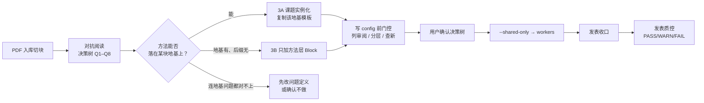
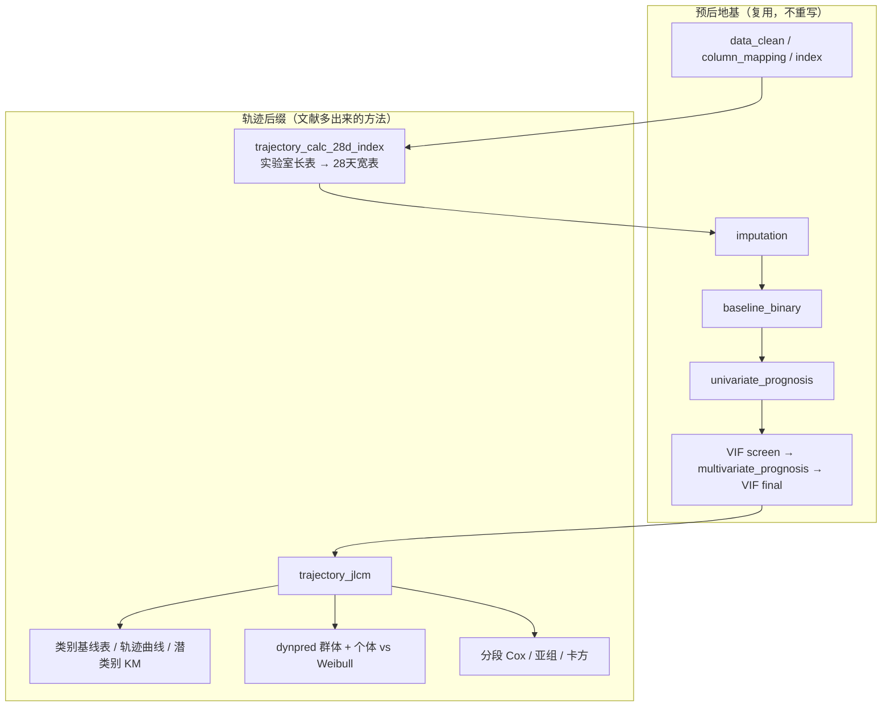

# 文献如何变成套路：地基架构 + 轨迹预后案例

> 汇报稿 · 2026-09-28
> 对象：现有 Medical Blocks 流水线（引擎 `01Block-new-Final` + 研究区 `medical-blocks-studies`）
> 一句话：**先立两块地基（发病 / 预后），新套路只改地基之上的方法层，不重挖清洗、协变量和批量调度。**
> Agent Skill：`.cursor/skills/pipeline-foundation/SKILL.md`（提示词模板见同目录 `prompt-template.md`）

---

## 0. 汇报口径（先讲这个）

我们不是「一篇文献写一套从零开始的脚本」。

系统里只有 **两类研究问题**，对应 **两块地基**：

| 地基           | 研究问题                             | 主模型闸门                   | 母版套路               |
| -------------- | ------------------------------------ | ---------------------------- | ---------------------- |
| **发病** | 指标 X 与「会不会发生」的关联 / 预测 | Logistic 分位闸门（Q→T→B） | `incidence` 双库批量 |
| **预后** | 指标 X 与「发生后活多久 / 是否死亡」 | Cox 分位闸门（Q→T→B）      | `survival` 双库批量  |

之后接到的新套路（轨迹、竞争风险、ML、两阶段 Transformer…）都是：

```text
地基前缀（清洗 → 列对齐 → 指标 → 排除泄漏 → 插补 → Table1 → 单因素 → VIF → 多因素）
        +
方法后缀（这篇文献多出来的统计：JLCM / Fine–Gray / 多模型 / 小时→日 Transformer …）
```

**禁止**为新文献再写一条平行的「清洗 + Table1 + VIF」。那是挖第二口井，不是接套路。

---

## 1. 地基长什么样（两块共用同一套工程习惯）

三层调度，所有套路一样：

```text
共享层（每库 1 次）     清洗 / 列名 / 复合指标 / 课题级派生
      ↓
指标 Worker（并行）     地基前缀 + 本套路后缀
      ↓
发表收口               成功指标 code 包 + 四目录图 + 双库同号表
```

程序员只改 `studies/<研究>/config.R` 和 `Data/`，引擎 `Blocks/` 只读。加功能走 `add_block`，禁止手改母版 `pipeline$blocks`。

### 1.1 发病地基（`incidence`）

入口：`run/incidence/run_incidence_dual_batch.R`
模板：`configs/templates/config_incidence_dual_batch.template.R`
决策树：`Decisiontree/decision_tree_incidence_dual_batch.md`
端口：5001

**Worker 主链（regular 库）**

`data_clean → column_mapping → dual_db_column_harmonize → index → analysis_exclusion → imputation → baseline_binary → 单因素发病 → VIF → 多因素 → 双库协变量对齐 → Logistic Q/T/B 闸门 → RCS → 亚组 → 中介`

NHANES 路径把中间换成加权 Table1 / 加权 Logistic，**前缀和闸门逻辑不变**。

### 1.2 预后地基（`survival`）

入口：`run/survival/run_survival_dual_batch.R`
模板：`configs/templates/config_survival_dual_batch.template.R`
决策树：`Decisiontree/decision_tree_survival_dual_batch.md`
端口：5001

**Worker 主链**

`data_clean → column_mapping → dual_db_column_harmonize → index → analysis_exclusion → imputation → landmark → baseline_binary → 单因素预后 → VIF → 多因素 → 双库协变量对齐 → Cox Q/T/B 闸门 → RCS → KM → 分段 Cox → 亚组`

和发病地基的差别只有三处：**结局是时间+事件**、**闸门从 logistic 换成 cox**、**图从 OR 森林换成 KM / HR**。清洗、指标、VIF、双库对齐、按指标并行，全部共用。

---

## 2. 文献进系统的标准路径（接套路前必须走完）



**对应 Agent Skill（提示词必须点名，否则容易跳过对抗阅读 / 质控）：**

| 节点 | Skill / 产物 |
|------|----------------|
| A–B | `.cursor/skills/adversarial-lit-reading` → `rounds/` + `labels/` |
| C–J | `.cursor/skills/pipeline-foundation` → `Decisiontree/` + config/run/Blocks |
| K | `.cursor/skills/pub-qc-after-project` → `reports/pub_qc_*.md` |
| 可复制提示词 | `.cursor/skills/pipeline-foundation/prompt-template.md`（含对抗 + 质控硬段） |

两棵树：对抗证据树（Q1–Q8）喂给分析套路树（`Decisiontree/`）；没有对抗阅读就写 config = 跳步。  
跑完未出质控报告 = 未闭环。用户仅举例路径或明确说「不要审」时，不打开该目录审阅。

文献只决定 **Results 展开顺序和方法后缀**。疾病名、结局列、暴露名必须用户确认，禁止从论文表头照搬。

写 config 前硬闸（两块地基通用）：

| 门控                       | 产物                                          |
| -------------------------- | --------------------------------------------- |
| 双库列名对齐               | 标准名词典                                    |
| 逐列审阅                   | `Data/_column_review.md` + `disease_vars` |
| 暴露只收复合指标真公式     | 缺轴整指标剔除                                |
| 疾病分层用数值算           | `reports/disease_stratification_basis_*.md` |
| 年龄一个切点、森林图二分类 | `age_cutoff`                                |
| 用户确认分析决策树         | 才允许写实例`config.R`                      |

---

## 3. 案例：轨迹预后如何站在「预后地基」上长出来

### 3.1 文献带来的新问题（不是新清洗）

索引课题形态：入院后 **每日复合指标轨迹**（JLCM 潜类别）能否对 **28 天死亡** 分层，动态预测是否优于静态 Weibull。

| 项               | 本案设定                                                         |
| ---------------- | ---------------------------------------------------------------- |
| 落在哪块地基     | **预后**（时间 + 死亡事件）                                |
| 暴露             | 复合指标轨迹（NLR / APRI / LAR / CAR / BUN_Cr / BAR …）         |
| 结局             | `survival_28d` + `survival_time_28d`                         |
| 队列             | eICU + MIMIC，**各库独立拟合**，不做发现→验证迁移         |
| 文献多出来的东西 | 长表 28 天指标、JLCM、潜类别 KM、dynpred、分段 Cox、Weibull 对比 |

如果把这篇文献当成「全新流水线」重写，会重复造：清洗、Table1、单因素、VIF、多因素、按指标并行。本案没有这样做。

### 3.2 地基怎么复用、后缀怎么加

引擎里轨迹套路被拆成三段，**前两段几乎就是预后地基**：

| 段          | 配置键                   | 来源                           | 做什么                                                 |
| ----------- | ------------------------ | ------------------------------ | ------------------------------------------------------ |
| 共享层      | `pipeline_shared`      | 预后共享层 +**1 个新块** | 清洗、列名、指标，再算 28 天宽表                       |
| Worker 前缀 | `pipeline_unit_prefix` | **原样复用预后地基**     | 插补 → Table1 → 单因素 → VIF → 多因素 → VIF final |
| Worker 后缀 | `pipeline_unit_suffix` | **本套路新增**           | JLCM 及下游图/表                                       |

对应 `configs/study_interface/baseline_pipelines.json` 的 `trajectory` 段，可直接对着讲。



### 3.3 Block 对照：哪些是地基、哪些是增量

| 步骤               | Block                                                                                                          | 相对预后地基                                                      |
| ------------------ | -------------------------------------------------------------------------------------------------------------- | ----------------------------------------------------------------- |
| 清洗 / 列名 / 指标 | `data_clean` `column_mapping` `index`                                                                    | **复用**                                                    |
| 28 天宽表          | `trajectory_calc_28d_index`                                                                                  | **新增**（共享层唯一增量）                                  |
| 插补 / Table1      | `imputation` `baseline_binary`                                                                             | **复用**                                                    |
| 协变量链           | `univariate_prognosis` → `multicollinearity_*` → `multivariate_prognosis`                              | **复用**（JLCM 的 survival 公式吃 VIF final）               |
| 潜类别             | `trajectory_jlcm`                                                                                            | **增强**（协变量入 survival 公式、自适应 ng、health guard） |
| 类别表图           | `trajectory_baseline_by_class` `trajectory_plot_jlcm` `trajectory_km_class`                              | 新增 / 复用轨迹块                                                 |
| 动态预测           | `trajectory_dynpred` `trajectory_dynpred_individual`                                                       | 复用 / 新增                                                       |
| 对比与亚组         | `trajectory_piecewise_cox` `trajectory_weibull_compare` `trajectory_subgroup_class` `trajectory_chisq` | 重写或新增                                                        |

**刻意没有复用的**：发病/预后双库的 Gate A/B 跨库列对齐。轨迹两库各自拟合 JLCM，不对齐协变量、不做迁移预测。这是方法决策，不是漏接地基。

### 3.4 程序员侧：挂上之后怎么跑

研究区（5006）复制 `_template_trajectory`，只改病种、路径、结局、指标池。

```bash
./run_study.sh <研究名> --routine trajectory --shared-only
./run_study.sh <研究名> --routine trajectory --workers N --only-index APRI
```

识别关键字：`trajectory_batch` / `trajectory_jlcm`。
入口：`run/trajectory_prognosis/run_trajectory_prognosis_apri_batch.R`。
母版决策树：`Decisiontree/decision_tree_trajectory_prognosis_apri.md`。

加功能只能挂在预留槽（`hook_slots.yaml`），例如 `trajectory.unit_after_jlcm`、`trajectory.unit_end`，不能在母版中间插行。

### 3.5 案例要讲清的「地基收益」

1. **Table1 / 单因素 / VIF 不用为轨迹再写一遍**，JLCM 直接吃预后地基筛出的 `Model1 ∪ Model2`。
2. **按指标并行、checkpoint、成功/失败目录** 复用同一套 batch 调度。
3. **发表收口铁律仍走全项目规则**：成功指标必须有 `code/` 包，`Figures/` 必须是 pdf/png/tiff/image_information 四目录。
4. 文献脚本（`lcmm.R`、Fig2A/2B/3/4、FigS1–S3、FigS7）被拆进 Block，而不是继续堆在课题 `scripts/`。

---

## 4. 同一套接法：其他套路站在哪块地基上

汇报时用这张表，避免被理解成「我们有 20 条互不相干的流水线」。

| 套路                       | 站在哪块地基                | 只改 / 只加的方法层                        | 端口             |
| -------------------------- | --------------------------- | ------------------------------------------ | ---------------- |
| 发病双库                   | 发病本身                    | Logistic 闸门 + RCS + 亚组 + 中介          | 5001             |
| 预后双库                   | 预后本身                    | Cox 闸门 + KM + 分段 Cox + 亚组            | 5001             |
| **轨迹预后（本案）** | **预后**              | 28 天宽表 + JLCM + dynpred + 类别图        | 5006             |
| 轨迹发病                   | **发病**              | 长表 LCMM + 类别后再接 logistic/Cox        | 引擎已有`52_*` |
| ML 双库                    | 发病或预后                  | 先特征选择，再按铁律解 Model1/2，再训练    | 5003             |
| 竞争风险                   | **预后**              | 主事件 vs 竞争事件，Fine–Gray / CIF       | 5006             |
| IPW                        | **发病/预后因果问法** | 治疗权重 + 加权生存                        | 5003             |
| 两阶段 Transformer         | **预后预测**          | 小时→日架构；清洗/划分/插补仍先走地基纪律 | 5006             |
| 环境 VOC                   | 发病（NHANES 加权）         | WQS / BKMR / qgcomp                        | 5006             |

判断规则只有一句：

- 问「会不会发生」→ 发病地基，后缀换成该文献的方法。
- 问「发生后结局如何」→ 预后地基，后缀换成该文献的方法。
- 问的是轨迹 / 竞争事件 / 预测模型，仍然先选地基，再加后缀，**不要新开第三块地基**。

---

## 5. 下一篇文献怎么接（作业单）

对听众演示「丢进一篇新论文」时，按这 6 问走：

1. **问题落在发病还是预后？** 写进决策树第一行。
2. **Results 顺序里，哪些步地基已经有？** 清洗 / Table1 / 单多因素 / 分位闸门 / RCS / 亚组。
3. **文献多出来的只有哪几步？** 只这些才允许新建 `register_block`。
4. **缺的是适配还是真缺失？** 已有 block 换变体（加权 / 发病 / 预后）优先于新建。
5. **写 config 前门控是否齐？** 列审阅、可算指标、分层数值、年龄切点、用户确认树。
6. **挂口是否只加后缀？** `baseline_pipelines.json` 的 prefix 保持地基，suffix 接新块；研究区加 `_template_<routine>`。

反例（汇报里主动说「我们不这么干」）：

- 为轨迹再写一套 Table1 / VIF。
- 未统一列名就开轨迹 workers。
- 把发病 ML 的特征白名单无检索挂到下一病。
- 只有论文笔记、没有 template + run 入口，就宣布「已经是套路」。

**套路完成标准**：母版决策树 + template + run 入口 +（需要时）研究区 `_template`；至少一次 `--shared-only` 冒烟；成功指标带 code 包和四目录图。

---

## 6. 附录：本案文件入口（便于翻页）

| 用途                      | 路径                                                                                |
| ------------------------- | ----------------------------------------------------------------------------------- |
| 预后地基决策树            | `Decisiontree/decision_tree_survival_dual_batch.md`                               |
| 发病地基决策树            | `Decisiontree/decision_tree_incidence_dual_batch.md`                              |
| 轨迹案例决策树            | `Decisiontree/decision_tree_trajectory_prognosis_apri.md`                         |
| 地基 / 轨迹 pipeline 清单 | `configs/study_interface/baseline_pipelines.json`                                 |
| 轨迹 hook 槽              | `configs/study_interface/hook_slots.yaml`（`trajectory.*`）                     |
| 轨迹模板                  | `configs/templates/config_trajectory_prognosis_batch.template.R`                  |
| 轨迹入口                  | `run/trajectory_prognosis/run_trajectory_prognosis_apri_batch.R`                  |
| 5006 挂口设计             | `docs/superpowers/specs/2026-07-17-5006-trajectory-prognosis-interface-design.md` |
| 程序员操作                | `docs/程序员操作手册.md` / `docs/block操作手册.md`                              |
| Block 选型总表            | `docs/Blocks_catalog.md` §1                                                      |

---

## 7. 结束页可用的三句话

1. **地基只有两块：发病和预后。**
2. **轨迹是预后地基上的方法后缀，不是第三条流水线。**
3. **新文献先对齐地基，再只实现 Results 里多出来的那几步。**
